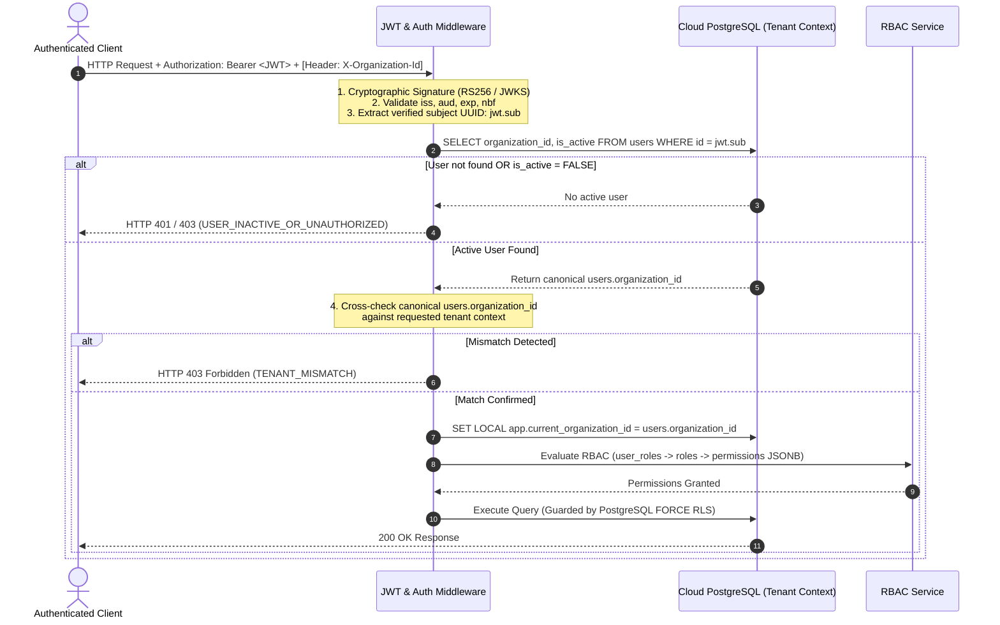

# ARCHITECTURE CHANGE REQUEST: WP-005 IMPLEMENTATION PLAN & SSOT CONSISTENCY CORRECTION

**ID:** `ACR-2026-006`  
**Framework:** `EAAF v1.2.0 @ 7e036f43240b3dc28ccb996e350263598275b2cd`  
**Workflow:** `workflows/ARCHITECTURE_CHANGE.md`  
**Requester:** `01_Solution_Architect — WP-005 IMPLEMENTATION PLAN CONSISTENCY REMEDIATION AUTHOR`  
**Date:** `2026-09-04`  
**Status:** `READY FOR ROLE-SEPARATED BASELINE REVIEW`  
**Base Commit:** `8cb4644f93f73a8e6fc28a2aa36841bc612c97d4`  
**Operating Mode:** `SOLO_MAINTAINER`  
**Classification:** `IMPLEMENTATION READINESS BASELINE CORRECTION & DATA MODEL INTEGRITY`  

---

## 1. Problem Statement

Prior to activating `13_Backend_Developer` (Builder) for Work Package `WP-005: Cloud IAM & Administrative Authentication`, a pre-implementation consistency gate was executed across the frozen architectural baselines (`IMPLEMENTATION_PLAN.md`, `DATA_MODEL.md`, `DATA_DICTIONARY.md`, `IAM_SECURITY_MODEL.md`, and `SECURITY_ARCHITECTURE.md`).

The audit identified five critical ambiguities and contradictions between the planning narrative and the frozen architectural SSOT:
1. **Contradiction A (RBAC Data Model):** `IMPLEMENTATION_PLAN.md` listed `permissions` and `role_permissions` under `WP-005` Data Objects, whereas the authoritative frozen `DATA_MODEL.md` defines RBAC using a document-oriented array `roles.permissions JSONB` and defines no normalized `permissions` or `role_permissions` tables.
2. **Contradiction B (`user_branch_credentials` Ownership):** `DATA_MODEL.md` defines `user_branch_credentials` in Cloud PostgreSQL, but `WP-005` did not explicitly claim ownership of its Cloud schema and provisioning, leaving the table potentially orphaned between Cloud IAM (`WP-005`) and Edge Offline IAM (`WP-010`).
3. **Contradiction C (Source References):** `WP-005` in `IMPLEMENTATION_PLAN.md` cited `IAM_SECURITY_MODEL.md Sec. 2` (PIN cryptographic parameters) and `SECURITY_ARCHITECTURE.md Sec. 3` (Edge QR/TLS enrollment protocol) rather than Cloud administrative authentication, JWT session lifecycle, and multi-tenant authorization sections.
4. **Contradiction D (Argon2id vs bcrypt):** `IMPLEMENTATION_PLAN.md` cited `Argon2id / bcrypt` as dependencies. `bcrypt` is not an approved cryptographic alternative in any frozen security architecture baseline.
5. **Contradiction E (Supabase Subject Binding & Identity Integrity):** Neither `DATA_MODEL.md` nor `IMPLEMENTATION_PLAN.md` documented the exact immutable binding rule between verified JWT subject (`jwt.sub`) and `users.id`, introducing risk of insecure lookups or unverified identity keys. Furthermore, relational foreign keys on `user_roles` and `user_branch_credentials` lacked tenant-aware composite foreign keys, creating a latent risk of cross-tenant references if not enforced at the database schema layer.

This Architecture Change Request formalizes the comprehensive remediation of these issues to ensure zero ambiguity before `WP-005` builder activation.

---

## 2. Frozen Sources Inspected

The following authoritative architectural baselines were inspected:
- `DATA_MODEL.md` (Document ID `ARCH-MDL-001`, Version `1.0 APPROVED / FROZEN — 2026-09-01`)
- `DATA_DICTIONARY.md` (Document ID `ARCH-DIC-001`, Version `1.0 APPROVED / FROZEN — 2026-09-01`)
- `DATA_ARCHITECTURE.md` (Document ID `ARCH-DAT-001`, Version `1.0 APPROVED / FROZEN — 2026-09-01`)
- `IAM_SECURITY_MODEL.md` (Document ID `ARCH-IAM-001`, Version `1.2 APPROVED / FROZEN — 2026-09-03`)
- `SECURITY_ARCHITECTURE.md` (Document ID `ARCH-SEC-001`, Version `1.2 APPROVED / FROZEN — 2026-09-03`)
- `SECURITY_CONTROL_MATRIX.md` (Document ID `ARCH-SCM-001`, Version `1.0 APPROVED / FROZEN — 2026-09-03`)
- `SECURITY_RISKS.md` (Document ID `ARCH-RSK-001`, Version `1.0 APPROVED / FROZEN — 2026-09-03`)
- `DATA_PROTECTION_AND_PRIVACY.md` (Document ID `ARCH-PRV-001`, Version `1.0 APPROVED / FROZEN — 2026-09-03`)
- `SECRETS_AND_KEY_MANAGEMENT.md` (Document ID `ARCH-SKM-001`, Version `1.0 APPROVED / FROZEN — 2026-09-03`)
- `SUPPLY_CHAIN_SECURITY.md` (Document ID `ARCH-SCS-001`, Version `1.0 APPROVED / FROZEN — 2026-09-03`)
- `IMPLEMENTATION_PLAN.md` (Document ID `ARCH-PLN-001`, Version `1.0 APPROVED / FROZEN — 2026-09-03`)
- `ARCHITECTURE_CHANGE_REQUEST_WP004_PLAN_CONSISTENCY.md` (`ACR-2026-005`)
- `project-manifest.json`

Repository SSOT prevails over narrative planning assumptions.

---

## 3. Detailed Remediation Decisions

### 3.1 Contradiction A: RBAC Authorization Model
- **Governed Model:** RBAC authorization is strictly governed by `roles.permissions JSONB NOT NULL DEFAULT '[]'`, where the JSONB column contains an array of permission string identifiers (e.g., `["orders:read", "orders:create", "admin:all"]`).
- **Eliminated Entities:** The tokens `permissions` and `role_permissions` are removed from `IMPLEMENTATION_PLAN.md`. No relational tables named `permissions` or `role_permissions` shall be created.
- **WP-005 Data Objects:** The authoritative list of Cloud database tables owned by `WP-005` is:
  1. `users`
  2. `roles`
  3. `user_roles`
  4. `user_branch_credentials`

### 3.2 Contradiction B: `user_branch_credentials` Ownership & Scope Boundary
- **Cloud Ownership (`WP-005`):** `WP-005` explicitly owns the Cloud DDL, schema migration, RLS policies (`ENABLE + FORCE ROW LEVEL SECURITY`), default-deny isolation, and administrative Cloud API for provisioning and rotating staff PIN hashes in `user_branch_credentials`.
- **Edge Runtime Ownership (`WP-010`):** `WP-010` exclusively owns Edge Offline IAM, SQLite `CachedUsers` schema, local PIN verification runtime, progressive delays (2s, 5s), station lockout (5 minutes after 5 consecutive failures), hardware benchmarks on low-end POS terminals ($\le 2\text{ GB}$ RAM), and local session tokens.
- **Boundary Invariant:** `user_branch_credentials` is not orphaned. Cloud provisioning belongs to `WP-005`; offline Edge verification and lockout runtime belong exclusively to `WP-010`.

### 3.3 Contradiction C: Correct Frozen Source References
- The citations in `IMPLEMENTATION_PLAN.md` for `WP-005` are corrected:
  - **Replaced:** `IAM_SECURITY_MODEL.md Sec. 2; SECURITY_ARCHITECTURE.md Sec. 3`
  - **Corrected:** `IAM_SECURITY_MODEL.md Sec. 1, 4; SECURITY_ARCHITECTURE.md Sec. 1, 2.2, 5.1, 6`
- This accurately references Cloud Identity Plane, JWT / Session lifecycles (15-min access token, 7-day refresh token), Cloud administrative MFA, and PostgreSQL RLS multi-tenant authorization boundaries.

### 3.4 Contradiction D: Cryptographic Algorithm Baseline (Argon2id vs bcrypt)
- **bcrypt Strictly Prohibited:** `bcrypt` is completely eliminated from `WP-005` dependencies and scope.
- **Argon2id Scope:** `WP-005` retains `Argon2id` strictly for Cloud-side provisioning and rotation of branch PIN hashes stored in `user_branch_credentials.pin_hash`.
- **Cryptographic Baseline:** Hashes generated by `WP-005` must conform to RFC 9106 baseline parameters established in `IAM_SECURITY_MODEL.md` Section 2:
  - Memory ($m$): $64\text{ MB}$ ($65,536\text{ KiB}$)
  - Iterations ($t$): $3$
  - Parallelism ($p$): $4$
  - Salt length: $16\text{ bytes}$ CSPRNG
  - Output hash length: $32\text{ bytes}$

### 3.5 Contradiction E: Supabase Subject Binding Rule
- **Canonical Binding Rule (Option A):** `users.id` IS the canonical Supabase Auth subject UUID (`jwt.sub`).
  - Upon user creation in Cloud IAM, the generated Supabase Auth UUID (`auth.users.id`) is assigned directly to `public.users.id`.
  - In local tests or fixtures without Supabase Auth, `DEFAULT gen_random_uuid()` remains available.
- **Zero Ambiguity:** Email-only identity correlation, unverified client-supplied user IDs, implicit lookup guesses, and ambiguous dual keys are strictly forbidden. The authenticated principal is always identified in the database by `users.id = jwt.sub`.

---

## 4. Tenant Claim Trust Model & Request Lifecycle

A signed JWT alone is not authorization. To prevent cross-tenant elevation or tenant-hopping (where an authenticated user attempts to access Tenant B by passing a forged or arbitrary `organizationId` parameter), the Cloud backend must enforce the following strict verification sequence:



### Trust Model Invariants:
1. **No Client Trust for Tenant Identity:** Client-supplied `orgId` headers or query parameters are treated as unverified requests and must be verified against `users.organization_id` fetched from the database for `users.id = jwt.sub`.
2. **No Client Trust for Roles/Permissions:** Client-supplied role claims or permission arrays in request bodies, headers, or unverified token payloads are strictly ignored. The database (`user_roles`, `roles.permissions JSONB`) is the sole authority for authorization.
3. **Inactive User Rejection:** If `users.is_active = FALSE`, requests are immediately rejected regardless of token expiration timestamp.

---

## 5. Tenant-Safe Relational Integrity

To guarantee tenant isolation at the relational engine level and prevent rows for Organization A from referencing entities (users, roles, branches) belonging to Organization B, composite tenant-aware constraints are formalized:

### 5.1 Additive Unique Constraints
- `branches`: `CONSTRAINT uq_branches_org_id UNIQUE (organization_id, id)` (formalized in `DATA_MODEL.md` per WP-004 baseline).
- `users`: `CONSTRAINT uq_users_org_id UNIQUE (organization_id, id)`.
- `roles`: `CONSTRAINT uq_roles_org_id UNIQUE (organization_id, id)`.
- `user_branch_credentials`: `CONSTRAINT uq_user_branch_cred_org_id UNIQUE (organization_id, id)`.

### 5.2 Composite Tenant-Aware Foreign Keys
- In `user_roles`:
  ```sql
  CONSTRAINT fk_user_roles_user FOREIGN KEY (organization_id, user_id) 
      REFERENCES users(organization_id, id) ON DELETE CASCADE,
  CONSTRAINT fk_user_roles_branch FOREIGN KEY (organization_id, branch_id) 
      REFERENCES branches(organization_id, id) ON DELETE CASCADE,
  CONSTRAINT fk_user_roles_role FOREIGN KEY (organization_id, role_id) 
      REFERENCES roles(organization_id, id) ON DELETE CASCADE
  ```
- In `user_branch_credentials`:
  ```sql
  CONSTRAINT fk_user_branch_cred_user FOREIGN KEY (organization_id, user_id) 
      REFERENCES users(organization_id, id) ON DELETE CASCADE,
  CONSTRAINT fk_user_branch_cred_branch FOREIGN KEY (organization_id, branch_id) 
      REFERENCES branches(organization_id, id) ON DELETE CASCADE
  ```

This prevents cross-tenant entity references even if a client or buggy query possesses valid UUIDs across multiple tenants.

---

## 6. Row Level Security (RLS) Requirements

Every table owned by `WP-005` (`users`, `roles`, `user_roles`, `user_branch_credentials`) must have:
1. `ALTER TABLE <table_name> ENABLE ROW LEVEL SECURITY;`
2. `ALTER TABLE <table_name> FORCE ROW LEVEL SECURITY;`
3. Foundational tenant isolation policy utilizing `current_app_org_id()`:
   ```sql
   CREATE POLICY <table_name>_tenant_isolation ON <table_name>
       FOR ALL
       USING (organization_id = current_app_org_id())
       WITH CHECK (organization_id = current_app_org_id());
   ```
4. Default-deny when transaction-scoped session variable `app.current_organization_id` is missing or invalid.

---

## 7. Scope Boundaries & Protected PO Neutrality

- **Strict WP-005 Boundaries:** `WP-005` encompasses only Cloud IAM and administrative authentication. It does NOT pull forward:
  - `WP-006` Audit logging implementation
  - `WP-007` Electron shell hardening
  - `WP-008` SQLite schema and durability
  - `WP-009` Edge QR/mDNS pairing protocol
  - `WP-010` Offline PIN verification runtime and brute force lockout
  - `WP-011` Folio leases and fencing tokens
- **PO Protected Decisions Neutrality:** All 9 Product Owner decisions (`OQ-SSOT-01` through `OQ-SSOT-07`, `OQ-ARCH-01`, `OQ-ARCH-02`) remain untouched and strictly `PENDING PO DECISION`.

---

## 8. Summary of Document Changes

| Document | Nature of Change | Justification |
|---|---|---|
| `IMPLEMENTATION_PLAN.md` | Corrected WP-005 Data Objects, Source References, Dependencies, Outputs, Acceptance Criteria, and Tests. | Removes `permissions` and `role_permissions` tables; removes `bcrypt`; points to correct Cloud IAM sections; formalizes `roles.permissions JSONB` and `user_branch_credentials` Cloud ownership. |
| `DATA_MODEL.md` | Updated Section 2.1 to document `users.id` Supabase binding, add `uq_users_org_id`, `uq_roles_org_id`, `uq_branches_org_id`, `uq_user_branch_cred_org_id`, and composite tenant foreign keys on `user_roles` and `user_branch_credentials`. | Restores tenant-safe relational integrity and aligns DDL with WP-004/WP-005 multi-tenant invariants. |
| `DATA_DICTIONARY.md` | Updated Section 1.1 to describe `users`, `roles`, `user_roles`, composite keys, and data classifications. | Aligns data dictionary with revised data model attributes. |
| `ARCHITECTURE_CHANGE_REQUEST_WP005_IAM_CONSISTENCY.md` | New artifact (`ACR-2026-006`). | Comprehensive architectural change request documenting problem, decisions, and governance evidence. |

---

## 9. Rollback Plan

If this change request is rejected by baseline reviewers, the repository can be cleanly restored to canonical base commit `8cb4644f93f73a8e6fc28a2aa36841bc612c97d4`.

---

## 10. Required Independent Reviews

This Change Request requires dual role-separated EAAF agent reviews:
1. `03_Data_Architect` — Data Architecture Conformance Review (`review/wp-005-plan-data-r1`)
2. `08_Security_Architect` — Security Conformance Review (`review/wp-005-plan-security-r1`)
