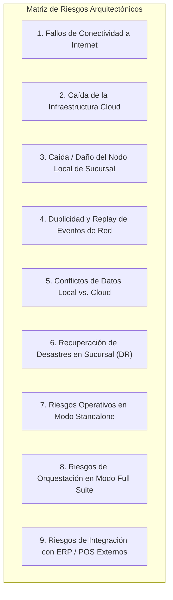

# ARCHITECTURE RISKS & MITIGATION MATRIX — ERP RESTAURANTES

**Versión:** 1.1 (SOLUTION ARCHITECTURE NORMALIZED)  
**Fecha:** 2026-08-31  
**SSOT Baseline:** [`FUNCTIONAL_ARCHITECTURE.md`](file:///Volumes/SSD_ORICO/BRAIN/TRIDENTPOSREST/FUNCTIONAL_ARCHITECTURE.md) (v1.2 APPROVED) & [`PRODUCT_SCOPE.md`](file:///Volumes/SSD_ORICO/BRAIN/TRIDENTPOSREST/PRODUCT_SCOPE.md) (v1.2 APPROVED).  
**Rol:** `01_Solution Architect`

---

## 1. Introducción y Marco de Gestión de Riesgos

La arquitectura de `ERP RESTAURANTES` combina un plano en la nube (SaaS multi-tenant) con un plano operativo en el borde (Edge Host en la red local de cada sucursal). Este documento identifica, evalúa y define las estrategias de mitigación para los 9 escenarios de riesgo arquitectónico y operativo más críticos del sistema.

---

## 2. Análisis Detallado de Escenarios de Riesgo

---

### R-01: Fallo de Conectividad a Internet en la Sucursal

- **Severidad:** **CRÍTICA**
- **Impacto Operativo:** La sucursal pierde comunicación con el Cloud Control Plane durante el servicio activo.
- **Mecanismo de Aislamiento y Mitigación:**
  1. **Autonomía Operativa en LAN:** `TRIDENTPOS` procesa localmente en red local la toma de pedidos, envío a KDS, impresión de tickets y liquidación de cuentas.
  2. **Transactional Outbox Local:** Todos los eventos de venta, turnos y arqueos se encolan en SQLite (`OutboxQueue`).
  3. **Generación Local de Cortes X y Z:** La sucursal emite sus Cortes X y Z de forma autónoma con numeración y sellado local.
  4. **Degradación Asistida:** Se suspenden temporalmente únicamente los servicios que requieren enlace directo a internet (timbrado fiscal instantáneo en PAC, pasarela PinPAD bancaria en línea y autofacturación web inmediata).

---

### R-02: Caída de la Infraestructura Cloud (Downtime en Render / Supabase / Vercel)

- **Severidad:** **ALTA**
- **Impacto Operativo:** El portal administrativo corporativo y las APIs cloud quedan temporalmente inaccesibles.
- **Mecanismo de Aislamiento y Mitigación:**
  1. **Aislamiento Operativo de Piso:** Las sucursales continúan operando sobre sus redes locales sin interrupción de comanda ni cobro.
  2. **Reconexión con Backoff Exponencial y Jitter:** El agente de sincronización local espacia los reintentos de conexión con variación aleatoria para evitar sobrecargar el backend cuando se restablezca el servicio en la nube.

---

### R-03: Caída Frecuente o Apagón Repentino del Nodo Local de Sucursal

- **Severidad:** **CRÍTICA**
- **Impacto Operativo:** La estación principal de cobro/servidor se apaga intempestivamente por corte de energía eléctrica.
- **Mecanismo de Aislamiento y Mitigación:**
  1. **Protección WAL en SQLite:** SQLite opera con `journal_mode = WAL` y `synchronous = NORMAL/FULL` para proteger la estructura del archivo de base de datos.
  2. **Reanudación de Estado:** Al reiniciar el Edge Host, el motor recarga las cuentas abiertas y reconstruye el estado de mesas activas.
  3. **Mitigación Física:** Se establece como baseline provisional el uso de un No-Break (UPS) para proteger el Edge Host, el switch y el router de la sucursal.
  4. **Validación:** Ejecución obligatoria de pruebas de corte de energía (power-loss testing) en hardware representativo.

---

### R-04: Duplicidad y Replay de Eventos de Red (At-Least-Once Delivery)

- **Severidad:** **ALTA**
- **Impacto Operativo:** Un reintento de red tras una reconexión inestable envía dos veces un cobro de cuenta o un evento de consumo de insumos.
- **Mecanismo de Aislamiento y Mitigación:**
  1. **Claves de Idempotencia Lógicas:** Cada evento incluye una `idempotencyKey` determinista que representa una operación lógica única.
  2. **Inserción Deduplicada en Base Central:** La tabla de ingesta en la nube implementa una restricción de unicidad (`ON CONFLICT (idempotency_key) DO NOTHING`).
  3. **Secuenciación por Agregado:** Se utiliza `aggregateSequenceNumber` o `streamOffset` para garantizar el orden causal sin depender de timestamps de reloj de dispositivos.

---

### R-05: Conflicto de Concurrencia Local y Datos Cloud

- **Severidad:** **MEDIA**
- **Impacto Operativo:** Edición simultánea de una misma mesa por dos meseros o actualización de precios centrales durante una venta activa.
- **Mecanismo de Aislamiento y Mitigación:**
  1. **Control de Concurrencia Optimista (OCC):** Las mutaciones sobre cuentas y mesas requieren `expectedVersion`. Si hay colisión, la operación se rechaza con `409 Conflict` y la interfaz solicita recargar el estado actual.
  2. **Inmutabilidad de la Venta en Curso:** Una vez capturado un ítem en una cuenta, su precio unitario, modificadores e impuestos quedan congelados y no se alteran retroactivamente por sincronizaciones de catálogo entrantes.

---

### R-06: Recuperación de Desastres en Sucursal (Pérdida Total del Equipo Edge Host)

- **Severidad:** **CRÍTICA**
- **Impacto Operativo:** El hardware del Edge Host se destruye físicamente o es robado.
- **Mecanismo de Aislamiento y Mitigación:**
  1. **Datos Sincronizados en Cloud (RTO < 30 min):** Un nuevo equipo descarga inmediatamente los catálogos maestros, overrides, usuarios, roles, PINs y folios históricos desde la nube.
  2. **Datos No Sincronizados (RPO = Ventana de contingencia offline):** Si el siniestro ocurrió tras un período prolongado sin internet, las transacciones pendientes en el outbox local se pierden físicamente y se activa el **Protocolo de Reconciliación Manual y Auditoría Física** (inspección de vouchers bancarios, corte de efectivo físico en caja y emisión de un `TurnoDeAjustePorContingencia`).

---

### R-07: Riesgos Operativos en Modo Standalone (TRIDENTPOS sin Suite Cloud)

- **Severidad:** **MEDIA**
- **Impacto Operativo:** Operación de TRIDENTPOS de forma 100% autónoma en sucursal.
- **Mecanismo de Aislamiento y Mitigación:**
  1. **Platform Foundation Embebido:** La aplicación local incluye interfaces para administración de catálogo local, empleados, estaciones y parámetros de sucursal.
  2. **Respaldo Local de Cortes:** Los Cortes X y Z se archivan en SQLite local y pueden exportarse a archivos locales o imprimirse térmicamente.

---

### R-08: Riesgos de Orquestación en Modo Full Suite (Cadena de Eventos Compleja)

- **Severidad:** **MEDIA**
- **Impacto Operativo:** Desacople temporal o error en la cadena de consumo de eventos inter-módulo.
- **Mecanismo de Aislamiento y Mitigación:**
  1. **Cloud Integration Outbox Durable:** Los eventos inter-módulo (`CorteZGenerado`, `RecepcionCompraRegistrada`) se persisten en la tabla Outbox de PostgreSQL dentro de la transacción principal.
  2. **Dead Letter Queue (DLQ):** Los eventos que fallen en su procesamiento de negocio se encolan en una tabla de DLQ para reintento y auditoría sin afectar la operación en curso.

---

### R-09: Riesgos de Integración con ERP / POS Externos

- **Severidad:** **ALTA**
- **Impacto Operativo:** Falla o lentitud en APIs de plataformas de terceros (PAC fiscal, Uber Eats, SAP).
- **Mecanismo de Aislamiento y Mitigación:**
  1. **Aislamiento en Integration Plane:** Los conectores se ejecutan en workers independientes con timeouts y circuit breakers configurables.
  2. **Cola de Reintento Asíncrono:** Si el PAC de facturación se degrada, el comprobante queda en estado `En Cola de Timbrado` sin bloquear la liberación de mesas ni el cobro en caja.
  3. **Esquema Canónico:** Todo payload externo se traduce a un esquema canónico interno antes de interactuar con los módulos de negocio.

---

## 3. Matriz Resumen de Riesgos, Severidad y Mitigación

| ID | Riesgo Identificado | Severidad | Probabilidad | Estrategia de Mitigación Primaria |
|---|---|---|---|---|
| **R-01** | Pérdida de Internet en Sucursal | **CRÍTICA** | **ALTA** | Arquitectura Edge autónoma con LAN WebSockets y Outbox local. |
| **R-02** | Downtime de Infraestructura Cloud | **ALTA** | **BAJA** | Aislamiento en red local; backoff con jitter al reconectar. |
| **R-03** | Apagón / Corte de Luz en Borde | **CRÍTICA** | **MEDIA** | SQLite WAL mode + Baseline provisional UPS + Pruebas power-loss. |
| **R-04** | Duplicidad / Replay de Eventos | **ALTA** | **MEDIA** | Claves de idempotencia lógicas y secuenciación causal por agregado. |
| **R-05** | Conflictos de Datos Cloud-Local | **MEDIA** | **MEDIA** | Control de Concurrencia Optimista (OCC) y precios congelados en venta viva. |
| **R-06** | Pérdida Total de Equipo en Sucursal | **CRÍTICA** | **BAJA** | Disaster Recovery: RTO < 30min para datos cloud + Reconciliación manual. |
| **R-07** | Operación Standalone Aislada | **MEDIA** | **BAJA** | Platform Foundation embebido con gestión y reportes locales. |
| **R-08** | Fallo en Eventos Full-Suite | **MEDIA** | **MEDIA** | Cloud Integration Outbox durable y Dead Letter Queue (DLQ). |
| **R-09** | Fallo de PAC / Agregadores / ERPs | **ALTA** | **ALTA** | Circuit breakers, timeouts y workers desacoplados en Integrations Hub. |

---

ARCHITECTURE RISKS V1.1: READY FOR FINAL APPROVAL
