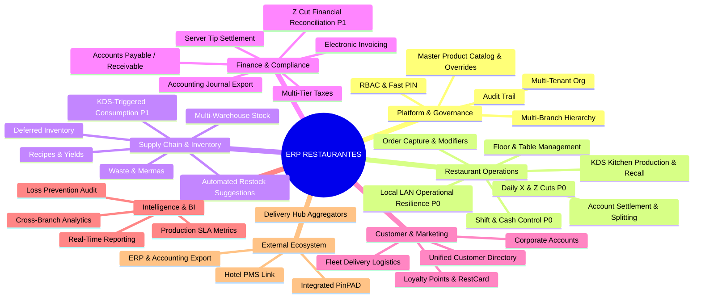

# CAPABILITY MAP — ERP RESTAURANTES

**Document ID:** `ARCH-CAP-001`  
**Version:** `1.3 NORMALIZED / REMEDIATED`  
**Status:** `READY FOR INDEPENDENT REVIEW`  
**Date:** 2026-09-01  
**Baseline:** `EAAF v1.2.0 @ 7e036f43240b3dc28ccb996e350263598275b2cd`  
**Supersedes:** `CAPABILITY_MAP.md v1.2`  

---

## 1. Taxonomía Funcional de Capacidades

El mapa de capacidades de **`ERP RESTAURANTES`** categoriza las funciones del negocio en 7 grandes dominios de capacidad:

---

## 2. Desglose Detallado de Capacidades por Dominio

### 2.1 Dominio: Plataforma, Seguridad y Gobierno (Platform Core)
- **CAP-PLT-01 [Gobierno Multi-Tenant & Multi-Branch]:** Administración de grupos empresariales y estructura jerárquica de sucursales con parametrización fiscal independiente.
- **CAP-PLT-02 [Gestión de Identidad y Acceso Dual]:** RBAC administrativo completo y autenticación rápida por PIN de 4 dígitos para estaciones de piso.
- **CAP-PLT-03 [Gobierno de Catálogo Maestro & Overrides]:** Catálogo centralizado de productos, categorías, menús, modificadores y precios base con sobreescritura local por sucursal (precios, visibilidad, impuestos).
- **CAP-PLT-04 [Auditoría Estructurada de Eventos]:** Registro cronológico de acciones sensibles (descuentos, cancelaciones, reaperturas de cuentas, apertura de cajón).
- **CAP-PLT-05 [Primitivas Transversales de Dispositivos]:** Registro, contexto de sucursal y autorización de identidades de estaciones físicas en la plataforma.

### 2.2 Dominio: Operaciones Gastronómicas (TRIDENTPOS)
- **CAP-OPS-01 [Gestión de Salón y Mesas]:** Control de estados de mesa (Libre, Abierta, Impresa, Cobrada), áreas físicas y comensales.
- **CAP-OPS-02 [Captura Rápida de Comanda]:** Captura táctil de productos simples, paquetes y compuestos con modificadores obligatorios y notas de cocina.
- **CAP-OPS-03 [Secuenciación y KDS en Cocina (Trigger P0)]:** Visualización de pedidos en tiempo real en LAN, cronómetro de preparación y emisión del evento formal `OrdenProduccionConfirmadaEnKDS`.
- **CAP-OPS-04 [Recuperación de Comandas (Recall)]:** Consulta histórica de comandas concluidas en monitor de cocina en una ventana de 2 horas.
- **CAP-OPS-05 [Operaciones Avanzadas de Mesa]:** División de cuentas por ítems o partes iguales, unión de cuentas y transferencias de mesas/meseros.
- **CAP-OPS-06 [Precuenta y Foliación]:** Emisión de precuenta impresa con asignación formal y consecutiva de Folio de Venta.
- **CAP-OPS-07 [Cobro y Split Payment]:** Liquidación de cuentas mediante múltiples formas de pago, registro de propinas y cálculo de cambio.
- **CAP-OPS-08 [Caja Completa y Cortes X/Z (P0)]:** Apertura de turno con fondo inicial, retiros, depósitos, salvaguardas, arqueo a ciegas, y **emisión autónoma de Corte X (parcial) y Corte Z (cierre diario de sucursal)**.
- **CAP-OPS-09 [Resiliencia Operativa de Red Local (LAN)]:** Continuidad operacional ininterrumpida de toma de pedidos, comanda en cocina, cobro y cortes ante fallas de internet.

### 2.3 Dominio: Cadena de Suministro y Recetas (Inventory & Procurement)
- **CAP-SCM-01 [Control Multi-Almacén]:** Separación funcional entre Bodegas de compra y Centros de Consumo de cocina.
- **CAP-SCM-02 [Ingeniería de Recetas y Rendimientos]:** Fórmulas de insumos, factores de conversión de rendimiento y porcentajes de merma en recetas de productos y subrecetas.
- **CAP-SCM-03 [Consumo de Inventario Disparado por KDS (P1)]:** Descarga efectiva de insumos en Centro de Consumo procesada por Inventory al recibir la confirmación de KDS cuando la capability está activa.
- **CAP-SCM-04 [Inventario Diferido]:** Soporte para ventas sin existencias físicas previas con registro de saldo pendiente por regularizar.
- **CAP-SCM-05 [Costeo Configurable]:** Métodos de Costo Promedio y Promedio de Entradas con salvaguarda ante saldo negativo.
- **CAP-SCM-06 [Producción de Insumos Elaborados]:** Órdenes manuales de transformación de subrecetas (fondos, salsas, masas).
- **CAP-SCM-07 [Sugerencia y Registro de Compras]:** Generación de pedidos por stock mínimo, emisión de órdenes de compra de un solo uso y registro de recepción de compras emitiendo eventos desacoplados hacia Inventory y Finance.
- **CAP-SCM-08 [Control de Mermas y Bajas]:** Registro de desperdicios de insumos y productos terminados con impacto a costo de ventas.

### 2.4 Dominio: Finanzas, Tesorería y Facturación (Finance & Billing)
- **CAP-FIN-01 [Cálculo de Impuestos Multi-Nivel]:** Impuestos directos (IVA), adicionales (IEPS), retenciones e impuestos en cascada.
- **CAP-FIN-02 [Facturación Fiscal Electrónica]:** Emisión y timbrado de comprobantes fiscales (CFDI / Int.) en modalidades normal, rápida, dividida y por lote.
- **CAP-FIN-03 [Cuentas por Pagar (CxP)]:** Registro y control de pasivos con proveedores derivados de recepciones de compra suscritas y programación de pagos.
- **CAP-FIN-04 [Cuentas por Cobrar (CxC)]:** Gestión de líneas de crédito a clientes, control de saldos y aplicación de abonos.
- **CAP-FIN-05 [Conciliación y Auditoría de Corte Z (P1)]:** Suscripción y conciliación financiera de los eventos `CorteZGenerado` emitidos por TRIDENTPOS.
- **CAP-FIN-06 [Liquidación de Propinas]:** Distribución de propinas a meseros con opción de descuento de comisión por cobro con tarjeta.
- **CAP-FIN-07 [Exportación de Pólizas Contables]:** Generación de interfaces de pólizas de ingresos, egresos y compras para software contable.

### 2.5 Dominio: Clientes, Fidelización y Canales Digitales (CRM, Loyalty & Delivery)
- **CAP-CST-01 [Directorio de Clientes]:** Libreta de teléfonos y direcciones asociadas a colonias y zonas de reparto.
- **CAP-CST-02 [Logística de Flota de Delivery Propio]:** Asignación de repartidores propios, despacho, control de ruta y liquidación de flotas mediante contrato funcional hacia TRIDENTPOS o Finance.
- **CAP-CST-03 [Monedero Electrónico y Puntos (Loyalty)]:** Tarjetas de saldo pre-pago (RestCard), acumulación y redención de puntos en cobro.
- **CAP-CST-04 [Cuentas Corporativas & Convenios]:** Gestión de convenios empresariales y comedores de empleados.

### 2.6 Dominio: Inteligencia de Negocio y Auditoría (Analytics)
- **CAP-ANA-01 [Tableros Ejecutivos Multi-Sucursal]:** Indicadores de ventas consolidadas, ticket promedio y mezcla de productos cross-branch.
- **CAP-ANA-02 [Métricas de Rendimiento en Cocina]:** Monitoreo de tiempos de preparación y cumplimiento de tiempos en KDS.
- **CAP-ANA-03 [Auditoría y Prevención de Pérdidas]:** Reportes especializados de cancelaciones, descuentos, mermas y variaciones de caja.
- **CAP-ANA-04 [Catálogo de Reportes Operacionales]:** Más de 65 reportes estándar de ventas, caja, inventarios y compras.

### 2.7 Dominio: Ecosistema e Integraciones (Integrations)
- **CAP-INT-01 [Conectores de Delivery Hub]:** Ingesta, transformación de pedidos y mapeo de catálogos de plataformas de terceros (Uber Eats, Rappi, Didi Food) hacia TRIDENTPOS.
- **CAP-INT-02 [Enlace PMS Hotelero]:** Cargo de consumos de restaurante directamente a la cuenta de habitación del huésped.
- **CAP-INT-03 [Terminales Bancarias Integradas]:** Comunicación con PinPADs para cobro automático sin tecleo manual de importes.
- **CAP-INT-04 [Venta de Tiempo Aire (TAE)]:** Módulo de recargas electrónicas de telefonía en caja.

---

## 3. Matriz de Mapeo: Capacidades vs. Módulos vs. Fases de Alcance

| Código de Capacidad | Nombre de la Capacidad | Bounded Context Asignado | Módulo Responsable | Fase de Alcance |
|---|---|---|---|---|
| **CAP-PLT-01** | Gobierno Multi-Tenant & Multi-Branch | Platform Core | Platform Core | **P0 (Core)** |
| **CAP-PLT-02** | Gestión de Identidad (RBAC + PIN) | Platform Core | Platform Core | **P0 (Core)** |
| **CAP-PLT-03** | Gobierno de Catálogo Maestro & Overrides | Platform Core | Platform Core | **P0 (Core)** |
| **CAP-PLT-04** | Auditoría Estructurada de Eventos | Platform Core | Platform Core | **P0 (Core)** |
| **CAP-PLT-05** | Primitivas Transversales de Dispositivos | Platform Core | Platform Core | **P0 (Core)** |
| **CAP-OPS-01** | Gestión de Salón y Mesas | TRIDENTPOS | TRIDENTPOS | **P0 (Core)** |
| **CAP-OPS-02** | Captura Rápida de Comanda | TRIDENTPOS | TRIDENTPOS | **P0 (Core)** |
| **CAP-OPS-03** | Secuenciación y KDS (Trigger Producción) | TRIDENTPOS | TRIDENTPOS | **P0 (Core)** |
| **CAP-OPS-04** | Recuperación de Comandas (Recall) | TRIDENTPOS | TRIDENTPOS | **P0 (Core)** |
| **CAP-OPS-06** | Precuenta y Foliación | TRIDENTPOS | TRIDENTPOS | **P0 (Core)** |
| **CAP-OPS-07** | Cobro y Split Payment | TRIDENTPOS | TRIDENTPOS | **P0 (Core)** |
| **CAP-OPS-08** | Caja Completa y Cortes X/Z | TRIDENTPOS | TRIDENTPOS | **P0 (Core)** |
| **CAP-OPS-09** | Resiliencia Operativa de Red Local (LAN) | TRIDENTPOS | TRIDENTPOS | **P0 (Core)** |
| **CAP-SCM-01** | Control Multi-Almacén (Bodega/Cocina) | Inventory | Inventory | **P1 (Comercial)** |
| **CAP-SCM-02** | Ingeniería de Recetas y Rendimientos | Inventory | Inventory | **P1 (Comercial)** |
| **CAP-SCM-03** | Consumo de Inventario Disparado por KDS | Inventory | Inventory | **P1 (Comercial)** |
| **CAP-SCM-04** | Inventario Diferido (Venta sin Stock) | Inventory | Inventory | **P1 (Comercial)** |
| **CAP-SCM-05** | Costeo Configurable (Promedio/Entradas) | Inventory | Inventory | **P1 (Comercial)** |
| **CAP-SCM-07** | Sugerencia y Registro de Compras | Procurement | Procurement | **P1 (Comercial)** |
| **CAP-SCM-08** | Control de Mermas y Bajas | Inventory | Inventory | **P1 (Comercial)** |
| **CAP-FIN-01** | Cálculo de Impuestos Multi-Nivel | Billing | Billing | **P1 (Comercial)** |
| **CAP-FIN-02** | Facturación Fiscal Electrónica | Billing | Billing | **P1 (Comercial)** |
| **CAP-FIN-03** | Cuentas por Pagar (CxP) | Finance | Finance | **P1 (Comercial)** |
| **CAP-FIN-04** | Cuentas por Cobrar (CxC) | Finance | Finance | **P1 (Comercial)** |
| **CAP-FIN-05** | Conciliación y Auditoría de Corte Z | Finance | Finance | **P1 (Comercial)** |
| **CAP-FIN-06** | Liquidación de Propinas | Finance | Finance | **P1 (Comercial)** |
| **CAP-OPS-05** | Operaciones Avanzadas de Mesa (División) | TRIDENTPOS | TRIDENTPOS | **P1 (Comercial)** |
| **CAP-CST-01** | Directorio de Clientes | CRM | CRM | **P1 (Comercial)** |
| **CAP-CST-02** | Logística de Flota de Delivery Propio | Delivery | Delivery | **P1 (Comercial)** |
| **CAP-ANA-04** | Catálogo de Reportes Operacionales | Analytics | Analytics | **P1 (Comercial)** |
| **CAP-INT-01** | Conectores de Delivery Hub | Integrations | Integrations | **P2 (Digital)** |
| **CAP-CST-03** | Monedero Electrónico y Puntos | Loyalty | Loyalty | **P2 (Digital)** |
| **CAP-CST-04** | Cuentas Corporativas & Convenios | CRM | CRM | **P2 (Digital)** |
| **CAP-SCM-06** | Producción de Insumos Elaborados | Inventory | Inventory | **P2 (Digital)** |
| **CAP-FIN-07** | Exportación de Pólizas Contables | Finance | Finance | **P2 (Digital)** |
| **CAP-INT-03** | Terminales Bancarias Integradas | Integrations | Integrations | **P2 (Digital)** |
| **CAP-ANA-01** | Tableros Ejecutivos Multi-Sucursal | Analytics | Analytics | **P2 (Digital)** |
| **CAP-ANA-02** | Métricas de Rendimiento en Cocina | Analytics | Analytics | **P2 (Digital)** |
| **CAP-ANA-03** | Auditoría y Prevención de Pérdidas | Analytics | Analytics | **P2 (Digital)** |
| **CAP-INT-02** | Enlace PMS Hotelero | Integrations | Integrations | **P3 (Extensiones)** |
| **CAP-INT-04** | Venta de Tiempo Aire (TAE) | Integrations | Integrations | **P3 (Extensiones)** |

---

DOCUMENT STATUS: READY FOR INDEPENDENT REVIEW
