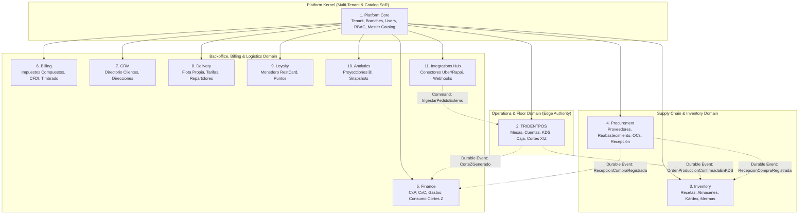

# DATA ARCHITECTURE — ERP RESTAURANTES / TRIDENTPOS

**Document ID:** `ARCH-DAT-001`  
**Version:** `1.0 DRAFT`  
**Status:** `READY FOR INDEPENDENT REVIEW`  
**Date:** 2026-09-01  
**Framework:** `EAAF v1.2.0 @ 7e036f43240b3dc28ccb996e350263598275b2cd`  
**Author Agent:** `03_Data_Architect`  
**Approved Solution Baseline:** `e35205906055a8425ab875d05789652b3c3497b7` (Tag `solution-architecture-v1.3-approved`)  
**Target Gate:** `DATA_ARCHITECTURE_GATE`  

---

## 1. Domains and Ownership

En estricto apego al estilo de **Monolito Modular con Bounded Contexts Fuertes** establecido en `ADR-001` y la arquitectura funcional `FUNCTIONAL_ARCHITECTURE.md`, la persistencia de datos se organiza en **11 Bounded Contexts lógicos**. 

### Regla Fundamental de Aislamiento de Datos
> **NO CROSS-BOUNDED-CONTEXT PRIVATE TABLE WRITES:** Ningún módulo puede ejecutar sentencias `INSERT`, `UPDATE` o `DELETE` directamente sobre tablas pertenecientes a otro Bounded Context. Toda mutación inter-módulo se realiza exclusivamente a través de la API pública de comandos del módulo o mediante el consumo de eventos de integración durables (`CloudIntegrationOutbox`).



---

## 2. Conceptual and Logical Storage Models

El sistema implementa una **Arquitectura de Persistencia Híbrida Cloud-Edge**:

1. **Cloud Control Plane Persistence (PostgreSQL 16 en Supabase):**
   - Actúa como `System of Record (SoR)` corporativo para Organizaciones, Sucursales, Usuarios, Catálogo Maestro, Recetas, Compras, Finanzas, Facturación y Analítica.
   - Aplica **Row-Level Security (RLS)** y particionamiento por `organization_id` para garantizar aislamiento estricto de tenants.
   - Aloja la cola de eventos inter-módulo transaccional `cloud_integration_outbox` y su correspondiente `cloud_integration_dlq`.

2. **Branch Operational Plane Persistence (SQLite 3 WAL en Edge Server):**
   - Base de datos local embebida de alta velocidad y cero administración.
   - Actúa como `Primary Write Authority` de las transacciones operativas en salón, cocina y caja (`mesas`, `cuentas`, `kds_ordenes`, `turnos_caja`, `pagos`, `cortes_z`).
   - Mantiene tablas de outbox local (`outbox_queue`) y registro de idempotencia (`ingested_idempotency_log`) para sincronización asíncrona bidireccional tolerante a desconexión.

---

## 3. Data Authority by Topology (Matriz EAAF)

La arquitectura de datos respeta y formaliza las 4 topologías de despliegue definidas en `SYSTEM_CONTEXT.md` y `ADR-002`:

| Dominio / Agregado | Topología | Authoritative Source (SoR) | Writable Node | Read Replica | Dirección de Sync | Política de Conflicto | Autoridad de Reconciliación |
|---|---|---|---|---|---|---|---|
| **Catálogo Maestro & Precios** | Full Suite | Cloud PostgreSQL | Cloud | Edge SQLite | Cloud → Edge (Deltas) | Cloud Wins (Staging Checksum) | Cloud SoR |
| **Mesas, Cuentas & Comandas** | Full Suite | Edge SQLite | Edge Host Local | Cloud PostgreSQL | Edge → Cloud (Outbox) | OCC (`expectedVersion`) | Edge Primary Write |
| **KDS & Estados Preparación** | Full Suite | Edge SQLite | Edge Host Local | Cloud (Analytics) | Edge → Cloud (Outbox) | Causal Monotonic Seq | Edge Primary Write |
| **Turnos de Caja & Cortes X/Z** | Full Suite | Edge SQLite | Edge Host Local | Cloud (Finance) | Edge → Cloud (Outbox) | Lease + Fencing Token | Edge Primary Write |
| **Kárdex & Movimientos Stock** | Full Suite | Cloud PostgreSQL | Cloud | N/A | Cloud Events Dispatch | Serial Transaction ACID | Cloud Inventory |
| **Finanzas (CxP / CxA / Gastos)**| Full Suite | Cloud PostgreSQL | Cloud | N/A | Cloud Events Dispatch | Append-Only Ledger | Cloud Finance |
| **Piso, Caja y Catálogo Local** | Standalone POS | Edge SQLite | Edge Host Local | N/A | Local Only | N/A | Edge Local SoR (100%) |
| **Backoffice & Finanzas** | Standalone Backoffice | Cloud PostgreSQL | Cloud | N/A | Cloud Only / API Ext. | Schema Validation | Cloud SoR |
| **Híbrido (POS + ERP Ext.)** | Hybrid ERP | Cloud / ERP Ext. | Edge (Piso) / ERP (Fin.) | Cloud / ERP Ext. | Edge → Cloud → ERP Ext.| Interface Policy Contract | ERP Corporativo Externo |

---

## 4. Integrity and Concurrency Invariants

### 4.1 Invariante de Control de Concurrencia Optimista (OCC)
- **Campos Mandatorios:** Toda tabla mutable sujeta a concurrencia distribuida (`cuentas`, `mesas`, `turnos_caja`) incluye una columna `version INTEGER NOT NULL DEFAULT 1`.
- **Regla de Mutación:** 
  $$\text{UPDATE } \text{table } \text{SET } \text{col} = \text{val}, \text{version} = \text{version} + 1 \text{ WHERE } \text{id} = :id \text{ AND } \text{version} = :expectedVersion;$$
- **Semántica de Fallo:** Si `affected_rows == 0`, la transacción aborta inmediatamente y retorna error estructurado `409 Conflict (CONCURRENT_MUTATION_CONFLICT)` junto con el snapshot actual para recarga en cliente.

### 4.2 Invariante de Lease de Folios con Épocas y Fencing Criptográfico (REM-01, ADR-008)
- **Estructura del Lease en Cloud:**
  `folio_leases (organization_id, branch_id, folio_type, epoch_id, fencing_token, range_start, range_end, high_water_mark, status, allocated_at, revoked_at, abandoned_at)`
- **Estados de Asignación:** `ALLOCATED` $\rightarrow$ `ACTIVE` $\rightarrow$ `EXHAUSTED` $\rightarrow$ `REVOKED` $\rightarrow$ `ABANDONED_CONTINGENCY_RANGE` $\rightarrow$ `RECONCILED`.
- **Invariante Falso-Positivo / Prevención de Reuso:**
  1. $\text{range\_start}_{\text{new}} > \text{range\_end}_{\text{abandoned}}$ de forma estrictamente monótona.
  2. Un rango marcado como `ABANDONED_CONTINGENCY_RANGE` **jamás se reasigna a un nuevo host**.
  3. Todo handshake con $\text{epoch\_id}_{\text{incoming}} < \text{epoch\_id}_{\text{active}}$ es rechazado con `403 LEASE_REVOKED`.

### 4.3 Invariante de Preservación de Snapshot Económico en Ventas Abiertas (REM-10)
- Las tablas `cuenta_items` y `cuenta_item_modificadores` almacenan de forma denormalizada e inmutable:
  `product_name_snapshot`, `unit_price_applied`, `tax_scheme_snapshot`, `tax_rate_applied`, `discount_amount_applied`, `modifier_price_applied`.
- **Invariante:** Las actualizaciones posteriores a las tablas maestras `products`, `prices` o `tax_schemes` **no tienen efecto retroactivo** sobre filas existentes en `cuenta_items`.

---

## 5. Tenancy, Isolation and Security Boundaries

### 5.1 Jerarquía Organizacional y Claves Compuestas
- **Tenant Scope:** Toda tabla en Cloud pertenece a una organización (`organization_id UUID NOT NULL REFERENCES organizations(id)`).
- **Branch Scope:** Toda entidad operativa local vincula a la sucursal (`branch_id UUID NOT NULL REFERENCES branches(id)`).
- **Claves Únicas Multi-Tenant:**
  Todas las restricciones de unicidad de negocio son compuestas: `UNIQUE (organization_id, code)` o `UNIQUE (organization_id, branch_id, business_number)`.

### 5.2 Row-Level Security (RLS) en Cloud PostgreSQL
```sql
-- Invariante de Aislamiento de Tenant en Cloud PostgreSQL
ALTER TABLE accounts ENABLE ROW LEVEL SECURITY;
CREATE POLICY tenant_isolation_policy ON accounts
  FOR ALL
  USING (organization_id = current_setting('app.current_organization_id', true)::uuid);
```

---

## 6. Data Classification and Privacy

| Nivel de Clasificación | Ejemplos de Datos | Mecanismo de Almacenamiento y Protección |
|---|---|---|
| **Restricted (Confidencial Alto)** | Hashes salteados de PIN (Argon2id), Credenciales OAuth de Integraciones, Tokens de Fencing, Llaves privadas de firmado fiscal. | Cifrado en reposo (`pgcrypto` / Secret Vault en Cloud, SQLCipher en Edge). Prohibido almacenamiento en texto plano. (`SECURITY ARCHITECTURE REQUIRED`). |
| **Confidential (Financiero / PII)** | Clientes (Nombre, Email, Teléfono, RFC), Vouchers de pago bancario, Arqueos de caja, Cortes Z, Cuentas por Pagar. | RLS por tenant, acceso restringido por roles RBAC, registro en bitácora de auditoría. |
| **Internal (Operativo)** | Comandas, Tiempos de KDS, Inventario, Kárdex, Recetas, Catálogo de Productos y Precios. | Aislamiento por Tenant / Sucursal. Sincronización outbox tipada. |
| **Public** | Nombres de platillos en menús públicos, descripciones comerciales. | Acceso de lectura no sensible. |

---

## 7. Lifecycle, Retention and Deletion Strategy

### 7.1 Políticas de Retención de Datos
- **Log de Idempotencia (`ingested_idempotency_log`):** `90 días` (`POLICY VALUE — REQUIRES PO/TECH VALIDATION`).
- **Transacciones Operativas Locales en Edge:** Retención activa de `30 días` en SQLite local tras sincronización confirmada; purga automática diaria de registros marcados como `SYNCED` con más de 30 días para evitar saturación de disco.
- **Historial Fiscal y Cortes Z en Cloud:** `5 a 10 años` según legislación tributaria aplicable (`POLICY VALUE — REQUIRES LEGAL VALIDATION`).
- **Bitácora de Auditoría (`audit_log_entries`):** `7 años` inmutable.

### 7.2 Estrategia de Eliminación y Soft Deletes
- Las entidades maestras (`products`, `categories`, `modifiers`, `users`, `branches`) implementan **Soft Delete** (`is_active BOOLEAN NOT NULL DEFAULT TRUE`, `deleted_at TIMESTAMPTZ NULL`).
- **Invariante Referencial:** Queda estrictamente prohibido el borrado físico (`HARD DELETE`) de entidades maestras que cuenten con transacciones históricas asociadas (`cuenta_items`, `kds_ordenes`, `facturas_fiscales`).

---

## 8. Migration Strategy (Cloud & Edge)

### 8.1 Migraciones en Cloud PostgreSQL
- **Herramienta:** Migraciones versionadas SQL secuenciales (`YYYYMMDDHHMMSS_name.sql`).
- **Patrón:** *Expand and Contract* (Cero tiempo de inactividad). Las columnas deprecadas se marcan como opcionales durante la fase de transición antes de su eliminación física.

### 8.2 Migraciones en Edge SQLite
- **Mecanismo:** Tabla `schema_migrations (version INTEGER PRIMARY KEY, applied_at TEXT, checksum TEXT)`.
- **Protocolo de Actualización Segura:**
  1. Ejecución de backup snapshot previo a la migración (`trident_pre_migrate_vX.db`).
  2. Ejecución de la migración dentro de una transacción única (`BEGIN TRANSACTION; ... COMMIT;`).
  3. En caso de error, `ROLLBACK`, restauración automática del backup previo y reporte de alerta con bloqueo del arranque en modo de contingencia.

---

## 9. Backup, Restore and Disaster Recovery Architecture

### 9.1 Respaldo en Cloud
- Respaldos físicos diarios continuos gestionados (WAL archiving + PITR en Supabase).
- Exportación lógica semanal encriptada de snapshots por Tenant a almacenamiento S3 aislado.

### 9.2 Respaldo en Edge Local
- Snapshot SQLite diario consistente ejecutando `VACUUM INTO 'backup_path'` en ventana de bajo tráfico.
- Respaldo obligatorio antes de cierres de turno y migraciones de esquema.

### 9.3 Procedimiento de Restauración y Validación de Integridad
- **Escenario Pérdida de Edge Host:**
  1. Aprovisionamiento de nuevo hardware.
  2. Bootstrap inicial desde Cloud (Descarga de catálogo maestro, branch overrides, credenciales cacheadas).
  3. Asignación de nuevo lease con época incrementada (`epochId = ep_2`, rango de folios limpio).
  4. Apertura del `TurnoDeAjustePorContingencia` para reconciliación física de folios abandonados.
- **Criterio de Validación:** `RESTORE VALIDATION REQUIRED` mediante simulacro formal de contingencia.

---

## 10. Audit Trail and Immutability

### 10.1 Inmutabilidad Financiera y Contable
- Las tablas `pagos`, `cortes_z`, `kardex_movimientos`, `facturas_fiscales`, `transacciones_lealtad` y `audit_log_entries` son **APPEND-ONLY**.
- Cualquier corrección contable o ajuste de inventario se realiza exclusivamente mediante **transacciones de reversa o compensación** (`COMPENSATING_TRANSACTION`), preservando el registro original intacto.

### 10.2 Estructura Canónica de Auditoría (`audit_log_entries`)
`audit_log_entries (id, organization_id, branch_id, actor_id, station_id, action, aggregate_type, aggregate_id, before_snapshot, after_snapshot, reason, correlation_id, client_timestamp, server_timestamp, is_offline_origin)`

---

## 11. Performance and Capacity Assumptions

Las siguientes métricas constituyen supuestos de diseño y dimensionamiento para pruebas de carga:
- **Catálogo Maestro:** Hasta 10,000 productos y modificadores por organización (`CAPACITY ASSUMPTION — REQUIRES BENCHMARK`).
- **Volumen Diario por Sucursal:** Hasta 2,000 comandas y 15,000 items vendidos por día (`CAPACITY ASSUMPTION`).
- **Concurrencia Local:** Hasta 20 terminales concurrentes (KDS + comanderos) consultando SQLite WAL con latencia $< 5\text{ ms}$ en LAN.
- **Tamaño de Base de Datos Edge:** Estimado $< 500\text{ MB}$ para 30 días de historial local operativo.

---

## 12. Open Questions Neutrality

Data Architecture preserva de forma estricta la neutralidad sobre las 9 decisiones del Product Owner:
1. **OQ-SSOT-01 (Cancelación Post-Cocina):** Modelo almacena `cancellation_reason_id` y `authorized_by_user_id` opcional sin forzar validación gerencial fija en base de datos.
2. **OQ-SSOT-02 (PIN Transferencia):** Tabla `cuenta_transferencias` admite `receiver_credential_hash` nulo/opcional.
3. **OQ-SSOT-03 (Límite Crédito CxC):** Esquema define `credit_limit DECIMAL` y `allow_overdraft BOOLEAN` parametrizable.
4. **OQ-SSOT-04 (Cancelación Total Móvil):** Tabla `cuenta_anulaciones` registra la anulación independientemente del tipo de estación emisora.
5. **OQ-SSOT-05 (Algoritmo Abastecimiento):** Tabla `replenishment_policies` soporta tipos de cálculo parametrizables (`STATIC_MIN_MAX`, `WEIGHTED_CONSUMPTION_AVERAGE`).
6. **OQ-SSOT-06 (Prorrateo Cuentas Divididas):** Modelo registra el split a nivel ítem admitiendo prorrateo porcentual o reinicio de descuentos vía comando.
7. **OQ-SSOT-07 (Recetas Modificadores):** Tablas `recipe_modifiers` almacenan insumos y factores sin asumir lógica aditiva vs. sustractiva hardcodeada en DDL.
8. **OQ-ARCH-01 (Turnos Multi-Cajero):** Modelo `turnos_caja` soporta sesión principal y tabla `turno_caja_operadores` para sesiones compartidas opcionales.
9. **OQ-ARCH-02 (Facturación Global):** Tabla `lotes_facturacion_global` desacoplada del disparador (manual vs. programado).

---

## 13. Traceability and Cross-References

| Componente de Datos | Capability Funcional | Bounded Context | ADR Relacionado |
|---|---|---|---|
| `organizations`, `branches`, `users`, `products` | CAP-PLT-01, CAP-PLT-02, CAP-PLT-03 | Platform Core | ADR-001 |
| `cuentas`, `mesas`, `cuenta_items` | CAP-OPS-01, CAP-OPS-02, CAP-OPS-03 | TRIDENTPOS | ADR-005, ADR-006 |
| `folio_leases`, `edge_epochs` | CAP-OPS-05, CAP-OPS-06 | TRIDENTPOS / Platform | ADR-008 |
| `kds_ordenes`, `kds_items` | CAP-OPS-04 | TRIDENTPOS | ADR-005 |
| `turnos_caja`, `pagos`, `cortes_z` | CAP-OPS-05, CAP-OPS-06 | TRIDENTPOS | ADR-004, ADR-006 |
| `recetas`, `almacenes`, `kardex_movimientos` | CAP-SCM-01, CAP-SCM-02, CAP-SCM-03 | Inventory | ADR-001, ADR-007 |
| `ordenes_compra`, `recepciones_compra` | CAP-SCM-06, CAP-SCM-07 | Procurement | ADR-007 |
| `cuentas_por_pagar`, `cuentas_por_cobrar` | CAP-FIN-01, CAP-FIN-02, CAP-FIN-03 | Finance | ADR-007 |
| `facturas_fiscales`, `timbres_fiscales` | CAP-BIL-01, CAP-BIL-02, CAP-BIL-03 | Billing | ADR-002 |
| `clientes`, `direcciones_cliente` | CAP-CRM-01, CAP-CRM-02 | CRM | ADR-001 |
| `zonas_delivery`, `tarifas`, `repartidores` | CAP-LOG-01, CAP-LOG-02, CAP-LOG-03 | Delivery | ADR-001 |
| `tarjetas_lealtad`, `monederos_saldo` | CAP-LOY-01, CAP-LOY-02 | Loyalty | ADR-001 |
| `conectores_externos`, `mapeos_entidades` | CAP-INT-01, CAP-INT-02 | Integrations Hub | ADR-002 |

---

DOCUMENT STATUS: READY FOR INDEPENDENT REVIEW
