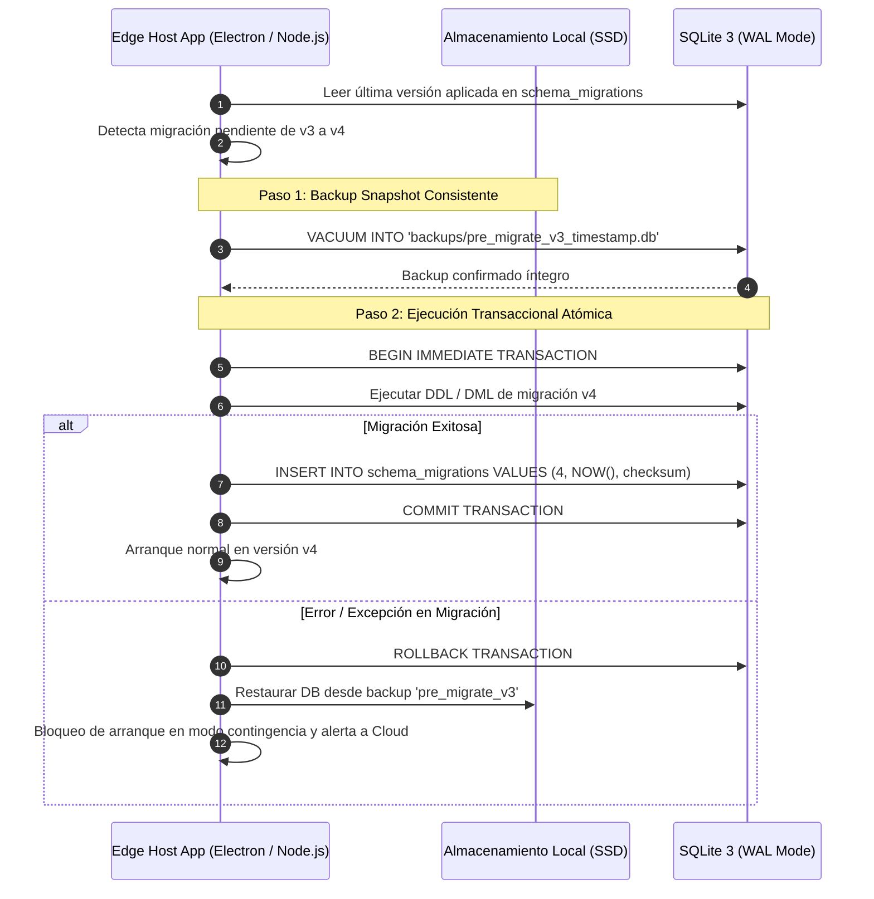

# DATA MIGRATION & COMPATIBILITY STRATEGY — ERP RESTAURANTES

**Document ID:** `ARCH-MIG-001`  
**Version:** `1.0 DRAFT`  
**Status:** `READY FOR INDEPENDENT REVIEW`  
**Date:** 2026-09-01  
**Framework:** `EAAF v1.2.0 @ 7e036f43240b3dc28ccb996e350263598275b2cd`  
**Author Agent:** `03_Data_Architect`  
**Approved Solution Baseline:** `e35205906055a8425ab875d05789652b3c3497b7` (Tag `solution-architecture-v1.3-approved`)  

---

## 1. Estrategia de Migración en Cloud PostgreSQL

### 1.1 Principios de Cero Tiempo de Inactividad (Expand & Contract)
Para evitar bloqueos de tabla en despliegues productivos continuos:
1. **Fase Expand (Adición No Disruptiva):** Se agregan nuevas columnas, tablas o tipos como nulables o con valores por defecto. La versión anterior del backend continúa operando sin afectación.
2. **Fase Transition (Doble Escritura / Backfill Asíncrono):** El nuevo backend escribe en las nuevas estructuras y ejecuta scripts de migración de datos históricos en segundo plano.
3. **Fase Contract (Limpieza y Restricción):** Una vez que todas las instancias y sucursales han migrado, se aplican restricciones `NOT NULL` y se eliminan las columnas antiguas obsoletas.

---

## 2. Estrategia de Migración en Edge SQLite

Las terminales de sucursal operan en entornos no controlados (apagones, cortes de red). Por tanto, las migraciones locales se rigen por un **Protocolo de Transaccionalidad Atómica y Backup Previo**:

---

## 3. Protocolo de Compatibilidad de Versiones de Sincronización (Sync Protocol Versioning)

Para evitar que una versión más reciente de Cloud rechace o corrompa datos de un Edge Server que aún no se ha actualizado:
- **Campos en el Handshake WSS:**
  - `protocolVersion`: Versión del protocolo de red (ej. `v1.3`).
  - `schemaVersion`: Versión del esquema local de SQLite (ej. `4`).
  - `minimumSupportedVersion`: Versión mínima aceptada por Cloud.
- **Regla de Negociación:**
  - Si $\text{schemaVersion}_{\text{Edge}} \ge \text{minimumSupportedVersion}_{\text{Cloud}}$: Sincronización permitida.
  - Si $\text{schemaVersion}_{\text{Edge}} < \text{minimumSupportedVersion}_{\text{Cloud}}$: Cloud responde `426 Upgrade Required`, permitiendo operaciones de cobro local pero bloqueando la ingesta hasta la actualización del binario de la sucursal.

---

DOCUMENT STATUS: READY FOR INDEPENDENT REVIEW
