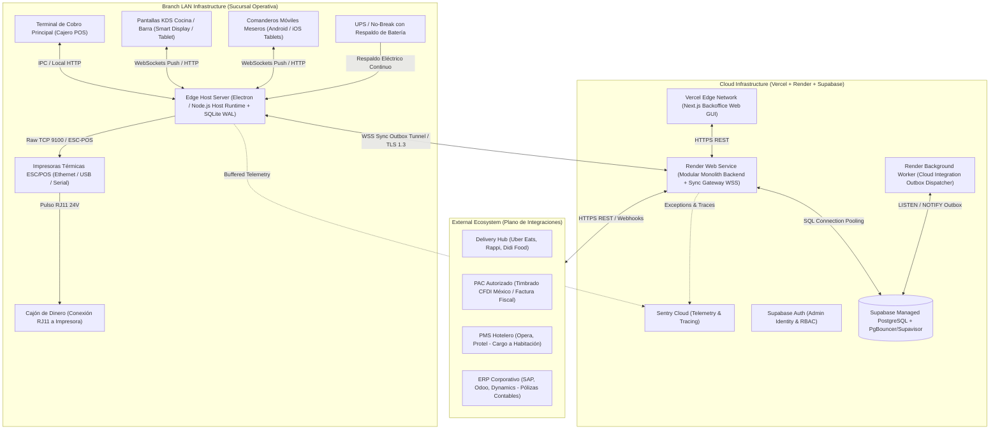

# DEPLOYMENT TOPOLOGY & INFRASTRUCTURE SPECIFICATION — ERP RESTAURANTES

**Document ID:** `ARCH-DEP-001`  
**Version:** `1.3 NORMALIZED / REMEDIATED`  
**Status:** `APPROVED / FROZEN`  
**Date:** 2026-09-01  
**Baseline:** `EAAF v1.2.0 @ 7e036f43240b3dc28ccb996e350263598275b2cd`  
**Supersedes:** `DEPLOYMENT_TOPOLOGY.md v1.1`  

---

## 1. Topología Global de Despliegue

---

## 2. Especificación del Cloud Control Plane

1. **Front-end Corporativo:** Desplegado en **Vercel** con distribución global en Edge Network, ofreciendo carga ultrarrápida del portal de administración de la suite.
2. **Back-end & Sincronización:** Ejecutado en **Render** como un Web Service Node.js en contenedor Docker administrado con escalamiento horizontal según demanda.
3. **Persistencia Central:** **PostgreSQL en Supabase** con réplicas de lectura opcionales para analítica masiva y Row-Level Security (RLS) para aislamiento estricto de tenants.

---

## 3. Especificación del Branch Operational Plane (Baseline Provisional de Hardware)

Las siguientes especificaciones corresponden a un **baseline de ingeniería provisional sujeto a benchmark y dimensionamiento técnico**:

| Componente | Especificación Mínima Sugerida | Especificación Recomendada | Justificación Técnica |
|---|---|---|---|
| **Edge Host Server (Equipo Principal)** | CPU Intel Celeron / Core i3, 4 GB RAM, 64 GB SSD, SO Windows 10/11 o Ubuntu Linux. | CPU Intel Core i5 / Ryzen 5, 8–16 GB RAM, 128 GB NVMe SSD, SO Ubuntu 22.04 LTS o Windows 11 Pro. | Soporte del runtime Electron/Node, base de datos SQLite WAL local, servidor WebSockets y cola de impresión. |
| **Respaldo de Energía (UPS)** | UPS 600VA / 360W con supresión de picos. | UPS 1000VA / 600W Online con regulador de voltaje. | Previene apagones súbitos durante escrituras en SQLite (`PRAGMA synchronous = FULL`) y cortes de caja. |
| **Red Local (LAN & WiFi)** | Router Gigabit Ethernet + AP WiFi 2.4/5GHz estándar. | Router/Switch Gigabit administrado + Access Point empresarial WiFi 6 (SSID dedicado para POS/KDS). | `LATENCY TARGET: < 5 ms` para distribución de órdenes de cocina sin interferencias con clientes. |
| **Impresoras Térmicas** | Impresora térmica 80mm ESC/POS (Ethernet / USB). | Impresora térmica 80mm con autocutter, triple interfaz (Ethernet, USB, Serial) y puerto RJ11. | Impresión confiable de comandas en cocina y precuentas/tickets en caja. |
| **Terminales KDS / Tablets** | Tablet Android 10+ / iPad con pantalla 10.1", 2 GB RAM. | Tablet industrial o Touch All-in-One 15.6", 4 GB RAM con montaje VESA sellado contra grasa/calor. | Visualización de tiempos de preparación y confirmación táctil de despacho de platillos. |

---

DOCUMENT STATUS: APPROVED / FROZEN — 2026-09-01
