# DEPLOYMENT TOPOLOGY — ERP RESTAURANTES

**Versión:** 1.1 (SOLUTION ARCHITECTURE NORMALIZED)  
**Fecha:** 2026-08-31  
**SSOT Baseline:** [`FUNCTIONAL_ARCHITECTURE.md`](file:///Volumes/SSD_ORICO/BRAIN/TRIDENTPOSREST/FUNCTIONAL_ARCHITECTURE.md) (v1.2 APPROVED) & [`PRODUCT_SCOPE.md`](file:///Volumes/SSD_ORICO/BRAIN/TRIDENTPOSREST/PRODUCT_SCOPE.md) (v1.2 APPROVED).  
**Rol:** `01_Solution Architect`

---

## 1. Visión General de la Topología de Despliegue

La arquitectura física y de red de `ERP RESTAURANTES` está diseñada como un **modelo híbrido Cloud-Edge** para combinar la gobernanza centralizada multi-tenant con la resiliencia operativa en sucursal.

```mermaid
graph TB
    subgraph Cloud_Infrastructure["CLOUD PLANE (Managed Infrastructure)"]
        direction TB
        subgraph Vercel_Edge["Vercel Global CDN / Edge"]
            CDN["Web App Static Assets (Backoffice SPA & Portal Autofacturación [PROPOSED])"]
        end

        subgraph Render_Cluster["Render Managed Services"]
            API_SVC["Core API Modular Monolith (Web Service)"]
            SYNC_SVC["Cloud Sync & WebSocket Gateway (Web Service / Persistent WSS)"]
            WORKER_SVC["Async Background Worker & Integrations Engine"]
        end

        subgraph Supabase_Cloud["Supabase Managed Platform"]
            PG_CLOUD[("Cloud PostgreSQL (Multi-Tenant Relational Data)")]
            STORAGE_CLOUD[("Supabase S3 Storage (Logos, XML, PDF)")]
            AUTH_CLOUD["Supabase Auth (Admin Identity Broker)"]
        end

        CDN --> API_SVC
        API_SVC --> PG_CLOUD
        SYNC_SVC --> PG_CLOUD
        WORKER_SVC --> PG_CLOUD
        API_SVC --> STORAGE_CLOUD
        API_SVC --> AUTH_CLOUD
    end

    subgraph Branch_LAN["BRANCH OPERATIONAL PLANE (Branch Local Network)"]
        direction TB
        subgraph Edge_Station["Estación Principal de Sucursal (Host Local)"]
            LOCAL_RUNTIME["TRIDENTPOS Edge Server (Host Runtime)"]
            LOCAL_DB[("Local SQLite 3 WAL Database")]
            HW_DAEMON["Hardware Gateway Driver (ESC/POS, Cash Drawer, Scales)"]
            CASH_UI["Terminal Caja Principal (Local Screen)"]
        end

        subgraph Floor_Stations["Estaciones Secundarias en Salón y Cocina"]
            POS_FLOOR["Terminal POS Salón (All-in-One Táctil)"]
            KDS_KITCHEN["Monitor KDS Cocina (Touchscreen Display)"]
            KDS_BAR["Monitor KDS Barra (Touchscreen Display)"]
            TABLET_WAITER["Comandero Móvil (Tablet en WiFi Local)"]
        end

        subgraph Hardware_Peripherals["Periféricos Físicos de Sucursal"]
            PRINT_CASH["Impresora Térmica Tickets (USB / Serial / Ethernet)"]
            PRINT_KITCHEN["Impresora Térmica Comandas (Ethernet / LAN)"]
            CASH_DRAWER["Cajón de Dinero (RJ11 vía Impresora)"]
            SCALE["Báscula de Alimentos (Serial RS232 / USB)"]
            PINPAD["PinPAD Bancario Integrado (TCP/IP Ethernet)"]
        end

        LOCAL_RUNTIME --> LOCAL_DB
        LOCAL_RUNTIME --> HW_DAEMON
        CASH_UI --> LOCAL_RUNTIME
        HW_DAEMON --> PRINT_CASH
        HW_DAEMON --> CASH_DRAWER
        HW_DAEMON --> SCALE
        HW_DAEMON --> PINPAD

        POS_FLOOR <== "HTTP / WebSocket (LAN)" ==> LOCAL_RUNTIME
        KDS_KITCHEN <== "WebSocket (LAN)" ==> LOCAL_RUNTIME
        KDS_BAR <== "WebSocket (LAN)" ==> LOCAL_RUNTIME
        TABLET_WAITER <== "WebSocket (WiFi Local)" ==> LOCAL_RUNTIME
        HW_DAEMON <== "TCP RAW Port 9100" ==> PRINT_KITCHEN
    end

    LOCAL_RUNTIME <== "HTTPS / WSS TLS 1.3 (Sincronización Asíncrona Resiliente)" ==> SYNC_SVC
```

---

## 2. Topologías de Despliegue

### 2.1 Topología 1: Full-Suite ERP RESTAURANTES
Despliegue integral que combina el Cloud Control Plane con nodos Edge en cada sucursal:
- **Cloud:** Backoffice SPA en Vercel, API Monolith y Sync Gateway en Render, PostgreSQL multi-tenant en Supabase.
- **Sucursal:** Edge Host en estación principal con SQLite WAL, clientes de piso en LAN y sincronización asíncrona hacia Cloud.

### 2.2 Topología 2: TRIDENTPOS Standalone
Despliegue autónomo en sucursal sin suscripción cloud:
- **Sucursal:** Edge Host local con Platform Foundation y Catálogo Maestro embebido.
- **Operación:** Mesas, comandas, KDS, comanderos móviles, arqueo y Cortes X/Z 100% locales en SQLite.

### 2.3 Topología 3: Backoffice Standalone
Gestión de compras, recetas, almacenes y finanzas en la nube recibiendo consumos de POS externos vía API/Webhooks.

### 2.4 Topología 4: Ecosistema Híbrido Corporativo
TRIDENTPOS opera en sucursales sincronizando con Cloud Control Plane, el cual exporta pólizas y consolidados hacia ERPs corporativos (SAP, Odoo, Dynamics).

---

## 3. Requisitos de Hardware y Red en Sucursal (Baseline Provisional)

> [!NOTE]
> La siguiente tabla constituye un **baseline provisional sujeto a benchmark y dimensionamiento técnico formal** según la volumetría de cada restaurante.

| Elemento de Infraestructura | Baseline Mínimo Provisional | Configuración Recomendada Provisional |
|---|---|---|
| **Estación Principal (Edge Server)** | Procesador 4 núcleos / 8 GB RAM / 128 GB SSD | Procesador 6-8 núcleos / 16 GB RAM / 256 GB NVMe SSD |
| **Terminales de Piso (POS)** | Procesador 2 núcleos / 4 GB RAM / Pantalla Táctil | Procesador 4 núcleos / 8 GB RAM / Pantalla Capacitiva 15" |
| **Pantallas KDS en Cocina** | Tablet 10" o Monitor 15" | Monitor Táctil Industrial IP54 (resistente a grasa/calor) |
| **Comanderos Móviles** | Dispositivos móviles Android 8+ / iOS 14+ | Dispositivos dedicados 8" con carcasa de uso rudo |
| **Red Local (LAN)** | Switch Fast Ethernet (100 Mbps) + Router WiFi | Switch Gigabit (1 Gbps) + AP WiFi Empresarial (SSID dedicado a Comanderos) |
| **Impresoras Térmicas** | Impresoras 80mm ESC/POS (Ethernet / USB) | Impresoras 80mm con cortador automático y Ethernet estático |
| **Respaldo Eléctrico (UPS)** | *Sujeto a dimensionamiento:* No-Break básico | *Sujeto a dimensionamiento:* UPS 1000VA para Edge Host, Switch y Router |

---

DEPLOYMENT TOPOLOGY V1.1: READY FOR FINAL APPROVAL
