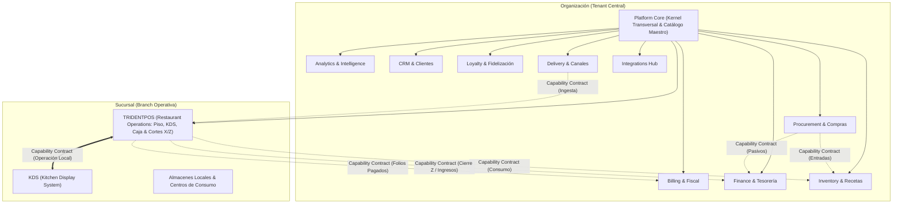
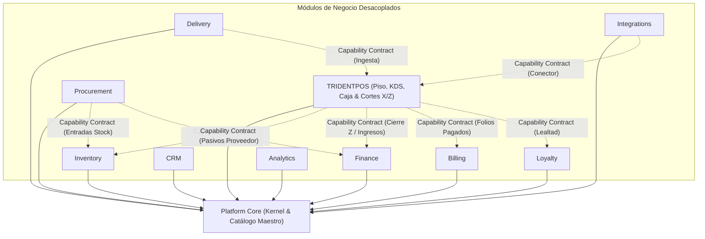

# FUNCTIONAL ARCHITECTURE — ERP RESTAURANTES

**Document ID:** `ARCH-FUNC-001`  
**Version:** `1.3 NORMALIZED / REMEDIATED`  
**Status:** `READY FOR INDEPENDENT REVIEW`  
**Date:** 2026-09-01  
**Baseline:** `EAAF v1.2.0 @ 7e036f43240b3dc28ccb996e350263598275b2cd`  
**Supersedes:** `FUNCTIONAL_ARCHITECTURE.md v1.2`  

**Rol:** `02_Functional / Business Architect`

---

## 1. Visión y Resumen del Sistema

**`ERP RESTAURANTES`** es una plataforma integral de gestión empresarial modular especializada en la industria gastronómica y de hospitalidad. El sistema está concebido para resolver de forma unificada tanto la alta velocidad de la operación de piso y cocina en tiempo real como la robustez analítica, administrativa, fiscal y de cadena de suministro requerida por grupos restauranteros, franquicias y cadenas multi-sucursal.

Dentro de este ecosistema, **`TRIDENTPOS`** se establece como la vertical especializada de **Restaurant Operations**, abarcando Punto de Venta (Comedor, Mostrador, Servicio a Domicilio), Comandero Móvil, Kitchen Display System (KDS) y la gestión integral de turnos, cobro y Cortes de Caja (X / Z).



---

## 2. Principio Rector: `MODULAR BY DESIGN — INTEGRATED BY CONTRACT`

El diseño funcional de `ERP RESTAURANTES` se rige por el desacoplamiento estricto de dominios de negocio. Cada módulo representa un **Bounded Context** que encapsula su lógica, invariantes y modelo de dominio, comunicándose con otros módulos exclusivamente mediante **Capability Contracts** (Comandos, Consultas y Eventos de Dominio).

### Topologías de Despliegue y Modos de Operación

1. **Modo Full-Suite (ERP Integral Gastronómico):**
   - Todos los 11 módulos operan de forma nativa dentro de la suite.
   - Los eventos de negocio fluyen automáticamente entre operaciones de piso, inventarios, compras, finanzas, facturación y lealtad según las capacidades habilitadas.
2. **Modo Standalone (Módulos Autónomos):**
   - Cada módulo opera de forma 100% independiente sobre las primitivas y el catálogo maestro de **Platform Core**.
   - *Ejemplo:* **TRIDENTPOS Standalone** opera ventas, comandero, KDS, cobro, arqueo de turnos y emisión de Cortes X y Z diarios de sucursal sin requerir el módulo Finance ni Inventory.
   - *Ejemplo:* **Inventory Standalone** gestiona almacenes, kárdex, recetas y costeo resolviendo productos directamente de Platform Core, con captura manual de consumos o integración externa sin requerir TRIDENTPOS.
3. **Modo Módulos Opcionales (Configuración Selectiva):**
   - Una sucursal u organización habilita únicamente los módulos pertinentes a su formato operativo (ej. POS + KDS + Inventario, prescindiendo de Delivery o Facturación Fiscal si no aplican a su modelo).
4. **Modo Integrado con ERP / POS Externo:**
   - **TRIDENTPOS → ERP Externo:** El POS opera en piso, ejecuta cobros y cortes, y emite eventos estandarizados de ventas, consumos e ingresos hacia sistemas corporativos como SAP, Oracle NetSuite, Odoo o Microsoft Dynamics.
   - **ERP RESTAURANTES ← POS Externo:** Los módulos de Inventory, Finance, Billing o Loyalty reciben transacciones de terminales POS de terceros a través de contratos funcionales expuestos por el Hub de Integraciones.

---

## 3. Descomposición en Bounded Contexts y Ownership

La arquitectura se divide en **11 Bounded Contexts**, con fronteras de dominio claramente delimitadas:

```mermaid
classDiagram
    class PlatformCore {
        +OrganizationContext
        +BranchContext
        +StationIdentity
        +UserIdentity
        +SecurityProfile
        +ModuleEntitlement
        +MasterProduct
        +ProductCategory
        +Menu
        +ModifierGroup
        +Modifier
        +BasePrice
        +BranchOverride
        +AuditLogEntry
    }
    class TRIDENTPOS {
        +Table
        +DiningArea
        +Account
        +Order
        +KdsStation
        +CashShift
        +CashMovement
        +AccountPayment
        +DailyXCut
        +DailyZCut
    }
    class Inventory {
        +Warehouse
        +ConsumptionCenter
        +Item
        +PreparedItem
        +Recipe
        +InventoryMovement
        +WasteRecord
    }
    class Procurement {
        +Supplier
        +RestockOrder
        +PurchaseOrder
        +GoodsReceipt
    }
    class Finance {
        +AccountsPayable
        +AccountsReceivable
        +OperatingExpense
        +ServerTipSettlement
        +AgentCommission
        +AccountingJournalEntry
    }
    class Billing {
        +TaxScheme
        +FiscalInvoice
        +DigitalStamp
        +InvoiceBatch
    }
    class CRM {
        +Customer
        +CustomerAddress
        +CorporateAccount
    }
    class Delivery {
        +DeliveryZone
        +DeliveryTariff
        +Driver
        +DispatchOrder
        +DriverSettlement
    }
    class Loyalty {
        +LoyaltyCard
        +PointsLedger
        +PrepaidWallet
        +Voucher
    }
    class Analytics {
        +PerformanceMetric
        +ConsolidatedSnapshot
        +AuditReport
    }
    class Integrations {
        +ExternalConnector
        +EntityMapping
        +ExternalPlatformOrderMapping
        +IntegrationAudit
    }
```



### Tabla de Bounded Contexts y Ownership

| # | Bounded Context | Responsabilidad Principal (Ownership) | Entidades Principales Agregadas | Dependencia Runtime |
|---|---|---|---|---|
| 1 | **Platform Core** | Tenant context, sucursales, estaciones, usuarios/RBAC/PIN, entitlements, auditoría y **Catálogo Maestro** (Productos, Categorías, Menús, Modificadores, Precios Base y Branch Overrides). | `Organization`, `Branch`, `StationIdentity`, `User`, `SecurityProfile`, `ModuleEntitlement`, `Producto`, `CategoriaProducto`, `Menu`, `GrupoModificador`, `Modificador`, `PrecioBase`, `BranchOverride`, `AuditLogEntry` | Ninguna (Kernel) |
| 2 | **TRIDENTPOS** | Operación de piso (mesas/áreas), comanda, monitor KDS en LAN, comandero móvil, **Caja completa P0 (Turnos, Cobro, Arqueo, Retiros/Depósitos/Salvaguardas, Cortes X y Z)**. | `AreaVenta`, `Mesa`, `Cuenta`, `OrdenProduccion`, `KdsStation`, `TurnoCaja`, `MovimientoEfectivo`, `PagoCuenta`, `CorteX`, `CorteZ` | Platform Core |
| 3 | **Inventory** | Multi-almacén, insumos, subrecetas elaboradas, recetas de productos, conversiones de rendimiento, mermas e inventario diferido. | `Almacen`, `Insumo`, `InsumoElaborado`, `Receta`, `MovimientoAlmacen`, `Merma` | Platform Core |
| 4 | **Procurement** | Sugerencias de reposición, órdenes de compra de un solo uso, recepción física y liquidación de compra. | `Proveedor`, `PedidoAbastecimiento`, `OrdenCompra`, `RecepcionCompra` | Platform Core |
| 5 | **Finance** | Cuentas por pagar (proveedores), cuentas por cobrar (crédito), gastos operativos, liquidación de propinas y pólizas contables (consumidor de Cortes Z). | `CuentaPorPagar`, `CuentaPorCobrar`, `GastoOperativo`, `LiquidacionPropina`, `ComisionAgente`, `PolizaContableInterfaz` | Platform Core |
| 6 | **Billing** | Esquemas de impuestos multi-nivel/cascada, timbrado fiscal (CFDI / Int.), facturación individual/lote/dividida. | `EsquemaImpuesto`, `FacturaFiscal`, `TimbreFiscal`, `LoteFacturas` | Platform Core |
| 7 | **CRM** | Directorio unificado de clientes, direcciones geolocalizadas, convenios y cuentas corporativas. | `Cliente`, `DireccionCliente`, `CuentaCorporativa` | Platform Core |
| 8 | **Delivery** | Control logístico de flota propia: zonas de cobertura, tarifas de envío, asignación de repartidores y liquidación de choferes. | `ZonaDelivery`, `TarifaDelivery`, `Repartidor`, `PedidoDelivery`, `LiquidacionChofer` | Platform Core |
| 9 | **Loyalty** | Programas de puntos, monedero electrónico recargable (RestCard), cortesías y cupones de descuento. | `TarjetaLealtad`, `Monedero`, `TransaccionPuntos`, `CuponDescuento` | Platform Core |
| 10 | **Analytics** | Reportes operacionales en tiempo real, tableros consolidados cross-branch y métricas de auditoría. | `SnapshotVentas`, `MetricaProduccionKDS`, `ReporteAuditoria` | Platform Core |
| 11 | **Integrations** | Conectores para plataformas externas (Uber Eats, Rappi, Didi, Deliverect), PAC fiscal, PMS hotelero y ERPs corporativos. | `ConectorExterno`, `CredencialConector`, `MapeoEntidades`, `BitacoraIntegracion` | Platform Core |

---

## 4. Platform Core Mínimo Compartido y Catálogo Maestro

El **Platform Core** provee el kernel compartido indispensable para cualquier despliegue y alberga el **gobierno del Catálogo Maestro** de la organización:

```text
Platform Core (Kernel Transversal & Gobierno de Catálogo)
  ├── 1. Tenant Context: Entidad Organization (identidad del grupo o tenant empresarial).
  ├── 2. Operating Unit Context: Entidad Branch (sucursal operativa con atributos regionales/horarios).
  ├── 3. Station & Device Identity: Registro e identidad de terminales físicas (POS, KDS, Comanderos, Kioskos).
  ├── 4. Identity & Access Management (IAM):
  │       ├── Usuarios administrativos con perfiles de seguridad (RBAC).
  │       └── Operadores de piso con autenticación rápida por PIN de 4 dígitos.
  ├── 5. Module Entitlements: Habilitación y licenciamiento de capacidades modulares por Organización/Branch.
  ├── 6. Master Product & Modifier Catalog (Catálogo Maestro Unificado):
  │       ├── Definición de Productos vendibles y comprables, Grupos/Categorías y Menús.
  │       ├── Grupos de Modificadores y Modificadores base.
  │       ├── Listas de Precios base a nivel Organización.
  │       └── Motor de Overrides por Sucursal (precios locales, disponibilidad/visibilidad y esquemas fiscales).
  ├── 7. Unified Audit Logging: Primitiva transversal para registro estructurado de eventos sensibles.
  └── 8. Functional Contract Abstraction: Definiciones formales de Comandos, Consultas y Eventos de Dominio.
```

> **Garantía de Autonomía:** Al residir el Catálogo Maestro en Platform Core, **Inventory puede operar Standalone** asociando recetas e insumos a productos sin depender de TRIDENTPOS, y **TRIDENTPOS puede operar Standalone** vendiendo productos y modificadores sin requerir Inventory.

---

## 5. Grafo de Dependencias Inter-Módulo

Bajo el principio de modularidad estricta, **ningún módulo de negocio posee dependencia runtime obligatoria de otro módulo de negocio**. Todos los módulos se acoplan únicamente a las primitivas y catálogo de **Platform Core**:



### Matriz de Aislamiento e Integración por Contrato

| Módulo de Negocio | Dependencia Runtime Obligatoria | Integración por Capability Contract (Interna o Externa) | Comportamiento si la Capability Opcional NO está presente |
|---|---|---|---|
| **TRIDENTPOS** | Platform Core | Inventory, Finance, Billing, Loyalty | **Opera de forma autónoma completa:** Mesas, comanda, KDS, cobro, turnos de caja y **generación de Cortes X y Z diarios**. Si Finance no está, almacena los cortes localmente; si Inventory no está, no descuenta stock; si Billing no está, opera con ticket interno. |
| **Inventory** | Platform Core | TRIDENTPOS, Procurement, ERP Externo | **Opera de forma autónoma:** Resuelve productos desde Platform Core, gestiona bodegas, centros de consumo, kárdex, recetas y costeo. Recibe consumos de TRIDENTPOS, de un POS externo o mediante capturas manuales de salidas. |
| **Procurement** | Platform Core | Inventory, Finance, ERP Externo | Gestiona proveedores y órdenes de compra. Si Inventory está presente, afecta stock; si no, emite órdenes de compra para consumo de un sistema externo. |
| **Finance** | Platform Core | TRIDENTPOS, Procurement, ERP Externo | **Suscriptor financiero:** Administra gastos, CxP y CxC. Consume los eventos `CorteZGenerado` y `TurnoCajaCerrado` de TRIDENTPOS para conciliar ingresos y emitir pólizas contables. Si TRIDENTPOS no está, opera con asientos directos. |
| **Billing** | Platform Core | TRIDENTPOS, ERP Externo | Emite comprobantes fiscales a partir de folios pagados de TRIDENTPOS interno o transacciones inyectadas por sistemas externos. |
| **Delivery** | Platform Core | TRIDENTPOS, Integrations | Gestiona flotas y rutas de reparto. Si TRIDENTPOS está presente, inyecta pedidos a mostrador; alternativamente puede operar como despachador logístico independiente. |
| **Loyalty** | Platform Core | TRIDENTPOS, CRM | Administra monederos y puntos. Si TRIDENTPOS está disponible, redime en caja; de lo contrario opera vía portal web o terminal de lealtad. |
| **Analytics** | Platform Core | Cualquier módulo activo | Consolida indicadores y reportes exclusivamente a partir de los módulos que se encuentren habilitados en la sucursal. |
| **Integrations** | Platform Core | Módulos destino según adaptador | Canaliza eventos y comandos hacia/desde sistemas externos sin acoplar la lógica central de los módulos. |

---

## 6. Capability Contracts entre Módulos

Los contratos funcionales definen los puntos de integración e intercambio de datos entre Bounded Contexts. Las capacidades receptoras pueden ser provistas por un módulo interno de la suite o por un sistema externo conectado mediante adaptadores.

### 6.1 Contrato TRIDENTPOS ↔ KDS (Restaurant Operations)
- **Alcance:** Coordinación de producción en cocina.
- **Comandos Funcionales:**
  - `EnviarComandaACocina(cuentaId, mesaId, items[], modificadores[], comentarios, urgencia)`
  - `IniciarPreparacionOrden(ordenProduccionId, kdsEstacionId)`
  - `ConfirmarOrdenSurtida(ordenProduccionId, kdsEstacionId, tiempoPreparacionMinutos)`
- **Consultas Funcionales:**
  - `ConsultarOrdenesActivas(kdsEstacionId)`
  - `RecuperarOrdenRecall(ordenProduccionId, ventanaMaxMinutos = 120)`
- **Eventos de Dominio Emitidos:**
  - `ComandaEnviadaACocina`
  - `OrdenProduccionIniciadaEnKDS`
  - `OrdenProduccionConfirmadaEnKDS` *(Hito operacional formal de confirmación de producción)*

---

### 6.2 Contrato TRIDENTPOS ↔ Inventory (Consumo de Insumos)
- **Evento Disparador:** `OrdenProduccionConfirmadaEnKDS`.
- **Parámetros del Contrato Funcional:**
  - `organizacionId`, `sucursalId`, `centroConsumoId`, `ordenId`, `fechaHora`
  - `items[]`: `{ productoId, cantidad, selectedModifiers[] }`
- **Comportamiento Condicionado a Disponibilidad de Capability:**
  - *Si Inventory está habilitado (interno):* Procesa la descarga de insumos en el Centro de Consumo correspondiente a la receta del producto y emite `InventarioDescontadoPorReceta`.
  - *Si Inventory es externo:* El evento es canalizado por el Hub de Integraciones hacia el ERP corporativo (ej. SAP, Odoo).
  - *Si Inventory no está habilitado:* El evento no genera impacto en almacén y la operación de venta continúa sin bloqueos.
- **Consultas Funcionales:**
  - `ConsultarDisponibilidadStock(sucursalId, productos[])` → Retorna existencias y estado de inventario pendiente.
- > **Nota sobre Cuestión Abierta #10 (OPEN #10):** El contrato transporta la lista de `selectedModifiers[]`. La fórmula y reglas de consolidación de insumos para modificadores en recetas compuestas (aditiva, sustractiva o excluyente) permanece **`OPEN / PENDIENTE DE DEFINICIÓN`** por parte del Product Owner.

---

### 6.3 Contrato TRIDENTPOS ↔ Finance / Billing (Liquidación, Caja y Fiscal)
- **Ownership de Caja:** TRIDENTPOS genera internamente los turnos de caja, el arqueo a ciegas, el cobro de cuentas, el registro de retiros/depósitos/salvaguardas, el **Corte X (parcial)** y el **Corte Z (cierre diario consolidado de sucursal)**.
- **Eventos de Dominio Emitidos por TRIDENTPOS:**
  - `CuentaPagada(organizacionId, sucursalId, estacionId, cuentaId, folioVenta, montos, impuestos[], propina, formasPago[], meseroId, clienteId)`
  - `TurnoCajaCerrado(organizacionId, sucursalId, estacionId, turnoId, cajeroId, fondoInicial, totalCobrado, arqueoFisico, diferencia)`
  - `CorteZGenerado(organizacionId, sucursalId, fechaOperativa, resumenFolios, totalVentasBrutas, totalVentasNetas, totalImpuestos[], totalPropinas, totalDescuentos, totalCancelaciones, desgloseFormasPago[], desgloseDelivery[])`
- **Comportamiento Condicionado en Módulos Suscriptores:**
  - *En Finance (si está presente):* Consume `CorteZGenerado` y `TurnoCajaCerrado` para conciliación de cuentas bancarias, control de gastos, cálculo de liquidación de propinas a meseros y generación automática de la **Póliza Contable de Ingresos**.
  - *En Billing (si está presente):* Consume `CuentaPagada` para habilitar el folio para emisión de comprobante fiscal electrónico (individual, lote o portal).
  - *En Loyalty (si está presente):* Consume `CuentaPagada` para acumular puntos o procesar redención de saldo pre-pago.
  - *Si son provistos por sistemas externos:* Los eventos alimentan la contabilidad o el ERP de terceros vía Integrations Hub.

---

### 6.4 Contrato Procurement ↔ Inventory & Finance (Abastecimiento)
- **Evento Disparador:** `RecepcionCompraRegistrada` (Canonical Name / REM-11).
- **Parámetros del Contrato Funcional:**
  - `proveedorId`, `sucursalId`, `almacenDestinoId`, `ordenCompraId`, `itemsRecibidos[]`, `costosUnitarios[]`, `condicionesPago`
- **Comportamiento Condicionado:**
  - *En Inventory:* Ingresa existencias físicas a la bodega y actualiza costo promedio según método configurado.
  - *En Finance:* Registra la obligación de pago en Cuentas por Pagar (CxP).

---

### 6.5 Contrato Integrations & Delivery ↔ TRIDENTPOS (Ingesta y Despacho)
- **Ingesta de Plataformas Externas (Integrations Hub → TRIDENTPOS):**
  - Comando: `IngestarPedidoExterno(canalOrigen, pedidoExternoId, cliente, items[], total, formaPago)`
- **Gestión de Flota Propia (Delivery → TRIDENTPOS):**
  - `AsignarRepartidorPedido(pedidoDeliveryId, repartidorId)`
  - `ConfirmarEntregaPedido(pedidoDeliveryId, horaEntrega)`
  - `LiquidarEfectivoRepartidor(repartidorId, turnoCajaId, montoEfectivo)`
- **Eventos de Dominio Emitidos:**
  - `PedidoDeliveryCreado`, `PedidoDeliveryDespachado`, `PedidoDeliveryEntregado`.

---

## 7. Resiliencia Operativa y Autonomía Local

Para garantizar que un restaurante de alto volumen mantenga su ritmo de servicio en piso y cocina aun ante interrupciones de conectividad a internet:

```text
[ Ámbito Local de la Sucursal ]
   ├── TRIDENTPOS (Terminales de Salón / Mostrador / Caja)
   ├── Comanderos Móviles (Captura en Mesa)
   └── KDS Displays (Monitores de Producción en Cocina)
```

1. **Autonomía Operativa de Piso, Cocina y Caja:**
   - La toma de comandas, el enrutamiento a cocina, la visualización y confirmación en KDS, la impresión de precuentas, el cobro en efectivo y la emisión de **Cortes X y Cortes Z** operan íntegramente sobre la infraestructura local de la sucursal.
2. **Servicios Dependientes de Conectividad Externa:**
   - La emisión y timbrado de facturas fiscales electrónicas, las transacciones con pasarelas de pago bancarias (PinPADs en línea), la sincronización con agregadores de delivery en la nube y la consulta centralizada de lealtad dependen de la conectividad y de las capacidades propias de cada proveedor externo.
3. **Consistencia Funcional Eventual:**
   - Los eventos de negocio generados localmente durante contingencias de red (ventas, consumos, Cortes Z) se conservan localmente para su conciliación con los módulos administrativos y analíticos una vez restablecida la comunicación.

---

## 8. Trazabilidad con la Especificación SSOT

| Requerimiento SSOT (v1.1) | Componente Arquitectónico | Bounded Context | Mecanismo de Integración |
|---|---|---|---|
| Modularidad por Diseño (Sec. 2, 5) | Modular Architecture | 11 Bounded Contexts | Capability Contracts |
| TRIDENTPOS como Vertical (Sec. 1, 4) | Restaurant Operations | TRIDENTPOS (POS, KDS, Comandero, Caja) | Operación de Piso y Caja |
| Catálogo Maestro Central con Overrides (Sec. 3, 12, 33) | Master Catalog | Platform Core | Shared Catalog Governance |
| Ownership de Caja y Cortes X/Z (Sec. 23, 24, 51) | Cash & Shifts P0 | TRIDENTPOS | Turnos, Cobro, Cortes X y Z |
| Disparador KDS de Inventario (Sec. 14, 18, 41) | Inventory Trigger | TRIDENTPOS ↔ Inventory | Evento `OrdenProduccionConfirmadaEnKDS` |
| Resiliencia Operativa Local (Sec. 18, 48) | Resilience Pattern | TRIDENTPOS / KDS | Autonomía de Red Local |
| Venta sin existencias diferida (Sec. 15, 41) | Inventory Model | Inventory | Saldo pendiente por descargar |
| Folio en precuenta (Sec. 11, 41) | Account Lifecycle | TRIDENTPOS | Evento `PrecuentaImpresaConFolio` |
| Facturación Lote / Dividida (Sec. 28) | Fiscal Engine | Billing | Contrato de Facturación |
| Cuestión Abierta Recetas Modificadores (Sec. 49) | Open Question #10 | Inventory | Declarado `OPEN` en Contrato 6.2 |

---

DOCUMENT STATUS: READY FOR INDEPENDENT REVIEW
