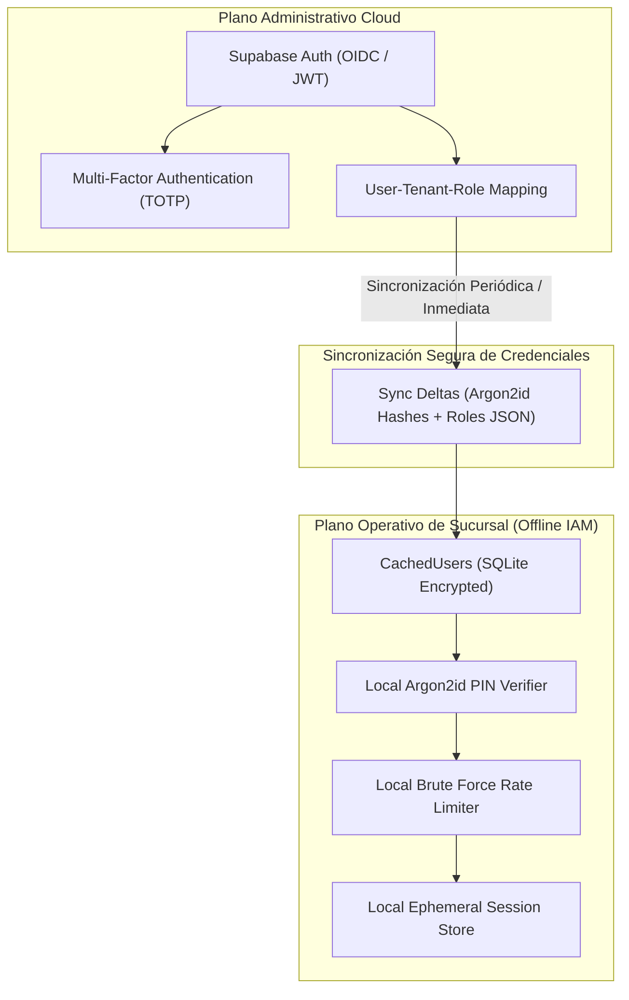

# IAM SECURITY MODEL SPECIFICATION — ERP RESTAURANTES

> [!WARNING]
> **ACR-2026-011 PROPOSED OVERLAY — NOT CANONICAL UNTIL PRODUCT OWNER APPROVAL AND MERGE TO MAIN**
> 
> The additions and specifications in this document relating to WP-009 (`EdgeSecureStore`, exact 32-byte HMAC key lifecycle, trustedEffectiveTime, atomic enrollment audit) represent proposed governance overlays under review via ACR-2026-011. The underlying baseline remains `APPROVED / FROZEN — 2026-09-03`.

**Document ID:** `ARCH-IAM-001`  
**Version:** `1.2 REMEDIATED DRAFT (R2.1)` (with ACR-2026-011 Proposed Overlay)  
**Status:** `APPROVED / FROZEN — 2026-09-03` (`ACR-2026-011 PROPOSAL PENDING PO APPROVAL`)  
**Date:** 2026-09-02  
**Framework:** `EAAF v1.2.0 @ 7e036f43240b3dc28ccb996e350263598275b2cd`  
**Author Agent:** `08_Security_Architect — Remediation Author` (Overlay Synthesis: `01_Solution_Architect`)  
**Approved Baseline Commit:** `9d076c1a8f674b2411991b20fa4faa83b85f708a` (Tag `data-architecture-v1.0-approved`)  

---

## 1. Arquitectura de Identidad Híbrida (Cloud & Offline Edge)

---

## 2. Parámetros Criptográficos para Hashes de PIN (Argon2id)

- **Algoritmo:** Argon2id (RFC 9106).
- **Parámetros de Baseline:**
  - Memoria ($m$): $64\text{ MB}$ ($65,536\text{ KiB}$).
  - Iteraciones / Tiempo ($t$): $3$ pasadas.
  - Paralelismo ($p$): $4$ hilos.
  - Longitud de Sal: $16\text{ bytes}$ generados con CSPRNG.
  - Longitud de Hash: $32\text{ bytes}$.
- **Clasificación:** `SECURITY BASELINE — REQUIRES TARGET HARDWARE BENCHMARK` (Para terminales POS de gama baja con $\le 2\text{ GB}$ de RAM, se permitirá evaluar $m=32\text{ MB}, t=2$ bajo prueba de carga específica para prevenir DoS local).

---

## 3. Mitigación de Fuerza Bruta y Bloqueo de Estaciones

- **Demora Progresiva:**
  - Intentos 1 y 2: Validación inmediata.
  - Intento 3: Demora artificial de $2\text{ segundos}$ (`SECURITY POLICY DEFAULT`).
  - Intento 4: Demora artificial de $5\text{ segundos}$ (`SECURITY POLICY DEFAULT`).
- **Bloqueo Temporal de Estación:**
  - Al 5to intento fallido consecutivo: La terminal entra en estado `STATION_LOCKED` durante $5\text{ minutos}$ (`SECURITY POLICY DEFAULT`).
  - Se genera de inmediato un evento de auditoría de severidad alta (`PinBruteForceAttemptDetected`).
  - El desbloqueo anticipado requiere la autorización de un usuario con privilegios de supervisión local.

---

## 4. Ciclo de Vida de Sesiones y Tokens

| Tipo de Token | Emisor | Vigencia | Algoritmo | Clasificación | Mecanismo de Revocación |
|---|---|---|---|---|---|
| **Cloud Access JWT** | Cloud Auth Service | 15 minutos | RS256 / EdDSA | `SECURITY POLICY DEFAULT` | Expiración natural / Lista de revocación por `token_version`. |
| **Cloud Refresh Token**| Cloud Auth Service | 7 días | Criptográfico Opaco (256-bit) | `SECURITY POLICY DEFAULT` | Revocación inmediata en base de datos al rotar o cerrar sesión. |
| **Local Station Token** | Edge Host | 12 horas (43200s) | HMAC-SHA256 (Llave Local) | `SECURITY POLICY DEFAULT` | Revocación en memoria al cerrar turno de caja o des-enrolar terminal.|
| **One-Time Override Token**| Edge Host | 60 segundos | HMAC-SHA256 (Llave Local) | `SECURITY POLICY DEFAULT` | Consumo único (One-Time Use) al autorizar operación sensible. |
| **Pairing Secret Payload** | Edge Host | 10 minutos (600s) | JSON Criptográfico con Fingerprint| `SECURITY POLICY DEFAULT` | Consumo atómico único tras verificación de fingerprint TLS y persistencia en StationPinStore. |

### Especificaciones de Llave y Sesión Local (ACR-2026-011):
- **Llave de Firma de Station Token:** La llave de producción es de **exactamente 32 bytes (256 bits)** de entropía generada mediante CSPRNG (HS256), criptográficamente independiente de la llave TLS, y persistida obligatoriamente en `EdgeSecureStore` (respaldado por el OS Keyring / `electron.safeStorage` seguro; fail-closed ante ausencia de cifrado). Se valida estrictamente que la llave posea exactamente 32 bytes. Queda prohibida la inyección arbitraria de strings en producción (inyección reservada para boundaries de prueba internos explícitos).
- **Semántica de Rotación de Llave HMAC:** No se impone rotación diaria automática en WP-009 ni periodos genéricos de gracia de 15 minutos. Para rotaciones no disruptivas, la llave de verificación previa debe permanecer disponible hasta la expiración máxima de los tokens emitidos con dicha llave (acotada por la vida útil congelada de 12 horas). Alternativamente, una rotación supervisada de emergencia o de fin de turno puede invalidar deliberadamente los tokens previos y exigir re-autenticación.
- **Separación de Identidad y Sesión:** La tabla durable `station_credentials` almacena exclusivamente la identidad autorizada del dispositivo de piso. No almacena `station_token_hash`. El ciclo de vida de sesiones y turnos activos se administra de forma efímera en `WP-010` (`StationSessions`).

---

## 5. Protocolo Criptográfico de Enrolamiento y Resiliencia Temporal (R2F-01, SR-12)

1. **Protocolo Criptográfico de Enrolamiento y Orden Estricto (ACR-2026-011):**
   - El Edge Server genera en su pantalla física el payload QR conteniendo: `branchId`, `edgeId`, `edgePublicKeyFingerprint`, `pairingId`, `expiresAt` (en `UNIX EPOCH SECONDS`) y `pairingSecret`.
   - La terminal descubre candidatos LAN vía mDNS.
   - **Sonda TLS Zero-Data:** La terminal abre una conexión TLS inicial con cero datos de aplicación transmitidos, extrae el certificado DER del candidato y calcula su huella digital SHA-256.
   - **Coincidencia de Fingerprint:** Si el fingerprint no coincide con el del QR físico, la conexión se destruye de inmediato sin revelar secretos.
   - **Persistencia Previa del Pin (`SEC-INV-WP009-02`):** La terminal debe persistir el fingerprint verificado en `StationPinStore` de almacenamiento seguro de plataforma **ANTES** de abrir la segunda conexión TLS y antes de enviar el secreto. Invariante: `PIN STORE FAILURE => ZERO SECRET DISCLOSURE + ZERO SERVER MUTATION`.
   - **Segunda Conexión Pinned y Transmisión:** Solo tras la persistencia exitosa del pin, la terminal abre la segunda conexión TLS anclada al certificado (`ca: [provenCertDer]`) y transmite `pairingId`, `pairingSecret` y su llave pública de estación.
   - **Preparación y Firma Pre-Transacción:** El Edge valida contexto (tenant/branch/edge), vigencia temporal y secreto; genera y firma el Station Token (HS256, 12h) en memoria. Si la firma falla, ocurre **cero mutación en base de datos**.
   - **Transacción Atómica y Auditoría Local (`DATA-INV-WP009-01`):** En una sola transacción SQLite WAL (`BEGIN IMMEDIATE`), el Edge valida el token, ejecuta el CAS (`consumed_at = now`), inserta `station_credentials`, vincula `pairing_id -> station_id`, e inserta el rastro forense en `edge_security_audit` (`TerminalEnrolada / SUCCESS`). Invariante: `ALL COMMIT OR NONE COMMIT`. Si la inserción de credenciales o de auditoría falla: `ROLLBACK`, `consumed_at` permanece `NULL`, no se crean credenciales ni auditoría de éxito, y no se retorna token.
   - **Entrega de Respuesta:** Tras el commit atómico exitoso, se retorna HTTP 200 con el Station Token. Si la entrega HTTP falla post-commit, el enrolamiento y la auditoría permanecen firmes; el cliente recurre al protocolo gobernado de re-enrolamiento.

2. **Resiliencia Temporal y Protección contra Manipulación de Reloj (Trusted Time & Clock Rollback) (ACR-2026-011):**
   - **Tiempo Efectivo Confiable durante la Vida del Proceso:** Las decisiones de expiración de pairing y tokens utilizan tiempo monotónico del proceso (`process.hrtime.bigint()`). Al recibir tiempo Cloud autenticado $T_{cloud}$ en el instante monotónico $M_0$:
     $$\text{trustedEffectiveTime} = T_{cloud} + \text{monotonicElapsedSince}(M_0)$$
   - **Anclas Persistidas de Integridad:** Se persisten en almacenamiento local protegido los metadatos de anclaje: `lastKnownCloudTime`, `localWallTimeAtLastCloudSync`, `anchorVersion` y metadatos de integridad en `UNIX EPOCH SECONDS`.
   - **Reinicio de Proceso / Sistema Operativo:** No se asume continuidad del contador monotónico tras reinicio. El ancla persistida actúa como cota inferior inviolable. Si el reloj de pared retrocede más de 5 minutos (300 segundos en Unix epoch: `Date.now() / 1000 < lastKnownCloudTime - 300`), el Edge entra en estado `CLOCK_ROLLBACK_LOCKED`, **bloquea inmediatamente la generación de secretos de pairing y la emisión de tokens**, y genera una alerta de auditoría crítica en `edge_security_audit` (`ClockRollbackDetected`).
   - **Primer Arranque Seguro (Bootstrap):** Si no existe ancla previa, se requiere sincronización autenticada de tiempo Cloud; queda estrictamente prohibido derivar tiempo confiable de relojes de pared locales no validados o inventar manifiestos de aprovisionamiento no canónicos.
   - **Normalización de Unidades:** Todos los registros de seguridad gobernados en WP-009 usan de manera uniforme `UNIX EPOCH SECONDS`.

---

DOCUMENT STATUS: APPROVED / FROZEN — 2026-09-03 (ACR-2026-011 PROPOSED ADDITIONS PENDING PRODUCT OWNER APPROVAL)
