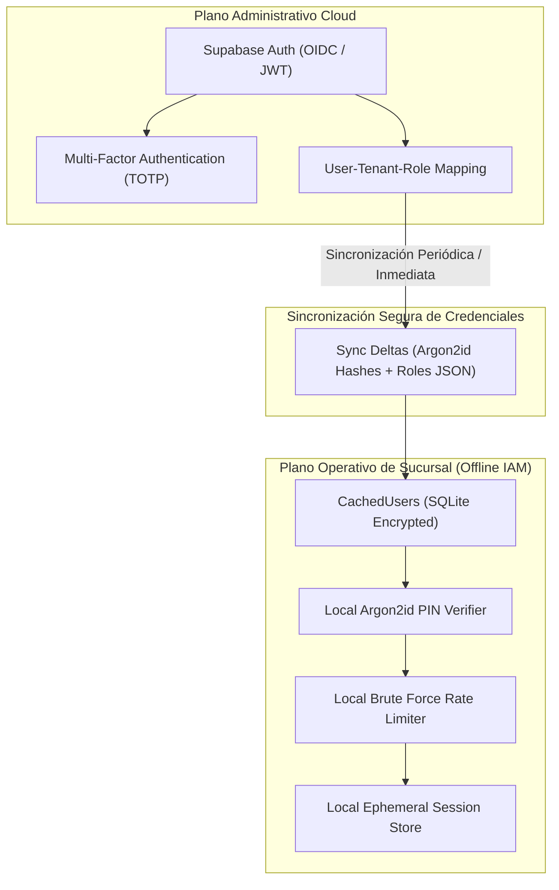

# IAM SECURITY MODEL SPECIFICATION — ERP RESTAURANTES

**Document ID:** `ARCH-IAM-001`  
**Version:** `1.0 DRAFT`  
**Status:** `READY FOR INDEPENDENT REVIEW`  
**Date:** 2026-09-01  
**Framework:** `EAAF v1.2.0 @ 7e036f43240b3dc28ccb996e350263598275b2cd`  
**Author Agent:** `08_Security_Architect`  
**Approved Baseline Commit:** `9d076c1a8f674b2411991b20fa4faa83b85f708a` (Tag `data-architecture-v1.0-approved`)  

---

## 1. Arquitectura de Identidad Híbrida (Cloud & Offline Edge)

El modelo de identidad distingue claramente dos planos de autenticación:

---

## 2. Parámetros Criptográficos para Hashes de PIN (Argon2id)

Para garantizar resistencia ante ataques de fuerza bruta local en caso de exfiltración de la base de datos SQLite:
- **Algoritmo:** Argon2id (RFC 9106).
- **Parámetros de Baseline:**
  - Memoria ($m$): $64\text{ MB}$ ($65,536\text{ KiB}$).
  - Iteraciones / Tiempo ($t$): $3$ pasadas.
  - Paralelismo ($p$): $4$ hilos.
  - Longitud de Sal: $16\text{ bytes}$ generados con CSPRNG.
  - Longitud de Hash: $32\text{ bytes}$.
- **Calificación:** `SECURITY BASELINE — REQUIRES TARGET HARDWARE BENCHMARK` (Para terminales POS con $\le 2\text{ GB}$ de RAM, se permitirá ajustar a $m=32\text{ MB}, t=2$ bajo prueba de carga).

---

## 3. Política de Mitigación de Fuerza Bruta y Bloqueo de PIN

Para prevenir ataques de adivinación de PIN en terminales desatendidas:
1. **Demora Progresiva:**
   - Intentos 1 a 2: Validación inmediata.
   - Intento 3: Demora artificial obligatoria de $2\text{ segundos}$.
   - Intento 4: Demora artificial obligatoria de $5\text{ segundos}$.
2. **Bloqueo Temporal de Estación:**
   - Al 5to intento fallido consecutivo: La terminal entra en estado `STATION_LOCKED` durante $5\text{ minutos}$.
   - Se genera de inmediato un evento de auditoría de severidad alta (`PinBruteForceAttemptDetected`).
   - El desbloqueo inmediato sólo puede ser efectuado mediante la credencial del Gerente de Sucursal.

---

## 4. Ciclo de Vida de Sesiones y Tokens

| Tipo de Token | Emisor | Vigencia | Algoritmo | Mecanismo de Revocación |
|---|---|---|---|---|
| **Cloud Access JWT** | Cloud Auth Service | 15 minutos | RS256 / EdDSA | Expiración natural / Lista de revocación por `token_version`. |
| **Cloud Refresh Token**| Cloud Auth Service | 7 días | Criptográfico Opaco (256-bit) | Revocación inmediata en base de datos al rotar o cerrar sesión. |
| **Local Station Token** | Edge Host | 12 horas (Turno) | HMAC-SHA256 (Llave Local) | Revocación en memoria al cerrar turno de caja o des-enrolar terminal.|
| **Manager Override Token**| Edge Host | 60 segundos | HMAC-SHA256 (Llave Local) | Consumo único (One-Time Use) al autorizar cancelación o descuento. |

---

DOCUMENT STATUS: READY FOR INDEPENDENT REVIEW
