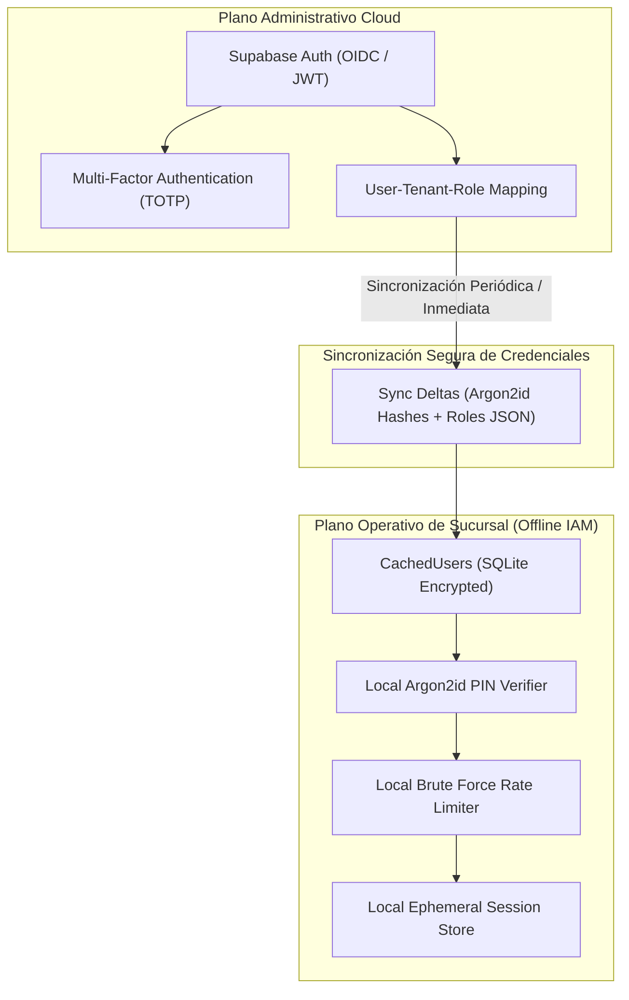

# IAM SECURITY MODEL SPECIFICATION — ERP RESTAURANTES

**Document ID:** `ARCH-IAM-001`  
**Version:** `1.2 REMEDIATED DRAFT (R2.1)`  
**Status:** `APPROVED / FROZEN — 2026-09-03`  
**Date:** 2026-09-02  
**Framework:** `EAAF v1.2.0 @ 7e036f43240b3dc28ccb996e350263598275b2cd`  
**Author Agent:** `08_Security_Architect — Remediation Author`  
**Approved Baseline Commit:** `9d076c1a8f674b2411991b20fa4faa83b85f708a` (Tag `data-architecture-v1.0-approved`)  

---

## 1. Arquitectura de Identidad Híbrida (Cloud & Offline Edge)

---

## 2. Parámetros Criptográficos para Hashes de PIN (Argon2id)

- **Algoritmo:** Argon2id (RFC 9106).
- **Parámetros de Baseline:**
  - Memoria ($m$): $64\text{ MB}$ ($65,536\text{ KiB}$).
  - Iteraciones / Tiempo ($t$): $3$ pasadas.
  - Paralelismo ($p$): $4$ hilos.
  - Longitud de Sal: $16\text{ bytes}$ generados con CSPRNG.
  - Longitud de Hash: $32\text{ bytes}$.
- **Clasificación:** `SECURITY BASELINE — REQUIRES TARGET HARDWARE BENCHMARK` (Para terminales POS de gama baja con $\le 2\text{ GB}$ de RAM, se permitirá evaluar $m=32\text{ MB}, t=2$ bajo prueba de carga específica para prevenir DoS local).

---

## 3. Mitigación de Fuerza Bruta y Bloqueo de Estaciones

- **Demora Progresiva:**
  - Intentos 1 y 2: Validación inmediata.
  - Intento 3: Demora artificial de $2\text{ segundos}$ (`SECURITY POLICY DEFAULT`).
  - Intento 4: Demora artificial de $5\text{ segundos}$ (`SECURITY POLICY DEFAULT`).
- **Bloqueo Temporal de Estación:**
  - Al 5to intento fallido consecutivo: La terminal entra en estado `STATION_LOCKED` durante $5\text{ minutos}$ (`SECURITY POLICY DEFAULT`).
  - Se genera de inmediato un evento de auditoría de severidad alta (`PinBruteForceAttemptDetected`).
  - El desbloqueo anticipado requiere la autorización de un usuario con privilegios de supervisión local.

---

## 4. Ciclo de Vida de Sesiones y Tokens

| Tipo de Token | Emisor | Vigencia | Algoritmo | Clasificación | Mecanismo de Revocación |
|---|---|---|---|---|---|
| **Cloud Access JWT** | Cloud Auth Service | 15 minutos | RS256 / EdDSA | `SECURITY POLICY DEFAULT` | Expiración natural / Lista de revocación por `token_version`. |
| **Cloud Refresh Token**| Cloud Auth Service | 7 días | Criptográfico Opaco (256-bit) | `SECURITY POLICY DEFAULT` | Revocación inmediata en base de datos al rotar o cerrar sesión. |
| **Local Station Token** | Edge Host | 12 horas (Turno) | HMAC-SHA256 (Llave Local) | `SECURITY POLICY DEFAULT` | Revocación en memoria al cerrar turno de caja o des-enrolar terminal.|
| **One-Time Override Token**| Edge Host | 60 segundos | HMAC-SHA256 (Llave Local) | `SECURITY POLICY DEFAULT` | Consumo único (One-Time Use) al autorizar operación sensible. |
| **Pairing Secret Payload** | Edge Host | 10 minutos | JSON Criptográfico con Fingerprint| `SECURITY POLICY DEFAULT` | Consumo atómico único tras verificación de fingerprint TLS. |

---

## 5. Protocolo Criptográfico de Enrolamiento y Resiliencia Temporal (R2F-01, SR-12)

1. **Bootstrap Criptográfico con Vinculación de Identidad (R2F-01):**
   - El Edge Server genera un payload estructurado que contiene: `branchId`, `edgeId`, `edgePublicKeyFingerprint`, `pairingId`, `expiresAt` y `pairingSecret`.
   - La terminal obtiene este payload físicamente (escaneo QR en la pantalla del Edge) y descubre los candidatos en LAN vía mDNS.
   - Antes de enviar el `pairingSecret`, la terminal establece una conexión TLS y exige el certificado del servidor candidato, comprobando que su huella digital coincida exactamente con `edgePublicKeyFingerprint`.
   - Si no coincide, la conexión es abortada sin transmitir el secreto, neutralizando cualquier intento de relay o proxy malicioso por un Rogue Edge en la LAN.
   - Tras la validación del fingerprint, el `pairingSecret` se envía cifrado bajo la sesión TLS verificada, el Edge lo valida y consume atómicamente, y emite el `Station Token`.

2. **Protección contra Manipulación de Reloj (Clock Rollback):**
   - Los temporizadores de expiración de sesiones efímeras se calculan utilizando contadores monotónicos del proceso (`process.hrtime.bigint()`).
   - El Edge Server compara periódicamente el reloj local contra la última marca de tiempo recibida de Cloud (`lastKnownCloudTime`). Retrocesos de reloj mayores a 5 minutos bloquean la emisión de nuevos tokens y generan una alerta de auditoría (`ClockRollbackDetected`).

---

DOCUMENT STATUS: APPROVED / FROZEN — 2026-09-03
