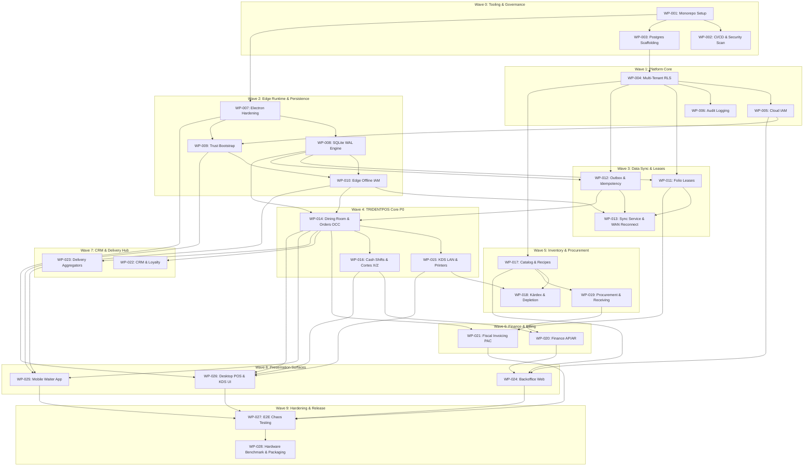

# IMPLEMENTATION PLAN — ERP RESTAURANTES / TRIDENTPOS

**Document ID:** `PLAN-IMP-001`  
**Version:** `1.0 DRAFT`  
**Status:** `READY FOR INDEPENDENT IMPLEMENTATION READINESS REVIEW`  
**Date:** `2026-09-03`  
**Author Agent:** `01_Solution_Architect — IMPLEMENTATION READINESS AUTHOR`  
**Target Gate:** `gates/IMPLEMENTATION_READINESS_GATE.md`  
**Governing Framework:** `EAAF v1.2.0 @ 7e036f43240b3dc28ccb996e350263598275b2cd`  
**Immutable Architecture Baseline Commit:** `6c31b64c435d50177e192fc6c5b7e83e18ffd87f`  

---

## 1. Executive Summary & Architectural Grounding

This Implementation Plan establishes the authoritative, atomic, and governed engineering execution framework for **ERP RESTAURANTES / TRIDENTPOS**.

Every implementation activity is decomposed into discrete, immutable **Work Packages (WPs)** that:
1. Map strictly to approved and frozen architectural baselines.
2. Separate implementation responsibilities (**Builder Agent**) from verification responsibilities (**Independent Reviewer**).
3. Explicitly document inputs, outputs, data objects, API contracts, objective acceptance criteria, automated test suites, rollback mechanisms, and required verification evidence.
4. Directly incorporate all 11 cataloged Security Validation Debts (`SEC-VAL-01`..`11`), Data Validation Debts (`DAT-04`, `DAT-08`), and Solution Residual Risks (`RSK-08`, `RSK-11`, `RSK-15`).
5. Strictly isolate and parameterize the 9 Protected Product Owner Decisions (`OQ-SSOT-01`..`07`, `OQ-ARCH-01`..`02`), ensuring zero implementation blocking while preventing unauthorized assumption of business rules.

---

## 2. Frozen Architectural Baselines Reference

All work packages in this plan derive authority from the following frozen baselines:
* **Functional Architecture / SSOT:** `FUNCTIONAL_ARCHITECTURE.md` (v1.2 APPROVED)
* **Solution Architecture:** Tag `solution-architecture-v1.3-approved` (`e35205906055a8425ab875d05789652b3c3497b7`)
* **Data Architecture:** Tag `data-architecture-v1.0-approved` (`9d076c1a8f674b2411991b20fa4faa83b85f708a`)
* **Security Architecture:** Tag `security-architecture-v1.0-approved` (`6c31b64c435d50177e192fc6c5b7e83e18ffd87f`)
* **Architectural Decision Records:** `ADR-001` through `ADR-008`

*Rule of Immutability:* No builder agent may modify, re-interpret, or bypass any frozen architecture specification. Any required architectural change must invoke the formal EAAF `ARCHITECTURE_CHANGE` workflow.

---

## 3. Implementation Governance, Roles & Repository Controls

### 3.1 Authorized Builder & Reviewer Roles
Under EAAF v1.2.0, architecture agents design and plan; implementation agents code; separate reviewer agents verify.
* **Builder Agents (Implementation Layer):**
  - `13_Backend_Developer`: Cloud microservices/modular monolith, REST/tRPC APIs, event bus, sync gateway.
  - `14_Mobile_Developer`: React Native mobile waiter handheld terminal (Comandero Móvil).
  - `15_Web_Frontend_Developer`: Next.js corporate backoffice web portal, KDS browser client.
  - `16_Native_Edge_Developer`: Electron desktop runtime, local Fastify daemon, WebSocket server, printer drivers.
  - `17_Database_Engineer`: PostgreSQL schemas, RLS policies, SQLite WAL configurations, migration scripts.
  - `18_DevOps_Engineer`: Monorepo tooling, CI/CD pipelines, container packaging, security scanning, secret management.
* **Independent Reviewer Roles (Verification Layer):**
  - `01_Solution_Architect`: Architecture alignment, context boundary checks, ADR conformance.
  - `03_Data_Architect`: Schema compliance, OCC invariants, data authority topology, migration safety.
  - `08_Security_Architect`: Cryptographic validation, RLS bypass reviews, auth bounds, secret handling.
  - `09_QA_Test_Architect`: Test pyramid compliance, chaos/failure-mode validation, E2E test integrity.
  - `10_DevOps_Platform_Architect`: Pipeline integrity, supply chain provenance, build determinism.
  - `11_Code_Reviewer`: Code quality, style, defensive programming, type safety, error boundaries.

### 3.2 Repository Governance & Branching Model
* **Current Repository Disposition (Main Branch Protection):**
  - *Observation:* GitHub reports `main` branch protection is currently disabled (HTTP 404).
  - *Disposition:* **BLOCKING ENTRY TO IMPLEMENTATION (PRE-IMPLEMENTATION GATE REQUIREMENT)**. Before Wave 0 execution begins, branch protection on `main` must be enabled by the repository administrator / DevOps Platform Architect, enforcing:
    1. Require a pull request before merging (minimum 1 approved review from designated reviewer).
    2. Require status checks to pass before merging (CI build, lint, typecheck, unit tests, secret scan).
    3. Require branches to be up to date before merging.
    4. Prohibit force pushes and direct commits to `main`.
* **Tag & Provenance Disposition:**
  - Architecture freeze tags (`security-architecture-v1.0-approved`) are git-annotated tags. Downstream software release artifacts (Wave 9) require cryptographic signing (Cosign / Sigstore / GPG), signed commits in CI, and SLSA Level 3 provenance generation.
* **Branch Strategy:**
  - `main`: Protected production-ready code. Contains only approved, gate-passed merges.
  - `feature/wp-XXX-<slug>`: Dedicated branch created for each Work Package, branched from current `main`.
  - PR Title: `feat(<context>): [WP-XXX] <title>`
  - PR Merge Rule: Squash-and-merge or rebase-and-merge as governed, retaining WP traceable commit messages. Builder $\ne$ Reviewer strictly enforced.

---

## 4. Definition of Done (DoD)

### 4.1 Work Package Level DoD
A Work Package is marked **DONE** only when all of the following verifiable conditions are met:
1. **Source Code:** Implementation satisfies 100% of the Acceptance Criteria with zero compiler or type errors (strict TypeScript / lint clean).
2. **Architecture Compliance:** Zero violation of frozen Bounded Context boundaries, Data Authority matrices, or Security controls.
3. **Automated Testing:** Unit test line coverage $\ge 85\%$ on business logic, plus 100% pass on required integration/contract tests.
4. **Security & Data Debt:** Explicit downstream test obligations assigned to the WP are implemented and pass.
5. **Rollback Verification:** Rollback mechanism (migration down-step, feature flag, or container revert) is documented and proven functional in testing.
6. **Evidence Generation:** Verification evidence artifact generated adhering to EAAF standard (Expected vs. Actual, execution logs, commit SHA, timestamp).
7. **Independent Review:** Formal review conducted and signed off by the assigned Independent Reviewer (Builder $\ne$ Reviewer).

### 4.2 Wave Level DoD
A Wave is marked **COMPLETED** only when:
1. All constituent Work Packages are verified DONE with signed evidence.
2. Cross-package integration tests pass without regression.
3. Wave exit criteria verified by `01_Solution_Architect`.

---

## 5. Implementation Waves Sequence

The implementation is structured into 10 dependency-driven waves:

```text
[WAVE 0: Repository, Tooling & Governance Foundation]
   ↓
[WAVE 1: Platform Core, Tenancy & Security Primitives]
   ↓
[WAVE 2: Edge Runtime, Local SQLite & Offline Engine]
   ↓
[WAVE 3: Data Sync, Transactional Outbox & Folio Leases]
   ↓
[WAVE 4: TRIDENTPOS Core Restaurant Operations (P0)]
   ↓
[WAVE 5: Inventory, Recipes, Procurement & Kárdex (P1)]
   ↓
[WAVE 6: Finance, Pre-Accounting & Fiscal Invoicing (P1)]
   ↓
[WAVE 7: CRM, Loyalty & Delivery Hub Integrations (P2)]
   ↓
[WAVE 8: Presentation Surfaces (Backoffice, Mobile, Edge UI)]
   ↓
[WAVE 9: Hardening, Non-Functional Validation & Release Readiness]
```

---

## 6. Work Package Catalog

### Wave 0: Repository, Tooling & Governance Foundation
Foundational infrastructure and CI/CD pipelines required before application code can be written.

#### `WP-001`: Monorepo Structure & Build Tooling
* **Bounded Context:** Platform Core
* **Frozen Requirements:** `SOLUTION_ARCHITECTURE.md` Sec. 3; `TECH_STACK_DECISIONS.md`
* **ADRs:** `ADR-001`, `ADR-003`
* **Data Objects:** None (Tooling)
* **APIs / Contracts:** Monorepo package boundaries (`@trident/core`, `@trident/pos`, `@trident/sync`, `@trident/ui`, `@trident/edge`)
* **Builder Agent:** `18_DevOps_Engineer`
* **Independent Reviewer:** `01_Solution_Architect`
* **Prerequisites:** `main` branch protection enabled on GitHub.
* **Dependencies:** Node.js 20 LTS, pnpm workspace, Turborepo, TypeScript 5.4.
* **Inputs:** `PROJECT_BLUEPRINT.md`
* **Outputs:** Turborepo configuration, root `package.json`, `pnpm-workspace.yaml`, shared `tsconfig.json`, ESLint / Prettier shared configs.
* **Acceptance Criteria:** Monorepo builds cleanly with `pnpm build`; workspace package dependency graph validated; circular dependencies prevented by lint rules.
* **Tests:** Workspace dependency lint test, turbo cache validation test.
* **Security Debt:** None
* **Evidence Required:** `pnpm turbo build` clean log, dependency tree graph output.
* **Rollback:** Revert repository commit.
* **Feature Flag:** NO
* **Migration Impact:** None
* **Risk:** Low
* **PO Dependency:** None
* **Parallelizable:** NO (Root foundation)
* **Handoff Target:** `WP-002`, `WP-003`

#### `WP-002`: Automated CI/CD Pipelines & Security Scanning
* **Bounded Context:** Platform Core
* **Frozen Requirements:** `SUPPLY_CHAIN_SECURITY.md` Sec. 2, 3; `SECURITY_ARCHITECTURE.md` Sec. 9
* **ADRs:** None
* **Data Objects:** None (CI/CD)
* **APIs / Contracts:** GitHub Actions workflows
* **Builder Agent:** `18_DevOps_Engineer`
* **Independent Reviewer:** `10_DevOps_Platform_Architect`
* **Prerequisites:** `WP-001`
* **Dependencies:** GitHub Actions, Trivy, TruffleHog / Gitleaks, ESLint, TypeScript.
* **Inputs:** `SUPPLY_CHAIN_SECURITY.md`, `project-manifest.json`
* **Outputs:** `.github/workflows/ci.yml` (lint, test, build), `.github/workflows/security-scan.yml` (SAST, secret scan, SCA, SBOM generation).
* **Acceptance Criteria:** CI pipeline executes automatically on PR; blocks merge on lint/test failure, detected hardcoded secrets, or CVEs with severity High/Critical.
* **Tests:** Dummy PR triggering positive and negative security scan validations.
* **Security Debt:** `SEC-VAL-05` (Secret scanning in CI/CD pipelines).
* **Evidence Required:** CI execution run log with green status and Trivy / TruffleHog scan reports.
* **Rollback:** Workflow disable / git commit revert.
* **Feature Flag:** NO
* **Migration Impact:** None
* **Risk:** Low
* **PO Dependency:** None
* **Parallelizable:** YES (with `WP-003`)
* **Handoff Target:** All subsequent WPs

#### `WP-003`: Cloud PostgreSQL Database Scaffolding & Migration Engine
* **Bounded Context:** Platform Core
* **Frozen Requirements:** `DATA_ARCHITECTURE.md` Sec. 2, 4; `DATA_MIGRATION_STRATEGY.md`
* **ADRs:** `ADR-001`, `ADR-002`
* **Data Objects:** Migration tracking table (`_migrations`), extensions (`uuid-ossp`, `pgcrypto`)
* **APIs / Contracts:** Drizzle ORM / Prisma migration CLI runner
* **Builder Agent:** `17_Database_Engineer`
* **Independent Reviewer:** `03_Data_Architect`
* **Prerequisites:** `WP-001`
* **Dependencies:** PostgreSQL 15+ (Supabase compatible), migration toolchain.
* **Inputs:** `DATA_MODEL.md`, `DATA_MIGRATION_STRATEGY.md`
* **Outputs:** Database connection harness, migration tool configuration supporting Expand-Migrate-Contract pattern, baseline schema directory.
* **Acceptance Criteria:** Migration engine runs forward and backward cleanly; tracks migration checksums; validates transactionality of migrations.
* **Tests:** Migration apply and rollback automated integration test against local PostgreSQL container.
* **Security Debt:** None
* **Evidence Required:** Clean migration runner output log showing up/down execution.
* **Rollback:** Migration down execution.
* **Feature Flag:** NO
* **Migration Impact:** None (Baseline engine)
* **Risk:** Low
* **PO Dependency:** None
* **Parallelizable:** YES (with `WP-002`)
* **Handoff Target:** `WP-004`, `WP-005`

---

### Wave 1: Platform Core, Tenancy & Security Primitives
Foundational domain models, Multi-Tenant RLS isolation, IAM, and audit logging.

#### `WP-004`: Organization & Branch Multi-Tenant RLS Foundation
* **Bounded Context:** Platform Core
* **Frozen Requirements:** `DATA_MODEL.md` Sec. 1; `SECURITY_ARCHITECTURE.md` Sec. 4; `DATA_PROTECTION_AND_PRIVACY.md`
* **ADRs:** `ADR-001`, `ADR-002`
* **Data Objects:** `organizations`, `branches`, `organization_memberships`
* **APIs / Contracts:** Tenant context session manager (`SET LOCAL app.current_organization_id`)
* **Builder Agent:** `17_Database_Engineer`
* **Independent Reviewer:** `08_Security_Architect`
* **Prerequisites:** `WP-003`
* **Dependencies:** PostgreSQL RLS
* **Inputs:** `DATA_MODEL.md` Sec. 1, `SECURITY_ARCHITECTURE.md` Sec. 4
* **Outputs:** SQL migration creating `organizations`, `branches`, and foundational RLS helper function `current_app_org_id()`; composite unique keys `(organization_id, id)`.
* **Acceptance Criteria:** RLS enabled on all tables with `FORCE ROW LEVEL SECURITY`; default deny active; cross-tenant query returns zero records when session variable is set to distinct organization.
* **Tests:** Automated penetration tests verifying tenant breakout attempt fails; RLS bypass attempt fails without bypassrls role.
* **Security Debt:** `SEC-VAL-01` (Multi-Tenant Isolation & RLS bypass verification).
* **Evidence Required:** RLS bypass negative test execution report with zero leaked cross-tenant rows.
* **Rollback:** Drop migration with schema restore.
* **Feature Flag:** NO
* **Migration Impact:** Expand
* **Risk:** Medium (Security critical)
* **PO Dependency:** None
* **Parallelizable:** NO (Prerequisite for all tenant-scoped tables)
* **Handoff Target:** `WP-005`, `WP-006`

#### `WP-005`: Cloud IAM & Administrative Authentication
* **Bounded Context:** Platform Core
* **Frozen Requirements:** `IAM_SECURITY_MODEL.md` Sec. 2; `SECURITY_ARCHITECTURE.md` Sec. 3
* **ADRs:** `ADR-001`
* **Data Objects:** `users`, `roles`, `permissions`, `role_permissions`, `user_roles`
* **APIs / Contracts:** Auth token verification middleware, RBAC evaluation service
* **Builder Agent:** `13_Backend_Developer`
* **Independent Reviewer:** `08_Security_Architect`
* **Prerequisites:** `WP-004`
* **Dependencies:** Supabase Auth / JWT verification library, Argon2id / bcrypt.
* **Inputs:** `IAM_SECURITY_MODEL.md`, `SECURITY_CONTROL_MATRIX.md`
* **Outputs:** User and RBAC schema migrations, JWT extraction middleware, permission check decorator/guard.
* **Acceptance Criteria:** Validates signed JWT; extracts `orgId`, `userId`, `role`; rejects expired tokens; enforces least privilege based on permissions table.
* **Tests:** Unit tests for RBAC evaluation; integration tests for JWT expiration, invalid signature, and role elevation rejection.
* **Security Debt:** `SEC-VAL-05` (Token secret management and validation).
* **Evidence Required:** Auth test suite execution logs covering positive and negative test cases.
* **Rollback:** Disable auth guard or revert service deployment.
* **Feature Flag:** NO
* **Migration Impact:** Expand
* **Risk:** Medium
* **PO Dependency:** None
* **Parallelizable:** YES (with `WP-006`)
* **Handoff Target:** `WP-007`, `WP-008`

#### `WP-006`: Tamper-Evident Security Logging & Cloud Audit Trail
* **Bounded Context:** Platform Core
* **Frozen Requirements:** `SECURITY_LOGGING_AND_MONITORING.md` Sec. 2, 3; `DATA_PROTECTION_AND_PRIVACY.md`
* **ADRs:** `ADR-001`
* **Data Objects:** `audit_log_events`, `security_telemetry_events`
* **APIs / Contracts:** Structured audit logger interface (`logAuditEvent()`)
* **Builder Agent:** `13_Backend_Developer`
* **Independent Reviewer:** `08_Security_Architect`
* **Prerequisites:** `WP-004`
* **Dependencies:** PostgreSQL, cryptographic hashing library (SHA-256).
* **Inputs:** `SECURITY_LOGGING_AND_MONITORING.md`
* **Outputs:** Append-only audit log table with hash-chaining column (`previous_record_hash`, `record_hash`); structured logger automatically redacting PII and credentials.
* **Acceptance Criteria:** Audit table enforces append-only via DB trigger (rejects UPDATE / DELETE); each entry chains hash of preceding entry; PII / passwords automatically redacted from payload.
* **Tests:** Test simulating UPDATE on audit table (must fail); test verifying hash-chain continuity; test verifying credential redaction.
* **Security Debt:** `SEC-VAL-06` (Tamper-evident audit verification & log redaction).
* **Evidence Required:** Hash-chain integrity test output and DB trigger denial logs.
* **Rollback:** Forward-fix schema trigger.
* **Feature Flag:** NO
* **Migration Impact:** Expand
* **Risk:** Low
* **PO Dependency:** None
* **Parallelizable:** YES (with `WP-005`)
* **Handoff Target:** `WP-007`

---

### Wave 2: Edge Runtime, Local SQLite & Offline Engine
Edge host runtime scaffolding, embedded persistence, local LAN communication, and offline IAM.

#### `WP-007`: Edge Host Runtime Scaffolding & Electron Security Hardening
* **Bounded Context:** Platform Core / Native Edge
* **Frozen Requirements:** `SOLUTION_ARCHITECTURE.md` Sec. 3; `SECURITY_ARCHITECTURE.md` Sec. 8; `ADR-003`
* **ADRs:** `ADR-003`
* **Data Objects:** Local configuration files (`edge-config.json`)
* **APIs / Contracts:** IPC bridge interface (`preload.ts`)
* **Builder Agent:** `16_Native_Edge_Developer`
* **Independent Reviewer:** `08_Security_Architect`
* **Prerequisites:** `WP-001`
* **Dependencies:** Electron 30+, Node.js 20.
* **Inputs:** `ADR-003`, `SECURITY_ARCHITECTURE.md` Sec. 8
* **Outputs:** Electron main and preload processes configured with: `contextIsolation: true`, `nodeIntegration: false`, `sandbox: true`, strict CSP headers, IPC allowlist bridge.
* **Acceptance Criteria:** Electron window initializes without Node.js exposed to renderer; IPC messages restricted to strictly allowlisted channels; external URL navigation intercepted and blocked.
* **Tests:** Electron security audit automated test; SAST scan of preload script; renderer remote code execution injection test.
* **Security Debt:** `SEC-VAL-07` (Electron security hardening & IPC allowlist validation).
* **Evidence Required:** Electron security checklist report and SAST scan output showing zero high/critical vulnerabilities.
* **Rollback:** Revert Electron configuration.
* **Feature Flag:** NO
* **Migration Impact:** None
* **Risk:** High (Runtime security boundary)
* **PO Dependency:** None
* **Parallelizable:** NO
* **Handoff Target:** `WP-008`, `WP-009`

#### `WP-008`: Edge Local Database (SQLite WAL) & Durability Manager
* **Bounded Context:** Platform Core / TRIDENTPOS
* **Frozen Requirements:** `DATA_ARCHITECTURE.md` Sec. 3; `ADR-004`
* **ADRs:** `ADR-004`
* **Data Objects:** SQLite database file (`edge_pos.db`), WAL journal
* **APIs / Contracts:** Local Database Service (`runInTransaction()`, `setSyncPragma()`)
* **Builder Agent:** `16_Native_Edge_Developer`
* **Independent Reviewer:** `03_Data_Architect`
* **Prerequisites:** `WP-007`
* **Dependencies:** `better-sqlite3` or official SQLite Node binding with WAL support.
* **Inputs:** `DATA_ARCHITECTURE.md` Sec. 3, `ADR-004`
* **Outputs:** SQLite connection factory configured with `PRAGMA journal_mode = WAL;`, dual synchronous mode (`NORMAL` for floor ops, `FULL` for Corte Z / cash close), automated WAL checkpointing manager.
* **Acceptance Criteria:** SQLite database opens with WAL mode verified; executes concurrent reads during active write transactions without SQLITE_BUSY lockouts; switches pragma dynamically for fiscal/cash close transactions.
* **Tests:** Concurrency stress test (50 concurrent local read/write threads); simulated crash/power-cut recovery test verifying zero corrupted pages.
* **Security Debt:** `DAT-04` (SQLite target-hardware power-loss durability validation).
* **Evidence Required:** Pragma status query output and power-loss recovery benchmark test log.
* **Rollback:** Delete/restore test SQLite database.
* **Feature Flag:** NO
* **Migration Impact:** None (Local embedded)
* **Risk:** High (Local transactional authority)
* **PO Dependency:** None
* **Parallelizable:** YES (with `WP-009`)
* **Handoff Target:** `WP-010`, `WP-011`

#### `WP-009`: Edge Enrollment & Trust Bootstrap Protocol
* **Bounded Context:** Platform Core / Security
* **Frozen Requirements:** `SECURITY_ARCHITECTURE.md` Sec. 3; `IAM_SECURITY_MODEL.md` Sec. 5
* **ADRs:** `ADR-005`
* **Data Objects:** `edge_hosts`, `station_credentials`, `enrollment_tokens`
* **APIs / Contracts:** Mutual enrollment TLS handshake (`/api/v1/edge/enroll`)
* **Builder Agent:** `16_Native_Edge_Developer`
* **Independent Reviewer:** `08_Security_Architect`
* **Prerequisites:** `WP-005`, `WP-007`
* **Dependencies:** mDNS (Bonjour), Node `crypto` (TLS certificate generation, SHA-256 fingerprinting).
* **Inputs:** `SECURITY_ARCHITECTURE.md` Sec. 3, `R2F-01`
* **Outputs:** QR generator on Edge Host containing `{ branchId, edgeId, edgePublicKeyFingerprint, pairingId, expiresAt, pairingSecret }`; station enrollment client verifying TLS cert fingerprint before transmitting secret; one-time consumption token store.
* **Acceptance Criteria:** Station verifies Edge TLS certificate against QR fingerprint prior to sending secret; rogue Edge with mismatched fingerprint rejected before secret exposure; secret invalidated immediately upon single use; terminal issued authenticated station token.
* **Tests:** Simulated rogue Edge mDNS spoofing attack (must fail); replay attack with expired pairing token (must fail); successful end-to-end enrollment.
* **Security Debt:** `SEC-VAL-03` (Trust bootstrap, rogue Edge mDNS spoofing and relay resistance).
* **Evidence Required:** Enrollment test trace demonstrating TLS certificate verification before secret disclosure.
* **Rollback:** Invalidate enrolled station token.
* **Feature Flag:** NO
* **Migration Impact:** Expand
* **Risk:** High (Trust boundary)
* **PO Dependency:** None
* **Parallelizable:** YES (with `WP-008`)
* **Handoff Target:** `WP-010`

#### `WP-010`: Edge Offline IAM & Floor PIN Authentication Engine
* **Bounded Context:** Platform Core / IAM
* **Frozen Requirements:** `IAM_SECURITY_MODEL.md` Sec. 3, 4; `SECURITY_ARCHITECTURE.md` Sec. 3; `ADR-005`
* **ADRs:** `ADR-005`
* **Data Objects:** SQLite `CachedUsers`, `StationSessions`
* **APIs / Contracts:** Local auth API (`POST /api/v1/auth/pin`)
* **Builder Agent:** `16_Native_Edge_Developer`
* **Independent Reviewer:** `08_Security_Architect`
* **Prerequisites:** `WP-008`, `WP-009`
* **Dependencies:** Argon2id native library, SQLite 3.
* **Inputs:** `IAM_SECURITY_MODEL.md` Sec. 3
* **Outputs:** SQLite tables for cached user PIN hashes; Argon2id verification routine; local lockout manager (lockout for 5 minutes after 5 consecutive failed attempts); session token generator bound to station ID.
* **Acceptance Criteria:** PIN resolved locally under 15ms; lockout triggered upon 5th failure; clock rollback detected (rejects tokens if local clock moves backward before issuedAt); expired cache invalidation.
* **Tests:** Brute force PIN attack test (verifying lockout); clock tampering test; Argon2id performance benchmark on resource-constrained process.
* **Security Debt:** `SEC-VAL-02` (Offline IAM brute force and lockout testing), `SEC-VAL-08` (Argon2id benchmark on $\le 2\text{ GB}$ RAM hardware).
* **Evidence Required:** Argon2id benchmark execution times and lockout verification logs.
* **Rollback:** Flush cached session table.
* **Feature Flag:** NO
* **Migration Impact:** None (Edge DB)
* **Risk:** High (Local authentication boundary)
* **PO Dependency:** None
* **Parallelizable:** NO
* **Handoff Target:** `WP-012`, `WP-013`

---

### Wave 3: Data Sync, Transactional Outbox & Folio Leases
Reliable synchronization between Cloud and Edge, transactional outbox, idempotency, and folio lease fencing.

#### `WP-011`: Folio Lease Allocation & Fencing Protocol Engine
* **Bounded Context:** Billing / TRIDENTPOS
* **Frozen Requirements:** `DATA_MODEL.md` Sec. 4; `SYNC_AND_OFFLINE_ARCHITECTURE.md` Sec. 3; `ADR-002`
* **ADRs:** `ADR-002`, `ADR-006`
* **Data Objects:** Cloud `folio_leases`, SQLite `local_folio_leases`
* **APIs / Contracts:** `POST /api/v1/sync/leases/request`, `POST /api/v1/sync/leases/heartbeat`
* **Builder Agent:** `13_Backend_Developer`
* **Independent Reviewer:** `03_Data_Architect`
* **Prerequisites:** `WP-004`, `WP-008`
* **Dependencies:** PostgreSQL, SQLite.
* **Inputs:** `DATA_MODEL.md` Sec. 4, `SYNC_AND_OFFLINE_ARCHITECTURE.md`
* **Outputs:** Cloud lease manager allocating disjoint folio ranges with monotonic `epochId` and `fencingToken`; local Edge lease consumer updating high-water mark; zombie Edge rejection logic.
* **Acceptance Criteria:** Prevents duplicate fiscal folio generation across multiple branches; reclaims expired leases; rejects synchronization payloads from zombie Edge instances with outdated fencing tokens.
* **Tests:** Zombie Edge simulation test (outdated lease rejected); concurrent lease request test (zero overlapping ranges); lease exhaustion contingency test.
* **Security Debt:** `SEC-VAL-04` (Lease fencing and zombie Edge simulation).
* **Evidence Required:** Fencing token rejection test output and zero-overlap range audit log.
* **Rollback:** Revoke lease in Cloud table.
* **Feature Flag:** NO
* **Migration Impact:** Expand
* **Risk:** High (Fiscal integrity)
* **PO Dependency:** None
* **Parallelizable:** YES (with `WP-012`)
* **Handoff Target:** `WP-014`, `WP-018`

#### `WP-012`: Transactional Outbox & Ingested Idempotency Engine
* **Bounded Context:** Platform Core / Sync
* **Frozen Requirements:** `SYNC_AND_OFFLINE_ARCHITECTURE.md` Sec. 2; `ADR-006`
* **ADRs:** `ADR-006`
* **Data Objects:** Cloud `CloudIntegrationOutbox`, SQLite `OutboxQueue`, `IngestedIdempotencyLog`
* **APIs / Contracts:** Sync payload contracts (`SyncBatchDTO`)
* **Builder Agent:** `13_Backend_Developer`
* **Independent Reviewer:** `01_Solution_Architect`
* **Prerequisites:** `WP-004`, `WP-008`
* **Dependencies:** PostgreSQL, SQLite, fast JSON serializer.
* **Inputs:** `ADR-006`, `SYNC_AND_OFFLINE_ARCHITECTURE.md`
* **Outputs:** Edge `OutboxQueue` table updated in the same local transaction as domain data; `IngestedIdempotencyLog` with composite key `(orgId, branchId, aggregateType, aggregateId, action, clientOpId)`; Cloud outbox dispatcher with DLQ.
* **Acceptance Criteria:** Re-transmitting identical payload returns cached original response with zero duplicate state mutations; sequence monotonicity maintained per aggregate stream; failed messages routed to DLQ after 5 retries.
* **Tests:** Idempotent retry simulation (duplicate batch sent 10 times, exactly 1 mutation executed); sequence gap detection test.
* **Security Debt:** None
* **Evidence Required:** Idempotency test suite log demonstrating deduplication.
* **Rollback:** Clear Outbox message queue or re-queue DLQ.
* **Feature Flag:** NO
* **Migration Impact:** Expand
* **Risk:** Medium
* **PO Dependency:** None
* **Parallelizable:** YES (with `WP-011`)
* **Handoff Target:** `WP-013`, `WP-014`

#### `WP-013`: Bidirectional Synchronization Service & WAN Reconnection Protocol
* **Bounded Context:** Platform Core / Sync
* **Frozen Requirements:** `SYNC_AND_OFFLINE_ARCHITECTURE.md` Sec. 4, 5; `ADR-005`
* **ADRs:** `ADR-002`, `ADR-005`, `ADR-006`
* **Data Objects:** `sync_checkpoints`, `sync_telemetry`
* **APIs / Contracts:** WebSocket Sync Gateway (`WSS /api/v1/sync/stream`)
* **Builder Agent:** `13_Backend_Developer`
* **Independent Reviewer:** `01_Solution_Architect`
* **Prerequisites:** `WP-010`, `WP-011`, `WP-012`
* **Dependencies:** `ws` (WebSockets), TLS 1.3, SQLite, PostgreSQL.
* **Inputs:** `SYNC_AND_OFFLINE_ARCHITECTURE.md`
* **Outputs:** Edge sync client and Cloud WebSocket Gateway; automatic reconnection loop with exponential backoff; delta-pull protocol for catalog updates; outbox flushing pipeline upon WAN restoration.
* **Acceptance Criteria:** Automatically detects WAN drop and recovery; drains local outbox upon reconnect; pulls catalog deltas; guarantees designated offline branch operations continue without network connectivity.
* **Tests:** Chaos network partition test (disconnect WAN for 15 minutes while generating orders, restore WAN, verify complete eventual consistency without dropped orders).
* **Security Debt:** `SEC-VAL-09` (WAN failure mode and offline continuity validation on designated workflows).
* **Evidence Required:** Network partition chaos simulation report showing zero lost transactions after reconnection.
* **Rollback:** Pause sync queue processing.
* **Feature Flag:** YES (Kill switch for sync engine)
* **Migration Impact:** Expand
* **Risk:** High
* **PO Dependency:** None
* **Parallelizable:** NO
* **Handoff Target:** `WP-014`, `WP-015`

---

### Wave 4: TRIDENTPOS Core Restaurant Operations (P0)
Dining room, counter orders, kitchen display (KDS), cash drawer, Cortes X/Z, and Optimistic Concurrency Control (OCC).

#### `WP-014`: Dining Room, Tables & Orders Domain Engine with OCC
* **Bounded Context:** TRIDENTPOS
* **Frozen Requirements:** `DATA_MODEL.md` Sec. 2; `FUNCTIONAL_ARCHITECTURE.md` Sec. 3; `ADR-002`
* **ADRs:** `ADR-002`, `ADR-004`
* **Data Objects:** SQLite & Cloud `zonas_mesas`, `mesas`, `cuentas`, `ordenes`, `orden_partidas`, `orden_modificadores`
* **APIs / Contracts:** Fastify local POS REST API (`POST /cuentas`, `POST /ordenes/partidas`, `PUT /cuentas/:id/cerrar`)
* **Builder Agent:** `16_Native_Edge_Developer`
* **Independent Reviewer:** `03_Data_Architect`
* **Prerequisites:** `WP-008`, `WP-010`, `WP-012`
* **Dependencies:** SQLite 3 WAL, local Fastify daemon.
* **Inputs:** `DATA_MODEL.md` Sec. 2, `DATA_AUTHORITY_MATRIX.md`
* **Outputs:** Local dining room aggregate service enforcing `expectedVersion` on `cuentas` and `mesas`; returns HTTP 409 Conflict on version mismatch; persists orders with Transactional Outbox records.
* **Acceptance Criteria:** Prevents concurrent waiters from overwriting orders on shared table; detects conflict and provides current aggregate snapshot; orders saved locally in $< 5\text{ ms}$.
* **Tests:** OCC race condition test (two concurrent clients submitting mutations with identical `expectedVersion`, exactly one succeeds, second receives 409); local latency benchmark.
* **Security Debt:** `SEC-VAL-08` (Local latency benchmarking).
* **Evidence Required:** OCC conflict test output log and latency benchmark results ($\le 5\text{ ms}$).
* **Rollback:** Void order partition.
* **Feature Flag:** NO
* **Migration Impact:** Expand
* **Risk:** Medium
* **PO Dependency:** `OQ-SSOT-01` (Parameterized: cancellation permissions isolated via policy interface), `OQ-SSOT-02` (Parameterized: table transfer PIN verification check isolated).
* **Parallelizable:** NO
* **Handoff Target:** `WP-015`, `WP-016`, `WP-017`

#### `WP-015`: Kitchen Display System (KDS) LAN Event Dispatcher & Printer Service
* **Bounded Context:** TRIDENTPOS
* **Frozen Requirements:** `FUNCTIONAL_ARCHITECTURE.md` Sec. 3; `ADR-005`
* **ADRs:** `ADR-005`
* **Data Objects:** SQLite `kds_estaciones`, `kds_tickets`, `kds_ticket_partidas`, `impresoras_red`
* **APIs / Contracts:** Local WebSocket broadcast (`WS /kds/events`), ESC/POS raw socket printer service
* **Builder Agent:** `16_Native_Edge_Developer`
* **Independent Reviewer:** `01_Solution_Architect`
* **Prerequisites:** `WP-014`
* **Dependencies:** Raw TCP socket (port 9100) for ESC/POS, WebSockets for KDS screens.
* **Inputs:** `ADR-005`, `FUNCTIONAL_ARCHITECTURE.md` Sec. 3
* **Outputs:** Local WebSocket pub/sub engine broadcasting new order events to connected KDS screens; ESC/POS network ticket formatter with queue and retry mechanism.
* **Acceptance Criteria:** KDS displays new comanda ticket in $< 100\text{ ms}$ over LAN; handles printer offline state gracefully without crashing order flow; queues unprinted tickets.
* **Tests:** LAN broadcast latency test; printer paper-out / network disconnect test verifying queue persistence in SQLite.
* **Security Debt:** None
* **Evidence Required:** KDS event timing log and printer failure recovery test log.
* **Rollback:** Disable specific printer route in config.
* **Feature Flag:** NO
* **Migration Impact:** None (Edge DB)
* **Risk:** Low
* **PO Dependency:** None
* **Parallelizable:** YES (with `WP-016`)
* **Handoff Target:** `WP-017`

#### `WP-016`: Cash Management, Shifts & Arqueo Ciego (Cortes X & Z)
* **Bounded Context:** TRIDENTPOS / Finance
* **Frozen Requirements:** `DATA_MODEL.md` Sec. 2; `FUNCTIONAL_ARCHITECTURE.md` Sec. 3; `ADR-004`
* **ADRs:** `ADR-004`
* **Data Objects:** `turnos_caja`, `movimientos_caja`, `cortes_caja`, `arqueos_ciegos`
* **APIs / Contracts:** Cash shift management API (`POST /turnos/apertura`, `POST /turnos/corte-z`)
* **Builder Agent:** `16_Native_Edge_Developer`
* **Independent Reviewer:** `03_Data_Architect`
* **Prerequisites:** `WP-014`
* **Dependencies:** SQLite 3 (with `PRAGMA synchronous = FULL` for Corte Z), ESC/POS receipt printer.
* **Inputs:** `DATA_MODEL.md` Sec. 2, `FUNCTIONAL_ARCHITECTURE.md`
* **Outputs:** Cash shift management service enforcing OCC on `turnos_caja`; blind count (arqueo ciego) validation; Corte X (read-only partial) and Corte Z (fiscal reset and lock); triggers physical cash drawer pulse.
* **Acceptance Criteria:** Blind count captures declared cash before displaying calculated total; Corte Z permanently freezes shift and triggers `PRAGMA synchronous = FULL` commit before emitting sync event; cash discrepancies recorded in audit log.
* **Tests:** Blind count calculation test; double-close attempt test (blocked by OCC); crash simulation during Corte Z commit.
* **Security Debt:** `DAT-04` (Corte Z durability validation).
* **Evidence Required:** Corte Z transactional test log and blind count audit event.
* **Rollback:** Admin unlock override with mandatory audit record.
* **Feature Flag:** NO
* **Migration Impact:** Expand
* **Risk:** Medium
* **PO Dependency:** `OQ-ARCH-01` (Parameterized: multi-cashier shift model isolated behind policy interface).
* **Parallelizable:** YES (with `WP-015`)
* **Handoff Target:** `WP-017`, `WP-018`

---

### Wave 5: Inventory, Recipes, Procurement & Kárdex (P1)
Stock management, recipes, automated depletion via KDS production, purchase orders, and physical receiving.

#### `WP-017`: Inventory Catalog, Multi-Warehouse & Recipe Explosion Engine
* **Bounded Context:** Inventory
* **Frozen Requirements:** `DATA_MODEL.md` Sec. 3; `FUNCTIONAL_ARCHITECTURE.md` Sec. 4; `MODULE_CATALOG.md`
* **ADRs:** `ADR-001`, `ADR-002`
* **Data Objects:** `insumos`, `unidades_medida`, `almacenes`, `recetas`, `receta_ingredientes`, `subrecetas`
* **APIs / Contracts:** Recipe service (`calculateRecipeCost()`, `explodeIngredients()`)
* **Builder Agent:** `13_Backend_Developer`
* **Independent Reviewer:** `03_Data_Architect`
* **Prerequisites:** `WP-004`
* **Dependencies:** PostgreSQL (Cloud SoR), Drizzle ORM.
* **Inputs:** `DATA_MODEL.md` Sec. 3
* **Outputs:** Multi-warehouse inventory schema; hierarchical sub-recipe explosion engine supporting yield factors and waste percentages.
* **Acceptance Criteria:** Correctly explodes nested sub-recipes to base raw materials; calculates theoretical unit cost based on weighted average purchase price.
* **Tests:** Recursive recipe unit test; zero-division edge case test (zero cost insumo); cycle detection test in recipe graph.
* **Security Debt:** None
* **Evidence Required:** Recipe explosion test report with mathematical validation of yields.
* **Rollback:** Revert recipe version.
* **Feature Flag:** NO
* **Migration Impact:** Expand
* **Risk:** Medium
* **PO Dependency:** `OQ-SSOT-07` (Parameterized: recipe priority for modifiers isolated behind modifier-resolution interface).
* **Parallelizable:** YES (with `WP-014`)
* **Handoff Target:** `WP-018`, `WP-019`

#### `WP-018`: Real-Time Kárdex, Waste Tracking & KDS Depletion Service
* **Bounded Context:** Inventory
* **Frozen Requirements:** `DATA_MODEL.md` Sec. 3; `FUNCTIONAL_ARCHITECTURE.md` Sec. 4; `ADR-002`
* **ADRs:** `ADR-002`, `ADR-007`
* **Data Objects:** `stock_actual`, `movimientos_inventario` (Kárdex), `mermas_inventario`
* **APIs / Contracts:** Inventory event consumer (`onKdsOrderProduced()`, `registerWaste()`)
* **Builder Agent:** `13_Backend_Developer`
* **Independent Reviewer:** `03_Data_Architect`
* **Prerequisites:** `WP-017`, `WP-015`
* **Dependencies:** PostgreSQL, transactional event bus.
* **Inputs:** `DATA_MODEL.md` Sec. 3
* **Outputs:** Monotonic Kárdex event ledger; automated inventory deduction upon order production completion in KDS; physical waste registration with mandatory reason code and photo attachment link.
* **Acceptance Criteria:** Kárdex balances never updated directly (only derived via append-only movements); stock balance matches sum of historical movements; negative stock triggers configurable operational alert.
* **Tests:** Kárdex ledger consistency test; concurrent order deduction test; negative stock prevention test.
* **Security Debt:** None
* **Evidence Required:** Kárdex integrity audit report verifying balance against movement sum.
* **Rollback:** Counter-movement in Kárdex.
* **Feature Flag:** NO
* **Migration Impact:** Expand
* **Risk:** Medium
* **PO Dependency:** None
* **Parallelizable:** NO
* **Handoff Target:** `WP-019`, `WP-020`

#### `WP-019`: Procurement, Supplier Management & Physical Receiving
* **Bounded Context:** Procurement
* **Frozen Requirements:** `DATA_MODEL.md` Sec. 3; `FUNCTIONAL_ARCHITECTURE.md` Sec. 4
* **ADRs:** `ADR-001`
* **Data Objects:** `proveedores`, `ordenes_compra`, `orden_compra_partidas`, `recepciones_mercancia`, `recepcion_partidas`
* **APIs / Contracts:** Procurement REST API (`POST /compras/ordenes`, `POST /compras/recepciones`)
* **Builder Agent:** `13_Backend_Developer`
* **Independent Reviewer:** `01_Solution_Architect`
* **Prerequisites:** `WP-017`
* **Dependencies:** PostgreSQL Cloud.
* **Inputs:** `DATA_MODEL.md` Sec. 3
* **Outputs:** Purchase order lifecycle (Draft $\rightarrow$ Sent $\rightarrow$ Partial $\rightarrow$ Received); physical receiving dock module validating delivered quantities and unit costs against PO; updates Kárdex and weighted average cost upon reception confirmation.
* **Acceptance Criteria:** Partial receiving leaves PO in partial state; receiving automatically increments warehouse stock; unit cost variation exceeding threshold requires supervisor authorization.
* **Tests:** Partial delivery test; price discrepancy authorization test; stock increment verification test.
* **Security Debt:** None
* **Evidence Required:** End-to-end procurement cycle test report.
* **Rollback:** Cancel PO or generate goods return movement.
* **Feature Flag:** NO
* **Migration Impact:** Expand
* **Risk:** Low
* **PO Dependency:** `OQ-SSOT-05` (Parameterized: automatic replenishment suggestion algorithm isolated behind suggestion provider interface).
* **Parallelizable:** YES (with `WP-018`)
* **Handoff Target:** `WP-021`

---

### Wave 6: Finance, Pre-Accounting & Fiscal Invoicing (P1)
Accounts payable/receivable, expenses, pre-accounting journal vouchers, and PAC fiscal invoicing integration.

#### `WP-020`: Finance, Accounts Payable/Receivable & Cash Reconciliation
* **Bounded Context:** Finance
* **Frozen Requirements:** `DATA_MODEL.md` Sec. 4; `FUNCTIONAL_ARCHITECTURE.md` Sec. 5
* **ADRs:** `ADR-001`
* **Data Objects:** `cuentas_por_pagar`, `cuentas_por_cobrar`, `pagos_programados`, `gastos_sucursal`
* **APIs / Contracts:** Finance Service (`POST /finanzas/gastos`, `POST /cxc/cargos`)
* **Builder Agent:** `13_Backend_Developer`
* **Independent Reviewer:** `01_Solution_Architect`
* **Prerequisites:** `WP-016`, `WP-019`
* **Dependencies:** PostgreSQL Cloud.
* **Inputs:** `DATA_MODEL.md` Sec. 4
* **Outputs:** AP generated from verified purchase receptions; AR customer balance management; store petty cash expense module with receipt attachments; daily cash reconciliation against Corte Z sync events.
* **Acceptance Criteria:** AP records balance due matching invoice; customer credit limit enforced; store expense reduces available cash in branch drawer; reconciliation flags variances $> \$0$.
* **Tests:** AP lifecycle test; AR credit limit boundary test; cash drawer reconciliation variance test.
* **Security Debt:** None
* **Evidence Required:** Finance ledger balance test report.
* **Rollback:** Reverse payment transaction.
* **Feature Flag:** NO
* **Migration Impact:** Expand
* **Risk:** Low
* **PO Dependency:** `OQ-SSOT-03` (Parameterized: customer credit limit enforcement rule isolated behind credit policy interface).
* **Parallelizable:** YES (with `WP-021`)
* **Handoff Target:** `WP-022`

#### `WP-021`: Fiscal Invoicing Engine (PAC CFDI / Electronic Invoicing)
* **Bounded Context:** Billing
* **Frozen Requirements:** `DATA_MODEL.md` Sec. 4; `FUNCTIONAL_ARCHITECTURE.md` Sec. 5; `ADR-007`
* **ADRs:** `ADR-002`, `ADR-007`
* **Data Objects:** `comprobantes_fiscales`, `emisor_fiscal_config`, `folios_fiscales`
* **APIs / Contracts:** PAC Gateway interface (`PACConnector.timbrar()`, `PACConnector.cancelar()`)
* **Builder Agent:** `13_Backend_Developer`
* **Independent Reviewer:** `08_Security_Architect`
* **Prerequisites:** `WP-011`, `WP-014`
* **Dependencies:** PAC Web Services (SOAP / REST), XML XMLDSig signing, XSLT, OpenSSL.
* **Inputs:** `DATA_MODEL.md` Sec. 4, `SECRETS_AND_KEY_MANAGEMENT.md`
* **Outputs:** XML CFDI 4.0 generation and validation engine; CSD (Certificado de Sello Digital) private key secure vault integration; PAC connector with circuit breaker; customer self-invoicing portal API.
* **Acceptance Criteria:** Generates schema-valid XML CFDI 4.0; seals XML with private key decrypted in-memory; sends to PAC and stores stamped UUID; handles PAC timeouts with queued retry without duplicating stamp request.
* **Tests:** PAC mock timbrado test; invalid RFC rejection test; PAC timeout idempotent retry test.
* **Security Debt:** `SEC-VAL-05` (CSD private key storage in secret vault), `SEC-VAL-10` (PAC contract validation).
* **Evidence Required:** Validated stamped XML CFDI 4.0 sample and mock timbrado test logs.
* **Rollback:** Cancel invoice with PAC using reason code.
* **Feature Flag:** YES (Kill switch for direct fiscal stamping)
* **Migration Impact:** Expand
* **Risk:** High (Fiscal compliance)
* **PO Dependency:** `OQ-ARCH-02` (Parameterized: unclaimed folio month-end global invoicing schema isolated behind batch policy interface).
* **Parallelizable:** NO
* **Handoff Target:** `WP-022`

---

### Wave 7: CRM, Loyalty & Delivery Hub Integrations (P2)
Customer profiles, points/rewards engine, and delivery aggregator webhooks (Uber Eats, Rappi, Didi Food).

#### `WP-022`: CRM Customer Profiles & Loyalty Rewards Engine (RestCard)
* **Bounded Context:** CRM / Loyalty
* **Frozen Requirements:** `FUNCTIONAL_ARCHITECTURE.md` Sec. 6; `DATA_MODEL.md` Sec. 5
* **ADRs:** `ADR-001`
* **Data Objects:** `clientes`, `direcciones_cliente`, `tarjetas_lealtad`, `movimientos_puntos`, `promociones`
* **APIs / Contracts:** Loyalty API (`POST /lealtad/acumular`, `POST /lealtad/canjear`)
* **Builder Agent:** `13_Backend_Developer`
* **Independent Reviewer:** `01_Solution_Architect`
* **Prerequisites:** `WP-014`
* **Dependencies:** PostgreSQL Cloud.
* **Inputs:** `DATA_MODEL.md` Sec. 5
* **Outputs:** Customer database with RFC, delivery addresses, and preferences; loyalty points ledger with rule-based accrual and redemption; birthday promotions.
* **Acceptance Criteria:** Points accrued atomically upon paid ticket sync; points redemption verified against current balance; customer phone number index optimized for fast POS caller-ID lookup.
* **Tests:** Concurrent points redemption test (prevents double spend); points expiry automated calculation test.
* **Security Debt:** `SEC-VAL-11` (Customer data retention and privacy policy compliance).
* **Evidence Required:** Loyalty ledger consistency test execution output.
* **Rollback:** Reversal entry in points ledger.
* **Feature Flag:** YES (Loyalty program toggle)
* **Migration Impact:** Expand
* **Risk:** Low
* **PO Dependency:** None
* **Parallelizable:** YES (with `WP-023`)
* **Handoff Target:** `WP-024`

#### `WP-023`: Delivery Hub & Aggregator Webhook Integration Engine
* **Bounded Context:** Integrations / Delivery
* **Frozen Requirements:** `FUNCTIONAL_ARCHITECTURE.md` Sec. 6; `ADR-007`; `SECURITY_ARCHITECTURE.md` Sec. 6
* **ADRs:** `ADR-007`
* **Data Objects:** `integraciones_delivery`, `pedidos_externos`, `webhook_eventos`
* **APIs / Contracts:** Webhook receivers (`POST /webhooks/ubereats`, `POST /webhooks/rappi`, `POST /webhooks/didifood`)
* **Builder Agent:** `13_Backend_Developer`
* **Independent Reviewer:** `08_Security_Architect`
* **Prerequisites:** `WP-014`
* **Dependencies:** Node `crypto` (HMAC SHA-256 webhook signatures), Transactional Outbox.
* **Inputs:** `SECURITY_ARCHITECTURE.md` Sec. 6, `FUNCTIONAL_ARCHITECTURE.md`
* **Outputs:** Ingestion webhook endpoints verifying provider-specific HMAC signatures and timestamps; maps external aggregator order schema to internal `OrderAggregate`; auto-accept rules; routes comanda directly to target branch Edge Host via Sync Gateway.
* **Acceptance Criteria:** Rejects unsigned or replay webhook payloads; maps catalog external product IDs to internal insumos/platos; injects comanda into KDS in $< 2\text{ seconds}$.
* **Tests:** Webhook signature forgery test (must fail); replay attack test (timestamp $> 5\text{ min}$ rejected); simulated aggregator order injection test.
* **Security Debt:** `SEC-VAL-10` (Provider webhook signature and timestamp contract verification).
* **Evidence Required:** Webhook signature verification test report and order transformation output.
* **Rollback:** Disable external delivery channel integration toggle.
* **Feature Flag:** YES (Per-aggregator channel toggle)
* **Migration Impact:** Expand
* **Risk:** Medium (External integration dependency)
* **PO Dependency:** None
* **Parallelizable:** YES (with `WP-022`)
* **Handoff Target:** `WP-024`

---

### Wave 8: Operational Presentation Surfaces
Web corporate backoffice, mobile waiter handheld, and desktop POS front-end.

#### `WP-024`: Corporate Backoffice Web Portal (Next.js / React)
* **Bounded Context:** Platform Core / Presentation
* **Frozen Requirements:** `SOLUTION_ARCHITECTURE.md` Sec. 3; `TECH_STACK_DECISIONS.md`
* **ADRs:** `ADR-001`
* **Data Objects:** None (Frontend web app)
* **APIs / Contracts:** Cloud REST / tRPC backend API
* **Builder Agent:** `15_Web_Frontend_Developer`
* **Independent Reviewer:** `01_Solution_Architect`
* **Prerequisites:** `WP-005`, `WP-017`, `WP-019`, `WP-020`
* **Dependencies:** Next.js 14 App Router, Tailwind CSS, TanStack Table, shadcn/ui.
* **Inputs:** `PROJECT_BLUEPRINT.md`, UI Wireframes
* **Outputs:** Web application for multi-tenant administration: Catalog & Recipe Builder, Warehouse Management, Purchase Orders, Finance & Cash Control, BI Dashboard, Organization & Branch Settings.
* **Acceptance Criteria:** Fully responsive web interface; RBAC route guards preventing unauthorized navigation; optimistic UI updates with error rollback; renders data tables with $> 10,000$ rows smoothly via virtualization.
* **Tests:** Component unit tests (Jest/React Testing Library); Playwright E2E smoke tests covering login, recipe creation, and PO approval.
* **Security Debt:** `SEC-VAL-07` (CSP headers and XSS prevention).
* **Evidence Required:** Playwright E2E test execution video/log and Lighthouse performance score $> 90$.
* **Rollback:** Revert Vercel deployment commit.
* **Feature Flag:** NO
* **Migration Impact:** None
* **Risk:** Low
* **PO Dependency:** None
* **Parallelizable:** YES (with `WP-025`, `WP-026`)
* **Handoff Target:** `WP-027`

#### `WP-025`: Mobile Waiter Handheld Client (Comandero Móvil)
* **Bounded Context:** TRIDENTPOS / Mobile
* **Frozen Requirements:** `FUNCTIONAL_ARCHITECTURE.md` Sec. 3; `ADR-005`
* **ADRs:** `ADR-005`
* **Data Objects:** Local cache store (AsyncStorage / WatermelonDB)
* **APIs / Contracts:** Edge Local REST & WebSocket API
* **Builder Agent:** `14_Mobile_Developer`
* **Independent Reviewer:** `01_Solution_Architect`
* **Prerequisites:** `WP-009`, `WP-010`, `WP-014`
* **Dependencies:** React Native / Expo, fast local Wi-Fi LAN connection.
* **Inputs:** `FUNCTIONAL_ARCHITECTURE.md` Sec. 3
* **Outputs:** Android / iOS tablet/phone app for floor waitstaff: Quick table map, item modifiers selector, comanda submission, split bill calculator, table transfer.
* **Acceptance Criteria:** Floor order dispatch to Edge Host takes $< 200\text{ ms}$; table state synchronizes across all handhelds via LAN WebSocket; handles Wi-Fi dead zones gracefully with pending visual status.
* **Tests:** Mobile simulator test suite; Wi-Fi disconnection and reconnection test; OCC 409 conflict handling UI alert test.
* **Security Debt:** `SEC-VAL-03` (Station certificate verification during QR enrollment).
* **Evidence Required:** Mobile test run logs and OCC 409 conflict resolution screenshot.
* **Rollback:** App store / sideload package rollback.
* **Feature Flag:** NO
* **Migration Impact:** None
* **Risk:** Medium
* **PO Dependency:** `OQ-SSOT-02` (Waiter transfer PIN requirement), `OQ-SSOT-04` (Parameterized: mobile total bill cancellation blocked/permitted per policy), `OQ-SSOT-06` (Parameterized: bill split discount/tip prorating formula).
* **Parallelizable:** YES (with `WP-024`, `WP-026`)
* **Handoff Target:** `WP-027`

#### `WP-026`: Native Desktop POS & KDS Station UI (Electron Desktop App)
* **Bounded Context:** TRIDENTPOS / Native Edge
* **Frozen Requirements:** `SOLUTION_ARCHITECTURE.md` Sec. 3; `ADR-003`
* **ADRs:** `ADR-003`
* **Data Objects:** Local UI state store
* **APIs / Contracts:** Local IPC Bridge (`window.electronAPI`)
* **Builder Agent:** `16_Native_Edge_Developer`
* **Independent Reviewer:** `01_Solution_Architect`
* **Prerequisites:** `WP-007`, `WP-014`, `WP-015`, `WP-016`
* **Dependencies:** Electron, React, Tailwind CSS, ESC/POS printer bridge.
* **Inputs:** `ADR-003`, `SOLUTION_ARCHITECTURE.md`
* **Outputs:** High-performance touch-screen interface for cashier and kitchen: Fast numeric keypad PIN entry, split billing, cash drawer control, integrated credit card terminal trigger, real-time KDS kitchen order cards with color-coded timers.
* **Acceptance Criteria:** UI responds to touch events in $< 16\text{ ms}$ (60 FPS); KDS ticket status transitions (Preparing $\rightarrow$ Ready $\rightarrow$ Served) update instantly across all screens; printer status indicator displayed.
* **Tests:** Touch response latency test; KDS ticket state transition test; memory leak profiling test over 8-hour continuous simulated shift.
* **Security Debt:** `RSK-11` (Memory footprint benchmarking on POS hardware $\le 2\text{ GB}$ RAM).
* **Evidence Required:** Memory profile snapshot showing $< 350\text{ MB}$ RAM consumption during peak load.
* **Rollback:** Sideload previous Electron installer version.
* **Feature Flag:** NO
* **Migration Impact:** None
* **Risk:** Medium
* **PO Dependency:** None
* **Parallelizable:** YES (with `WP-024`, `WP-025`)
* **Handoff Target:** `WP-027`

---

### Wave 9: Hardening, Non-Functional Validation & Release Readiness
Disaster recovery verification, hardware performance benchmarks, chaos tests, and final release validation.

#### `WP-027`: Cross-Context E2E Integration & Non-Functional Chaos Testing
* **Bounded Context:** Cross-Context
* **Frozen Requirements:** `PROJECT_BLUEPRINT.md` Sec. 2; `ADR-008`; `SECURITY_RISKS.md`
* **ADRs:** `ADR-008`
* **Data Objects:** Cross-context synthetic test dataset
* **APIs / Contracts:** All system interfaces
* **Builder Agent:** `18_DevOps_Engineer`
* **Independent Reviewer:** `09_QA_Test_Architect`
* **Prerequisites:** All prior WPs (`WP-001` through `WP-026`)
* **Dependencies:** Docker Compose test environment, chaos test harness (Toxiproxy / Chaos Mesh).
* **Inputs:** `PROJECT_BLUEPRINT.md`, `SECURITY_RISKS.md`
* **Outputs:** Automated cross-context E2E test suite executing full restaurant lifecycle: Table Opening $\rightarrow$ Order Entry $\rightarrow$ KDS Production $\rightarrow$ Inventory Depletion $\rightarrow$ Payment $\rightarrow$ Facturación $\rightarrow$ Corte Z $\rightarrow$ Cloud Sync $\rightarrow$ Financial Ledger Posting.
* **Acceptance Criteria:** E2E suite passes 100% on clean environment; simulated WAN loss during order placement proves zero data loss; RPO target 0 and RTO target $< 3\text{ min}$ validated on simulated process crash.
* **Tests:** Full E2E regression suite; chaos network partition test; process SIGKILL recovery test.
* **Security Debt:** `SEC-VAL-09` (WAN failure mode validation), `DAT-08` (DR restore simulation), `RSK-15` (Empirical RTO/RPO DR drill).
* **Evidence Required:** Comprehensive E2E test run report and chaos recovery audit trace.
* **Rollback:** N/A (Test suite)
* **Feature Flag:** NO
* **Migration Impact:** None
* **Risk:** Medium
* **PO Dependency:** None
* **Parallelizable:** NO
* **Handoff Target:** `WP-028`

#### `WP-028`: Hardware Benchmarking & Release Packaging
* **Bounded Context:** Platform Core / Supply Chain
* **Frozen Requirements:** `PROJECT_BLUEPRINT.md` Sec. 2; `SUPPLY_CHAIN_SECURITY.md` Sec. 4; `ADR-003`
* **ADRs:** `ADR-003`
* **Data Objects:** Release binaries, SHA-256 checksums, signed installer manifests
* **APIs / Contracts:** Auto-updater manifest endpoint
* **Builder Agent:** `18_DevOps_Engineer`
* **Independent Reviewer:** `10_DevOps_Platform_Architect`
* **Prerequisites:** `WP-027`
* **Dependencies:** Code signing certificates (Windows Authenticode / macOS Developer ID), electron-builder.
* **Inputs:** `SUPPLY_CHAIN_SECURITY.md`, `ADR-003`
* **Outputs:** Signed production release packages for Windows, Linux, and macOS; Argon2id and SQLite benchmarks verified on representative low-end hardware ($\le 2\text{ GB}$ RAM); SLSA Level 3 provenance attestation and SBOM.
* **Acceptance Criteria:** Release binaries cryptographically signed; auto-update updates client seamlessly; benchmark proves Electron + SQLite + Argon2id operates stably within $< 500\text{ MB}$ total memory footprint on low-end test hardware.
* **Tests:** Code signature verification test (`signtool verify` / `codesign -v`); memory usage stress benchmark on constrained test VM.
* **Security Debt:** `SEC-VAL-08` (Argon2id benchmark on $\le 2\text{ GB}$ hardware), `RSK-11` (Node/Electron footprint validation), `RSK-08` (SSD write barrier / power loss verification).
* **Evidence Required:** Signed binary verification output, memory benchmark report, and CycloneDX SBOM artifact.
* **Rollback:** Revoke release version in auto-update feed.
* **Feature Flag:** NO
* **Migration Impact:** None
* **Risk:** High (Release distribution)
* **PO Dependency:** None
* **Parallelizable:** NO
* **Handoff Target:** `RELEASE_READINESS`

---

## 7. Bounded Context Coverage Matrix

| Bounded Context | Work Packages Covering Context | Primary Data Entities |
|---|---|---|
| **Platform Core** | `WP-001`, `WP-002`, `WP-003`, `WP-004`, `WP-005`, `WP-006`, `WP-007`, `WP-009`, `WP-010`, `WP-012`, `WP-013`, `WP-024`, `WP-028` | `organizations`, `branches`, `users`, `roles`, `audit_log_events`, `OutboxQueue` |
| **TRIDENTPOS** | `WP-008`, `WP-010`, `WP-014`, `WP-015`, `WP-016`, `WP-025`, `WP-026` | `mesas`, `cuentas`, `ordenes`, `orden_partidas`, `kds_tickets`, `turnos_caja` |
| **Inventory** | `WP-017`, `WP-018` | `insumos`, `almacenes`, `recetas`, `stock_actual`, `movimientos_inventario` |
| **Procurement** | `WP-019` | `proveedores`, `ordenes_compra`, `recepciones_mercancia` |
| **Finance** | `WP-016`, `WP-020` | `cuentas_por_pagar`, `cuentas_por_cobrar`, `gastos_sucursal`, `arqueos_ciegos` |
| **Billing** | `WP-011`, `WP-021` | `comprobantes_fiscales`, `folio_leases`, `emisor_fiscal_config` |
| **CRM** | `WP-022` | `clientes`, `direcciones_cliente` |
| **Delivery** | `WP-023` | `pedidos_externos`, `repartidores_domicilio` |
| **Loyalty** | `WP-022` | `tarjetas_lealtad`, `movimientos_puntos`, `promociones` |
| **Analytics** | `WP-027`, `WP-024` | `metricas_ventas_diarias`, `bi_snapshots` |
| **Integrations** | `WP-021`, `WP-023` | `webhook_eventos`, `integraciones_delivery`, `pac_credentials` |

---

## 8. Builder & Independent Reviewer Assignment Matrix

| Work Package | Title | Builder Agent | Independent Reviewer |
|---|---|---|---|
| `WP-001` | Monorepo Structure & Build Tooling | `18_DevOps_Engineer` | `01_Solution_Architect` |
| `WP-002` | Automated CI/CD Pipelines & Security Scanning | `18_DevOps_Engineer` | `10_DevOps_Platform_Architect` |
| `WP-003` | Cloud PostgreSQL Scaffolding & Migration Engine | `17_Database_Engineer` | `03_Data_Architect` |
| `WP-004` | Organization & Branch Multi-Tenant RLS Foundation | `17_Database_Engineer` | `08_Security_Architect` |
| `WP-005` | Cloud IAM & Administrative Authentication | `13_Backend_Developer` | `08_Security_Architect` |
| `WP-006` | Tamper-Evident Security Logging & Cloud Audit Trail | `13_Backend_Developer` | `08_Security_Architect` |
| `WP-007` | Edge Host Runtime & Electron Security Hardening | `16_Native_Edge_Developer` | `08_Security_Architect` |
| `WP-008` | Edge Local Database (SQLite WAL) & Durability | `16_Native_Edge_Developer` | `03_Data_Architect` |
| `WP-009` | Edge Enrollment & Trust Bootstrap Protocol | `16_Native_Edge_Developer` | `08_Security_Architect` |
| `WP-010` | Edge Offline IAM & Floor PIN Authentication | `16_Native_Edge_Developer` | `08_Security_Architect` |
| `WP-011` | Folio Lease Allocation & Fencing Engine | `13_Backend_Developer` | `03_Data_Architect` |
| `WP-012` | Transactional Outbox & Ingested Idempotency | `13_Backend_Developer` | `01_Solution_Architect` |
| `WP-013` | Bidirectional Sync Service & WAN Reconnection | `13_Backend_Developer` | `01_Solution_Architect` |
| `WP-014` | Dining Room, Tables & Orders Engine with OCC | `16_Native_Edge_Developer` | `03_Data_Architect` |
| `WP-015` | KDS LAN Event Dispatcher & Printer Service | `16_Native_Edge_Developer` | `01_Solution_Architect` |
| `WP-016` | Cash Management, Shifts & Arqueo Ciego (Cortes X/Z)| `16_Native_Edge_Developer` | `03_Data_Architect` |
| `WP-017` | Inventory Catalog, Warehouses & Recipe Explosion | `13_Backend_Developer` | `03_Data_Architect` |
| `WP-018` | Real-Time Kárdex & KDS Depletion Service | `13_Backend_Developer` | `03_Data_Architect` |
| `WP-019` | Procurement, Supplier Management & Receiving | `13_Backend_Developer` | `01_Solution_Architect` |
| `WP-020` | Finance, AP/AR & Cash Reconciliation | `13_Backend_Developer` | `01_Solution_Architect` |
| `WP-021` | Fiscal Invoicing Engine (PAC CFDI) | `13_Backend_Developer` | `08_Security_Architect` |
| `WP-022` | CRM Customer Profiles & Loyalty Rewards | `13_Backend_Developer` | `01_Solution_Architect` |
| `WP-023` | Delivery Hub & Aggregator Webhook Engine | `13_Backend_Developer` | `08_Security_Architect` |
| `WP-024` | Corporate Backoffice Web Portal (Next.js) | `15_Web_Frontend_Developer` | `01_Solution_Architect` |
| `WP-025` | Mobile Waiter Handheld Client (Comandero Móvil) | `14_Mobile_Developer` | `01_Solution_Architect` |
| `WP-026` | Native Desktop POS & KDS Station UI | `16_Native_Edge_Developer` | `01_Solution_Architect` |
| `WP-027` | Cross-Context E2E Integration & Chaos Testing | `18_DevOps_Engineer` | `09_QA_Test_Architect` |
| `WP-028` | Hardware Benchmarking & Release Packaging | `18_DevOps_Engineer` | `10_DevOps_Platform_Architect` |

---

## 9. Dependency Directed Acyclic Graph (DAG)



---

## 10. Protected Product Owner Decisions Dependency Matrix

All 9 business decisions remain strictly **`PENDING PO DECISION`**. No implementation work assumes or closes any decision. The table below details how work proceeds neutrally without blocking, and establishes the exact dependency milestone deadline when a formal PO decision is required:

| OQ ID | Title / Business Question | Affected Work Packages | Can Start Neutrally? | Neutral Parameterization Strategy | Hard Decision Milestone Deadline |
|---|---|---|---|---|---|
| **`OQ-SSOT-01`** | Política y permisos de cancelación post-cocina | `WP-014`, `WP-024`, `WP-026` | **YES** | Define an extensible `CancellationPolicy` interface with default strict policy (requires Supervisor PIN + audit log). Support configurable flag `ALLOW_WAITER_CANCEL_POST_KDS`. | Before entry to `WP-027` (E2E testing). |
| **`OQ-SSOT-02`** | Requerimiento de PIN de mesero receptor al transferir cuenta | `WP-014`, `WP-025` | **YES** | Parameterize transfer flow via `TransferValidationRule` setting: `REQUIRE_RECEIVER_PIN` (true/false). Default to `true` (defensive). | Before entry to `WP-025` completion. |
| **`OQ-SSOT-03`** | Validación de límite de crédito para cargos CxC | `WP-020`, `WP-024` | **YES** | Implement `CreditLimitValidator` with configurable options: `STRICT_BLOCK`, `ALLOW_WITH_SUPERVISOR_OVERRIDE`, `WARN_ONLY`. | Before entry to `WP-020` completion. |
| **`OQ-SSOT-04`** | Cancelación total de cuentas impresas desde móvil | `WP-014`, `WP-025` | **YES** | Restrict total printed cancellation to stationary POS by default. Expose capability flag `ALLOW_MOBILE_TOTAL_VOID = false` pending PO decision. | Before entry to `WP-025` completion. |
| **`OQ-SSOT-05`** | Criterios de sugerencia automática de compras vs manual | `WP-019`, `WP-024` | **YES** | Provide extensible `ReplenishmentSuggestionProvider` interface (implementing Min/Max par levels as baseline). Manual purchase order flow remains 100% functional. | Before entry to `WP-019` completion. |
| **`OQ-SSOT-06`** | Prorrateo financiero de descuentos y propinas al dividir cuentas | `WP-014`, `WP-025`, `WP-026` | **YES** | Implement pluggable `BillSplitProrationStrategy` supporting proportional pro-rata by item price vs equal split. | Before entry to `WP-014` completion. |
| **`OQ-SSOT-07`** | Consolidación y prioridad de recetas en modificadores | `WP-017`, `WP-018` | **YES** | Implement modifier recipe resolver using additive ingredient explosion (each modifier explicitly adds/replaces specified raw insumo deltas). | Before entry to `WP-017` completion. |
| **`OQ-ARCH-01`** | Modelo de turnos multi-cajero en terminal compartida | `WP-016`, `WP-026` | **YES** | Enforce single-cashier-per-drawer session as baseline. Structure shift model with `activeCashierUserId` bound to shift so multi-cashier sub-drawers can be enabled without schema migration. | Before entry to `WP-016` completion. |
| **`OQ-ARCH-02`** | Esquema de facturación global automática fin de mes | `WP-021`, `WP-024` | **YES** | Implement batch query identifying unticketed folios at period close. Stamping execution gated by configurable cron setting `AUTO_GLOBAL_INVOICING_ENABLED = false`. | Before entry to `WP-021` completion. |

---

## 11. Security Validation Debt Mapping

Every one of the 11 cataloged Security Validation Debts is mapped to concrete Work Packages, execution methodologies, and evidence requirements:

| Debt ID | Security Validation Requirement | Assigned WP | Owning Agent | Execution Method | Required Evidence Artifact |
|---|---|---|---|---|---|
| **`SEC-VAL-01`** | Multi-Tenant Isolation (RLS bypass & tenant breakout) | `WP-004` | `17_Database_Engineer` | Automated SQL penetration test executing cross-tenant SELECT/UPDATE queries without session context. | `EVIDENCE_SEC_VAL_01_RLS_BREAKOUT.md` |
| **`SEC-VAL-02`** | Offline IAM Brute Force & Rate Limiting | `WP-010` | `16_Native_Edge_Developer` | Automated attack script submitting 100 rapid invalid PINs to verify lockout after 5 attempts. | `EVIDENCE_SEC_VAL_02_PIN_LOCKOUT.md` |
| **`SEC-VAL-03`** | Trust Bootstrap & Rogue Edge Resistance | `WP-009` | `16_Native_Edge_Developer` | LAN spoofing test simulating rogue mDNS server presenting mismatched certificate fingerprint. | `EVIDENCE_SEC_VAL_03_ROGUE_EDGE.md` |
| **`SEC-VAL-04`** | Lease Fencing & Zombie Edge Rejection | `WP-011` | `13_Backend_Developer` | Chaos simulation sending sync batch with outdated `fencingToken` and verifying 409 rejection. | `EVIDENCE_SEC_VAL_04_ZOMBIE_EDGE.md` |
| **`SEC-VAL-05`** | Secrets & Vault Key Redaction | `WP-002`, `WP-005` | `18_DevOps_Engineer` | CI/CD Gitleaks/TruffleHog scanner and automated log redaction regex verification. | `EVIDENCE_SEC_VAL_05_SECRET_SCAN.md` |
| **`SEC-VAL-06`** | Tamper-Evident Audit & SQLite Hash Chain | `WP-006` | `13_Backend_Developer` | Direct database alteration simulation verifying hash-chain breakage detection during sync. | `EVIDENCE_SEC_VAL_06_AUDIT_INTEGRITY.md` |
| **`SEC-VAL-07`** | Electron Security & IPC Allowlist Hardening | `WP-007` | `16_Native_Edge_Developer` | Automated SAST scan and renderer XSS exploit test attempting to access Node `child_process`. | `EVIDENCE_SEC_VAL_07_ELECTRON_HARDENING.md` |
| **`SEC-VAL-08`** | Hardware Benchmark (Argon2id on $\le 2\text{ GB}$ RAM) | `WP-010`, `WP-028` | `16_Native_Edge_Developer` | Performance benchmark on physical or VM hardware throttled to 2 GB RAM and 2 vCPUs. | `EVIDENCE_SEC_VAL_08_HARDWARE_BENCHMARK.md` |
| **`SEC-VAL-09`** | WAN Failure Mode & Offline Continuity | `WP-013`, `WP-027` | `13_Backend_Developer` | Continuous order entry during simulated 30-minute WAN outage followed by reconnect sync. | `EVIDENCE_SEC_VAL_09_OFFLINE_CONTINUITY.md` |
| **`SEC-VAL-10`** | Provider Contracts & Webhook Signatures | `WP-021`, `WP-023` | `13_Backend_Developer` | Mock webhook test submitting forged signatures and stale timestamps ($> 300\text{ s}$). | `EVIDENCE_SEC_VAL_10_WEBHOOK_SIGNATURES.md` |
| **`SEC-VAL-11`** | Legal & Privacy Retention Compliance | `WP-022` | `13_Backend_Developer` | Data lifecycle audit verifying customer PII purge and pseudonymization routines. | `EVIDENCE_SEC_VAL_11_PRIVACY_RETENTION.md` |

---

## 12. Data & Solution Residual Risk Mapping

| Risk ID | Title | Assigned WP | Owning Agent | Validation & Mitigation Method |
|---|---|---|---|---|
| **`DAT-04`** | SQLite Power-Loss Durability on SSD Cache | `WP-008`, `WP-028` | `16_Native_Edge_Developer` | Power-loss testing on consumer SSDs; dual `PRAGMA synchronous` (NORMAL / FULL for Corte Z); flush-barrier validation. |
| **`DAT-08`** | Disaster Recovery Cold-Restore Simulation | `WP-027` | `18_DevOps_Engineer` | Automated DR drill wiping Edge database and verifying catalog bootstrap from Cloud in $< 30\text{ min}$. |
| **`RSK-08`** | SSD Volatile Cache Loss | `WP-008`, `WP-028` | `16_Native_Edge_Developer` | Recommend hardware UPS with auto-shutdown daemon; test simulated power cut during active transaction. |
| **`RSK-11`** | Electron/Node Footprint on Low-End POS ($\le 2\text{ GB}$) | `WP-026`, `WP-028` | `16_Native_Edge_Developer` | Memory profiling under load; evaluation of memory limits (`--max-old-space-size=256`); Tauri migration path tracked in `ADR-003`. |
| **`RSK-15`** | Empirical RTO/RPO DR Drills | `WP-027` | `18_DevOps_Engineer` | Controlled chaos drill measuring exact elapsed time to restore service after hard Edge Host failure. |

---

## 13. External Dependencies & Target Hardware Matrix

### 13.1 External Technical Dependencies
* **Cloud Infrastructure (Confirmed):** Supabase Managed PostgreSQL 15+, Render Web Services & WebSocket Gateway, Vercel Edge Network.
* **Database & ORM (Confirmed):** Drizzle ORM / Prisma, `better-sqlite3`.
* **Runtime & Frameworks (Confirmed):** Node.js 20 LTS, Electron 30+, Next.js 14, React Native / Expo.
* **External Third-Party APIs (Provider Contract Pending):**
  - PAC CFDI Web Services (Finkok / Solución Factible / Edicom)
  - Delivery Aggregators (Uber Eats API, Rappi Webhook API, Didi Food Open Platform)
  - Payment Terminals (Clip / Mercado Pago / Banorte POS SDK via raw socket/Bluetooth)

### 13.2 Representative Validation Hardware Classes
1. **Low-End POS Terminal (Class A):** Celeron / Atom quad-core, 2 GB DDR3 RAM, 64 GB eMMC / SATA SSD, Windows 10 IoT / Linux POS. (Primary target for `SEC-VAL-08` and `RSK-11`).
2. **Standard Branch Edge Host (Class B):** Core i3 / Ryzen 3, 8 GB RAM, 256 GB NVMe SSD, Gigabit LAN.
3. **KDS Kitchen Touch Station (Class C):** 15-21 inch Android / Windows touch panel, 4 GB RAM, wired Ethernet.
4. **Mobile Waiter Terminal (Class D):** Android 12+ / iOS 15+ handheld terminal or 8-inch tablet, 5 GHz Wi-Fi.
5. **LAN Environment:** Dedicated VLAN, 5 GHz Wi-Fi for mobile stations, isolated from guest Wi-Fi.

---

## 14. Implementation Plan Author Declaration & Status

* **Author Agent:** `01_Solution_Architect — IMPLEMENTATION READINESS AUTHOR`
* **Declaration:** This Implementation Plan strictly adheres to EAAF v1.2.0. Every work package maps to frozen architecture; builders and reviewers are segregated; no code has been implemented; no architecture decisions have been altered; all 9 PO decisions remain pending.
* **Author Maximum Status:**

# `READY FOR INDEPENDENT IMPLEMENTATION READINESS REVIEW`
