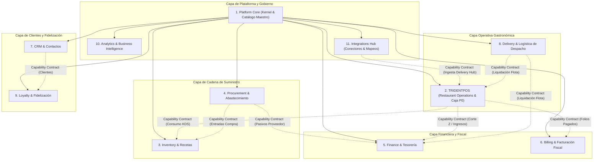

# MODULE CATALOG — ERP RESTAURANTES

**Document ID:** `ARCH-MOD-001`  
**Version:** `1.3 NORMALIZED / REMEDIATED`  
**Status:** `APPROVED / FROZEN`  
**Date:** 2026-09-01  
**Baseline:** `EAAF v1.2.0 @ 7e036f43240b3dc28ccb996e350263598275b2cd`  
**Supersedes:** `MODULE_CATALOG.md v1.2`  

---

## Catálogo Exhaustivo de los 11 Módulos Funcionales

---

### MÓDULO 1: Platform Core (Kernel Compartido y Catálogo Maestro)

- **Identificador:** `MOD-CORE`
- **Propósito:** Proveer la infraestructura funcional base, administración multi-tenant, estructura organizacional multi-sucursal, seguridad (RBAC y PIN rápido), el **Catálogo Maestro unificado** (Productos, Categorías, Menús, Modificadores, Precios Base y Branch Overrides) y auditoría transversal.
- **Entidades y Agregados Propios:** `Organization`, `Branch`, `StationIdentity`, `User`, `SecurityProfile`, `ModuleEntitlement`, `Producto`, `CategoriaProducto`, `Menu`, `GrupoModificador`, `Modificador`, `PrecioBase`, `BranchOverride`, `AuditLogEntry`.
- **Capacidades Operativas:**
  - Gestión de grupos empresariales y jerarquía de sucursales.
  - Registro y autorización de terminales y estaciones físicas (cajas, comanderos, KDS, kioskos).
  - Autenticación administrativa por usuario/contraseña y operativa por PIN de 4 dígitos.
  - **Gobierno del Catálogo Maestro:** Definición de productos vendibles/comprables, modificadores, listas de precios base y overrides por sucursal.
  - Registro de auditoría central de eventos sensibles.
- **Modos de Operación:**
  - *Full-Suite:* Tronco central y SSOT de catálogos para toda la suite.
  - *Standalone:* Incluido como componente embebido indispensable en cualquier módulo independiente.
- **Eventos Emitidos:** `OrganizationCreated`, `BranchCreated`, `StationRegistered`, `UserAuthenticated`, `MasterProductUpdated`, `BranchOverrideSet`, `SecurityAuditEventLogged`.
- **Eventos Consumidos:** Ninguno (Módulo base).
- **Contrato Funcional Expuesto:**
  - *Comandos:* `CreateOrganization()`, `RegisterBranch()`, `RegisterStation()`, `AuthenticateByPin()`, `SaveMasterProduct()`, `SaveBranchOverride()`.
  - *Consultas:* `GetBranchConfig()`, `ResolveProductForBranch(BranchId, ProductId)`, `ValidatePermission(UserId, ActionCode)`.
- **Dependencias:** Ninguna (Kernel compartido).

---

### MÓDULO 2: TRIDENTPOS (Restaurant Operations / POS & Caja P0)

- **Identificador:** `MOD-POS`
- **Propósito:** Gestionar la operación gastronómica en tiempo real: salón comedor, mostrador, comandero móvil, monitor de cocina (KDS con resiliencia LAN local), flujo de cuentas, cobro y la **operación completa de Caja P0 (Turnos, Arqueo ciego, Movimientos de efectivo, Cortes X y Cortes Z)**.
- **Entidades y Agregados Propios:** `AreaVenta`, `Mesa`, `MapaMesas`, `Cuenta`, `ProductoEnCuenta`, `OrdenProduccion`, `KdsStation`, `TurnoCaja`, `MovimientoEfectivo`, `PagoCuenta`, `CorteX`, `CorteZ`.
- **Capacidades Operativas:**
  - Apertura de mesas, control de comensales y asignación de mesero.
  - Captura rápida de comanda con modificadores obligatorios, paquetes y compuestos.
  - Enrutamiento y visualización de pedidos en KDS sobre red local tolerante a desconexión (LAN).
  - Confirmación de preparación en KDS y emisión de `OrdenProduccionConfirmadaEnKDS`.
  - Impresión de precuenta y asignación formal de Folio de Venta consecutivo.
  - Cobro de cuentas con soporte de pagos combinados (split payment) y propinas.
  - Operaciones de mesa: división de cuentas (por ítems o partes iguales), unión y transferencias.
  - **Operación Completa de Caja:** Apertura de turno con fondo inicial, retiros/depósitos/salvaguardas, cierre con arqueo ciego, emisión de Corte X (parcial) y **emisión de Corte Z (cierre diario de sucursal)** de forma autónoma.
- **Modos de Operación:**
  - *Full-Suite:* Emite consumos a Inventory, ingresos y Cortes Z a Finance, y folios pagados a Billing.
  - *Standalone:* Opera piso, cocina, cobro y cortes diarios de manera 100% autónoma sobre red local.
  - *Integrado con ERP Externo:* Envía transacciones de venta y cortes Z consolidados a SAP, Odoo o Dynamics.
- **Eventos Emitidos:** `CuentaAbierta`, `ComandaEnviadaACocina`, `OrdenProduccionIniciadaEnKDS`, `OrdenProduccionConfirmadaEnKDS`, `PrecuentaImpresaConFolio`, `CuentaPagada`, `CuentaCerrada`, `MesaLiberada`, `TurnoAbierto`, `TurnoCajaCerrado`, `CorteXGenerado`, `CorteZGenerado`.
- **Eventos Consumidos:** `BranchOverrideSet` (de Core), `PedidoExternoInyectado` (de Integrations).
- **Contrato Funcional Expuesto:**
  - *Comandos:* `AbrirMesa()`, `CapturarComanda()`, `EnviarCocina()`, `ConfirmarKdsOrden()`, `ImprimirPrecuenta()`, `PagarCuenta()`, `DividirCuenta()`, `AbrirTurnoCaja()`, `RegistrarMovimientoEfectivo()`, `CerrarTurnoArqueo()`, `GenerarCorteZ()`.
  - *Consultas:* `GetMesasStatus(AreaId)`, `GetCuentaDetails(CuentaId)`, `GetKdsActiveOrders(KdsStationId)`, `GetTurnoSummary(TurnoId)`, `GetCorteZSummary(BranchId, Fecha)`.
- **Dependencias:** Platform Core (Obligatoria). Inventory, Finance, Billing, Loyalty (Opcionales).

---

### MÓDULO 3: Inventory (Almacén e Inventarios)

- **Identificador:** `MOD-INV`
- **Propósito:** Controlar el ciclo de vida de insumos, presentaciones de compra, recetas de productos, subrecetas elaboradas, movimientos de almacén, existencias, mermas y costeo teórico.
- **Entidades y Agregados Propios:** `Almacen` (Bodega / Centro de Consumo), `Insumo`, `InsumoElaborado`, `PresentacionCompra`, `UnidadMedida`, `Receta`, `MovimientoAlmacen`, `KardexEntry`, `RegistroMerma`, `InventarioFisico`, `SaldoInventarioDiferido`.
- **Capacidades Operativas:**
  - Multi-almacén diferenciado: Bodegas (empaque de compra) y Centros de Consumo (unidad base de cocina).
  - Conversión por factores de rendimiento y porcentaje de merma.
  - **Descuento Automático de Insumos:** Procesado cuando Inventory está activo y suscrito al evento `OrdenProduccionConfirmadaEnKDS`.
  - Manejo de inventario diferido (venta permitida sin existencia física con saldo pendiente).
  - Métodos de costeo: Promedio y Promedio de entradas con salvaguarda ante existencias negativas.
  - Registro de mermas y bajas de insumos o productos terminados.
  - Traspasos entre almacenes y levantamiento de inventarios físicos con ajuste de diferencias.
- **Modos de Operación:**
  - *Full-Suite:* Recibe compras de Procurement y consumos de TRIDENTPOS automáticamente.
  - *Standalone:* Resuelve productos desde Platform Core y administra bodegas, recetas y costeo con captura manual de salidas sin requerir TRIDENTPOS.
- **Eventos Emitidos:** `InventarioDescontadoPorReceta`, `StockMinimoAlcanzado`, `TraspasoAlmacenesCompletado`, `MermaRegistrada`, `AjusteInventarioFisicoAplicado`.
- **Eventos Consumidos:** `OrdenProduccionConfirmadaEnKDS` (de TRIDENTPOS u origen externo), `RecepcionCompraRegistrada` (de Procurement u origen externo).
- **Contrato Funcional Expuesto:**
  - *Comandos:* `RegistrarConsumoPorReceta()`, `RealizarTraspaso()`, `RegistrarMerma()`, `AplicarInventarioFisico()`, `CrearReceta()`.
  - *Consultas:* `GetExistencias(BranchId, AlmacenId)`, `GetKardex(InsumoId, Fechas)`, `CalcularCostoReceta(ProductoId)`.
- **Dependencias:** Platform Core (Obligatoria). TRIDENTPOS, Procurement (Opcionales).

---

### MÓDULO 4: Procurement (Abastecimiento y Compras)

- **Identificador:** `MOD-PROC`
- **Propósito:** Gestionar el aprovisionamiento de insumos, proveedores, sugerencias de reposición, emisión de órdenes de compra y registro de recepción física de mercancías.
- **Entidades y Agregados Propios:** `Proveedor`, `CatalogoProveedorInsumo`, `PedidoAbastecimiento`, `OrdenCompra`, `RecepcionCompra`, `DocumentoProveedor`.
- **Capacidades Operativas:**
  - Catálogo de proveedores con condiciones de crédito y catálogo de insumos cotizados.
  - Generación de pedidos internos sugeridos por historial de consumo y stock mínimo.
  - Emisión de órdenes de compra (documentos de un solo uso, no modifican existencias ni generan pasivos por sí mismos).
  - Registro de recepción de compra física y emisión de `RecepcionCompraRegistrada`.
  - **Afectación Desacoplada:** Procurement no incrementa stock ni genera pasivos directamente; estos efectos ocurren exclusivamente si las capabilities de `Inventory` y `Finance` (internas o externas) se encuentran disponibles y suscritas al evento.
- **Modos de Operación:**
  - *Full-Suite:* Alimenta automáticamente a Inventory y Finance mediante contratos de eventos.
  - *Standalone:* Gestión pura de proveedores, cotizaciones y órdenes de compra sin acoplamiento runtime obligatorio.
- **Eventos Emitidos:** `PedidoAbastecimientoCreado`, `OrdenCompraEmitida`, `RecepcionCompraRegistrada`.
- **Eventos Consumidos:** `StockMinimoAlcanzado` (de Inventory).
- **Contrato Funcional Expuesto:**
  - *Comandos:* `GenerarPedidoSugerido()`, `EmitirOrdenCompra()`, `RegistrarRecepcionCompra()`.
  - *Consultas:* `GetOrdenesCompraPendientes(BranchId)`, `GetHistorialComprasProveedor(ProveedorId)`.
- **Dependencias:** Platform Core (Obligatoria). Inventory, Finance (Opcionales por Capability Contract).

---

### MÓDULO 5: Finance (Finanzas y Cuentas Operativas)

- **Identificador:** `MOD-FIN`
- **Propósito:** Administrar la tesorería de sucursal, cuentas por pagar a proveedores, cuentas por cobrar (créditos a clientes), gastos operativos, liquidación de propinas y pólizas contables (actuando como suscriptor financiero de Cortes Z).
- **Entidades y Agregados Propios:** `CuentaPorPagar`, `CuentaPorCobrar`, `GastoOperativo`, `LiquidacionPropinaMesero`, `ComisionAgente`, `PolizaContableInterfaz`.
- **Capacidades Operativas:**
  - Control de vencimiento y pagos a proveedores (CxP) generados a partir de recepciones de compra suscritas.
  - Control de saldos y abonos de clientes con línea de crédito (CxC).
  - Registro y clasificación de gastos operativos menores.
  - **Consumo y Conciliación de Corte Z:** Recibe el `CorteZGenerado` de TRIDENTPOS para conciliación bancaria y auditoría financiera.
  - Liquidación de propinas recaudadas para meseros con retención opcional de comisión bancaria.
  - Generación de pólizas de ingresos, egresos y compras para exportación contable.
- **Modos de Operación:**
  - *Full-Suite:* Concentra automáticamente los flujos financieros de POS, Compras y Caja.
  - *Standalone:* Módulo financiero de tesorería y cuentas corrientes gastronómicas sin dependencia de POS interno.
- **Eventos Emitidos:** `PagoProveedorRegistrado`, `AbonoClienteRegistrado`, `PolizaContableGenerada`.
- **Eventos Consumidos:** `CorteZGenerado` (de TRIDENTPOS), `TurnoCajaCerrado` (de TRIDENTPOS), `CuentaPagada` (de TRIDENTPOS), `RecepcionCompraRegistrada` (de Procurement).
- **Contrato Funcional Expuesto:**
  - *Comandos:* `RegistrarAbonoCliente()`, `LiquidarPagoProveedor()`, `RegistrarGasto()`, `ExportarPolizaContable()`.
  - *Consultas:* `GetAntiguedadSaldosCxP()`, `GetEstadoCuentaCliente(ClienteId)`, `GetResumenConciliacionZ(BranchId, Fecha)`.
- **Dependencias:** Platform Core (Obligatoria). TRIDENTPOS, Procurement (Opcionales).

---

### MÓDULO 6: Billing (Facturación Fiscal e Impuestos)

- **Identificador:** `MOD-BILL`
- **Propósito:** Gestionar el motor de cálculo de impuestos compuestos y la emisión de comprobantes fiscales digitales normativos.
- **Entidades y Agregados Propios:** `EsquemaImpuesto`, `ImpuestoDetalle`, `FacturaFiscal`, `TimbreFiscal`, `LoteFacturacion`, `CertificadoDigital`.
- **Capacidades Operativas:**
  - Motor de impuestos multi-nivel (IVA, IEPS, retenciones, impuestos en cascada).
  - Emisión de facturas fiscales digitales (CFDI México y esquemas internacionales).
  - Modalidades: Individual (de 1 ticket), Rápida, Dividida (1 ticket a varias facturas) y por Lote.
  - Cancelación de facturas fiscales con motivos normativos.
  - Monitoreo de timbres disponibles por sucursal.
- **Modos de Operación:**
  - *Full-Suite:* Facturación automática o bajo demanda desde cuentas pagadas de TRIDENTPOS.
  - *Standalone:* Emisor de facturación electrónica desde transacciones importadas.
- **Eventos Emitidos:** `FacturaFiscalEmitida`, `FacturaFiscalCancelada`, `TimbresFiscalesPorAgotar`.
- **Eventos Consumidos:** `CuentaPagada` (de TRIDENTPOS u origen externo).
- **Contrato Funcional Expuesto:**
  - *Comandos:* `GenerarFacturaDeFolio()`, `GenerarFacturaGlobalLote()`, `DividirFolioEnFacturas()`, `CancelarFacturaFiscal()`.
  - *Consultas:* `GetFacturaByUuid(Uuid)`, `GetTimbresDisponibles(BranchId)`.
- **Dependencias:** Platform Core (Obligatoria). TRIDENTPOS (Opcional).

---

### MÓDULO 7: CRM (Clientes y Contactos)

- **Identificador:** `MOD-CRM`
- **Propósito:** Centralizar el directorio de clientes, libreta de direcciones para entrega a domicilio, cuentas corporativas y convenios empresariales.
- **Entidades y Agregados Propios:** `Cliente`, `DireccionCliente`, `ZonaAsociada`, `CuentaCorporativa`, `ConvenioEmpresarial`.
- **Capacidades Operativas:**
  - Catálogo centralizado de clientes con datos fiscales, teléfonos múltiples y preferencias.
  - Libreta de direcciones geolocalizadas asociadas a zonas y colonias de reparto.
  - Cuentas corporativas para comedores de empleados y consumos de convenios.
  - Historial consolidado de consumo cross-branch.
- **Modos de Operación:**
  - *Full-Suite:* Asiste a Delivery, Facturación y Loyalty.
  - *Standalone:* Directorio y gestión de relaciones con clientes.
- **Eventos Emitidos:** `ClienteRegistrado`, `DireccionClienteActualizada`, `CuentaCorporativaCreada`.
- **Eventos Consumidos:** `CuentaPagada` (de TRIDENTPOS).
- **Contrato Funcional Expuesto:**
  - *Comandos:* `RegistrarCliente()`, `AgregarDireccionDelivery()`, `CrearCuentaCorporativa()`.
  - *Consultas:* `BuscarClientePorTelefono(Telefono)`, `GetHistorialCliente(ClienteId)`.
- **Dependencias:** Platform Core (Obligatoria). Delivery, Loyalty (Opcionales).

---

### MÓDULO 8: Delivery (Servicio a Domicilio y Logística de Despacho)

- **Identificador:** `MOD-DEL`
- **Propósito:** Administrar la zonificación geográfica, tarifas de envío, asignación y despacho de pedidos a domicilio con flota propia, y la emisión de liquidaciones de repartidores.
- **Entidades y Agregados Propios:** `ZonaDelivery`, `TarifaZona`, `Repartidor`, `PedidoDelivery`, `BitacoraDespacho`, `LiquidacionRepartidor`.
- **Capacidades Operativas:**
  - Zonificación geográfica y cálculo automático de costos de envío.
  - Asignación de repartidores propios, control de tiempos de viaje y estatus (En Preparación → Despachado → Entregado).
  - Emisión del evento `LiquidacionRepartidorEmitida` al finalizar la ruta para ser procesado mediante contrato funcional hacia `TRIDENTPOS` (caja de piso) o `Finance` (tesorería).
  - *Separación con Integrations:* Delivery no gestiona conectores ni credenciales de plataformas externas (Uber/Rappi); esos residen exclusivamente en `Integrations`.
- **Modos de Operación:**
  - *Full-Suite:* Integrado con TRIDENTPOS para enrutamiento a cocina y liquidación directa en turno de caja.
  - *Standalone:* Despacho logístico independiente de flotas de reparto interactuando por contrato con POS/Finance internos o externos.
- **Eventos Emitidos:** `PedidoDeliveryCreado`, `PedidoDeliveryDespachado`, `PedidoDeliveryEntregado`, `LiquidacionRepartidorEmitida`.
- **Eventos Consumidos:** `ComandaEnviadaACocina` (de TRIDENTPOS), `OrdenProduccionConfirmadaEnKDS` (de TRIDENTPOS).
- **Contrato Funcional Expuesto:**
  - *Comandos:* `CrearPedidoDelivery()`, `AsignarRepartidor()`, `ConfirmarEntrega()`, `EmitirLiquidacionRepartidor()`.
  - *Consultas:* `GetRepartidoresDisponibles(BranchId)`, `GetPedidosEnRuta(BranchId)`.
- **Dependencias:** Platform Core (Obligatoria). TRIDENTPOS, Finance, Integrations (Opcionales por Capability Contract).

---

### MÓDULO 9: Loyalty (Lealtad y Fidelización)

- **Identificador:** `MOD-LOY`
- **Propósito:** Fidelizar comensales a través de monederos electrónicos de saldo pre-pago, programas de puntos por consumo, cortesías y tarjetas de regalo.
- **Entidades y Agregados Propios:** `TarjetaLealtad`, `MonederoElectronico`, `TransaccionMonedero`, `TransaccionPuntos`, `ProgramaLealtad`, `CuponDescuento`.
- **Capacidades Operativas:**
  - Monedero electrónico recargable (físico o digital / RestCard).
  - Reglas de acumulación de puntos por importe de compra o productos específicos.
  - Redención de puntos o saldo como forma de pago en la pantalla de cobro de TRIDENTPOS.
  - Emisión y validación de cupones de descuento y cortesías autorizadas.
- **Modos de Operación:**
  - *Full-Suite:* Acumulación y redención transparente en el punto de cobro.
  - *Standalone:* Plataforma de lealtad y gift cards con terminal web de consulta.
- **Eventos Emitidos:** `PuntosAcumulados`, `PuntosRedimidos`, `SaldoMonederoRecargado`, `SaldoMonederoDebitado`.
- **Eventos Consumidos:** `CuentaPagada` (de TRIDENTPOS).
- **Contrato Funcional Expuesto:**
  - *Comandos:* `RecargarMonedero()`, `DebitarMonedero()`, `AcumularPuntos()`, `RedimirPuntos()`, `ValidarCupon()`.
  - *Consultas:* `ConsultarSaldoMonedero(NumeroTarjeta)`, `ConsultarPuntosCliente(ClienteId)`.
- **Dependencias:** Platform Core (Obligatoria). TRIDENTPOS, CRM (Opcionales).

---

### MÓDULO 10: Analytics (Reportes e Inteligencia de Negocio)

- **Identificador:** `MOD-ANA`
- **Propósito:** Generar reportes operacionales, financieros, de auditoría y tableros analíticos consolidados multi-sucursal en tiempo real.
- **Entidades y Agregados Propios:** `ReportDefinition`, `AnalyticsCube`, `OperationalSnapshot`, `FraudAuditReport`, `KitchenPerformanceMetric`.
- **Capacidades Operativas:**
  - Catálogo de más de 65 reportes operacionales (Ventas, Caja, Inventarios, Compras, Finanzas).
  - Analítica cross-branch comparativa de rendimiento, ticket promedio y mezcla de ventas.
  - Métricas de eficiencia de cocina (tiempos de preparación en KDS).
  - Auditoría especializada de mermas, cancelaciones de folios, descuentos y aperturas manuales de cajón.
- **Modos de Operación:**
  - *Full-Suite:* Tableros ejecutivos integrales alimentados por todos los módulos.
  - *Standalone:* Motor de BI alimentado por extractores de datos.
- **Eventos Emitidos:** `ReporteGenerado`, `AlertaDesviacionCostoDetectada`, `AlertaFraudePotencial`.
- **Eventos Consumidos:** Todos los eventos de dominio de la suite.
- **Contrato Funcional Expuesto:**
  - *Comandos:* `EjecutarReporte()`, `ConfigurarAlertaAuditoria()`, `ExportarReporteAFormato()`.
  - *Consultas:* `GetTableroEjecutivo(OrganizationId, Fechas)`, `GetAuditoriaCancelaciones(BranchId, Fechas)`.
- **Dependencias:** Platform Core (Obligatoria). Módulos de datos según el reporte.

---

### MÓDULO 11: Integrations (Hub de Integraciones)

- **Identificador:** `MOD-INT`
- **Propósito:** Administrar de forma exclusiva los conectores externos, credenciales, esquemas de autenticación y mapeos de catálogos para plataformas de terceros (agregadores de delivery, PMS hotelero, pasarelas bancarias y ERPs corporativos).
- **Entidades y Agregados Propios:** `ConectorExterno`, `CredencialIntegracion`, `MapeoCatalogoExterno`, `TransaccionGateway`, `BitacoraIntegracion`, `SyncJob`.
- **Capacidades Operativas:**
  - **Delivery Hub:** Ingesta, transformación de pedidos y mapeo de menús de Uber Eats, Rappi, Didi Food y agregadores hacia TRIDENTPOS.
  - **Enlace PMS Hotelero:** Cargo de consumos de restaurante a habitaciones de huéspedes.
  - **Enlace Bancario / PinPAD:** Comunicación con terminales bancarias integradas.
  - **Enlace ERP / Contable:** Exportación de pólizas e integración con SAP, Odoo, ContPAQi.
  - **Recargas Electrónicas (TAE):** Venta de tiempo aire telefónico en caja.
- **Modos de Operación:**
  - *Full-Suite:* Pasarela unificada de interoperabilidad de la plataforma.
  - *Standalone:* Adaptador de protocolos y transformador de mensajes.
- **Eventos Emitidos:** `PedidoExternoInyectado`, `TransaccionExternaCompletada`, `SincronizacionCatalogoExitosa`, `FallaConexionExterna`.
- **Eventos Consumidos:** `CuentaPagada`, `ComandaEnviadaACocina`, `CorteZGenerado`.
- **Contrato Funcional Expuesto:**
  - *Comandos:* `InyectarPedidoDeliveryHub()`, `CargarAHabitacionHotel()`, `SincronizarMenuAgregador()`, `ProcesarCobroPinpad()`, `VenderTiempoAire()`.
  - *Consultas:* `ValidarHabitacionHuesped(NumeroHabitacion)`, `GetEstadoIntegracion(ConectorId)`.
- **Dependencias:** Platform Core (Obligatoria). Módulos específicos según la integración.

---

DOCUMENT STATUS: APPROVED / FROZEN — 2026-09-01
