# PRODUCT SCOPE — ERP RESTAURANTES

**Document ID:** `ARCH-SCP-001`  
**Version:** `1.3 NORMALIZED / REMEDIATED`  
**Status:** `APPROVED / FROZEN`  
**Date:** 2026-09-01  
**Baseline:** `EAAF v1.2.0 @ 7e036f43240b3dc28ccb996e350263598275b2cd`  
**Supersedes:** `PRODUCT_SCOPE.md v1.2`  

---

## 1. Visión y Objetivos del Producto

### 1.1 Declaración de Visión
**`ERP RESTAURANTES`** es una suite empresarial de software especializada en la industria gastronómica, diseñada para proporcionar control operativo en tiempo real a nivel de sucursal y gobierno analítico, fiscal y de abastecimiento centralizado a nivel corporativo.

### 1.2 Objetivos Estratégicos
1. **Velocidad y Precisión Operativa:** Agilizar la captura en mesa, enrutamiento a cocina y liquidación de cuentas mediante la vertical **`TRIDENTPOS`**.
2. **Control Integral de Costos:** Asegurar trazabilidad del ciclo de insumos (compras, rendimiento, recetas, subrecetas y mermas) con descuento automático al confirmar la producción en KDS cuando la capability de inventario esté activa.
3. **Gobierno Multi-Sucursal:** Permitir la gestión centralizada de catálogos maestros y políticas empresariales en **Platform Core**, otorgando flexibilidad a cada sucursal mediante overrides locales de precios, impuestos y visibilidad.
4. **Continuidad Operativa (Resiliencia LAN en TRIDENTPOS):** Garantizar que la operación de salón, mostrador, cocina y caja funcione de manera ininterrumpida aun ante fallas de internet en la sucursal.
5. **Arquitectura Desacoplada:** Soportar despliegues completos (Full-Suite), módulos independientes (Standalone) o integración con ERPs y POS de terceros mediante contratos funcionales.

---

## 2. Personas y Perfiles de Usuario

El sistema atiende a 9 perfiles de usuario operacionales y administrativos:

| Persona / Perfil | Entorno Primario | Responsabilidades Operativas Clave |
|---|---|---|
| **Administrador Corporativo** | Backoffice Web | Gestión de Organización, sucursales, usuarios, catálogo maestro central, esquemas de impuestos, auditoría global y reportes consolidados. |
| **Gerente de Sucursal** | Backoffice / POS | Autorización de cancelaciones, descuentos, reapertura de cuentas, configuración de layout de mesas, arqueos y supervisión de cortes de caja. |
| **Cajero** | Terminal POS Caja | Apertura/cierre de turnos de caja, registro de retiros/depósitos/salvaguardas, cobro de cuentas (split payment), emisión de tickets, precuentas y generación de Cortes X y Z. |
| **Mesero / Garzón** | POS Piso / Comandero Móvil | Apertura de mesas, captura de comandas con modificadores, envío a cocina, división/unión de cuentas y solicitud de precuenta. |
| **Mesero-Capitán** | Comandero Móvil / POS | Supervisión de asignación de mesas a meseros, transferencias de cuentas y cobro móvil en mesa cuando esté autorizado. |
| **Personal de Cocina (KDS)** | Pantalla KDS en Cocina | Visualización de comandas en tiempo real, control de tiempos de preparación y confirmación de órdenes surtidas. |
| **Repartidor de Domicilio** | Módulo Delivery / Móvil | Recepción y despacho de pedidos, entrega a domicilio, retorno de evidencias y liquidación de efectivo en caja. |
| **Almacenista / Compras** | Backoffice Almacén | Recepción física de órdenes de compra, traspasos entre bodegas y centros de consumo, inventarios físicos y registro de mermas. |
| **Comensal / Cliente** | Kiosko / Portal Web | Visualización de menú, pedidos en auto-servicio, consulta de puntos de lealtad y generación de comprobantes fiscales (autofacturación). |

---

## 3. Desglose del Alcance por Fases Funcionales

```mermaid
graph TD
    subgraph P0["P0 — Core Operativo Fundacional (Mínimo para Operar)"]
        P0_CORE["Platform Core (Org, Branch, Catálogo Maestro, Overrides, RBAC/PIN, Auditoría)"]
        P0_POS["TRIDENTPOS (Comedor, Mostrador, Comanda, Precuenta, Cobro)"]
        P0_KDS["KDS en LAN (Visualización & Confirmación de Producción como Trigger)"]
        P0_CASH["Caja Completa (Turnos, Fondo, Arqueo Ciego, Retiros/Depósitos, Cortes X y Z)"]
        P0_CANC["Cancelaciones Básicas (Post-Cocina OPEN)"]
    end

    subgraph P1["P1 — Operación Comercial y Abastecimiento"]
        P1_INV["Inventory (Multi-almacén, Kárdex, Recetas, Rendimiento, Mermas, Descuento Real por KDS)"]
        P1_PROC["Procurement (Sugerencias, Órdenes de Compra de un solo uso, Recepción de Mercancía)"]
        P1_FIN["Finance (CxP, CxC, Gastos, Liquidación Propinas, Consumo de Cortes Z)"]
        P1_DEL["Delivery Propio (Zonas, Repartidores, Despacho, Liquidación vía Contrato)"]
        P1_BILL["Billing (Impuestos Compuestos, Emisión CFDI / Fiscal Multi-modal)"]
        P1_OPS["Operaciones Avanzadas de Mesa (División / Unión de Cuentas)"]
    end

    subgraph P2["P2 — Avanzado y Ecosistema Digital"]
        P2_MOB["Comandero Móvil en Tiempo Real"]
        P2_HUB["Delivery Hub (Ingesta de Agregadores Externos)"]
        P2_LOY["CRM & Loyalty (RestCard, Monedero, Puntos por Consumo)"]
        P2_SUB["Insumos Elaborados & Subrecetas"]
        P2_MAP["Diseñador Gráfico de Mesas"]
        P2_INT["Integrations (Pólizas Contables, Terminales Bancarias)"]
    end

    subgraph P3["P3 — Extensiones Verticales y Opcionales"]
        P3_ENT["Vertical Entretenimiento (Billar, Patinaje por Tiempo)"]
        P3_EMP["Comedor de Empleados con Subvenciones"]
        P3_PMS["Enlace Hotelero (PMS)"]
        P3_KIO["Kiosko Interactivo de Auto-Servicio"]
    end

    P0 --> P1
    P1 --> P2
    P2 --> P3
```

### 3.1 P0 — Core Operativo Fundacional (Obligatorio para Operar)
Alcance mínimo indispensable para operar un restaurante en piso, cocina y caja:
- **Platform Core Fundacional:**
  - Estructura multi-tenant Organization → Branch.
  - Catálogo maestro unificado de productos, categorías, menús y modificadores con branch overrides (precios locales, visibilidad y esquemas fiscales).
  - RBAC administrativo y autenticación rápida por PIN de 4 dígitos en terminales de piso.
  - Registro estructurado de auditoría de eventos sensibles.
- **TRIDENTPOS (Core Operativo):**
  - **Servicio Comedor:** Áreas de venta, mesas, apertura de cuenta con comensales, captura de productos simples/compuestos/paquetes con modificadores obligatorios y notas de cocina.
  - **Servicio Rápido / Mostrador:** Captura directa en caja para consumo en mostrador o para llevar.
  - **Gestión de Cuentas:** Impresión de precuenta (asignación formal del folio de venta consecutivo), cobro simple o mixto (split payment) y liberación de mesa.
- **KDS (Monitor de Cocina Integrado en LAN):**
  - Despliegue en tiempo real sobre red local de la sucursal (resiliencia LAN de TRIDENTPOS).
  - Grilla de órdenes activas con cronómetro y alertas visuales.
  - **Confirmación de Orden Surtida (Disparador de Evento P0):** Emisión del evento formal `OrdenProduccionConfirmadaEnKDS`.
  - Función de recuperación (Recall) de órdenes terminadas dentro de una ventana de 2 horas.
- **Disparador Funcional de Inventario:** El evento emitido por KDS queda formalizado como el trigger del consumo de insumos. El **descuento real de existencias en almacén ocurre cuando la capability de Inventory se encuentra habilitada** (en P1 de la suite completa o mediante módulo standalone contratado/conectado).
- **Caja Completa P0 en TRIDENTPOS:**
  - Apertura de turno con captura de fondo inicial de caja y desglose de denominaciones.
  - Registro de movimientos de efectivo: Retiros, Depósitos y Salvaguardas operativas.
  - Cierre de turno con arqueo a ciegas.
  - **Emisión de Corte X (parcial de estación/turno) y Corte Z (cierre diario consolidado de sucursal)** de forma autónoma en el POS.
- **Cancelaciones Básicas:**
  - Cancelación de ítems antes de enviar a cocina con captura obligatoria de motivo del catálogo.
  - Cancelación total de cuenta/folio.
  - *Política de cancelación post-cocina:* Se mantiene formalmente **`OPEN / PENDIENTE DE DEFINICIÓN`**.

### 3.2 P1 — Operación Comercial y Abastecimiento
- **Inventory Completo:**
  - Gestión multi-almacén (Bodegas de presentaciones de compra vs. Centros de consumo de cocina).
  - Factores de conversión de rendimiento y mermas por insumo.
  - Recetas de productos simples y compuestos.
  - Métodos de costeo: Promedio o Promedio de entradas con salvaguarda ante existencias negativas.
  - Kárdex de movimientos, traspasos entre almacenes, inventario físico, saldo de inventario diferido y **consumo efectivo de insumos disparado por KDS**.
- **Procurement & Finance:**
  - Pedidos internos de abastecimiento y sugerencias de reposición por stock mínimo.
  - Órdenes de compra de un solo uso.
  - Recepción de compras: Procurement emite el evento de recepción; la afectación de existencias en Inventory y el registro de pasivos en Cuentas por Pagar (Finance) se ejecutan mediante suscripción a contratos funcionales cuando dichas capabilities se encuentran disponibles (internas o externas).
  - Cuentas por cobrar (CxC: gestión base de créditos a clientes).
  - Registro de gastos operativos de sucursal.
  - **Consumo y conciliación de eventos de Corte Z y turnos cerrados de TRIDENTPOS.**
- **Delivery Propio:**
  - Directorio de clientes con teléfonos y direcciones asociadas a colonias y zonas tarifarias.
  - Asignación, despacho, seguimiento y retorno de repartidores propios.
  - Liquidación de efectivo de repartidores mediante contrato funcional hacia TRIDENTPOS o Finance.
- **Billing (Facturación Fiscal):**
  - Motor de impuestos multi-nivel (directos, adicionales, retenciones).
  - Emisión y timbrado de comprobantes fiscales digitales (CFDI / Comprobantes internacionales).
  - Modalidades: Individual, rápida, dividida y por lote de folios.
- **Operaciones Avanzadas de Mesa:**
  - División de cuenta por productos (hasta 3 subcuentas) o en partes iguales entre N comensales.
  - Unión y transferencia de cuentas entre mesas.
  - Configuración de propina sugerida y liquidación en cortes de caja.
  - Aplicación de descuentos y promociones programadas (horarios, días, 2x1).
- **Reportes Operativos:** Reportes básicos de ventas, caja, inventarios y compras.

### 3.3 P2 — Avanzado y Ecosistema Digital
- **Comandero Móvil:** Front-end para tablets/smartphones de meseros sincronizado en tiempo real vía LAN.
- **Delivery Hub:** Ingesta de pedidos de plataformas de terceros (Uber Eats, Rappi, Didi Food) y agregadores (Ordatic, Deliverect) hacia el mostrador de TRIDENTPOS mediante el módulo Integrations.
- **CRM y Fidelización:**
  - Historial consolidado cross-branch de compras del cliente.
  - Monedero electrónico recargable (RestCard) y acumulación de puntos por importe.
  - Cuentas corporativas y convenios empresariales.
- **Insumos Elaborados:** Órdenes de producción manual para subrecetas (salsas, masas, fondos) que transforman insumos base en insumos compuestos en stock.
- **Diseñador Gráfico de Mesas:** Editor visual interactivo de planos por área de venta.
- **Integraciones:** Enlace con sistemas contables para generación de pólizas e integración con terminales bancarias PinPAD.

### 3.4 P3 — Extensiones Verticales y Opcionales
- **Vertical de Entretenimiento:** Renta de mesas de billar y pistas de patinaje por tiempo, con tarifas fraccionadas y control de iluminación.
- **Comedor de Empleados:** Asignación de turnos de comida, menús diarios y control de subsidios/descuentos por nómina.
- **Enlace Hotelero (PMS):** Cargo de consumos y propinas directamente a habitaciones de hotel.
- **Kiosko Interactivo de Auto-Servicio:** Terminal de pedido y cobro desatendido para comensales en mostrador.

---

## 4. Requisitos No Funcionales y Operacionales

1. **Resiliencia Operativa Local en TRIDENTPOS:** Las operaciones críticas de toma de pedidos, comanda, preparación en KDS, precuenta, cobro en efectivo y emisión de Cortes X/Z no se interrumpen ante contingencias de conectividad a internet en la sucursal. Platform Core provee las primitivas transversales de identidad y seguridad.
2. **Capacidad de Respuesta y Fluidez:** Captura de comanda y confirmación visual inmediata en pantallas táctiles y KDS de cocina.
3. **Concurrencia sin Bloqueos:** Soporte simultáneo multi-estación en la misma sucursal sin colisión de folios de precuenta ni duplicidad de comandas en cocina.
4. **Seguridad y Trazabilidad:** Separación estricta de privilegios administrativos (RBAC) y operativos (PIN rápido). Auditoría estructurada de cancelaciones, descuentos, aperturas de cajón y reaperturas de cuenta.

---

## 5. Límites del Sistema y Fuera de Alcance Inicial

### 5.1 En Alcance (In Scope)
- Administración multi-tenant y multi-sucursal con catálogo maestro centralizado en Platform Core.
- Operación completa de salón, mostrador, delivery, cocina y caja P0 en TRIDENTPOS.
- Cadena de abastecimiento y costeo de recetas en Inventory y Procurement.
- Facturación fiscal y tesorería operativa en Billing y Finance.
- Fidelización, monederos y CRM gastronómico.

### 5.2 Fuera de Alcance Inicial (Out of Scope)
- Contabilidad general completa (Balance general, libros mayores de doble partida); el sistema emite **pólizas contables de interfaz** hacia software contable especializado.
- Administración de nómina y cálculo de impuestos laborales; el sistema provee control de asistencia y liquidación de propinas.
- Plataforma propia de comercio electrónico B2C masivo (el alcance cubre canales digitales directos y Delivery Hub con agregadores).

---

DOCUMENT STATUS: APPROVED / FROZEN — 2026-09-01
