# PROJECT BLUEPRINT — ERP RESTAURANTES / TRIDENTPOS

**Framework repository/commit:** `https://github.com/Lucas030509/EAAF-Framework@7e036f43240b3dc28ccb996e350263598275b2cd`  
**Framework Version:** `1.2.0`  
**Framework Ref:** `codex/eaaf-v1.2-governance`  
**Status:** `DRAFT`  
**Active Lifecycle Phase:** `SOLUTION ARCHITECTURE — REMEDIATION`  
**Next Gate:** `SOLUTION_ARCHITECTURE_GATE` (PENDIENTE DE REMEDIACIÓN Y REVISIÓN INDEPENDIENTE)  

```yaml
framework_governance:
  framework: "EAAF"
  framework_version: "1.2.0"
  repository: "https://github.com/Lucas030509/EAAF-Framework"
  ref: "codex/eaaf-v1.2-governance"
  commit: "7e036f43240b3dc28ccb996e350263598275b2cd"
  adoption_status: "GOVERNED"
```

---

## 1. Product and Scope

- **Problem Statement:** La industria restaurantera requiere operar piso, cocina y caja con ultra-baja latencia y resiliencia total ante caídas de conectividad local/internet, sin perder el gobierno corporativo de catálogos maestros, compras, recetas, finanzas y analítica consolidada en la nube.
- **Product Name:** `ERP RESTAURANTES` (Suite Empresarial) / `TRIDENTPOS` (Vertical Especializada de Restaurant Operations).
- **Core Users & Personas:** Administrador Corporativo, Gerente de Sucursal, Cajero, Mesero / Garzón, Personal de Cocina (KDS), Repartidor de Domicilio, Almacenista / Compras, Comensal / Cliente.
- **Phased Scope:**
  - **P0 (Core Operativo Fundacional):** Platform Core (Org, Branch, Catálogo Maestro, Overrides, RBAC/PIN, Auditoría), TRIDENTPOS (Comedor, Mostrador, Comanda, Precuenta, Cobro, Turnos, Arqueo, Cortes X y Z), KDS en LAN (Trigger de producción).
  - **P1 (Operación Comercial y Abastecimiento):** Inventory (Recetas, Kárdex, Mermas, Descuento real por KDS), Procurement (Órdenes de compra, Recepción física), Finance (CxP, CxC, Gastos, Consumo de Cortes Z), Delivery Propio, Billing (CFDI / Fiscal multi-modal).
  - **P2 (Avanzado & Ecosistema Digital):** Comandero Móvil, Delivery Hub (Integrations con Uber/Rappi/Didi), CRM & Loyalty (RestCard), Insumos Elaborados.
  - **P3 (Extensiones Opcionales):** Entretenimiento por tiempo, Comedor de Empleados, Enlace Hotelero (PMS), Kiosko interactivo.
- **Exclusions (Out of Scope Inicial):** Contabilidad general de partida doble completa (se generan pólizas de interfaz contable), administración y cálculo de nómina legal, comercio electrónico B2C masivo no gastronómico.
- **SSOT Functional Authority:** [`FUNCTIONAL_ARCHITECTURE.md`](file:///Volumes/SSD_ORICO/BRAIN/TRIDENTPOSREST/eeaaf/TRIDENTPOS/FUNCTIONAL_ARCHITECTURE.md) (v1.2 APPROVED).

---

## 2. Quality Attributes

- **Availability & Resilience:** `DESIGN OBJECTIVE: Continuidad operativa local en sucursal mediante arquitectura Edge aislada; tolerancia a fallos de enlace a internet para operaciones de toma de pedidos, KDS, impresión y cobro en efectivo.`
- **Latency & Performance:** `LATENCY TARGET: < 5 ms en red local cableada o WiFi 5GHz dedicada para eventos de comanda y actualización en pantallas KDS — REQUIRES HARDWARE BENCHMARK.`
- **Target RPO / RTO (Disaster Recovery):**
  - *Reinicio de Software / Caída con UPS:* `RPO TARGET: 0, RTO TARGET: < 3 minutos.`
  - *Pérdida Total de Hardware del Edge Host:* `RTO TARGET: < 30 minutos (bootstrap automático desde Cloud para catálogos y configuración) + Protocolo de Reconciliación Manual y Auditoría Física para transacciones locales pendientes de sincronización — REQUIRES DR VALIDATION.`
- **Validation Method:** Pruebas automatizadas de corte de energía (power-loss testing) en hardware representativo, pruebas de carga concurrente LAN y simulacro de recuperación ante desastres.

---

## 3. Topology and Stack

- **Architectural Style:** Monolito Modular con Bounded Contexts fuertemente tipados en Cloud + Nodos Edge en Sucursal.
- **Cloud Control Plane:**
  - *Presentation:* Next.js / React alojado en Vercel Edge Network.
  - *Compute & Sync:* Node.js / TypeScript Web Services & Background Workers en Render (incluye Sync WebSocket Gateway `WSS`).
  - *Data & Storage:* PostgreSQL multi-tenant administrado en Supabase con PgBouncer/Supavisor, Storage S3 y Row-Level Security (RLS).
  - *Observability:* Sentry Cloud para tracing distribuido y telemetría de excepciones.
- **Branch Operational Plane (TRIDENTPOS Edge):**
  - *Host Runtime:* Electron / Node.js Local Host Runtime (Baseline actual, evaluando Tauri/Rust para hardware de ultra-baja gama según ADR-003).
  - *Local Store:* SQLite 3 con journaling `WAL` y configuración dual `synchronous = NORMAL` (operación) / `FULL` (Cortes Z).
  - *Local LAN Bus:* HTTP REST para comandos tipados y WebSocket Server nativo (`ws`) para distribución push de comandas a KDS y comanderos.
  - *Hardware Gateway:* Driver de comunicación directa ESC/POS (Ethernet / USB / Serial Raw TCP 9100), apertura de cajón de dinero RJ11 y lectura de básculas.

---

## 4. Modules and Ownership

La suite se compone de 11 Bounded Contexts desacoplados gobernados por el principio `MODULAR BY DESIGN — INTEGRATED BY CONTRACT`:

```mermaid
graph TD
    MOD_01["1. Platform Core (Kernel & Catálogo Maestro)"]
    MOD_02["2. TRIDENTPOS (Restaurant Operations & Caja P0)"]
    MOD_03["3. Inventory (Recetas, Almacenes & Kárdex)"]
    MOD_04["4. Procurement (Abastecimiento & Órdenes de Compra)"]
    MOD_05["5. Finance (Tesorería, CxP, CxC, Consumo Corte Z)"]
    MOD_06["6. Billing (Impuestos Compuestos & Facturación Fiscal)"]
    MOD_07["7. CRM (Directorio de Clientes & Contactos)"]
    MOD_08["8. Delivery (Logística & Despacho Flota Propia)"]
    MOD_09["9. Loyalty (Monedero RestCard & Puntos)"]
    MOD_10["10. Analytics (Reportes & Tableros BI)"]
    MOD_11["11. Integrations Hub (Conectores Externos & Mapeos)"]

    MOD_01 --> MOD_02
    MOD_01 --> MOD_03
    MOD_01 --> MOD_04
    MOD_01 --> MOD_05
    MOD_01 --> MOD_06
    MOD_01 --> MOD_07
    MOD_01 --> MOD_08
    MOD_01 --> MOD_09
    MOD_01 --> MOD_10
    MOD_01 --> MOD_11
```



- **Regla de Dependencias:** Ningún módulo de negocio tiene dependencia runtime obligatoria de otro módulo de negocio; se integran exclusivamente mediante contratos funcionales (Capability Contracts).
- **Ownership de Catálogo:** Reside en `Platform Core` (Productos, Grupos, Menús, Modificadores, Precios Base y Overrides).
- **Ownership de Recetas:** Reside exclusivamente en `Inventory`.
- **Ownership de Caja:** Reside en `TRIDENTPOS` (Turnos, Cobro, Arqueo, Cortes X y Cortes Z). `Finance` consume los eventos de Corte Z.
- **Ownership de Conectores Externos:** Reside exclusivamente en `Integrations Hub`.

---

## 5. Identity and Tenancy

- **Multi-Tenancy Hierarchy:** `Organization (Tenant Corporativo) → Branch (Sucursal Operativa)`.
- **Administrative Identity:** Autenticación por email/contraseña federada en Supabase Auth con RBAC granular.
- **Operational Floor Identity:** Autenticación rápida por PIN de 4 dígitos en terminales de salón, cocina y caja, resuelta localmente en el Edge Server.
- **Device & Station Identity:** Registro y autorización criptográfica de terminales fijas y móviles vinculadas a la sucursal.
- **Audit Trail:** Bitácora inmutable de eventos sensibles (cancelaciones, descuentos, aperturas de cajón, reaperturas de cuenta y transferencias).

---

## 6. Data and Integrations

- **Data Authority Matrix:**
  - *Full Suite:* Cloud es SoR de Catálogos y Usuarios; Branch es Primary Write Authority de Mesas, Cuentas, KDS, Caja y Cortes X/Z.
  - *TRIDENTPOS Standalone:* Branch Edge Host posee 100% de autoridad sobre el catálogo embebido, operaciones y cortes locales.
  - *Backoffice Standalone:* Cloud es SoR de Catálogo, Recetas, Almacenes y Finanzas; POS Externo es autoridad de tickets.
  - *Híbrido Corporativo:* Branch Edge opera piso/caja; Cloud reconcilia; ERP Externo es SoR contable corporativo.
- **Integrations Plane:**
  - *Delivery Hub:* Uber Eats, Rappi, Didi Food, Deliverect.
  - *Fiscal Invoicing:* PACs autorizados (CFDI México / Fiscal Internacional).
  - *Hotel PMS:* Opera, protel (cargos a habitación).
  - *Corporate ERP:* SAP S/4HANA, Microsoft Dynamics, Odoo (pólizas contables).

---

## 7. Offline and Hybrid Operations

- **Local Persistence & Outbox:** Transacciones locales persistidas atómicamente en SQLite WAL junto con la tabla `OutboxQueue`.
- **Idempotency Key Lógica:** `orgId:branchId:aggregateType:aggregateId:action:clientOpId`.
- **Causal Ordering:** Garantizado por `aggregateSequenceNumber` / `streamOffset` monotónico por agregado (no por timestamps de dispositivos).
- **Concurrency Control:** Control de Concurrencia Optimista (OCC) con `expectedVersion` sobre cuentas y mesas para prevenir colisiones entre comanderos.
- **Reconnection Protocol:** Detección de enlace -> Drenado de Outbox -> Pull de deltas de catálogo -> Confirmación de estado sincronizado.

---

## 8. Security and Observability

- **Threat Controls:** Aislamiento estricto de bases de datos por Tenant (RLS), cifrado en tránsito TLS 1.3 y tokens de sesión de corta duración.
- **Telemetry & Tracing:** Sentry distribuido con captura de trazas, alertas de degradación de integraciones y buffer offline en el Edge Host.
- **Loss Prevention:** Auditoría analítica de cancelaciones post-cocina, descuentos atípicos, mermas reportadas y diferencias de arqueo ciego.

---

## 9. Delivery and Operations

- **Environments:** Local Dev, CI/CD Pipeline, Staging, Production Cloud + Edge Packages.
- **Packaging:** Instalador desktop todo-en-uno para Edge Server (Windows / Linux / macOS) con auto-aprovisionamiento guiado.
- **Database Migrations:** Versionadas y ejecutadas exclusivamente a través de los pipelines de CI/CD corporativos.

---

## 10. Risks, Assumptions, ADRs and PENDING PO Decisions

### Architectural Decision Records (ADRs Registrados)
- [`ADR-001`](file:///Volumes/SSD_ORICO/BRAIN/TRIDENTPOSREST/eeaaf/TRIDENTPOS/ADR/ADR-001-modular-monolith-bounded-contexts.md): Adopción del Patrón Monolito Modular con Bounded Contexts Fuertes.
- [`ADR-002`](file:///Volumes/SSD_ORICO/BRAIN/TRIDENTPOSREST/eeaaf/TRIDENTPOS/ADR/ADR-002-cloud-branch-data-authority-by-topology.md): Definición de Autoridad de Datos Cloud / Branch por Topología.
- [`ADR-003`](file:///Volumes/SSD_ORICO/BRAIN/TRIDENTPOSREST/eeaaf/TRIDENTPOS/ADR/ADR-003-edge-host-runtime-electron-vs-tauri.md): Selección del Runtime del Edge Host (Electron/Node vs. Tauri/Rust).
- [`ADR-004`](file:///Volumes/SSD_ORICO/BRAIN/TRIDENTPOSREST/eeaaf/TRIDENTPOS/ADR/ADR-004-embedded-database-sqlite-durability.md): Base de Datos Embebida en Borde (SQLite 3) y Estrategia de Durabilidad.
- [`ADR-005`](file:///Volumes/SSD_ORICO/BRAIN/TRIDENTPOSREST/eeaaf/TRIDENTPOS/ADR/ADR-005-local-lan-communication-protocol.md): Protocolo de Comunicación en Red Local (HTTP + WebSockets).
- [`ADR-006`](file:///Volumes/SSD_ORICO/BRAIN/TRIDENTPOSREST/eeaaf/TRIDENTPOS/ADR/ADR-006-outbox-and-idempotent-sync.md): Sincronización Asíncrona mediante Transactional Outbox e Ingesta Idempotente.
- [`ADR-007`](file:///Volumes/SSD_ORICO/BRAIN/TRIDENTPOSREST/eeaaf/TRIDENTPOS/ADR/ADR-007-durable-cloud-integration-events.md): Manejo de Eventos Durables de Integración Inter-Módulo en Cloud.
- [`ADR-008`](file:///Volumes/SSD_ORICO/BRAIN/TRIDENTPOSREST/eeaaf/TRIDENTPOS/ADR/ADR-008-disaster-recovery-strategy.md): Estrategia de Disaster Recovery y Resiliencia ante Pérdida Total del Edge Host.

### Decisiones Protegidas Pendientes del Product Owner (`PENDING PO DECISION`)
1. **OQ-SSOT-01:** Política y permisos de cancelación de productos post-cocina (CRITICAL #4).
2. **OQ-SSOT-02:** Requerimiento de contraseña/PIN de mesero receptor al transferir cuenta en comandero móvil (IMPORTANT #5).
3. **OQ-SSOT-03:** Mecanismo y validación de límite de crédito para cargos a clientes en CxC (IMPORTANT #6).
4. **OQ-SSOT-04:** Flujo y validaciones de cancelación total de cuentas impresas desde comandero móvil (IMPORTANT #7).
5. **OQ-SSOT-05:** Criterios de sugerencia automática de compra vs. pedido manual en abastecimiento (IMPORTANT #8).
6. **OQ-SSOT-06:** Regla de prorrateo financiero de descuentos y propinas al dividir cuentas (IMPORTANT #9).
7. **OQ-SSOT-07:** Consolidación y prioridad de recetas en compuestos con modificadores (IMPORTANT #10).
8. **OQ-ARCH-01:** Modelo de turnos multi-cajero en terminales de cobro compartidas.
9. **OQ-ARCH-02:** Esquema de facturación global automática para folios no reclamados al cierre de mes.

---

## 11. Gate Evidence

- **Current Gate Scheduled:** `SOLUTION_ARCHITECTURE_GATE`
- **Gate Status:** `PENDIENTE DE REMEDIACIÓN Y REVISIÓN INDEPENDIENTE`
- **Gate Authority:** `Independent Solution Architect` (Revisión independiente requerida conforme a EAAF v1.2.0).

---

PROJECT BLUEPRINT V1.0 (DRAFT): READY FOR REVIEW
