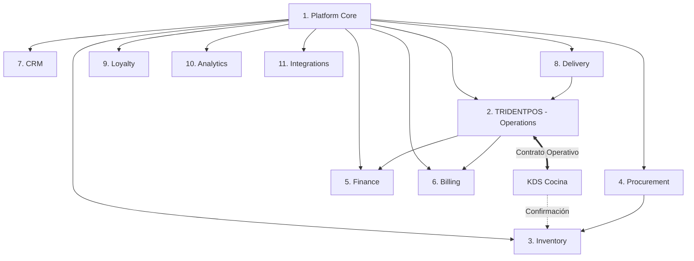
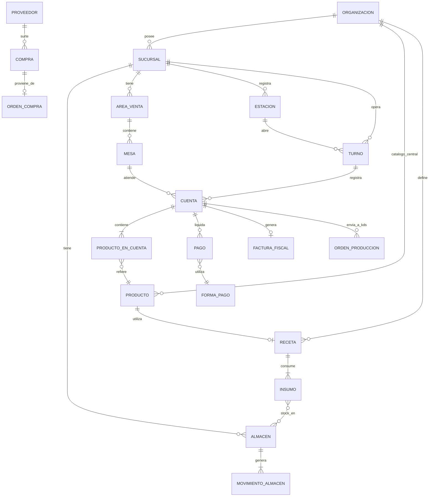

# RESTAURANT_SOFTWARE_RECONSTRUCTION_SPEC.md

**Versión:** 1.1 (NORMALIZED) — 2026-08-31  
**Baseline Histórica Inmutable:** [`RESTAURANT_SOFTWARE_RECONSTRUCTION_SPEC_v1.0_BASELINE.md`](file:///Volumes/SSD_ORICO/BRAIN/TRIDENTPOSREST/RESTAURANT_SOFTWARE_RECONSTRUCTION_SPEC_v1.0_BASELINE.md) (Versión 1.0 Original).

---

## Metadatos y Fuentes del Análisis

**Fuentes Documentales:**
1. *Manual de Usuario Soft Restaurant® 11 (v1.1)*, National Soft de México SAPI de C.V. — 228 páginas — **fuente primaria**, analizada íntegramente (secciones 1-54).
2. `SR12-Manual-Recall-KDS.pdf` (National Soft, SR12, 7 páginas) — leído íntegramente, complementa KDS (sección 18).
3. `DES.MNL.SR11.Delivery_Hub.v.1.1.pdf` (National Soft, SR11, 36 páginas) — leído íntegramente, complementa Delivery de terceros (secciones 31 y 46).
4. `SR-Cloud-Manual-Usuario-Web.pdf` (National Soft, "Soft Restaurant Cloud" v.1.2.0, 89 páginas) — leído íntegramente, referencia de arquitectura funcional multi-sucursal (sección 55).

**Método de Reconstrucción y Normalización:**  
Ingeniería inversa funcional a partir de la documentación oficial de usuario. Todo el contenido documental fue extraído y categorizado preservando estrictamente la evidencia fáctica de los manuales. En esta versión 1.1 NORMALIZED se formalizan las decisiones de producto para la suite **`ERP RESTAURANTES`**, manteniendo una separación explícita entre la evidencia documental y las definiciones de diseño de la nueva plataforma.

---

## Marco Conceptual de la Versión 1.1 NORMALIZED

### 1. Dirección Estratégica del Producto: `ERP RESTAURANTES`
El sistema se define formalmente como **`ERP RESTAURANTES`**, una plataforma integral de gestión empresarial especializada para la industria gastronómica, diseñada para operar tanto en establecimientos individuales como en cadenas y franquicias multi-sucursal con administración centralizada.

### 2. TRIDENTPOS como Vertical Operativa
El componente **`TRIDENTPOS`** se establece como la vertical especializada de **`Restaurant Operations / POS`**, cubriendo la ejecución operativa de piso, comedor, mostrador, servicio móvil (comandero) y cocina (KDS).

### 3. Principio Rector: `MODULAR BY DESIGN — INTEGRATED BY CONTRACT`
La suite se estructura bajo una arquitectura funcional desacoplada donde cada dominio expone contratos funcionales claros para intercambio de eventos e información:
- **Full-Suite (ERP Completo):** Todos los módulos operan nativamente dentro del ecosistema intercambiando eventos en tiempo real.
- **Standalone:** Cada módulo clave (ej. TRIDENTPOS, Inventory, Billing) puede desplegarse y operar de forma autónoma e independiente.
- **Módulos Internos Opcionales:** Una organización puede seleccionar y activar únicamente los módulos pertinentes a su modelo de negocio (ej. POS + KDS + Inventario sin requerir Delivery o Facturación).
- **Integrado con ERP / POS Externo:** Los módulos pueden integrarse con sistemas de terceros mediante contratos funcionales (ej. TRIDENTPOS alimentando un ERP corporativo externo como SAP u Odoo, o Inventory recibiendo consumos de un POS de terceros).

### 4. Estructura de Separación Dual
A lo largo de este documento se aplica de forma estricta la diferenciación:
- **SOURCE EVIDENCE:** Hechos y reglas obtenidos directamente de los manuales originales, clasificados según:
  - `[CONFIRMADO]` — Explícitamente afirmado o mostrado en texto/pantallas.
  - `[INFERIDO]` — Deducido lógicamente de los flujos sin ambigüedad.
  - `[DESCONOCIDO]` — Sin evidencia suficiente en la documentación analizada.
- **NEW PRODUCT DECISIONS:** Decisiones funcionales adoptadas para la construcción de `ERP RESTAURANTES`.

---

## Índice General

1. Objetivo Principal
2. Reglas Críticas y Principios Arquitectónicos
3. Contexto de Negocio y Jerarquía Organizacional
4. System Overview
5. Catálogo Modular Preliminar de ERP RESTAURANTES e Inventario Reconstruido
6. Modelo Operativo del Restaurante
7. Roles y Usuarios
8. Matriz de Permisos
9. POS / TRIDENTPOS (Punto de Venta)
10. Mesas y Áreas
11. Comandas y Cuentas
12. Productos y Menú
13. Modificadores
14. Recetas y Rendimientos
15. Inventarios y Almacenes
16. Mermas y Desperdicios
17. Compras y Abastecimiento
18. KDS / Cocina (Monitor de Producción)
19. Tiempos de Preparación y SLA
20. Pagos y Formas de Pago
21. División de Cuentas
22. Propinas
23. Caja y Turnos
24. Cortes de Caja (X / Z)
25. Cancelaciones y Anulaciones
26. Descuentos, Cortesías y Promociones
27. Impuestos y Esquemas Compuestos
28. Facturación Fiscal
29. Clientes y CRM
30. Lealtad y Fidelización
31. Delivery y Canales Digitales
32. Reservaciones
33. Sucursales (Branches)
34. Multiempresa y Multitenancy
35. Catálogo de Pantallas Reconstruidas
36. Catálogo de Funcionalidades Reconstruidas
37. Entidades de Dominio
38. Modelo ER Conceptual
39. Workflows Operativos
40. Máquinas de Estado
41. Reglas de Negocio Normalizadas
42. Eventos de Dominio y Contratos Funcionales
43. Operaciones de Contrato Funcional
44. Reportes y Analítica
45. Auditoría y Trazabilidad
46. Hub de Integraciones
47. Hardware Soportado
48. Requisitos No Funcionales
49. Open Questions (Matriz de Decisiones)
50. Confianza de Reconstrucción y Readiness de Definición
51. MVP Scope Normalizado (P0 a P3)
52. Implementation Readiness
53. Matriz de Trazabilidad
54. Nota de Cierre
55. Addendum: Análisis de Manuales Especializados

---

# 1. OBJETIVO PRINCIPAL

Este documento normaliza la reconstrucción funcional completa de **Soft Restaurant® 11** y sus extensiones oficiales, consolidándola como la especificación funcional y base de requerimientos de **`ERP RESTAURANTES`** y su vertical operativa **`TRIDENTPOS`**. 

El documento establece **qué hace el sistema y cómo opera el negocio**, manteniendo un estricto desacoplamiento de código, scripts SQL, frameworks web o detalles de infraestructura técnica.

---

# 2. REGLAS CRÍTICAS Y PRINCIPIOS ARQUITECTÓNICOS

1. **Integridad de Evidencia:** Toda afirmación proveniente de manuales conserva su etiqueta `[CONFIRMADO]`, `[INFERIDO]` o `[DESCONOCIDO]`.
2. **Registro Explícito de Decisiones:** Cualquier vacío del software original que cuente con resolución en el nuevo producto se desglosa en `SOURCE EVIDENCE` vs. `NEW PRODUCT DECISIONS`.
3. **Modularidad por Diseño (`MODULAR BY DESIGN — INTEGRATED BY CONTRACT`):** Arquitectura funcional basada en fronteras de dominio cohesivas y contratos de integración explícitos.
4. **Despliegue Flexible:** Soporte operativo para modos Full-Suite, Standalone, Módulos opcionales o Integrado con sistemas externos.
5. **Aislamiento Funcional:** No se diseñan APIs técnicas, esquemas SQL ni infraestructura de servidores; se especifican procesos de negocio, entidades y contratos de eventos.

---

# 3. CONTEXTO DE NEGOCIO Y JERARQUÍA ORGANIZACIONAL

### SOURCE EVIDENCE
`[CONFIRMADO]` El sistema fuente soporta múltiples formatos de servicio:
- **Comedor:** Mesas, áreas físicas y atención por meseros.
- **Servicio Rápido / Mostrador:** Venta directa en caja sin mesa (Consumir aquí, Para llevar, Drive Thru).
- **Servicio a Domicilio:** Reparto propio con zonas, colonias y control de repartidores.
- **Entretenimiento / Servicios por Tiempo:** Renta de mesas de billar y pista de patinaje por tiempo.
- **Comedor de Empleados:** Alimentación de personal con menús programados por día.
- **Enlace Hotelero:** Cargo de consumo a habitación de hotel (PMS).

**Jerarquía Original Reconstruida (SR11):**
```text
Empresa (Razón social + dirección fiscal, 1 licencia = 1 base de datos)
  └── Sucursal (Atributo opcional de dirección fiscal)
       └── Servidor (1 único servidor central LAN por instalación)
            └── Estaciones (Cajas / Comanderos / POS)
                 └── Turnos
                      └── Cuentas / Comandas
```
`[INFERIDO]` En el manual base de SR11 no existía sincronización multi-sucursal en la nube; operaba bajo un modelo mono-servidor local.

### NEW PRODUCT DECISIONS
Para **`ERP RESTAURANTES`**, se adopta una jerarquía fundacional multi-sucursal nativa:
```text
Organización (Tenant / Grupo Empresarial)
  ├── Catálogo Central (Productos, Menús, Recetas, Impuestos, Modificadores)
  └── Sucursal (Branch / Establecimiento Operativo)
       ├── Overrides de Sucursal (Precios, Disponibilidad, Esquemas Fiscales locales)
       ├── Almacenes Locales (Bodegas y Centros de Consumo)
       ├── Áreas de Venta y Mesas (Comedor, Terraza, Barra, Mostrador)
       ├── Estaciones Operativas (Cajas, Comanderos Móviles, Kioskos)
       │    └── Turnos y Cortes de Caja
       └── KDS / Cocina (Pantallas de Producción en LAN Local)
```

---

# 4. SYSTEM OVERVIEW

### Propósito del Sistema
`ERP RESTAURANTES` es una solución integral modular para la administración, control operativo de piso, abastecimiento, costeo de recetas, facturación electrónica y analítica de negocios gastronómicos.

### Componentes Clave
1. **Backoffice Administrativo & ERP:** Administración centralizada multi-sucursal, compras, inventarios, costos, cuentas por pagar/cobrar, CRM, facturación y reportes consolidados.
2. **TRIDENTPOS (Restaurant Operations):** Front-end operacional de punto de venta en piso, mostrador, servicio a domicilio y comandero móvil.
3. **KDS (Kitchen Display System):** Monitores de producción en cocina integrados en tiempo real para secuenciación de órdenes y confirmación de preparación.

---

# 5. CATÁLOGO MODULAR PRELIMINAR DE ERP RESTAURANTES E INVENTARIO RECONSTRUIDO

La plataforma `ERP RESTAURANTES` se estructura en 11 módulos preliminares bajo el principio `MODULAR BY DESIGN — INTEGRATED BY CONTRACT`:



### Definición de Módulos Preliminares

1. **Platform Core:** Organización, sucursales (branches), estaciones operativas, usuarios, roles, perfiles de seguridad, auditoría central y configuración global.
2. **TRIDENTPOS (Restaurant Operations / POS):** Servicio Comedor, Servicio Rápido (mostrador, para llevar, drive-thru), Comandero móvil, diseñador gráfico de mapas de mesas, **KDS / Monitor de Cocina** y gestión de turnos/caja de estación.
3. **Inventory (Almacén e Inventarios):** Multi-almacén (Bodegas de presentaciones y Centros de consumo de insumos), catálogo de insumos, factores de rendimiento, recetas de productos, insumos elaborados (subrecetas), mermas, desperdicios, traspasos entre almacenes, inventario físico e inventario diferido/pendiente.
4. **Procurement (Abastecimiento y Compras):** Pedidos internos de reposición, generador automático de pedidos por historial, órdenes de compra de un solo uso, recepción y aplicación de compras, afectación de existencias y generación de pasivos con proveedores.
5. **Finance (Cuentas y Finanzas Operativas):** Cuentas por pagar (proveedores), cuentas por cobrar (crédito a clientes), gastos operativos, movimientos de caja (retiros, depósitos, salvaguardas), cortes de caja X y Z consolidados, comisiones de agentes y pólizas contables.
6. **Billing (Facturación e Impuestos):** Motor de impuestos compuestos (IVA, IEPS, retenciones, esquemas internacionales), timbrado fiscal electrónico (CFDI y comprobantes internacionales), modalidades de facturación (individual, global, dividida, por lote de folios) y cancelaciones fiscales.
7. **CRM (Clientes y Contactos):** Catálogo unificado de clientes, libreta de direcciones múltiples (zonas/colonias para delivery), historial consolidado de consumo y cuentas corporativas / comedores de empleados.
8. **Delivery (Servicio a Domicilio y Canales Digitales):** Despacho y seguimiento de repartidores propios (en preparación, enviado, entregado), Delivery Hub para ingesta de pedidos de plataformas externas (Uber Eats, Rappi, Didi Food) y canales propios de venta en línea.
9. **Loyalty (Lealtad y Fidelización):** Programas de puntos por compra, monedero electrónico de saldo pre-pago, tarjetas de regalo, cortesías y cupones de descuento.
10. **Analytics (Reportes e Inteligencia de Negocio):** Reportes operacionales en tiempo real, analítica consolidada cross-branch, auditoría de cancelaciones y descuentos, tiempos de producción en cocina y márgenes de rentabilidad.
11. **Integrations (Hub de Integraciones):** Conectores formales para sistemas hoteleros (PMS / NS Hoteles), agregadores de delivery (Ordatic, Deliverect), terminales bancarias / PinPADs, recargas electrónicas (TAE) y enlaces contables.

### Modos de Operación de Cada Módulo
- **Full-Suite:** Integrado en el ERP completo intercambiando eventos de dominio en tiempo real.
- **Standalone:** Desplegable de forma autónoma con interfaces mínimas de configuración.
- **Módulos Opcionales:** Activación o desactivación selectiva por organización o sucursal.
- **Integración Externa:** Conectable mediante contratos funcionales a ERPs o POS externos.

---

## Mapeo del Inventario Funcional Reconstruido (SR11) al Catálogo Modular

| ID Original | Módulo Reconstruido de SR11 | Módulo Asignado en ERP RESTAURANTES | Estado Reconstrucción |
|---|---|---|---|
| MOD-01 | Punto de Venta (Servicio Comedor) | TRIDENTPOS (Operations) | CONFIRMADO |
| MOD-02 | Servicio a Domicilio | Delivery / TRIDENTPOS | CONFIRMADO |
| MOD-03 | Servicio Rápido | TRIDENTPOS (Operations) | CONFIRMADO |
| MOD-04 | Comandero Móvil | TRIDENTPOS (Operations) | CONFIRMADO |
| MOD-05 | Mesas de Juegos (Billar) | TRIDENTPOS (Vertical Entretenimiento) | CONFIRMADO |
| MOD-06 | Pista de Patinaje | TRIDENTPOS (Vertical Entretenimiento) | CONFIRMADO |
| MOD-07 | Comedor de Empleados | CRM / TRIDENTPOS | CONFIRMADO |
| MOD-08 | Caja / Turnos | TRIDENTPOS / Finance | CONFIRMADO |
| MOD-09 | Facturación (Fiscal) | Billing | CONFIRMADO |
| MOD-10 | Cuentas por Cobrar | Finance / CRM | CONFIRMADO |
| MOD-11 | Cuentas por Pagar | Finance / Procurement | CONFIRMADO |
| MOD-12 | Gastos Operativos | Finance | CONFIRMADO |
| MOD-13 | Comisiones de Agentes | Finance | CONFIRMADO |
| MOD-14 | Cortesías y Beneficios | Loyalty | CONFIRMADO |
| MOD-15 | Catálogos Base | Platform Core | CONFIRMADO |
| MOD-16 | Almacén / Inventarios | Inventory | CONFIRMADO |
| MOD-17 | Pedidos / Compras | Procurement | CONFIRMADO |
| MOD-18 | Producción Insumos Elaborados | Inventory | CONFIRMADO |
| MOD-19 | Desperdicios / Mermas | Inventory | CONFIRMADO |
| MOD-20 | Costos y Recetas | Inventory / Analytics | CONFIRMADO |
| MOD-21 | Monedero Electrónico | Loyalty | CONFIRMADO |
| MOD-22 | Mapa Gráfico de Mesas | TRIDENTPOS | CONFIRMADO |
| MOD-23 | Reservaciones | TRIDENTPOS / CRM | CONFIRMADO (Catálogo) |
| MOD-24 | Seguridad / Perfiles / Usuarios | Platform Core | CONFIRMADO |
| MOD-25 | Reportes | Analytics | CONFIRMADO |
| MOD-26 | Consultas en Tiempo Real | Analytics / TRIDENTPOS | CONFIRMADO |
| MOD-27 | Contabilidad Básica | Finance | CONFIRMADO |
| MOD-28 | Mantenimiento y Respaldos | Platform Core | CONFIRMADO |
| MOD-29 | Enlace Hotelero (PMS) | Integrations | CONFIRMADO |
| MOD-30 | Recargas Telefónicas (TAE) | Integrations | CONFIRMADO |
| MOD-31 | Impresora Fiscal | Billing / Hardware | CONFIRMADO |
| MOD-32 | Terminal Bancaria Integrada | Integrations / TRIDENTPOS | CONFIRMADO |
| MOD-33 | e-Delivery / Apps Terceros | Delivery | CONFIRMADO |
| MOD-34 | Idiomas | Platform Core | CONFIRMADO |
| MOD-35 | Asistencia y Biometría | Platform Core | CONFIRMADO |
| MOD-36 | Monitor de Producción / KDS | TRIDENTPOS (Core Operativo) | CONFIRMADO |

---

# 6. MODELO OPERATIVO DEL RESTAURANTE

```text
Organización / Sucursal
   ↓
Estación Operativa (Caja, Comandero, Mostrador)
   ↓
Turno de Caja (Apertura con Fondo Inicial)
   ↓
Asignación de Mesero / Repartidor
   ↓
Mesa (Comedor) | Mostrador (Rápido) | Cliente + Repartidor (Domicilio)
   ↓
Cuenta Abierta (Captura de ítems, modificadores, comentarios)
   ↓
Disparo a Cocina (Enrutamiento por área a Impresora o KDS vía LAN)
   ↓
Confirmación en KDS (Cocina surte orden → Evento de confirmación)
   ↓ [Disparador Funcional del Consumo]
Descuento de Inventario por Receta (Salida de insumos en Centro de Consumo)
   ↓
Impresión de Precuenta (Asignación de Folio consecutivo)
   ↓
Cobro de Cuenta (Efectivo, Tarjeta, Mixto, Puntos, Crédito) + Propina
   ↓
Cierre de Cuenta (Liberación de mesa, afectación de saldos de caja)
   ↓
Corte X (Parcial de turno) / Corte Z (Cierre diario consolidado)
```

---

# 7. ROLES Y USUARIOS

`[CONFIRMADO]` El sistema opera con perfiles de seguridad configurables por acción:
- **ROLE-001 — Administrador:** Configuración completa del sistema, gestión de perfiles y usuarios, mantenimiento de catálogos y único rol obligatorio.
- **ROLE-002 — Gerente / Supervisor:** Autorización de eventos de seguridad (descuentos, cancelaciones, reaperturas, reimpresiones de cortes pasados).
- **ROLE-003 — Cajero:** Apertura/cierre de turnos de caja, cobro de cuentas, retiros/depósitos, cortes de caja y liquidación de repartidores.
- **ROLE-004 — Mesero:** Apertura de mesas, captura de comandas, envío a cocina, consulta de ventas individuales e impresión de cuentas autorizadas.
- **ROLE-005 — Mesero-Capitán:** Mesero con permisos adicionales para supervisar comandas y cobrar en piso.
- **ROLE-006 — Repartidor:** Despacho, transporte y entrega de pedidos a domicilio.
- **ROLE-007 — Almacenista:** Recepción de compras, traspasos, conteos de inventario físico y mermas.
- **ROLE-008 — Personal de Cocina / KDS:** Operador de monitores de producción, preparación y confirmación de despacho de comandas.
- **ROLE-009 — Comisionista (Externo):** Entidad externa para liquidación de comisiones por atracción de clientes.

---

# 8. MATRIZ DE PERMISOS

`[CONFIRMADO]` Distribución de operaciones sensibles por perfil de seguridad:

| Acción Operativa | Mesero | Cajero | Gerente | Administrador |
|---|---|---|---|---|
| Abrir mesa / cuenta | SÍ | SÍ | SÍ | SÍ |
| Capturar productos | SÍ | SÍ | SÍ | SÍ |
| Cancelar producto antes de cocina | Requiere motivo | SÍ | SÍ | SÍ |
| Cancelar producto post-cocina | **OPEN / SIN RESOLVER** | **OPEN / SIN RESOLVER** | **OPEN / SIN RESOLVER** | **OPEN / SIN RESOLVER** |
| Aplicar descuento general o por producto | Requiere permiso | Configurable | SÍ | SÍ |
| Reabrir cuenta impresa | Configurable | Configurable | SÍ | SÍ |
| Ejecutar Corte X | — | SÍ (Su turno) | SÍ | SÍ |
| Ejecutar Corte Z | — | Configurable | SÍ | SÍ |
| Imprimir corte de fechas pasadas | NO | NO | NO | SÍ (Obligatorio Admin) |
| Abrir cajón de dinero manual | Requiere auth | SÍ | SÍ | SÍ |
| Pagar cuenta desde Comandero móvil | Configurable | — | SÍ | SÍ |

---

# 9. POS / TRIDENTPOS (PUNTO DE VENTA)

`[CONFIRMADO]` Integra los flujos de Comedor, Mostrador/Rápido, Domicilio y Comandero móvil compartiendo la misma lógica de negocio:
- **Apertura de Mesa/Cuenta:** Validación de disponibilidad de mesa, captura de comensales y asignación de cliente opcional.
- **Captura:** Selección de productos, paquetes o compuestos, asignación de modificadores obligatorios e instrucciones de preparación.
- **Enrutamiento Operativo:** Envío de comanda a impresora física o estación KDS correspondiente.
- **Operaciones de Mesa:** Traspaso de productos entre mesas, cambio de mesero, división de cuenta (hasta 3 cuentas o partes iguales) y unión de cuentas.
- **Cobro:** Liquidación simple o combinada (split payment) con captura de propina y generación de comprobante.

---

# 10. MESAS Y ÁREAS

`[CONFIRMADO]`
- **Áreas de Venta:** Segmentación física (Comedor, Terraza, Barra, Salón Privado) asociadas a tipos de servicio.
- **Tipos de Mesa:** Redonda, Cuadrada, Individual, con capacidad máxima de comensales.
- **Mapa de Mesas:** Diseñador gráfico con disposición de mesas, muros, divisiones y objetos de referencia visual.
- **Estados de Mesa:** `Libre` (Verde), `Ocupada/Abierta` (Rojo/Negro), `Pendiente de Pago/Impresa` (Rojo destacado) y `Liberada` al liquidar todas las cuentas activas.

---

# 11. COMANDAS Y CUENTAS

`[CONFIRMADO]`
- **Identificadores:** Número de Cuenta (identificador operativo de piso), Número de Orden (secuencial de turno) y **Folio de Venta** (asignado **únicamente al imprimir la precuenta**, no al abrirla).
- **Ciclo de Vida de Cuenta:**
  ```text
  [Abierta] ──(Imprimir)──> [Pendiente por Pagar] ──(Pagar)──> [Pagada / Cerrada]
      │                              │
      └──(Borrar si vacía)           ├──(Reabrir)──> [Abierta]
                                     └──(Cancelar Folio)──> [Cancelada]
  ```

---

# 12. PRODUCTOS Y MENÚ

`[CONFIRMADO en origen / NORMALIZADO con Overrides]`
- **Jerarquía:** Grupo de Productos → (Opcional) Subgrupo → Producto.
- **Tipologías:**
  - **Simple:** Producto directo con o sin receta.
  - **Paquete:** Conjunto de productos fijos (mutuamente excluyente con compuesto).
  - **Compuesto:** Producto base con grupos de modificadores asociados.
- **Catálogo Central con Overrides:** Los productos se definen a nivel de Organización y se activan por Sucursal con posibilidad de modificar precio de venta, esquema de impuestos y estado de visibilidad local.

---

# 13. MODIFICADORES

`[CONFIRMADO]`
- **Grupos de Modificadores:** Catálogo reutilizable (ej. Término de Carne, Salsas, Guarniciones).
- **Reglas de Inclusión:** Parámetro "Modificadores Incluidos" por grupo dentro del producto compuesto.
- **Excedentes:** Las selecciones que superen los modificadores incluidos se tarifan automáticamente.
- **Captura Forzosa:** Bloqueo de avance en comanda si no se completan los modificadores requeridos.

---

# 14. RECETAS Y RENDIMIENTOS

### SOURCE EVIDENCE
`[CONFIRMADO]` Recetas de productos e insumos elaborados (subrecetas) con unidades de medida, factores de rendimiento y mermas configuradas en insumos.  
`[DESCONOCIDO]` El momento exacto del descuento de inventario en el manual de SR11 solo se describía como "al vender" sin especificar el evento técnico disparador.

### NEW PRODUCT DECISIONS
En **`ERP RESTAURANTES`**, el disparador funcional formal del consumo y descuento de inventario por receta es la **confirmación de la orden de producción en cocina (KDS)** al surtir la comanda.

---

# 15. INVENTARIOS Y ALMACENES

`[CONFIRMADO]`
- **Tipologías de Almacén:**
  - **Bodega:** Almacenamiento en presentaciones de compra (cajas, bidones, sacos).
  - **Centro de Consumo:** Almacén operativo de piso/cocina en unidades base de insumo.
- **Traspasos:** Movimiento entre almacenes con conversión automática por factor de rendimiento.
- **Inventario Diferido (Venta sin Stock):** El sistema permite operar con existencias en negativo, manteniendo un saldo de "Inventario pendiente por descargar" regularizable al registrar compras.
- **Costeo:** Método configurable — Promedio o Promedio de entradas (con salvaguarda ante existencia negativa: se usa el último costo correcto en vez de recalcular).

---

# 16. MERMAS Y DESPERDICIOS

`[CONFIRMADO]`
- **Baja de Productos Terminados:** Registro de desperdicio de producto preparado con descarga de los insumos de su receta.
- **Baja de Insumos / Insumos Elaborados:** Registro de merma directa en almacén con concepto de salida por desperdicio (SPD).
- **Afectación Financiera:** Impacto directo al costo de ventas y reportes de variaciones.

---

# 17. COMPRAS Y ABASTECIMIENTO

`[CONFIRMADO]`
- **Ciclo de Abastecimiento:**
  ```text
  Pedido Interno / Sugerido Automático 
     ──> Aprobación 
     ──> Orden de Compra (Documento de un solo uso, no afecta stock) 
     ──> Recepción de Compra (Afecta stock en almacén) 
     ──> Pago Inmediato o Cuentas por Pagar (Pasivo con Proveedor)
  ```
- **Integraciones de Compra:** Soporte para importación de compras desde sistemas contables (AdminPaq vía archivo de texto).

---

# 18. KDS / COCINA (MONITOR DE PRODUCCIÓN)

### SOURCE EVIDENCE
`[CONFIRMADO]` Interfaz de grilla de 6 órdenes activas con cronómetro, SLA y detalle de productos (`SR12 Recall KDS`).  
`[CONFIRMADO]` Función Recall para recuperar órdenes finalizadas dentro de una ventana de 2 horas para validación visual.  
`[CONFIRMADO]` En la fuente original (SR12 Recall KDS) solo existen los estados operativos implícitos: `Activa` (visible en grilla) → `Finalizada/Servida` (sale de grilla activa, accesible vía Recall durante 2 horas).  
`[DESCONOCIDO]` El protocolo de transporte POS↔KDS y su integración nativa no estaban detallados en el manual base.

### NEW PRODUCT DECISIONS
- **KDS en Core (P0):** El Monitor de Producción forma parte del núcleo operativo fundacional junto al POS.
- **Transporte en Red Local (LAN / WiFi):** La comunicación POS↔KDS opera sobre la red local de la sucursal para garantizar resiliencia ante contingencias de internet.
- **Confirmación Funcional:** La acción de marcar una orden como surtida en KDS emite el evento formal que descuenta el inventario en el Centro de Consumo.
- **Máquina de Estados KDS Propuesta (NEW PRODUCT DECISION / PROPOSED):**
  ```text
  [En Cola / Recibida] ──(Iniciar Preparación)──> [En Preparación] ──(Confirmar / Surtir)──> [Surtida / Finalizada]
                                                                                                  │
                                                                                                  └──(Recall < 2h)──> [Vista Histórica]
  ```

---

# 19. TIEMPOS DE PREPARACIÓN Y SLA

### SOURCE EVIDENCE
`[CONFIRMADO]`
- Tiempos objetivo de preparación y minutos de alerta (SLA) configurables por producto.
- Alertas visuales y cromáticas en monitor ante pedidos con tiempo excedido.
- Reporte "Tiempo de producción" disponible en módulo de Administración (requiere monitor de producción).

### NEW PRODUCT DECISIONS / PROPOSED
- **Analítica de Cocina Propuesta (Analytics):** Métricas de rendimiento de tiempos y monitoreo de demoras por estación de cocina.

---

# 20. PAGOS Y FORMAS DE PAGO

`[CONFIRMADO]`
- **Catálogo de Formas de Pago:** Efectivo, Tarjetas bancarias, Vales de despensa, Moneda extranjera con tipo de cambio, Monedero electrónico, Transferencia bancaria, Cargo a hotel y Crédito a cliente (CxC).
- **Split Payment:** Liquidación de una misma cuenta combinando múltiples formas de pago.
- **Integración Bancaria:** Enlace directo con terminales y PinPADs bancarios para captura automática de vouchers y conciliación en caja.

---

# 21. DIVISIÓN DE CUENTAS

`[CONFIRMADO]`
- **División por Ítems:** Selección y transferencia de productos a hasta 3 cuentas secundarias independientes.
- **División en Partes Iguales:** Prorrateo del importe total entre N comensales con ajuste editable de montos.

---

# 22. PROPINAS

`[CONFIRMADO]`
- Configuración de propina sugerida general o diferenciada por grupo de productos.
- Base de cálculo configurable sobre subtotal sin impuestos o total con impuestos.
- Liquidación de propinas a meseros en cortes de caja, con retención opcional de comisión por pago con tarjeta.

---

# 23. CAJA Y TURNOS

`[CONFIRMADO]`
- Apertura de turno con captura de fondo inicial de caja y conteo de denominaciones.
- Registro de movimientos de efectivo: Retiros, Depósitos y Salvaguardas programadas de caja.
- Cierre de turno con arqueo a ciegas (declaración física vs. saldo teórico del sistema) y cálculo automático de diferencias.

---

# 24. CORTES DE CAJA (X / Z)

`[CONFIRMADO]`
- **Corte X:** Corte parcial por estación o turno en cualquier momento del día operativo.
- **Corte Z:** Corte de cierre diario que consolida todas las cajas, turnos y estaciones de la sucursal.
- **Estructura del Corte:** Desglose de folios, ventas brutas/netas, impuestos, propinas, descuentos, cancelaciones, formas de pago, ventas por plataforma de delivery y desglose fiscal.

---

# 25. CANCELACIONES Y ANULACIONES

### SOURCE EVIDENCE
`[CONFIRMADO]` Cancelación de producto individual con captura obligatoria de motivo del catálogo (CANCEL-001).  
`[CONFIRMADO]` Cancelación total de folio (CANCEL-002), borrado de cuentas vacías (CANCEL-003) y cancelación de facturas (CANCEL-005).  
`[DESCONOCIDO]` El manual original no definía una política de permisos diferenciada para cancelar un producto antes o después de ser enviado/elaborado en cocina.

### NEW PRODUCT DECISIONS
- **Política Post-Cocina:** **`ABIERTA / PENDIENTE DE DECISIÓN DE NEGOCIO`**. Se mantiene completamente abierta la definición de política empresarial sobre la autorización de cancelaciones post-cocina (si exige clave gerencial obligatoria, si genera merma automática y cómo interactúa con el inventario ya descontado por KDS).

---

# 26. DESCUENTOS, CORTESÍAS Y PROMOCIONES

`[CONFIRMADO / NORMALIZADO]`
- **Descuentos:** Porcentaje o importe fijo/abierto aplicable a producto individual o cuenta completa.
- **Promociones Automáticas:** Reglas por horario, días de la semana y esquemas de volumen (2x1, combos, precios especiales).
- **Cortesías:** Aplicación de 100% de descuento ligada a motivos autorizados o programas de fidelización.

---

# 27. IMPUESTOS Y ESQUEMAS COMPUESTOS

`[CONFIRMADO / NORMALIZADO]`
- Motor de impuestos multi-nivel que soporta esquemas de impuestos directos (IVA), adicionales (IEPS), retenciones (ISR, IVA retenido) e impuestos internacionales.
- Cálculo de impuestos en cascada (base imponible simple o acumulada).
- Asignación de esquemas de impuestos por producto con overrides por sucursal.

---

# 28. FACTURACIÓN FISCAL

### SOURCE EVIDENCE
`[CONFIRMADO]`
- Emisión de comprobantes fiscales digitales (CFDI México y comprobantes internacionales).
- Modalidades confirmadas en fuente: Facturación normal de folio(s), facturación rápida de 1 folio, división de 1 folio en varias facturas, y facturación por lote de folios pendientes.
- Monitoreo y control de timbres fiscales por sucursal.

### NEW PRODUCT DECISIONS / PROPOSED
- **Portal de Autofacturación para Clientes (PROPOSED):** Portal web de autofacturación asistida para que los comensales generen su comprobante fiscal a partir de su ticket de consumo.

---

# 29. CLIENTES Y CRM

### SOURCE EVIDENCE
`[CONFIRMADO]`
- Directorio de clientes con datos fiscales, hasta 5 teléfonos y libreta de direcciones para entrega a domicilio (asociadas a colonias y zonas).
- Consulta de últimos pedidos del cliente en Servicio a Domicilio.
- Cuentas para empleados en Comedor de Empleados.

### NEW PRODUCT DECISIONS / NORMALIZED
- **Historial Unificado Cross-Branch (NEW PRODUCT DECISION / NORMALIZED):** Historial consolidado de pedidos y consumos del cliente a través de todas las sucursales de la organización.
- **Gestión Corporativa:** Cuentas corporativas y convenios empresariales unificados.

---

# 30. LEALTAD Y FIDELIZACIÓN

`[CONFIRMADO]`
- Acumulación de puntos por importe o por producto comprado.
- Tarjetas de saldo pre-pago y monedero electrónico.
- Redención de puntos o saldo directamente en la pantalla de cobro de TRIDENTPOS.

---

# 31. DELIVERY Y CANALES DIGITALES

`[CONFIRMADO]`
- **Canal Propio:** Módulo de asignación de repartidores, despacho, control de tiempos de entrega y liquidación de efectivo.
- **Delivery Hub:** Ingesta de pedidos de agregadores externos (Uber Eats, Rappi, Didi Food) y agregadores (Ordatic, Deliverect).
- **Aterrizaje en POS:** Los pedidos externos ingresan al flujo de mostrador/cuentas en espera para validación y despacho a cocina.
- **Conciliación:** Separación de ventas por plataforma en el Corte Z diario.

---

# 32. RESERVACIONES

`[CONFIRMADO (Catálogo) / NORMALIZADO]`
- Catálogo de tipos de reservación con descuento asociado y opción de solicitar comisionista.
- Asociación de reservaciones a mesas y cuentas abiertas en Servicio Comedor.

---

# 33. SUCURSALES (BRANCHES)

`[NORMALIZADO en ERP RESTAURANTES]`
Cada sucursal opera como una entidad operativa que gestiona:
- Áreas de venta y layout de mesas propios.
- Almacenes locales y centros de consumo.
- Estaciones de cobro, comandero y KDS.
- Asignación de listas de precios y esquemas fiscales específicos.

---

# 34. MULTIEMPRESA Y MULTITENANCY

### SOURCE EVIDENCE
`[DESCONOCIDO / Tensión]` Manual base de SR11 operaba mono-servidor LAN con catálogo de Empresa pero sin sincronización multi-sucursal en la nube.

### NEW PRODUCT DECISIONS
`ERP RESTAURANTES` implementa un modelo multi-sucursal nativo con aislamiento por Organización (Tenant) y federación de sucursales, permitiendo analítica consolidada y gobierno centralizado de catálogos con overrides locales.

---

# 35. CATÁLOGO DE PANTALLAS RECONSTRUIDAS

`[CONFIRMADO en origen]`
- `SCREEN-001`: Configuración General de Sucursal y Sistema.
- `SCREEN-002`: Servicio Comedor (Punto de Venta principal con mapa y cuentas).
- `SCREEN-003`: Servicio a Domicilio y Despacho.
- `SCREEN-004`: Servicio Rápido / Mostrador.
- `SCREEN-005`: Despacho y Asignación de Repartidores.
- `SCREEN-006`: Comandero Móvil para Meseros.
- `SCREEN-007`: Control de Caja, Turnos y Movimientos de Efectivo.
- `SCREEN-008`: Catálogo Maestro de Productos, Menús y Recetas.
- `SCREEN-009`: Diseñador Gráfico de Mapa de Mesas.
- `SCREEN-010`: Perfiles y Permisos de Seguridad.
- `SCREEN-011`: Gestión de Usuarios y Credenciales.
- `SCREEN-012`: Órdenes de Compra y Recepción de Mercancía.
- `SCREEN-013`: Monitor de Producción en Cocina (KDS).

---

# 36. CATÁLOGO DE FUNCIONALIDADES

### 36.1 — Funcionalidades Reconstruidas (SOURCE EVIDENCE)
- `FUNC-001`: Apertura de cuenta en mesa con control de comensales. `[CONFIRMADO]`
- `FUNC-002`: Captura y modificación de comanda con modificadores obligatorios. `[CONFIRMADO]`
- `FUNC-003`: Enrutamiento y despacho de comanda a impresoras / áreas de preparación. `[CONFIRMADO]`
- `FUNC-006`: Impresión de precuenta con asignación de Folio definitivo. `[CONFIRMADO]`
- `FUNC-007`: Cobro de cuenta con soporte de pagos mixtos y propinas. `[CONFIRMADO]`
- `FUNC-008`: División de cuenta por productos o en partes iguales. `[CONFIRMADO]`
- `FUNC-009`: Unión y transferencia de cuentas entre mesas o meseros. `[CONFIRMADO]`
- `FUNC-010`: Cancelación de productos y folios con captura de motivo obligatorio. `[CONFIRMADO]`
- `FUNC-011`: Apertura y cierre de turnos de caja con arqueo ciego. `[CONFIRMADO]`
- `FUNC-012`: Emisión de Cortes de Caja X y Z. `[CONFIRMADO]`
- `FUNC-013`: Generación automática de pedidos de compra por stock mínimo e histórico. `[CONFIRMADO]`
- `FUNC-014`: Recepción de compras y afectación de existencias y costos. `[CONFIRMADO]`
- `FUNC-015`: Traspaso de insumos entre bodegas y centros de consumo con conversión de rendimiento. `[CONFIRMADO]`
- `FUNC-016`: Emisión y timbrado de facturas electrónicas (individual, lote, dividida). `[CONFIRMADO]`
- `FUNC-017`: Acumulación y canje de puntos de lealtad y saldo de monedero (RestCard). `[CONFIRMADO]`
- `FUNC-018`: Recuperación (Recall) de órdenes terminadas en KDS (ventana de 2h). `[CONFIRMADO]`

### 36.2 — Funcionalidades Definidas para el Producto Nuevo (NEW PRODUCT DECISIONS)
- `FUNC-NP-001 (Confirmación KDS)`: Confirmación de preparación y despacho de orden en KDS como hito operacional formal. `[NEW PRODUCT DECISION]`
- `FUNC-NP-002 (Consumo de Inventario por KDS)`: Descuento automático de existencias de insumos por receta disparado por el evento de confirmación en KDS. `[NEW PRODUCT DECISION]`
- `FUNC-NP-003 (Overrides de Catálogo por Sucursal)`: Activación y parametrización de precios, visibilidad e impuestos específicos por sucursal desde el catálogo central. `[NEW PRODUCT DECISION / NORMALIZED]`

---

# 37. ENTIDADES DE DOMINIO

`Organización, Sucursal, Estación, Usuario, PerfilSeguridad, Turno, Mesero, Repartidor, Comisionista, Cliente, DirecciónCliente, ZonaDelivery, ÁreaVenta, Mesa, TipoMesa, MapaMesas, Cuenta, OrdenProducción, ProductoEnCuenta, Producto, Menú, GrupoProducto, SubgrupoProducto, GrupoModificador, Modificador, Receta, Insumo, InsumoElaborado, PresentaciónCompra, UnidadMedida, Almacén, MovimientoAlmacén, Merma, Proveedor, PedidoAbastecimiento, OrdenCompra, Compra, CuentaPorPagar, CuentaPorCobrar, Gasto, FormaPago, Pago, Descuento, Promoción, Cortesía, TarjetaLealtad, FacturaFiscal, FolioVenta, PólizaContable.`

---

# 38. MODELO ER CONCEPTUAL



---

# 39. WORKFLOWS OPERATIVOS

- **FLOW-001 (Apertura Operativa):** Inicio de estación → Autenticación de usuario → Apertura de Turno con Fondo Inicial.
- **FLOW-002 (Ciclo Completo de Venta en Mesa):** Apertura de mesa → Captura de productos → Enrutamiento a KDS/Cocina → Preparación y Confirmación KDS → Descuento de Insumos → Impresión de Precuenta (Folio) → Cobro Mixto → Cierre de Cuenta → Mesa Libre.
- **FLOW-003 (Ciclo de Abastecimiento):** Cálculo de necesidad de stock → Pedido interno → Orden de Compra → Recepción de Compra física → Entrada a Almacén → Registro de Pasivo en Cuentas por Pagar.
- **FLOW-004 (Cierre Diario):** Cierre individual de turnos de caja con arqueo → Emisión de Cortes X → Generación de Corte Z consolidado de sucursal → Exportación de póliza contable.
- **FLOW-005 (Delivery y Reparto):** Recepción de pedido (teléfono o app) → Captura → Preparación KDS → Asignación a repartidor → Despacho (Enviado) → Retorno de repartidor (Entregado) → Liquidación de efectivo en caja.

---

# 40. MÁQUINAS DE ESTADO

### Estado de la Cuenta
```text
[Abierta] ──(Imprimir Precuenta)──> [Pendiente por Pagar] ──(Pagar)──> [Pagada/Cerrada]
    │                                       │
    └──(Borrar si sin ítems)                ├──(Reabrir)──> [Abierta]
                                            └──(Cancelar Folio)──> [Cancelada]
```

### Estado de Orden en KDS
- **SOURCE EVIDENCE (SR12 Recall KDS):** `[CONFIRMADO]`
```text
[Activa / En Preparación (Grilla 1-6)] ──(Finalizar / Servir)──> [Finalizada / Servida]
                                                                        │
                                                                        └──(Recall < 2h)──> [Vista Solo Lectura]
```

- **NEW PRODUCT DECISION / PROPOSED (Propuesta KDS):**
```text
[En Cola / Recibida] ──(Iniciar Preparación)──> [En Preparación] ──(Confirmar / Surtir)──> [Surtida / Finalizada]
                                                                                                  │
                                                                                                  └──(Recall < 2h)──> [Vista Histórica]
```

### Estado del Repartidor / Pedido Domicilio
```text
[Programado / En Cocina] ──(Asignar Repartidor)──> [En Preparación] ──(Despachar)──> [Enviado] ──(Arribo)──> [Entregado] ──(Liquidar)──> [Cerrado]
```

---

# 41. REGLAS DE NEGOCIO NORMALIZADAS

- **BR-01 [Disparador de Descuento de Inventario]:**
  - **SOURCE EVIDENCE:** `[DESCONOCIDO]` El manual indicaba "al vender".
  - **NEW PRODUCT DECISION:** El descuento de insumos de una receta ocurre cuando la orden de producción es **confirmada/surtida en el KDS de cocina**.
- **BR-02 [Asignación de Folio de Venta]:** El folio fiscal/operativo consecutivo se asigna en el momento exacto de imprimir la precuenta, no al abrir la mesa.
- **BR-03 [Precondición de Cobro]:** No es posible cobrar una cuenta de comedor sin haber emitido previamente la precuenta impresa.
- **BR-04 [Exclusividad de Tipo de Producto]:** Un producto paquete no puede ser producto compuesto, ni viceversa.
- **BR-05 [Motivo Obligatorio de Cancelación]:** Ningún producto o folio puede cancelarse sin registrar un motivo justificado.
- **BR-06 [Consumo de Orden de Compra]:** Al aplicarse una orden de compra en una recepción de mercancía, queda consumida y no reutilizable.
- **BR-07 [Venta sin Existencias]:** El sistema permite facturar productos sin existencia física previa, catalogando el saldo como inventario pendiente por descargar hasta regularización vía compras.
- **BR-08 [Unicidad de PIN de POS]:** Cada operador de punto de venta posee un PIN corto numérico único dentro de la organización para autenticación rápida en terminal.

---

# 42. EVENTOS DE DOMINIO Y CONTRATOS FUNCIONALES

### 42.1 — SOURCE-DERIVED EVENTS
Eventos funcionales directamente respaldados por la evidencia de los flujos del sistema original:
- `TurnoAbierto`, `TurnoCerrado` `[CONFIRMADO]`
- `CuentaAbierta`, `ProductoCapturadoEnCuenta`, `ProductoCanceladoEnCuenta` `[CONFIRMADO]`
- `ComandaEnviadaACocina` `[CONFIRMADO]`
- `PrecuentaImpresaConFolio` `[CONFIRMADO]`
- `CuentaPagada`, `CuentaCerrada`, `MesaLiberada` `[CONFIRMADO]`
- `CompraAplicadaEnAlmacen`, `PasivoProveedorGenerado` `[CONFIRMADO]`
- `TraspasoAlmacenesCompletado` `[CONFIRMADO]`
- `FacturaFiscalEmitida`, `FacturaFiscalCancelada` `[CONFIRMADO]`
- `PedidoDeliveryDespachado`, `PedidoDeliveryEntregado` `[CONFIRMADO]`
- `OrdenRecuperadaKDS (Recall)` `[CONFIRMADO]`

### 42.2 — NEW PRODUCT CONTRACT EVENTS
Eventos definidos para la integración por contratos de `ERP RESTAURANTES`:
- **`OrdenProduccionConfirmadaEnKDS`** `[NEW PRODUCT CONTRACT EVENT]` *(Evento emitido por KDS al finalizar preparación de la comanda)*
- **`InventarioDescontadoPorReceta`** *(Consumo de insumos en centro de consumo disparado por confirmación en KDS)*
- `OrdenProduccionIniciadaEnKDS` `[NEW PRODUCT CONTRACT EVENT]` *(Registro de inicio de preparación en monitor KDS)*
- `OverrideSucursalActualizado` `[NEW PRODUCT CONTRACT EVENT]` *(Modificación de precio/visibilidad/impuesto local en sucursal)*

---

# 43. OPERACIONES DE CONTRATO FUNCIONAL

Operaciones de intercambio modular bajo el principio `MODULAR BY DESIGN — INTEGRATED BY CONTRACT`:

### TRIDENTPOS ↔ KDS
- Enviar comanda capturada a estación de cocina.
- Confirmar orden de producción como surtida/terminada.
- Consultar lista de órdenes activas en monitor de producción.
- Recuperar orden terminada para validación visual (Recall).

### TRIDENTPOS ↔ Inventory
- Registrar consumo de insumos de receta por confirmación en KDS.
- Consultar existencias de productos e insumos por sucursal.

### TRIDENTPOS ↔ Finance / Billing
- Registrar apertura y cierre de turno de caja con arqueo ciego.
- Aplicar cobro de cuenta y registrar formas de pago.
- Generar comprobante fiscal electrónico desde cuenta pagada.

### Procurement ↔ Inventory / Finance
- Aplicar recepción de orden de compra afectando existencias de almacén.
- Generar registro de cuenta por pagar a proveedor desde compra recibida.

---

# 44. REPORTES Y ANALÍTICA

`[CONFIRMADO]` ~65 reportes distribuidos en 9 familias operativas y ejecutivas:
1. **Ventas:** Ventas por sucursal, por área, por mesero, por grupo de producto, ticket promedio y rentabilidad horaria.
2. **Caja:** Detalle de turnos, arqueos, retiros, depósitos y concentrado de Cortes X y Z.
3. **Inventarios:** Kárdex de movimientos, existencias actuales, valuación de stock, máximos y mínimos y consumo de insumos.
4. **Costos:** Costo teórico de recetas vs. consumo real, variación de precios de compra y margen de contribución.
5. **Compras:** Historial de compras por insumo/proveedor y cumplimiento de órdenes de compra.
6. **Finanzas:** Antigüedad de saldos de cuentas por pagar y cuentas por cobrar.
7. **Auditoría:** Reporte detallado de cancelaciones (con motivo y usuario), descuentos otorgados y reaperturas de cuenta.
8. **Cocina / KDS:** Tiempos de preparación y cumplimiento de SLA por estación.
9. **Consolidados Multi-sucursal:** Comparativa cross-branch de rendimiento, ventas e inventario del grupo.

---

# 45. AUDITORÍA Y TRAZABILIDAD

`[CONFIRMADO]` Registro de auditoría de eventos sensibles:
- Cancelaciones de productos y folios (registrando usuario, fecha, hora, estación, monto y motivo obligatorio).
- Aplicación de descuentos y cortesías.
- Aperturas, reaperturas de cuentas y anulaciones de movimientos de caja.
- Bitácora de cambios en catálogos maestros y recetas.

---

# 46. HUB DE INTEGRACIONES

`[CONFIRMADO]`
- **INT-001 (Lealtad / Monedero):** Integración bidireccional de saldo, puntos y recompensas.
- **INT-002 (PMS / Hoteles):** Cargo directo de consumos y propinas a cuentas de habitación.
- **INT-003 (Sistemas Contables):** Exportación de pólizas de ingresos, egresos y compras.
- **INT-004 (Delivery Hub):** Conexión con agregadores (Uber Eats, Rappi, Didi Food, Ordatic, Deliverect).
- **INT-005 (Facturación Fiscal):** Timbrado con PACs autorizados y validación de certificados digitales.
- **INT-006 (Pasarelas de Pago):** Comunicación con terminales bancarias integradas.

---

# 47. HARDWARE SOPORTADO

`[CONFIRMADO]`
- Impresoras térmicas de tickets y comandas (58mm y 80mm).
- Monitores Touch Screen y tablets para comandero móvil.
- Pantallas KDS industriales / Smart Displays para cocina.
- Cajones de dinero con apertura automática por pulso de impresora o serial.
- Lectores biométricos USB de huella digital para autenticación rápida.
- Básculas electrónicas para recepción de insumos en compras e inventario físico.
- Terminales PinPAD bancarias.

---

# 48. REQUISITOS NO FUNCIONALES

- **Disponibilidad y Resiliencia Local:** El enlace operativo crítico entre POS y KDS opera sobre la red LAN/WiFi de la sucursal, permitiendo continuar la comanda y preparación incluso ante intermitencias del enlace a internet.
- **Seguridad:** Autenticación con credenciales completas para panel administrativo web y PIN rápido de 4 dígitos para estaciones de piso/POS.
- **Concurrencia:** Soporte de captura simultánea multi-estación en tiempo real sin colisión de folios ni duplicidad de comandas.
- **Trazabilidad:** Persistencia completa de auditoría por evento de negocio.

---

# 49. OPEN QUESTIONS (MATRIZ DE DECISIONES)

## CRITICAL DECISIONS

| # | Dominio | Cuestión Original | SOURCE EVIDENCE (SR11) | NEW PRODUCT DECISIONS (ERP RESTAURANTES) |
|---|---|---|---|---|
| 1 | Recetas / Inventario | ¿Cuándo exactamente se descuenta el inventario de una receta? | `[DESCONOCIDO]` El manual solo decía "al vender". | **DECIDIDO:** El descuento de insumos ocurre cuando la orden de producción es **confirmada/surtida en KDS de cocina**, garantizando sincronía entre lo producido y lo descontado. |
| 2 | POS ↔ KDS | ¿Cuál es el mecanismo de transporte de comandas a cocina? | `[DESCONOCIDO]` En SR11 la pantalla KDS era un módulo add-on sin detalle de protocolo. | **DECIDIDO:** El transporte opera vía **red local (LAN / WiFi)** de cada sucursal para asegurar tolerancia a fallas de internet. |
| 3 | Arquitectura Multi-sucursal | ¿El sistema es mono-servidor o multi-sucursal nativo? | `[DESCONOCIDO / Tensión]` Manual base mono-servidor LAN vs. SR Cloud centralizado. | **DECIDIDO:** `ERP RESTAURANTES` es **Multi-sucursal nativo** con **catálogo centralizado en la nube y branch overrides** locales de precios, impuestos y visibilidad. |
| 4 | Seguridad / Cancelaciones | ¿Requiere autorización diferenciada cancelar un producto post-cocina? | `[DESCONOCIDO]` El manual exigía motivo pero no diferenciaba nivel de permiso. | **`OPEN / PENDIENTE DE DECISIÓN DE NEGOCIO`:** Se mantiene totalmente abierta la política sobre si anular productos ya elaborados en KDS exige clave gerencial obligatoria y/o genera merma automática. |

## IMPORTANT QUESTIONS (OPEN / PENDIENTES DE DEFINICIÓN)

| # | Dominio | Cuestión Original | SOURCE EVIDENCE | ESTADO PRODUCTO NUEVO |
|---|---|---|---|---|
| 5 | Comandero | ¿Transferir cuenta requiere contraseña de mesero destino? | `[CONFIRMADO Configurable]` | **OPEN / PENDIENTE DE DEFINICIÓN:** Requiere definición de política por el Product Owner. |
| 6 | Cuentas por Cobrar | Mecanismo exacto de generación de cargo a crédito de cliente (CxC). | `[CONFIRMADO en Pantalla]` | **OPEN / PENDIENTE DE DEFINICIÓN:** Requiere definición del flujo de asignación y límite crediticio en CRM. |
| 7 | Comandero | Flujo y reglas de "CANCELAR CUENTA" en estado "Pendiente por pagar". | `[CONFIRMADO Botón / DESCONOCIDO Flujo]` | **OPEN / PENDIENTE DE DEFINICIÓN:** Requiere definición de permisos y flujo de cancelación total móvil. |
| 8 | Compras | Comportamiento exacto de generación de orden de compra por stock vs pedido. | `[DESCONOCIDO Detalle]` | **OPEN / PENDIENTE DE DEFINICIÓN:** Requiere definición de reglas de abastecimiento automático. |
| 9 | División de cuenta | Prorrateo de descuentos, propina incluida y cargos previos al dividir cuenta. | `[DESCONOCIDO]` | **OPEN / PENDIENTE DE DEFINICIÓN:** Requiere definición de la regla de distribución financiera. |
| 10 | Recetas compuestas | Interacción de receta base y recetas de modificadores seleccionados. | `[INFERIDO]` | **OPEN / PENDIENTE DE DEFINICIÓN:** Requiere confirmación de fórmula de consolidación de insumos. |

---

# 50. CONFIANZA DE RECONSTRUCCIÓN Y READINESS DE DEFINICIÓN

### 50.1 — SOURCE RECONSTRUCTION CONFIDENCE
Evaluación de la cobertura y fidelidad de la ingeniería inversa sobre los manuales de usuario oficiales:
- **POS (Comedor, Rápido, Domicilio, Comandero):** `Muy Alta` — Flujos de captura, cobro, cuentas y reglas de piso totalmente documentados en manual base.
- **Caja, Turnos y Cortes (X/Z):** `Muy Alta` — Apertura, retiros, depósitos, salvaguarda, arqueo ciego y desglose de cortes documentados.
- **Inventario, Recetas y Almacén:** `Alta` — Estructura de insumos, almacenes, traspasos y subrecetas confirmada; disparador exacto de descuento era ambiguo en fuente.
- **Compras y Abastecimiento:** `Alta` — Ciclo pedido → orden de compra → compra → pasivo confirmado.
- **Facturación y Fiscal:** `Alta` — Esquemas CFDI, timbrado y modalidades documentados.
- **KDS / Cocina:** `Media` — Enriquecido mediante manual complementario `SR12 Recall KDS`, pero ausente en manual base de SR11.
- **Delivery de Terceros:** `Alta` — Completado mediante manual `Delivery Hub` (apps, NSSync y Enlace Móvil).
- **Multi-sucursal:** `Media-Baja` en manual base (mono-servidor LAN); enriquecido como referencia funcional por manual `SR Cloud`.
- **Reservaciones:** `Baja` — Solo existe catálogo base y asignación a cuenta; sin agenda ni estados operativos documentados.

### 50.2 — NEW PRODUCT DEFINITION READINESS
Estado de definición de los requerimientos funcionales para `ERP RESTAURANTES`:
- **Definiciones Funcionales Resueltas:**
  - Jerarquía fundacional Organization → Branch con catálogo central y overrides.
  - POS + KDS integrados en Core Operativo P0.
  - Confirmación en KDS como disparador funcional de consumo de inventario.
  - Enlace POS↔KDS operando en red local (LAN/WiFi).
  - Principio rector `MODULAR BY DESIGN — INTEGRATED BY CONTRACT`.
- **Decisiones Funcionales Abiertas (Pendientes de Definición por Product Owner):**
  - Política de autorización y registro de mermas para cancelaciones post-cocina (CRITICAL #4).
  - Reglas operativas y permisos para transferencias de cuentas en comandero (IMPORTANT #5).
  - Reglas de negocio para generación de cargos a crédito y límites en CxC (IMPORTANT #6).
  - Flujo detallado y validaciones de cancelación total de cuenta en comandero (IMPORTANT #7).
  - Comportamiento y alcance de órdenes de compra automáticas vs manuales por stock (IMPORTANT #8).
  - Reglas de prorrateo financiero de descuentos/propinas al dividir cuentas (IMPORTANT #9).
  - Reglas de combinación de recetas compuestas con modificadores (IMPORTANT #10).

---

# 51. MVP FUNCTIONAL SCOPE (NORMALIZADO)

### P0 — Core Operativo Fundacional (Obligatorio para Operar)
- **Platform Core Fundacional:** Entidad Organización y Sucursales (Branches) con catálogo central y branch overrides (precios, visibilidad, impuestos).
- **TRIDENTPOS (Core Operativo):** Servicio Comedor (mesas, comensales, comanda) y Servicio Rápido (mostrador/take-away).
- **KDS (Monitor de Cocina Integrado):** Recepción de órdenes en tiempo real en LAN local y **confirmación de despacho**.
- **Disparador Funcional de Inventario:** Confirmación KDS como trigger del consumo posterior de insumos.
- **Control de Caja y Turnos:** Apertura de turno con fondo inicial, cobro simple/mixto y emisión de Corte X y Corte Z.
- **Cancelaciones Básicas:** Cancelación con captura obligatoria de motivo (política post-cocina OPEN / pendiente de definición).
- **Seguridad Base:** Autenticación por PIN en POS y perfiles de seguridad fundamentales.

### P1 — Operación Comercial y Abastecimiento
- **Inventory Completo:** Control de stock multi-almacén, kárdex, recetas y costeo.
- **Procurement & Finance:** Pedidos de abastecimiento, órdenes de compra de un solo uso, compras y cuentas por pagar.
- **Delivery Nativo:** Control de pedidos a domicilio, zonas y asignación/despacho de repartidores.
- **Facturación Fiscal:** Emisión de comprobantes fiscales (CFDI) y esquemas de impuestos compuestos.
- **Operaciones de Mesa Avanzadas:** División y unión de cuentas, propinas y descuentos/promociones.
- **Reportes Operativos:** Reportes básicos de ventas, caja, stock y auditoría.

### P2 — Avanzado y Ecosistema Digital
- **Comandero Móvil:** Front-end móvil para meseros sincronizado en tiempo real.
- **Delivery Hub:** Integración con agregadores externos (Uber Eats, Rappi, Didi Food).
- **CRM y Fidelización:** Cuentas corporativas, crédito a clientes (CxC) y monedero de lealtad/puntos.
- **Insumos Elaborados:** Órdenes de producción manual y subrecetas.
- **Diseñador Gráfico de Mesas:** Layout visual interactivo por área.
- **Integraciones:** Enlaces contables (pólizas) y pasarelas bancarias integradas.

### P3 — Extensiones Verticales y Opcionales
- Verticales de Entretenimiento (Mesas de billar, pista de patinaje por tiempo).
- Comedor de Empleados con subvenciones.
- Enlace Hotelero (PMS) para cargo a habitación.
- Auto-servicio / Kiosko interactivo para clientes.

---

# 52. IMPLEMENTATION READINESS

- **Estado del Requerimiento:** `READY FOR FUNCTIONAL ARCHITECTURE`
- **Alcance del Estado:** La especificación funcional normalizada cuenta con la solidez requerida para proceder al diseño de la arquitectura funcional, modelo de dominio y contratos de integración modular de `ERP RESTAURANTES` y `TRIDENTPOS`.
- **Decisiones Funcionales Abiertas:** Se formaliza la existencia de decisiones de negocio pendientes de resolución por parte del Product Owner antes de la fase de implementación detallada:
  1. *Cancelación Post-Cocina (CRITICAL #4):* Definición de política sobre si anular productos ya elaborados en KDS requiere rol gerencial forzoso y/o genera merma automática.
  2. *Transferencia de Cuentas (IMPORTANT #5):* Definición de activación de contraseña obligatoria de mesero receptor.
  3. *Gestión de Créditos a Clientes (IMPORTANT #6):* Mecanismo y validaciones para afectación de línea de crédito en CRM/CxC.
  4. *Cancelación Total en Comandero (IMPORTANT #7):* Flujo operativo detallado para anulación de cuentas impresas desde móvil.
  5. *Abastecimiento por Stock (IMPORTANT #8):* Criterios de sugerencia automática de compra vs. pedido manual.
  6. *Prorrateo en División de Cuentas (IMPORTANT #9):* Criterios de distribución de descuentos y propinas acumuladas.
  7. *Recetas Compuestas (IMPORTANT #10):* Consolidación de recetas base y modificadores.
- **Siguiente Paso:** Elaboración del Documento de Arquitectura Funcional y Especificación de Contratos Modulares para `ERP RESTAURANTES`.

---

# 53. MATRIZ DE TRAZABILIDAD

| Requerimiento Funcional | Módulo ERP | Flujo | Pantalla | Entidades Afectadas | Regla de Negocio | Evidencia Fuente |
|---|---|---|---|---|---|---|
| Apertura de mesa en comedor | TRIDENTPOS | FLOW-002 | SCREEN-002 | Cuenta, Mesa | BR-02 | SR11 Cap. 6.4.3 |
| Enrutamiento y confirmación en KDS | TRIDENTPOS (KDS) | FLOW-002 | SCREEN-013 | OrdenProducción, KDS | BR-01 | SR12 Recall KDS |
| Descuento de insumos por confirmación | Inventory | FLOW-002 | — | Insumo, MovimientoAlmacén | BR-01 | Decisión ERP REST |
| Pago mixto y propina | TRIDENTPOS / Finance | FLOW-002 | SCREEN-002 | Cuenta, Pago, FormaPago | BR-03 | SR11 Cap. 6.4.4 |
| Emisión de Corte Z diario | Finance | FLOW-004 | SCREEN-007 | Turno, Corte | — | SR11 Cap. 6.2.7 |
| Orden de compra y recepción | Procurement | FLOW-003 | SCREEN-012 | OrdenCompra, Compra | BR-06 | SR11 Cap. 9.2-9.3 |
| Overrides de producto por sucursal | Platform Core | — | SCREEN-008 | Producto, Sucursal | — | SR Cloud Manual |
| Despacho y entrega de delivery | Delivery | FLOW-005 | SCREEN-005 | Cuenta, Repartidor | — | SR11 Cap. 6.5.6 |

---

# 54. NOTA DE CIERRE

El presente documento constituye la especificación funcional canónica y normalizada para el diseño y construcción de **`ERP RESTAURANTES`** y su vertical operativa **`TRIDENTPOS`**. Se preserva la totalidad de la evidencia fáctica extraída de los manuales y se formalizan los principios de diseño modular, integración por contratos y jerarquía organizacional multi-sucursal.

---

# 55. ADDENDUM: ANÁLISIS DE MANUALES ESPECIALIZADOS

1. **`SR12-Manual-Recall-KDS.pdf`:** Confirmó la interfaz de grilla del KDS, las órdenes activas y la función de recuperación (Recall) de órdenes concluidas dentro de una ventana de 2 horas sin alteración financiera.
2. **`DES.MNL.SR11.Delivery_Hub.v.1.1.pdf`:** Documentó el funcionamiento del Delivery Hub, la sincronización de catálogos y el ingreso de pedidos de plataformas externas (Uber Eats, Rappi, Didi Food) hacia el módulo de mostrador/cuentas en espera.
3. **`SR-Cloud-Manual-Usuario-Web.pdf`:** Validó el modelo de datos multi-sucursal con **catálogo central y branch overrides** de precios, visibilidad e impuestos, así como la separación entre RBAC web y autenticación por PIN en estaciones de punto de venta.

---

RESTAURANT RECONSTRUCTION SPEC V1.1: READY FOR FINAL APPROVAL
