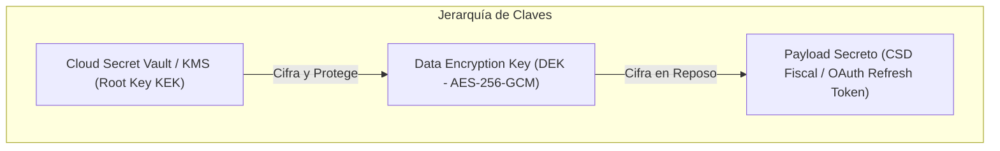

# SECRETS AND KEY MANAGEMENT SPECIFICATION — ERP RESTAURANTES

**Document ID:** `ARCH-SEC-002`  
**Version:** `1.0 DRAFT`  
**Status:** `READY FOR INDEPENDENT REVIEW`  
**Date:** 2026-09-01  
**Framework:** `EAAF v1.2.0 @ 7e036f43240b3dc28ccb996e350263598275b2cd`  
**Author Agent:** `08_Security_Architect`  
**Approved Baseline Commit:** `9d076c1a8f674b2411991b20fa4faa83b85f708a` (Tag `data-architecture-v1.0-approved`)  

---

## 1. Jerarquía de Llaves Criptográficas y Envelope Encryption

El almacenamiento de secretos en Cloud implementa **Envelope Encryption** (cifrado por sobre) para garantizar que los datos sensibles no dependan de una única llave global:

---

## 2. Inventario y Ciclo de Vida de Secretos por Categoría

| Categoría de Secreto | Ubicación de Almacenamiento | Algoritmo de Cifrado | Frecuencia de Rotación | Procedimiento de Contingencia ante Fuga |
|---|---|---|---|---|
| **Credenciales OAuth Agregadores** (Uber/Rappi/Didi) | Cloud PostgreSQL (Columna Cifrada) | AES-256-GCM (Llave en Vault) | Cada 90 días o por evento | Re-autenticación inmediata en panel corporativo y revocación de tokens previos. |
| **Certificados y Llaves CSD (CFDI)** | Cloud Secret Vault / Storage Cifrado | AES-256-GCM / RSA 2048 | Anual (Vigencia SAT) | Revocación en el SAT y carga de nuevo CSD con password cifrado. |
| **Tokens de Fencing (Lease Folios)** | Cloud DB / Edge RAM & Storage | Criptográfico Opaco 256-bit | Por cada nuevo Lease / Época | Emisión inmediata de nueva época (`ep_n+1`) en Cloud para cerco de nodo comprometido. |
| **Llave de Cifrado de SQLite (SQLCipher)**| Edge Host OS Keyring (DPAPI/Keyring)| AES-256-CBC / Derivación PBKDF2 | Anual o ante reemplazo de hardware | Re-cifrado de la base de datos local mediante comando administrativo seguro. |
| **JWT Signing Keys (Cloud Auth)** | Cloud Identity KMS | RS256 / Ed25519 | Cada 180 días | Rotación con ventana de gracia de 24h para validación de tokens en tránsito. |

---

## 3. Principio de Aislamiento de Secretos
> **ZERO SECRETS IN CODE OR CONFIG REPOSITORIES:** Queda terminantemente prohibido almacenar llaves privadas, secretos de webhooks, contraseñas de bases de datos o credenciales de terceros en el código fuente, archivos `.env` versionados o repositorios Git. Los secretos se inyectan en tiempo de ejecución a través de variables de entorno protegidas o llamadas seguras al Secret Vault.

---

DOCUMENT STATUS: READY FOR INDEPENDENT REVIEW
