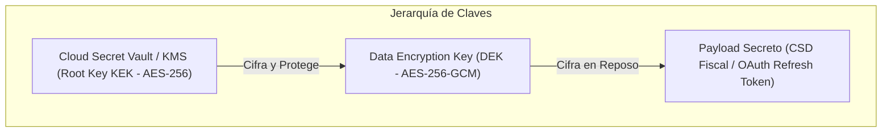

# SECRETS AND KEY MANAGEMENT SPECIFICATION — ERP RESTAURANTES

> [!WARNING]
> **ACR-2026-011 PROPOSED OVERLAY — NOT CANONICAL UNTIL PRODUCT OWNER APPROVAL AND MERGE TO MAIN**
> 
> The additions in this document relating to WP-009 (`EdgeSecureStore`, Edge TLS Private Key, Station Token HMAC Key contract, StationPinStore) represent proposed governance overlays under review via ACR-2026-011. The underlying baseline remains `APPROVED / FROZEN — 2026-09-03`.

**Document ID:** `ARCH-SEC-002`  
**Version:** `1.1 REMEDIATED DRAFT` (with ACR-2026-011 Proposed Overlay)  
**Status:** `APPROVED / FROZEN — 2026-09-03` (`ACR-2026-011 PROPOSAL PENDING PO APPROVAL`)  
**Date:** 2026-09-01  
**Framework:** `EAAF v1.2.0 @ 7e036f43240b3dc28ccb996e350263598275b2cd`  
**Author Agent:** `08_Security_Architect` (Overlay Synthesis: `01_Solution_Architect`)  
**Approved Baseline Commit:** `9d076c1a8f674b2411991b20fa4faa83b85f708a` (Tag `data-architecture-v1.0-approved`)  

---

## 1. Jerarquía de Llaves Criptográficas y Envelope Encryption

El almacenamiento de secretos en Cloud implementa **Envelope Encryption** con separación estricta de responsabilidades:

---

## 2. Inventario y Ciclo de Vida de Secretos por Categoría

| Categoría de Secreto | Ubicación de Almacenamiento | Algoritmo Criptográfico | Frecuencia de Rotación | Procedimiento de Contingencia ante Fuga |
|---|---|---|---|---|
| **Credenciales OAuth Agregadores** | Cloud PostgreSQL (Columna Cifrada) | AES-256-GCM (DEK gestionada) | Cada 90 días (`POLICY DEFAULT`) o por evento | Re-autenticación inmediata en panel corporativo y revocación de tokens previos. |
| **Certificados y Llaves CSD (CFDI)** | Cloud Secret Vault / Storage Cifrado | AES-256-GCM / RSA 2048 | Anual o vigencia SAT | Revocación en el SAT y carga de nuevo CSD con password cifrado. |
| **Tokens de Fencing (Lease Folios)** | Cloud DB / Edge RAM & Storage | Criptográfico Opaco 256-bit | Por cada nuevo Lease / Época | Emisión inmediata de nueva época (`ep_n+1`) en Cloud para cerco de nodo desfasado. |
| **Llave de Cifrado SQLite (SQLCipher)**| Edge Host OS Keyring (DPAPI/Keyring)| AES-256-CBC / Derivación PBKDF2 | Anual o reemplazo de hardware | Re-cifrado de la base de datos local mediante comando administrativo seguro. |
| **JWT Signing Keys (Cloud Auth)** | Cloud Identity KMS | RS256 / EdDSA (Agilidad) | Cada 180 días (`POLICY DEFAULT`)| Rotación con ventana de gracia de 24h para validación de tokens en tránsito. |
| **Edge TLS Private Key (WP-009)** | Edge Host `EdgeSecureStore` (OS Keyring) | RSA 2048 / ECDSA P-256 | Inmutable por ciclo de vida de nodo (sin regeneración silenciosa) | Fail-closed al iniciar si falta o está corrupta (`EdgeTlsKeyMissingOrCorrupted`). Re-aprovisionamiento administrativo supervisado. |
| **Station Token HMAC Key (WP-009)** | Edge Host `EdgeSecureStore` (OS Keyring) | HMAC-SHA256 (Exactamente 32 bytes CSPRNG) | Rotación no disruptiva o por fin de turno | Retención de llave previa durante 12h de vigencia de tokens emitidos; revocación inmediata ante compromiso. |
| **Station Pin Store (WP-009)** | Station Client Tamper-Resistant Store | Hash SHA-256 (Fingerprint cert) | Por re-enrolamiento físico supervisado | Bloqueo de conexión ante fingerprint mismatch; reset físico administrativo en terminal. |

---

## 3. Principio de Aislamiento de Secretos
> **ZERO SECRETS IN CODE OR CONFIG REPOSITORIES:** Queda terminantemente prohibido almacenar llaves privadas, secretos de webhooks, contraseñas de bases de datos o credenciales de terceros en el código fuente, archivos `.env` versionados o repositorios Git (`SECURITY REQUIREMENT`). Los secretos se inyectan en tiempo de ejecución a través de variables de entorno protegidas o llamadas al Secret Vault.

---

## 4. EdgeSecureStore Architecture & Key Contracts (ACR-2026-011)

### 4.1 Contrato de Seguridad de `EdgeSecureStore`
El subsistema Edge Host implementa el componente interno de almacenamiento seguro `EdgeSecureStore`, gobernado por las siguientes invariantes obligatorias:
1. **Material Protegido:** Custodia la llave privada TLS del Edge Host, la llave simétrica HMAC de 32 bytes para firma de Station Tokens, y opcionalmente el material de integridad del ancla de tiempo confiable (`lastKnownCloudTime`).
2. **Prohibición de Archivos en Texto Plano:** Queda terminantemente prohibido persistir llaves privadas o secretos criptográficos en archivos de texto plano o con simples permisos POSIX (`0600`), los cuales resultan inoperantes en sistemas de archivos Windows / NTFS.
3. **Cifrado Respaldado por el Sistema Operativo:** La implementación de producción en Electron utiliza `electron.safeStorage` o un adaptador nativo equivalente con respaldo del subsistema criptográfico del SO:
   - **Windows:** DPAPI (`CryptProtectData`).
   - **macOS:** Keychain Services.
   - **Linux:** Secret Service API / Freedesktop Keyring real.
4. **Prohibición de Fallback Inseguro en Linux:** El fallback `basic_text` (texto claro ofuscado) provisto por ciertas librerías en entornos Linux sin interfaz gráfica queda **ESTRICTAMENTE PROHIBIDO** para los secretos gobernados por WP-009.
5. **Fail-Closed Mandatario:** Si el backend de almacenamiento seguro no está disponible o `safeStorage.isEncryptionAvailable()` retorna `false`, el sistema **DEBE FALLAR CERRADO AL INICIAR** (`FAIL CLOSED`). No se permite la inicialización insegura de secretos sensibles.
6. **Encapsulamiento e Inaccesibilidad Externa:** `EdgeSecureStore` es estrictamente interno al paquete `@trident/edge`. Prohibida su exposición vía IPC hacia procesos de renderizado, getters públicos de llaves privadas, o registro en `Symbol.for` / ámbito global.
7. **Material Público Exento:** Los certificados públicos DER/PEM y fingerprints SHA-256 pueden residir en el sistema de archivos estándar, dado que no constituyen material secreto.

### 4.2 Contrato y Ciclo de Vida de Llave HMAC de Station Tokens
1. **Entropía y Tamaño Estricto:** La llave de producción debe ser de **exactamente 32 bytes (256 bits)** generada mediante un generador criptográficamente seguro (CSPRNG, ej. `crypto.randomBytes(32)`). Se valida estrictamente la longitud de buffer: claves menores o mayores a 32 bytes son rechazadas de inmediato.
2. **Independencia Criptográfica:** La llave HMAC es totalmente independiente de la llave TLS del servidor; el compromiso de una no compromete la otra.
3. **Prohibición de Inyección Arbitraria:** Queda prohibida la inyección de strings arbitrarios como llave en interfaces de producción. Métodos de inyección de llave quedan confinados a límites de prueba internos (`test-only boundaries`).
4. **Persistencia Multi-Reinicio:** La llave se persiste en `EdgeSecureStore` para garantizar la validez de los tokens de estación de 12 horas a través de reinicios del proceso Edge y del sistema operativo.
5. **Semántica de Rotación:**
   - **Sin periodo de gracia genérico de 15 minutos:** Queda descartado el periodo arbitrario de 15 minutos.
   - **Rotación No Disruptiva:** Cuando se genera una nueva versión de la llave HMAC, la llave de verificación previa (`previousKey`) debe permanecer disponible en memoria y protegida hasta que expire el último Station Token emitido con ella (acotado por el TTL congelado de 12 horas / 43200s).
   - **Rotación de Emergencia / Fin de Turno:** Una rotación supervisada de emergencia o de cierre de turno operativo puede purgar intencionalmente la llave previa, invalidando de inmediato todos los tokens de piso y forzando la re-autenticación de terminales.
   - **Sin Rotación Diaria Automática en WP-009:** No se impone rotación programada diaria en WP-009.

### 4.3 Contrato de StationPinStore en Terminales de Piso
1. **Persistencia Obligatoria Previa a Transmisión:** Las terminales (POS, KDS, comanderos) deben persistir el fingerprint verificado en `StationPinStore` **ANTES** de transmitir `pairingSecret` o llaves públicas al Edge Host.
2. **Invariante `PIN STORE FAILURE`:** Si la persistencia del pin falla por cualquier causa, la terminal aborta la operación: **CERO DIVULGACIÓN DE SECRETOS Y CERO MUTACIÓN EN EL SERVIDOR**.
3. **Almacenamiento Seguro de Plataforma:** Respaldado por el almacenamiento seguro del dispositivo (Electron safeStorage, Android Keystore, iOS Keychain).
4. **Prohibición de `initialPin` en Producción:** Queda prohibido el uso de bypasses de pin precargado en entornos de producción. El reset de un pin exige una intervención administrativa presencial en la terminal.

---

DOCUMENT STATUS: APPROVED / FROZEN — 2026-09-03 (ACR-2026-011 PROPOSED ADDITIONS PENDING PRODUCT OWNER APPROVAL)
