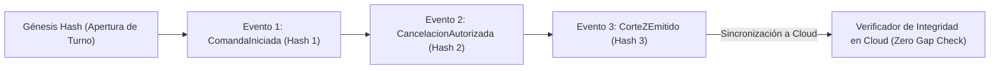

# SECURITY LOGGING & MONITORING SPECIFICATION — ERP RESTAURANTES

**Document ID:** `ARCH-LOG-001`  
**Version:** `1.0 DRAFT`  
**Status:** `READY FOR INDEPENDENT REVIEW`  
**Date:** 2026-09-01  
**Framework:** `EAAF v1.2.0 @ 7e036f43240b3dc28ccb996e350263598275b2cd`  
**Author Agent:** `08_Security_Architect`  
**Approved Baseline Commit:** `9d076c1a8f674b2411991b20fa4faa83b85f708a` (Tag `data-architecture-v1.0-approved`)  

---

## 1. Diseño de Auditoría Inmutable y Tamper-Evident en Borde

Para detectar cualquier intento de manipulación física o edición de la base de datos local SQLite antes de su sincronización con la nube, la tabla `local_audit_trail` implementa un esquema de **Encadenamiento Criptográfico (Hash Chaining)**:

$$\text{Block}_n = \text{Hash}(\text{Block}_{n-1} \parallel \text{EventID}_n \parallel \text{Timestamp}_n \parallel \text{ActorID}_n \parallel \text{Action}_n \parallel \text{PayloadHash}_n)$$

---

## 2. Catálogo de Detección de Anomalías y Umbrales de Alerta de Seguridad

| Regla de Detección | Condición / Disparador | Severidad | Propietario de Respuesta | Acción Inmediata de Mitigación |
|---|---|---|---|---|
| **Fuerza Bruta de PIN en Terminal** | $\ge 5$ fallos de PIN en $\le 5$ minutos en la misma estación | ALTA | Gerente de Sucursal | Bloqueo temporal de estación por 5 minutos y registro de alerta en auditoría. |
| **Intento de Acceso con Lease Revocado** | Petición de sincronización con $\text{epochId} < \text{epochId}_{\text{activa}}$ | CRÍTICA | Seguridad / Operaciones Cloud | Rechazo `403 LEASE_REVOKED`, marcado de nodo como Host Zombie y alerta en Cloud. |
| **Picos Anómalos de Cancelaciones Post-Cocina**| $> 10$ cancelaciones de supervisor en $\le 1$ hora | MEDIA | Gerente General / Auditor | Notificación push inmediata al panel de control administrativo corporativo. |
| **Firma Inválida en Webhook de Delivery** | Fallo en validación HMAC-SHA256 de Uber/Rappi | ALTA | Seguridad Cloud | Descarte inmediato con `401 Unauthorized` y registro de IP en lista de cuarentena temporal. |
| **Bypass o Violación de Políticas RLS** | Intento de consulta sin `organization_id` válido | CRÍTICA | Arquitectura / DevOps Cloud | Aborto de transacción, registro en Sentry y corte de sesión del usuario. |
| **Rotura en Hash Chain de Auditoría** | $\text{Hash}_n \neq \text{SHA256}(\text{Hash}_{n-1} \dots)$ al sincronizar | CRÍTICA | Seguridad / Auditoría Forense | Cuarentena del lote de sincronización y reporte de incidente de integridad. |

---

DOCUMENT STATUS: READY FOR INDEPENDENT REVIEW
