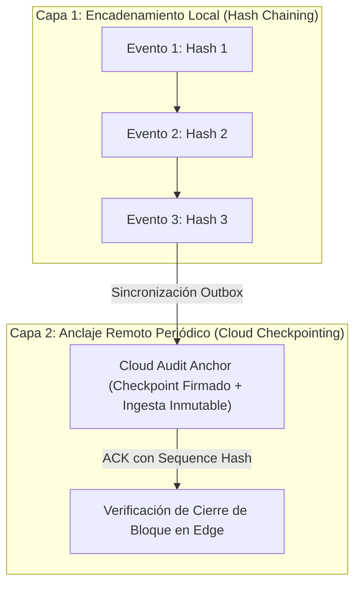

# SECURITY LOGGING & MONITORING SPECIFICATION — ERP RESTAURANTES

**Document ID:** `ARCH-LOG-001`  
**Version:** `1.2 REMEDIATED DRAFT (R2.1)`  
**Status:** `APPROVED / FROZEN — 2026-09-03`  
**Date:** 2026-09-02  
**Framework:** `EAAF v1.2.0 @ 7e036f43240b3dc28ccb996e350263598275b2cd`  
**Author Agent:** `08_Security_Architect — Remediation Author`  
**Approved Baseline Commit:** `9d076c1a8f674b2411991b20fa4faa83b85f708a` (Tag `data-architecture-v1.0-approved`)  

---

## 1. Diseño de Auditoría Tamper-Evident por Capas (R2F-03)

Para proteger la integridad de la bitácora de eventos sin incurrir en falsas afirmaciones de invulnerabilidad, la arquitectura implementa un **Diseño Tamper-Evident en Dos Capas**:



### Capacidades y Limitaciones del Control:
1. **Detección Local:** El encadenamiento local ($H_n = \text{SHA256}(H_{n-1} \parallel \dots)$) detecta alteraciones accidentales, modificaciones parciales y borrados no secuenciales en SQLite.
2. **Anclaje Remoto:** Los puntos de control periódicos en Cloud consolidan la historia sincronizada de forma inmutable.
3. **Declaración Explícita de Riesgo Residual (R2F-03):**
   > *DOCUMENTED RESIDUAL RISK — FORMAL ACCEPTANCE NOT YET RECORDED:* Un atacante que obtenga acceso total de escritura al sistema operativo y a la base de datos SQLite antes de que se emita un anclaje remoto a Cloud, puede potencialmente reescribir la historia local no anclada. Este riesgo residual está plenamente documentado; su aceptación formal corresponde a la autoridad autorizada de gestión de riesgos bajo gobernanza EAAF.

---

## 2. Detección de Anomalías y Umbrales de Alerta de Seguridad (Security Policy Defaults)

| Regla de Detección | Condición / Disparador | Severidad | Propietario de Respuesta | Acción Inmediata de Mitigación | Clasificación del Umbral |
|---|---|---|---|---|---|
| **Fuerza Bruta de PIN en Terminal** | $\ge 5$ fallos de PIN en $\le 5$ minutos en la misma estación | ALTA | Gerente de Sucursal | Bloqueo temporal de estación por 5 minutos y registro de alerta en auditoría. | `SECURITY POLICY DEFAULT` |
| **Intento de Acceso con Lease Revocado** | Petición de sincronización con $\text{epochId} < \text{epochId}_{\text{activa}}$ | CRÍTICA | Seguridad / Operaciones Cloud | Rechazo `403 LEASE_REVOKED`, marcado de nodo como Host Zombie y alerta en Cloud. | `SECURITY BASELINE` |
| **Firma Inválida en Webhook de Delivery** | Fallo en validación de firma según contrato de proveedor | ALTA | Seguridad Cloud | Descarte inmediato con `401 Unauthorized` y registro de IP en lista de cuarentena temporal (15 min). | `SECURITY POLICY DEFAULT` |
| **Bypass o Violación de Políticas RLS** | Intento de consulta sin `organization_id` válido | CRÍTICA | Arquitectura / DevOps Cloud | Aborto de transacción, registro en Sentry y corte de sesión del usuario. | `SECURITY BASELINE` |
| **Rotura en Hash Chain de Auditoría** | $\text{Hash}_n \neq \text{SHA256}(\text{Hash}_{n-1} \dots)$ al sincronizar | CRÍTICA | Seguridad / Auditoría Forense | Cuarentena del lote de sincronización y reporte de incidente de integridad. | `SECURITY BASELINE` |
| **Manipulación de Reloj Local (Clock Rollback)**| Desfase $> 5\text{ min}$ respecto a `lastKnownCloudTime` | ALTA | Operaciones / Seguridad | Bloqueo de emisión de nuevos tokens y registro de alerta `ClockRollbackDetected`. | `SECURITY POLICY DEFAULT` |

---

## 3. Contrato Canónico de Auditoría Cloud y Telemetría de Seguridad (WP-006)

Para hacer implementable y gobernable la bitácora de auditoría y telemetría de seguridad en Cloud PostgreSQL sin ambigüedades técnicas ni colisiones con componentes de borde posteriores, se formalizan los siguientes contratos:

### 3.1 Separación de Responsabilidades Cloud vs. Edge (Boundary Split)
1. **Alcance de Propiedad Exclusiva de Cloud (`WP-006`):**
   - Contrato estructurado de eventos de auditoría (`logAuditEvent()`).
   - Contrato de eventos de telemetría de seguridad (`logSecurityTelemetryEvent()`).
   - Persistencia Cloud append-only en PostgreSQL (`audit_log_events`, `security_telemetry_events`).
   - Metadatos de integridad Cloud (`previous_record_hash`, `record_hash`, `sequence_number`).
   - Especificación de serialización canónica y algoritmo criptográfico SHA-256.
   - Definición de representación y primitivas de verificación de checkpoints Cloud.
   - Algoritmo de censura/redacción previa a cualquier persistencia o emisión a observabilidad.
   - Aislamiento multi-tenant en PostgreSQL (`ENABLE + FORCE ROW LEVEL SECURITY` con `current_app_org_id()`).
   - Reglas de append-only mediante triggers PostgreSQL y restricción de privilegios de rol.
2. **Componentes Excluidos de `WP-006` (Propiedad de WPs Posteriores):**
   - Persistencia local SQLite `local_audit_trail` (pertenece a `WP-008`).
   - Runtime de encadenamiento hash y captura offline en Edge (pertenece a `WP-008` / `WP-010`).
   - Cola de Outbox local y transporte seguro WAN a Cloud (pertenece a `WP-012` / `WP-013`).
   - Runtime de confirmación y procesamiento de ACK de checkpoint en Edge (pertenece a `WP-013`).
   - Motores de detección activos (como bloqueo de PIN en terminal `WP-010`, revancha de leases `WP-011`, validación de webhooks de delivery `WP-021`). `WP-006` establece el esquema y logger para recibir estos eventos, no el motor de detección.

### 3.2 Interfaz del Registrador de Auditoría y Telemetría Estructurada
El sistema implementa interfaces tipadas e independientes para auditoría de negocio y telemetría de seguridad, evitando volcados arbitrarios no estructurados:

```typescript
export interface AuditEventInput {
  organizationId: string;       // UUIDv4 canónico del tenant
  branchId?: string | null;     // UUIDv4 de sucursal (NULL si es evento corporativo)
  actorId?: string | null;      // UUIDv4 del usuario actor (NULL si es evento de sistema)
  stationId?: string | null;    // UUIDv4 del dispositivo/estación (NULL si es backend cloud)
  eventType: string;            // Identificador canónico (e.g. 'auth.login.success', 'order.cancelled')
  action: string;               // Acción realizada (e.g. 'CREATE', 'UPDATE', 'CANCEL', 'AUTHORIZE')
  entityName: string;           // Entidad afectada (e.g. 'order', 'user', 'shift', 'role')
  entityId?: string | null;     // Identificador de la entidad afectada
  severity?: 'INFO' | 'WARN' | 'ERROR' | 'CRITICAL'; // Default: 'INFO'
  source: 'CLOUD' | 'EDGE_POS' | 'EDGE_KDS' | 'SYSTEM';
  requestId?: string | null;    // Correlación de petición HTTP / RPC
  metadata?: Record<string, unknown>; // Atributos de contexto (sujetos a redacción obligatoria)
  clientTimestamp?: Date | string | null; // Marca temporal de captura en origen
}

export interface SecurityTelemetryInput {
  organizationId: string;
  branchId?: string | null;
  stationId?: string | null;
  actorId?: string | null;
  ruleCode: 
    | 'PIN_BRUTE_FORCE' 
    | 'LEASE_REVOKED_ACCESS' 
    | 'DELIVERY_WEBHOOK_INVALID_SIGNATURE' 
    | 'RLS_VIOLATION_ATTEMPT' 
    | 'AUDIT_HASH_CHAIN_BREAK' 
    | 'CLOCK_ROLLBACK_DETECTED';
  severity: 'LOW' | 'MEDIUM' | 'HIGH' | 'CRITICAL';
  category: 'AUTHENTICATION' | 'AUTHORIZATION' | 'INTEGRITY' | 'NETWORK' | 'TIMING';
  details: Record<string, unknown>; // Detalles de la detección (sujetos a redacción)
  actionTaken: string;              // Mitigación aplicada según tabla Sec. 2
  source: 'CLOUD' | 'EDGE_POS' | 'EDGE_SERVER' | 'SYSTEM';
  requestId?: string | null;
}

export interface IAuditLogger {
  logAuditEvent(event: AuditEventInput): Promise<string>; // Retorna id del evento persistido
  logSecurityTelemetryEvent(event: SecurityTelemetryInput): Promise<string>;
}
```

### 3.3 Especificación Criptográfica de Encadenamiento Hash SHA-256 y Checkpoints
Para garantizar la detectabilidad de alteraciones y continuidad temporal:
1. **Algoritmo de Hash:** SHA-256 (NIST FIPS 180-4), representado como cadena hexadecimal de 64 caracteres en minúsculas.
2. **Serialización Canónica Determinista:**
   El payload a hashear se transforma utilizando el estándar RFC 8785 (JSON Canonicalization Scheme - JCS) o concatenación estricta con orden canónico de claves predeterminado:
   $$\text{CanonicalString} = \text{Serialize}(\{ \text{orgId}, \text{branchId}, \text{sequenceNumber}, \text{clientTimestamp}, \text{serverTimestamp}, \text{eventType}, \text{action}, \text{entityName}, \text{entityId}, \text{actorId}, \text{stationId}, \text{redactedMetadata}, \text{previousRecordHash} \})$$
   $$\text{record\_hash} = \text{SHA256}(\text{CanonicalString})$$
3. **Bloque Génesis y Secuencia Monotónica:**
   - La numeración `sequence_number` es un entero `BIGINT` estrictamente monotónico por flujo de auditoría `(organization_id, branch_id)`.
   - Para el registro génesis (`sequence_number = 1`), el valor de `previous_record_hash` se define invariablemente como 64 caracteres de cero:
     $$\text{GENESIS\_HASH} = \text{"0000000000000000000000000000000000000000000000000000000000000000"}$$
4. **Vinculación de Contexto Criptográfico:**
   El hash del registro vincula indisolublemente el tenant (`organization_id`), la sucursal (`branch_id`), la estación (`station_id`), el actor (`actor_id`), la secuencia y los metadatos sanitizados con el hash previo, impidiendo el trasvase o reordenamiento de eventos entre sucursales o inquilinos.
5. **Checkpoints Cloud:**
   Un checkpoint Cloud se formaliza como un registro de auditoría de tipo `audit.checkpoint.created` que contiene en sus metadatos:
   `start_sequence_number`, `end_sequence_number`, `start_record_hash`, `checkpoint_record_hash`, `event_count` y `source_stream`.
6. **Manejo de Duplicados, Replays y Cuarentena por Rotura:**
   - Idempotencia: Ingestas repetidas con el mismo `id` y mismo `record_hash` son descartadas como no-op idempotente sin duplicar registros.
   - Detección de Tampering: Si se recibe un evento con una secuencia existente pero hash discrepante, o si $\text{previous\_record\_hash}_n \neq \text{record\_hash}_{n-1}$, se rechaza la transacción, se envían los datos a cuarentena forense y se emite inmediatamente un evento crítico `AUDIT_HASH_CHAIN_BREAK`.

### 3.4 Política Canónica de Redacción Previa a Persistencia y Observabilidad
Para cumplir con `DATA_PROTECTION_AND_PRIVACY.md` Sec. 3:
1. **Regla Temporal:** `REDACT BEFORE ANY EXTERNAL SINK`. La censura y enmascaramiento se ejecutan **antes** de insertar en la base de datos PostgreSQL, antes de escribir en logs del sistema (stdout/stderr) y antes de transmitir a Sentry o APM. Jamás se persisten secretos en claro bajo la promesa de enmascararlos en lectura.
2. **Campos Censurados de Forma Recursiva e Insensible a Mayúsculas:**
   Cualquier clave que coincida (case-insensitive) con la lista prohibida se reemplaza por el valor literal `"[REDACTED]"`:
   - `password`, `pin`, `pin_hash`, `token`, `secret`, `authorization`, `credit_card`, `cvv`, `private_key` (y variantes camelCase como `accessToken`, `refreshToken`, `apiKey`, `clientSecret`).
3. **Enmascaramiento de PII:**
   - Correos electrónicos: Formato canónico `u***@domain.com` (se conserva la primera letra del usuario, tres asteriscos y el dominio completo).
   - Números de teléfono: Formato canónico `******1234` (se ocultan los dígitos iniciales conservando únicamente los últimos 4 dígitos).
4. **Recursividad:** La función de redacción recorre de forma recursiva estructuras anidadas (objetos JSON, arrays) sin límite arbitrario de profundidad.

### 3.5 Invariante de Inmutabilidad Bajo Límite de Confianza de Aplicación
1. **Término Preciso de Gobernanza:**
   > **TAMPER-EVIDENT / APPEND-ONLY UNDER APPLICATION TRUST BOUNDARY**
   Queda estrictamente prohibido categorizar la base de datos relacional Cloud como "absolutamente a prueba de manipulación" o invulnerable contra superusuarios de PostgreSQL, DBAs con privilegios elevados o administradores de infraestructura de nube.
2. **Controles de Aplicación Obligatorios:**
   - Triggers PostgreSQL que interceptan y abortan cualquier operación `UPDATE` o `DELETE` con excepción explicativa:
     `RAISE EXCEPTION 'Audit trail is append-only: UPDATE and DELETE are prohibited on %', TG_TABLE_NAME;`
   - Los permisos de usuario de conexión de la aplicación (DML role) sólo reciben `GRANT SELECT, INSERT`. Los comandos `UPDATE`, `DELETE` y `TRUNCATE` son revocados a nivel de privilegios del esquema.

### 3.6 Aislamiento Multi-Tenant y Políticas RLS
1. `audit_log_events` y `security_telemetry_events` integran `organization_id UUID NOT NULL REFERENCES organizations(id)`.
2. Se exige mandatoriamente:
   - `ALTER TABLE audit_log_events ENABLE ROW LEVEL SECURITY;`
   - `ALTER TABLE audit_log_events FORCE ROW LEVEL SECURITY;`
   - `ALTER TABLE security_telemetry_events ENABLE ROW LEVEL SECURITY;`
   - `ALTER TABLE security_telemetry_events FORCE ROW LEVEL SECURITY;`
3. Políticas de aislamiento vinculadas a `current_app_org_id()`:
   - Cláusulas `USING (organization_id = current_app_org_id())` y `WITH CHECK (organization_id = current_app_org_id())`.
   - Default Deny garantizado cuando `app.current_organization_id` no está inicializada o es nula.
   - Claves foráneas compuestas con `(organization_id, id)` en sucursales, usuarios y estaciones para impedir colisiones o suplantaciones cruzadas entre inquilinos.

---

DOCUMENT STATUS: APPROVED / FROZEN — 2026-09-04

