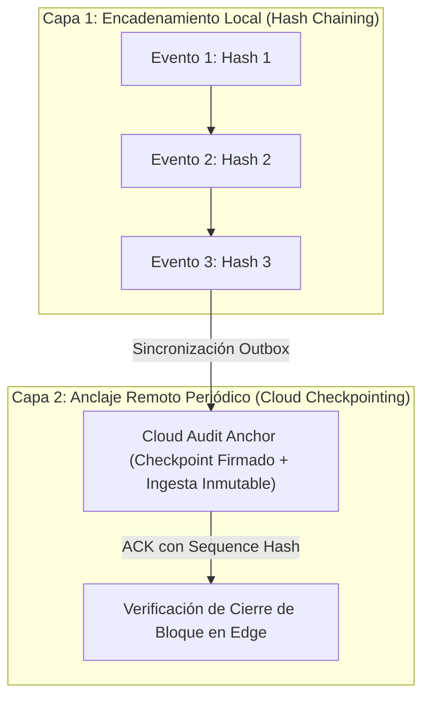

# SECURITY LOGGING & MONITORING SPECIFICATION — ERP RESTAURANTES

**Document ID:** `ARCH-LOG-001`  
**Version:** `1.1 REMEDIATED DRAFT`  
**Status:** `READY FOR INDEPENDENT REVIEW`  
**Date:** 2026-09-01  
**Framework:** `EAAF v1.2.0 @ 7e036f43240b3dc28ccb996e350263598275b2cd`  
**Author Agent:** `08_Security_Architect`  
**Approved Baseline Commit:** `9d076c1a8f674b2411991b20fa4faa83b85f708a` (Tag `data-architecture-v1.0-approved`)  

---

## 1. Diseño de Auditoría Tamper-Evident por Capas (SR-04)

Para garantizar la integridad de la bitácora de eventos sin incurrir en falsas afirmaciones de invulnerabilidad, la arquitectura implementa un **Diseño Tamper-Evident en Dos Capas**:

### Capacidades y Limitaciones del Control:
1. **Detección Local:** El encadenamiento local ($H_n = \text{SHA256}(H_{n-1} \parallel \dots)$) detecta alteraciones accidentales, modificaciones parciales y borrados no secuenciales en SQLite.
2. **Anclaje Remoto:** Los puntos de control periódicos en Cloud consolidan la historia sincronizada de forma inmutable.
3. **Declaración Explícita de Riesgo Residual:**
   > *Un atacante que obtenga acceso total de escritura al sistema operativo y a la base de datos SQLite antes de que se emita un anclaje remoto a Cloud, puede potencialmente reescribir la historia local no anclada. Esto constituye un riesgo residual documentado y aceptado, mitigado mediante sincronizaciones frecuentes y respaldos consistentes.*

---

## 2. Detección de Anomalías y Umbrales de Alerta de Seguridad

| Regla de Detección | Condición / Disparador | Severidad | Propietario de Respuesta | Acción Inmediata de Mitigación |
|---|---|---|---|---|
| **Fuerza Bruta de PIN en Terminal** | $\ge 5$ fallos de PIN en $\le 5$ minutos en la misma estación | ALTA | Gerente de Sucursal | Bloqueo temporal de estación por 5 minutos y registro de alerta en auditoría. |
| **Intento de Acceso con Lease Revocado** | Petición de sincronización con $\text{epochId} < \text{epochId}_{\text{activa}}$ | CRÍTICA | Seguridad / Operaciones Cloud | Rechazo `403 LEASE_REVOKED`, marcado de nodo como Host Zombie y alerta en Cloud. |
| **Firma Inválida en Webhook de Delivery** | Fallo en validación de firma según contrato de proveedor | ALTA | Seguridad Cloud | Descarte inmediato con `401 Unauthorized` y registro de IP en lista de cuarentena temporal. |
| **Bypass o Violación de Políticas RLS** | Intento de consulta sin `organization_id` válido | CRÍTICA | Arquitectura / DevOps Cloud | Aborto de transacción, registro en Sentry y corte de sesión del usuario. |
| **Rotura en Hash Chain de Auditoría** | $\text{Hash}_n \neq \text{SHA256}(\text{Hash}_{n-1} \dots)$ al sincronizar | CRÍTICA | Seguridad / Auditoría Forense | Cuarentena del lote de sincronización y reporte de incidente de integridad. |
| **Manipulación de Reloj Local (Clock Rollback)**| Desfase $> 5\text{ min}$ respecto a `lastKnownCloudTime` | ALTA | Operaciones / Seguridad | Bloqueo de emisión de nuevos tokens y registro de alerta `ClockRollbackDetected`. |

---

DOCUMENT STATUS: READY FOR INDEPENDENT REVIEW
