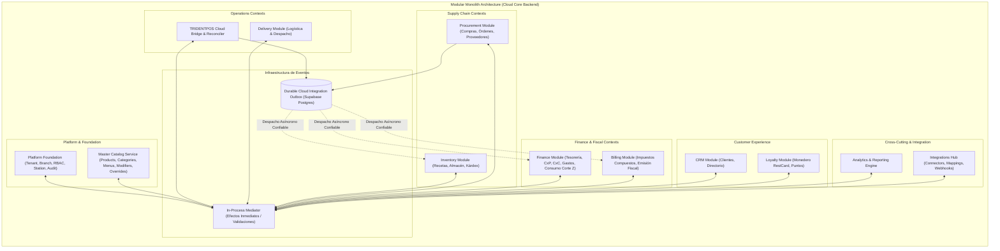
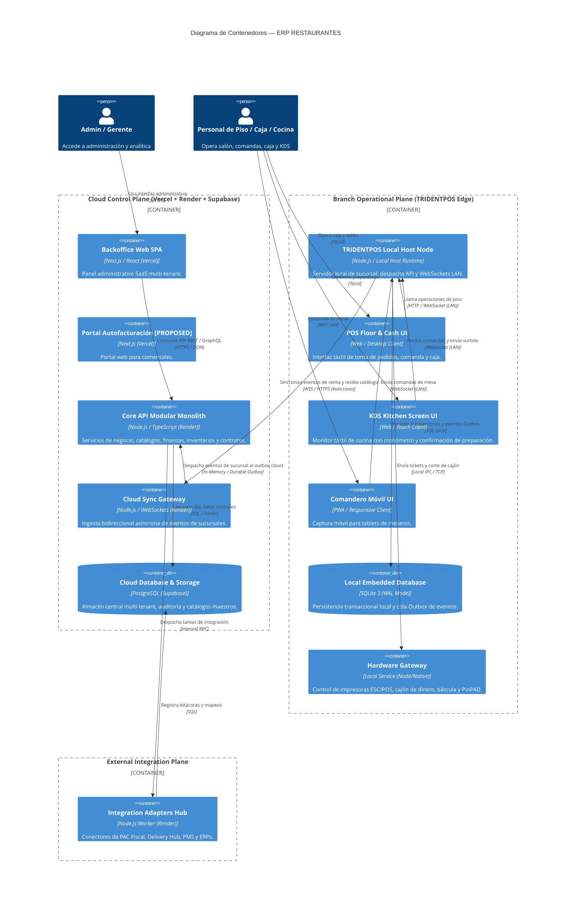
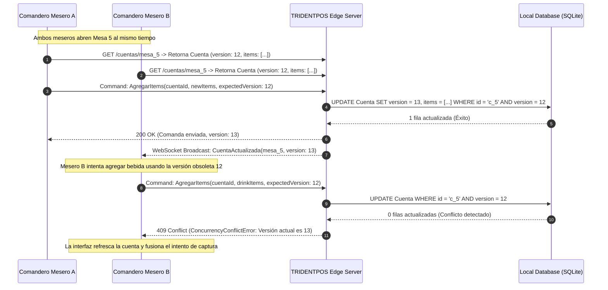
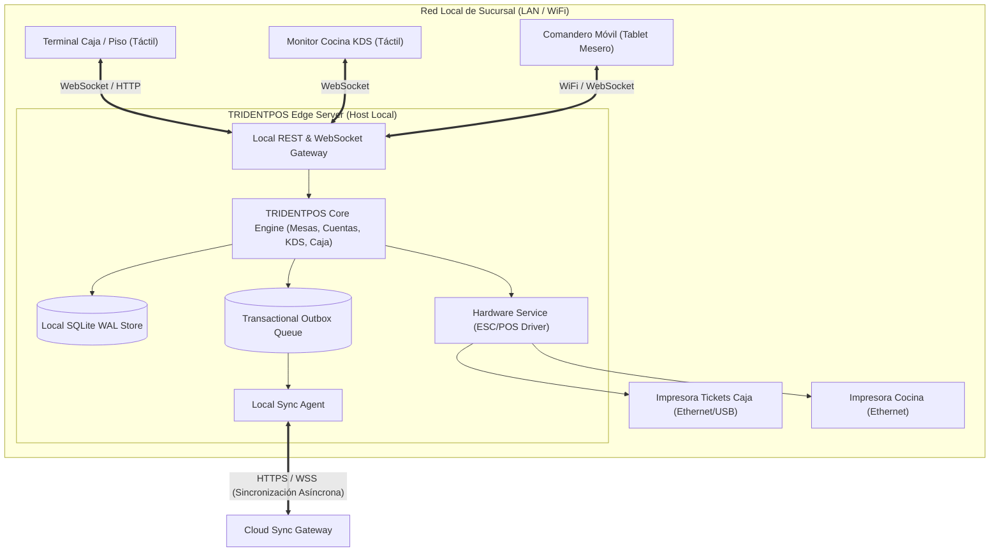

# SOLUTION ARCHITECTURE — ERP RESTAURANTES

**Versión:** 1.1 (SOLUTION ARCHITECTURE NORMALIZED)  
**Fecha:** 2026-08-31  
**SSOT Baseline:** [`FUNCTIONAL_ARCHITECTURE.md`](file:///Volumes/SSD_ORICO/BRAIN/TRIDENTPOSREST/FUNCTIONAL_ARCHITECTURE.md) (v1.2 APPROVED) & [`MODULE_CATALOG.md`](file:///Volumes/SSD_ORICO/BRAIN/TRIDENTPOSREST/MODULE_CATALOG.md) (v1.2 APPROVED).  
**Rol:** `01_Solution Architect`

---

## 1. Estilo Arquitectónico: Monolito Modular con Bounded Contexts Fuertes

Para `ERP RESTAURANTES`, la arquitectura del backend en el Cloud Control Plane se diseña bajo el patrón **Modular Monolith (Monolito Modular)** con aislamiento estricto entre Bounded Contexts y comunicación dual: **In-Process Domain Events** para efectos intra-transaccionales y **Durable Integration Events** para efectos inter-módulo que no pueden perderse.



### 1.1 Justificación del Monolito Modular y Manejo de Eventos Durables
1. **Aislamiento por Contratos Fuertes:** Cada módulo se encapsula en un paquete de código con su propia API pública (Comandos, Queries y Eventos). Queda **estrictamente prohibido el acceso a estructuras internas o almacenamiento privado de otro módulo sin pasar por su contrato público**.
2. **Diferenciación de Eventos:**
   - **In-Process Domain Events:** Eventos que se ejecutan dentro del mismo límite de transacción y ciclo de vida de la petición (ej. validación de reglas de negocio, sincronización en memoria).
   - **Durable Integration Events:** Eventos de negocio que representan transacciones inter-módulo críticas (ej. `CorteZGenerado`, `RecepcionCompraRegistrada`, `OrdenProduccionConfirmadaEnKDS`). Estos eventos **se persisten de forma durable en la tabla `CloudIntegrationOutbox` dentro de la transacción principal** para garantizar que no se pierdan ante caídas de proceso antes de ser consumidos por los módulos de Inventory, Finance o Billing.
3. **Sin Broker Externo Prematuro:** No se introduce Kafka ni RabbitMQ inicialmente; la tabla de Outbox en PostgreSQL gestionada por workers internos proporciona garantías transaccionales suficientes con menor costo y complejidad operativa.

---

## 2. Diagrama de Contenedores del Sistema (C4 Container Level)



---

## 3. Descomposición Interna: Platform Foundation vs. Master Catalog

Funcionalmente, ambos componentes pertenecen a `Platform Core` como Bounded Context unificado. Arquitectónicamente, se implementan en dos submódulos internos con interfaces desacopladas:

```mermaid
graph LR
    subgraph Platform_Core_Package["Platform Core (Bounded Context)"]
        subgraph Sub_Foundation["Submódulo A: Platform Foundation"]
            A1["Tenant & Organization Manager"]
            A2["Branch Registry"]
            A3["Identity, RBAC & PIN Authenticator"]
            A4["Station & Device Identity Manager"]
            A5["Central Audit Trail Engine"]
        end

        subgraph Sub_Catalog["Submódulo B: Master Catalog & Overrides"]
            B1["Master Product & Category Registry"]
            B2["Modifier & ModifierGroup Registry"]
            B3["Base Price Engine"]
            B4["Branch Overrides Engine (Price, Visibility, Tax)"]
            B5["Menu & Schedule Resolver"]
        end

        Sub_Foundation -. "Valida Permiso y Sucursal" .-> Sub_Catalog
    end

    Sub_Catalog ==> "Expone Catálogo Resuelto" ==> Other_Modules["TRIDENTPOS / Inventory / Billing"]
```

---

## 4. Control de Concurrencia en Red Local (Optimistic Concurrency Control)

Para evitar la sobreescritura silenciosa de datos cuando múltiples operadores o comanderos interactúan sobre una misma mesa o cuenta, el sistema implementa **Control de Concurrencia Optimista (OCC)** basado en versionado de agregados:



- **Mecanismo:** Toda mutación sobre `Cuenta`, `Mesa` o `TurnoCaja` incluye el campo `expectedVersion`.
- **Detección de Conflicto:** Si la versión en base de datos difiere de la esperada, la operación se rechaza atómicamente con error `409 Conflict`, obligando al cliente móvil a recargar el estado actual y reintentar de forma informada sin pérdida accidental de comandas.

---

## 5. Ejecución en TRIDENTPOS (Branch Operational Plane)

El nodo local de sucursal expone servicios de baja latencia para toda la red local:



---

SOLUTION ARCHITECTURE V1.1: READY FOR FINAL APPROVAL
