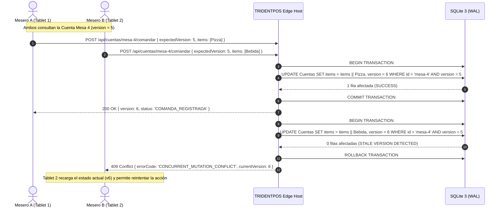

# SOLUTION ARCHITECTURE & COMPONENT MODEL — ERP RESTAURANTES

> [!NOTE]
> **ACR-2026-013 PROPOSED ARCHITECTURE CHANGE — PENDING GOVERNANCE APPROVAL**
> 
> Proposed amendment under `ACR-2026-013`: Formalization of the 4-layer monorepo package composition model (`ADR-013`) and Edge exact fixed-point signed integer storage (`INTEGER` scale 4, `ADR-012`). Pending formal review and Product Owner approval.

**Document ID:** `ARCH-SOL-001`  
**Version:** `1.4 PROPOSED OVERLAY — ACR-2026-013` (Underlying baseline: `1.3 NORMALIZED / REMEDIATED — 2026-09-01`)  
**Status:** `PROPOSED ARCHITECTURE CHANGE — PENDING GOVERNANCE APPROVAL`  
**Date:** 2026-09-13  
**Baseline:** `EAAF v1.2.0 @ 7e036f43240b3dc28ccb996e350263598275b2cd`  
**Author Agent:** `01_Solution_Architect`  
**Supersedes:** `SOLUTION_ARCHITECTURE.md v1.1`  

---

## 1. C4 Model — Nivel 2: Diagrama de Contenedores

```mermaid
graph TD
    subgraph Client_Plane["Plano de Clientes"]
        AdminWeb["Backoffice Web App (Next.js / Vercel)"]
        POSApp["TRIDENTPOS GUI (Electron Renderer / POS Desktop)"]
        KDSApp["KDS Display / Mobile Comandero (Browser / Tablet)"]
    end

    subgraph Cloud_Control_Plane["Cloud Control Plane (Modular Monolith en Render)"]
        CloudGateway["API Gateway & Auth Handler (Node.js / Express)"]
        
        subgraph Modular_Monolith_Modules["Bounded Context Modules (In-Process)"]
            PlatCore["Platform Core Module (Kernel & Catálogos)"]
            InvMod["Inventory Module (Recetas & Kárdex)"]
            ProcMod["Procurement Module (Compras)"]
            FinMod["Finance Module (Tesorería & CxP/CxC)"]
            BillMod["Billing Module (Fiscal CFDI)"]
            DelivMod["Delivery Module (Flota Propia)"]
            IntegMod["Integrations Hub Module (Conectores)"]
            OtherMods["CRM, Loyalty, Analytics Modules"]
        end

        CloudOutboxWorker["Cloud Integration Outbox Worker"]
        CloudDB[(PostgreSQL Central Database - Supabase)]
    end

    subgraph Branch_Operational_Plane["Branch Operational Plane (Edge Server en Sucursal)"]
        LocalHost["TRIDENTPOS Edge Host Runtime (Node.js Background Process)"]
        LocalWS["Local WebSocket Server (ws)"]
        LocalHTTP["Local HTTP REST Command Handler"]
        LocalEngine["Local POS / KDS / Cash Shift Engine"]
        LocalOutboxWorker["Local Outbox Sync Worker"]
        LocalDB[(SQLite 3 WAL Database)]
        LocalPrinters["Thermal Printers / ESC-POS Drivers"]
    end

    AdminWeb -->|HTTPS REST / JWT| CloudGateway
    CloudGateway --> Modular_Monolith_Modules
    Modular_Monolith_Modules --> CloudDB
    Modular_Monolith_Modules -->|Durable Events Insert| CloudDB
    CloudOutboxWorker -->|Read & Dispatch Pending Events| CloudDB
    CloudOutboxWorker -.->|Dispatch Inter-Module| Modular_Monolith_Modules

    POSApp -->|In-Process IPC / Local HTTP| LocalHost
    KDSApp -->|Local HTTP REST Commands| LocalHTTP
    KDSApp <-->|Local WebSockets (Push Updates)| LocalWS
    
    LocalHTTP --> LocalEngine
    LocalEngine --> LocalDB
    LocalEngine --> LocalPrinters
    LocalEngine -.->|Broadcast Event| LocalWS
    LocalEngine -->|Atomic Local Outbox Insert| LocalDB
    
    LocalOutboxWorker -->|Read Pending Outbox| LocalDB
    LocalOutboxWorker <-->|WSS / HTTPS Sync Tunnel| CloudGateway
```

---

## 2. Modelo de Concurrencia Local: Control de Concurrencia Optimista (OCC) (REM-02)

Para prevenir sobreescrituras silenciosas (*Lost Updates* o *First-Write-Wins* destructivo) en escenarios de múltiples meseros interactuando simultáneamente con una misma cuenta, se implementa **Control de Concurrencia Optimista (OCC)** con versionado explícito en los agregados de `Cuenta`, `Mesa` y `TurnoCaja`.



### Reglas de Ejecución OCC
1. Toda mutación sobre `Cuenta`, `Mesa` o `TurnoCaja` debe enviar el campo `expectedVersion`.
2. La sentencia SQL ejecuta la actualización condicionada: `UPDATE ... WHERE id = :id AND version = :expectedVersion`.
3. Si el número de filas afectadas es `0`, el motor aborta la transacción y responde con `409 Conflict` conteniendo la versión actual del agregado para que el cliente realice una fusión informada.

---

## 3. Manejo de Eventos en Cloud: In-Process vs. Durable Integration Outbox (REM-05)

Dentro del Monolito Modular en Cloud se implementa una separación estricta:

1. **In-Process Domain Events (Eventos de Dominio en Memoria):**
   - Utilizados para orquestación interna dentro del mismo ciclo de vida de la petición HTTP (ej. cálculo de totales, validación de inventario en memoria, validación de reglas de negocio intra-módulo).
2. **Durable Cloud Integration Events (Transactional Outbox en PostgreSQL):**
   - Todo efecto colateral inter-módulo que **no puede perderse** ante reinicios o fallas del proceso backend se persiste atómicamente en la tabla `CloudIntegrationOutbox` dentro de la misma transacción ACID que la mutación principal.
   - **Eventos Críticos Durables:**
     - `TRIDENTPOS.CorteZGenerado` -> Consumido durablemente por `Finance` para contabilizar ingresos del día.
     - `Procurement.RecepcionCompraRegistrada` -> Consumido durablemente por `Inventory` (incremento de kárdex) y `Finance` (generación de pasivo CxP).
     - `TRIDENTPOS.OrdenProduccionConfirmadaEnKDS` -> Consumido durablemente por `Inventory` para el costeo y descuento de insumos/recetas.
   - **Worker de Despacho:** Un worker asíncrono lee eventos pendientes en `CloudIntegrationOutbox` mediante `LISTEN / NOTIFY` y los despacha a los manejadores de los módulos suscriptores. En caso de fallas recurrentes tras 5 intentos, el evento se mueve a la tabla `CloudIntegrationDLQ` para auditoría y remediación manual.

---

## 4. Arquitectura de Seguridad e Identidad Offline (REM-09)

1. **Local Cached Identity Store:** El Edge Host almacena en SQLite una tabla segura `CachedUsers` con los hashes salteados de PIN (Argon2id) de los empleados autorizados en la sucursal.
2. **Control de Validez y Expiración:**
   - Cada snapshot de credenciales posee `snapshotVersion`, `credentialVersion`, `issuedAt` y `expiresAt`.
   - **Ventana Máxima Offline:** La política predeterminada restringe la validez del cache a **72 horas**. Si el nodo no se comunica con Cloud en este lapso, las operaciones administrativas privilegiadas (cancelaciones de cuenta, descuentos mayores al 10%) requieren autorización expresa de Gerente de Turno local.
3. **Escenarios de Revocación Offline:**
   - *Usuario revocado en Cloud mientras la sucursal está desconectada:* El usuario continuará operando hasta que el Edge reciba el delta de revocación o expire la ventana offline; toda operación sensible queda auditada con firma de terminal.
   - *Dispositivo / Terminal revocada:* El Edge Server rechaza la conexión WebSocket de cualquier dispositivo no listado en la tabla `AuthorizedDevices`.

---

## 5. Metas y Calibración de Rendimiento (REM-06, REM-08)

- **Tiempo de Respuesta en Comandas LAN:** `DESIGN OBJECTIVE: Latencia de distribución en tiempo real < 5 ms en red cableada o WiFi 5GHz — REQUIRES HARDWARE BENCHMARK.`
- **Capacidad de Concurrencia Local:** `TARGET: Procesamiento de hasta 20 terminales concurrentes (KDS + comanderos) por Edge Host en hardware POS estándar.`
- **Durabilidad Local:** `ESTIMATE: Cero corrupción de datos en SQLite WAL mediante protección por UPS y fsync en cierres de turno — REQUIRES POWER-LOSS TESTING.`

---

## 6. Topología de Monorepo y Modelo de Composición en Capas (`ADR-013`, `ACR-2026-013`)

Para preservar el principio **Modular by Design — Integrated by Contract**, el monorepo implementa una arquitectura hexagonal en cuatro capas:

1. **Capa 1 — Kernel de Plataforma y Bounded Context Platform Core (`@trident/core`):**
   - Representa tanto el Bounded Context Platform Core como la superficie pública de kernel compartido. Aloja contratos de capabilities, Value Objects (`Money`, `ADR-012`), y posee lógica de dominio propia para: Organización, Sucursal, Identidad de Estación, Usuarios/RBAC, Module Entitlements, Catálogo Maestro de Productos, Modificadores, Overrides de Sucursal, primitivas de Auditoría y Criptografía. Dependencias internas: ninguna.
2. **Capa 2 — Paquetes de Dominio de Negocio (10 Bounded Contexts):**
   - `@trident/pos`: Lógica pura de restaurante y operaciones de piso: Salones, Mesas, Cuentas, Partidas (`cuenta_items`), Modificadores, Comandas de Piso, KDS LAN, Turnos de Caja (`turnos_caja`), Movimientos de Efectivo, Cobro POS (`pagos`), Arqueos de Turno, Cortes X y Cortes Z. Motor OCC con snapshot conflictivo. Contratos de políticas (`CancellationPolicy`, `BillSplitProrationStrategy`).
   - `@trident/inventory`: Catálogo de insumos, multialmacén, motor de explosión de recetas/subrecetas y kárdex.
   - `@trident/finance`: Finanzas corporativas y contabilidad central: CxP, CxC (crédito a clientes), Gastos, Liquidación de Propinas, Comisiones, Conciliación Bancaria e Interfaz Contable. (Los turnos de caja, arqueos y cobros POS pertenecen exclusivamente a TRIDENTPOS).
   - `@trident/procurement`, `@trident/billing`, `@trident/crm`, `@trident/delivery`, `@trident/loyalty`, `@trident/analytics`, `@trident/integrations`.
   - **Invariante de Dominio:** Dependen única y exclusivamente de `@trident/core`. Cero importaciones entre dominios. Cero importaciones hacia paquetes de infraestructura.
3. **Capa 3 — Adaptadores de Infraestructura Técnica:**
   - `@trident/database`: Conexión PostgreSQL 16, migraciones y RLS.
   - `@trident/edge`: Runtime Electron, seguridad IPC, SQLite WAL (`EdgeDatabaseService`) y outbox local (`EdgeOutboxPersistence`).
   - `@trident/sync`: Protocolo de sincronización y WebSocket Gateway.
   - `@trident/ui`: Componentes visuales transversales.
   - Dependencias internas: `@trident/core`.
4. **Capa 4 — Raíces de Composición (Composition Roots):**
   - `@trident/pos-edge-runtime`: Ensambla `@trident/pos` con `@trident/edge`, implementa repositorios sobre SQLite WAL, expone la API REST Fastify local (`POST /cuentas`, etc.) y aloja las pruebas de integración con persistencia real.
   - `@trident/cloud-server`: Ensambla dominios Cloud con `@trident/database`, exponiendo el API Gateway corporativo.

---

DOCUMENT STATUS:
- Canonical Baseline v1.3: APPROVED / FROZEN — 2026-09-01
- ACR-2026-013 (ADR-012, ADR-013) Proposed Amendment: PROPOSED ARCHITECTURE CHANGE — PENDING GOVERNANCE APPROVAL
