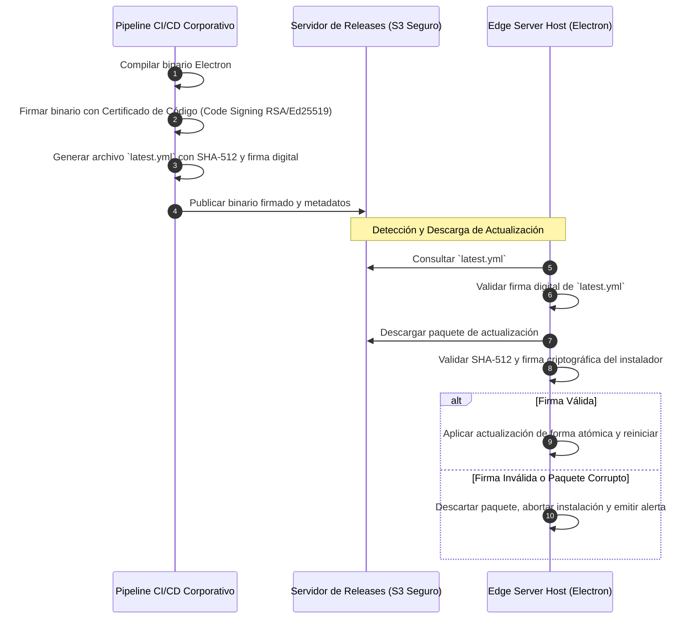

# SUPPLY CHAIN & RELEASE SECURITY SPECIFICATION — ERP RESTAURANTES

**Document ID:** `ARCH-SUP-001`  
**Version:** `1.0 DRAFT`  
**Status:** `READY FOR INDEPENDENT REVIEW`  
**Date:** 2026-09-01  
**Framework:** `EAAF v1.2.0 @ 7e036f43240b3dc28ccb996e350263598275b2cd`  
**Author Agent:** `08_Security_Architect`  
**Approved Baseline Commit:** `9d076c1a8f674b2411991b20fa4faa83b85f708a` (Tag `data-architecture-v1.0-approved`)  

---

## 1. Integridad de la Cadena de Suministro de Software (Supply Chain)

Para prevenir la introducción de dependencias maliciosas o vulnerabilidades conocidas:
1. **Lockfiles Estrictos:** Inclusión obligatoria de `package-lock.json` verificado mediante `npm ci` en todos los entornos de construcción.
2. **Escaneo Automatizado de Dependencias:** Integración en pipelines CI/CD de análisis de vulnerabilidades (SCA) y escaneo de secretos antes de compilar.
3. **Generación de SBOM (Software Bill of Materials):** Generación de inventario en formato SPDX o CycloneDX con cada versión de producción.

---

## 2. Protocolo de Confianza para Actualizaciones de Electron (Secure Auto-Updates)

Para validar que los instaladores y actualizaciones remotas distribuidas a los servidores de sucursal provienen exclusivamente de fuentes autorizadas:

---

DOCUMENT STATUS: READY FOR INDEPENDENT REVIEW
