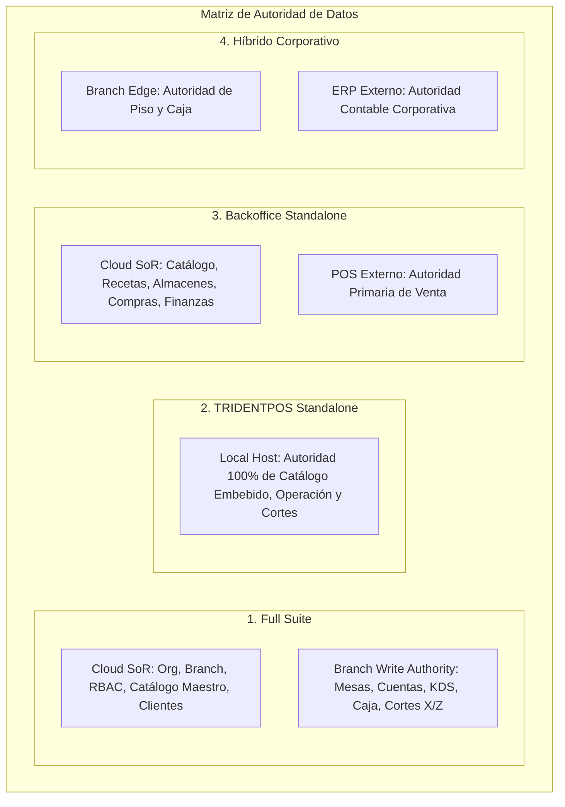
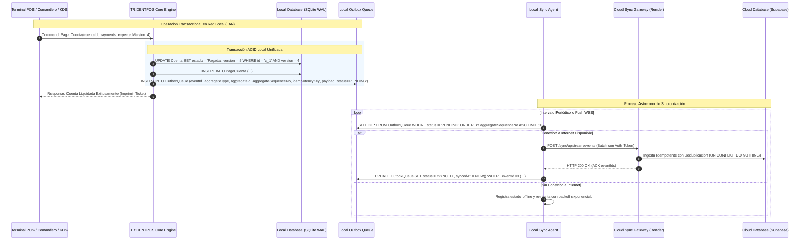
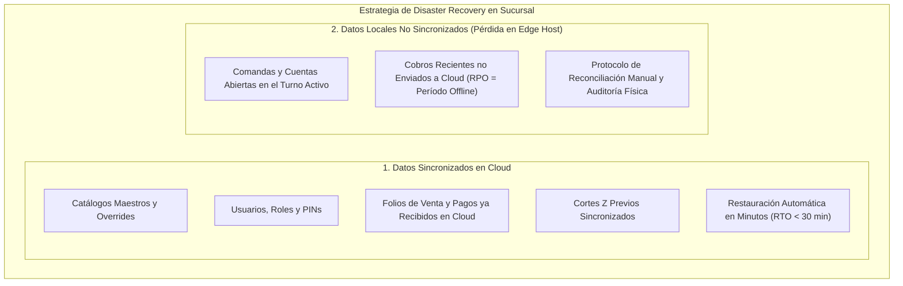

# SYNC AND OFFLINE ARCHITECTURE — ERP RESTAURANTES

**Versión:** 1.1 (SOLUTION ARCHITECTURE NORMALIZED)  
**Fecha:** 2026-08-31  
**SSOT Baseline:** [`FUNCTIONAL_ARCHITECTURE.md`](file:///Volumes/SSD_ORICO/BRAIN/TRIDENTPOSREST/FUNCTIONAL_ARCHITECTURE.md) (v1.2 APPROVED) & [`PRODUCT_DECISIONS.md`](file:///Volumes/SSD_ORICO/BRAIN/TRIDENTPOSREST/PRODUCT_DECISIONS.md) (v1.2 APPROVED).  
**Rol:** `01_Solution Architect`

---

## 1. Principio Fundamental de Autoridad de Datos por Topología

La autoridad sobre los datos se estructura según la topología de despliegue activa:



---

## 2. Patrón de Sincronización: Transactional Outbox Local

En el nodo de sucursal (`TRIDENTPOS Edge Server`), toda acción operativa se guarda atómicamente en la base de datos local junto con su registro en la cola de salida (`OutboxQueue`):



---

## 3. Idempotencia y Secuenciación Causal

### 3.1 Clave de Idempotencia Lógica (Idempotency Key)
Para evitar la duplicidad por reintentos de red, cada evento lleva una clave determinista que representa una **operación lógica única**:
$$\text{idempotencyKey} = \text{orgId} : \text{branchId} : \text{aggregateType} : \text{aggregateId} : \text{action} : \text{operationClientToken}$$

*Ejemplo:* `org_corp01:br_norte:cuenta:c_88921:pago:op_token_9912`

### 3.2 Secuenciación Causal por Agregado / Stream
> [!IMPORTANT]
> **No se utiliza UUIDv7 ni ULID como garantía de orden causal.** Aunque los identificadores basados en tiempo ayudan a la indexación, los desfases de reloj (clock skew) entre terminales móviles y el host impiden garantizar causalidad estricta mediante timestamps.
> 
> La causalidad se garantiza mediante **`aggregateSequenceNumber`** (número secuencial monotónico incremental por agregado) o **`streamOffset`** gestionado por el Edge Server local.

```json
{
  "eventId": "01J6X7A8B9C0D1E2F3G4H5J6K7",
  "organizationId": "org_corporativo_01",
  "branchId": "branch_norte_05",
  "aggregateType": "Cuenta",
  "aggregateId": "acc_88921",
  "aggregateSequenceNo": 14,
  "aggregateVersion": 5,
  "eventType": "CuentaPagada",
  "timestamp": "2026-08-31T19:15:30.124Z",
  "idempotencyKey": "org_corp01:br_norte:cuenta:acc_88921:pago:op_9912",
  "payload": {
    "folioVenta": "A-000492",
    "total": 540.00,
    "propina": 54.00,
    "formaPago": [
      { "tipo": "EFECTIVO", "monto": 200.00 },
      { "tipo": "TARJETA_CREDITO", "monto": 394.00, "autorizacion": "084129" }
    ],
    "turnoId": "shift_20260831_caja1_01"
  }
}
```

---

## 4. Durabilidad de SQLite en Borde: Análisis de Modos de Sincronización

En el nodo Edge de sucursal, la selección de parámetros de SQLite implica un compromiso directo entre rendimiento de disco y durabilidad ante cortes de energía:

| Configuración SQLite | Mecanismo de Disco | Nivel de Durabilidad | Riesgo ante Pérdida Súbita de Energía | Caso de Uso |
|---|---|---|---|---|
| `journal_mode = WAL` + `synchronous = NORMAL` | Realiza fsync principalmente en los checkpoints del WAL. Las escrituras en WAL no hacen fsync por cada commit. | Resistente a caídas de la aplicación y del sistema operativo. Muy alto rendimiento de escritura. | **Riesgo:** Si el equipo pierde energía de golpe y la unidad SSD tiene caché de escritura volátil sin respaldo de batería, pueden perderse las últimas transacciones no descargadas al medio físico. | Modo estándar para operaciones de alta velocidad en horas pico. |
| `journal_mode = WAL` + `synchronous = FULL` | Realiza fsync explícito en cada commit de transacción en el archivo WAL. | Máxima durabilidad transaccional en disco. Menor rendimiento bajo ráfagas intensas. | **Sin pérdida de commits confirmados:** Las transacciones confirmadas quedan selladas físicamente en el almacenamiento antes de retornar ACK. | Recomendado para operaciones críticas (emisión de Corte Z, arqueo final de caja). |

> [!CAUTION]
> **Requisito de Validación:** Es **obligatorio ejecutar pruebas automatizadas de corte de energía (power-loss testing)** sobre el hardware objetivo seleccionado para validar el comportamiento real del controlador de disco ante apagones intempestivos.

---

## 5. Estrategia de Recuperación ante Desastres (Disaster Recovery)

En caso de **destrucción total, daño irreversible o robo del equipo Edge Host** de la sucursal, se aplica una estrategia diferenciada entre datos ya sincronizados y datos locales no sincronizados:



### 5.1 Objetivos Conceptuales de RPO y RTO

| Escenario de Desastre | RPO Conceptual (Pérdida Máxima de Datos) | RTO Conceptual (Tiempo Máximo de Recuperación) |
|---|---|---|
| **Reinicio tras Caída de Software / Apagón con UPS** | **RPO = 0** (Sin pérdida de datos; SQLite WAL recupera estado) | **RTO < 3 minutos** (Reinicio del Edge Host y reconexión LAN) |
| **Pérdida Total de Hardware del Edge Host (Robo / Destrucción)** | **RPO = Ventana de eventos offline no sincronizados** (0 si había enlace a internet activo al momento del siniestro) | **RTO < 30 minutos** (Instalación de nueva máquina, provisión de credenciales y descarga de catálogo desde Cloud) |

### 5.2 Protocolo de Reconciliación ante Pérdida de Datos No Sincronizados
Si el hardware del Edge Host se pierde durante una caída prolongada de internet con transacciones pendientes en el Outbox:
1. **Aprovisionamiento de Nuevo Nodo:** Se instala la aplicación en una máquina de reemplazo, se autentica con la Organización y Sucursal, y se descarga la configuración base.
2. **Reconciliación de Folios Consecutivos:** La nube asigna el siguiente rango de Folios de Venta y número de Corte Z garantizando que no existan duplicidades con los folios históricos.
3. **Reconstrucción Contable y Auditoría:**
   - **Comprobantes Bancarios:** Se cotejan los vouchers físicos de las terminales PinPAD bancarias o el reporte del adquirente.
   - **Efectivo en Cajón:** Se realiza un arqueo físico del efectivo disponible en el cajón de dinero.
   - **Registro de Regularización:** El Gerente emite un `TurnoDeAjustePorContingencia` en el nuevo nodo para registrar los ingresos físicos reconstruidos y balancear la tesorería.

---

SYNC AND OFFLINE ARCHITECTURE V1.1: READY FOR FINAL APPROVAL
