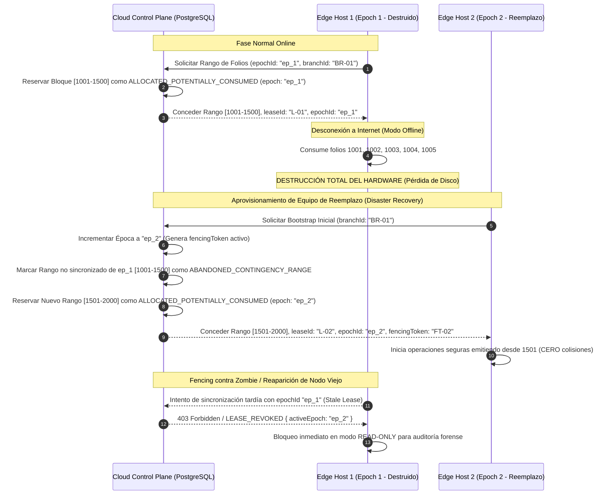

# SYNC AND OFFLINE ARCHITECTURE — ERP RESTAURANTES

**Document ID:** `ARCH-SYNC-001`  
**Version:** `1.3 NORMALIZED / REMEDIATED`  
**Status:** `READY FOR INDEPENDENT REVIEW`  
**Date:** 2026-09-01  
**Baseline:** `EAAF v1.2.0 @ 7e036f43240b3dc28ccb996e350263598275b2cd`  
**Supersedes:** `SYNC_AND_OFFLINE_ARCHITECTURE.md v1.1`  

---

## 1. Protocolo de Continuidad Segura de Folios y Recuperación ante Desastres (REM-01)

### Planteamiento del Problema
Cuando una sucursal pierde conectividad a internet, el Edge Host continúa emitiendo tickets y comandas. Si el equipo sufre una pérdida total (destrucción física, daño irrecuperable de disco o robo) antes de sincronizar sus últimas transacciones, un equipo de reemplazo no puede reutilizar los números de folio emitidos localmente.

### Arquitectura de Rangos Preasignados con Épocas (`epochId`) y Fencing Tokens
Para resolver este problema de manera matemáticamente estricta:



### Reglas del Protocolo de Folios
1. **Asignación en Cloud:** Cloud reserva bloques finitos de folios (ej. 500 folios) marcándolos en base de datos como `ALLOCATED_POTENTIALLY_CONSUMED` vinculado a un `epochId` y `leaseId` antes de su uso local.
2. **Operación Offline:** El Edge Host consume números secuencialmente dentro de su rango concedido.
3. **Pérdida Total y Reemplazo:** Al registrar un nuevo Edge Host, Cloud incrementa la época (`epochId`), invalida el lease previo y marca el rango anterior como `ABANDONED_CONTINGENCY_RANGE`. Estos folios **nunca se reasignan silenciosamente**.
4. **Fencing de Nodos Antiguos (Zombie Protection):** Si el nodo antiguo reaparece, toda comunicación hacia Cloud es rechazada con `403 LEASE_REVOKED` debido a disparidad de épocas (`ep_1 < ep_2`), forzando al nodo a entrar en modo solo-lectura protegido.
5. **Protocolo de Reconciliación Manual y Auditoría Física:** Los folios pertenecientes al rango de contingencia abandonado se concilian contablemente mediante el cotejo de vouchers bancarios físicos de PinPAD, arqueo de efectivo en caja y registro de un `TurnoDeAjustePorContingencia` en Cloud.

---

## 2. Idempotencia Lógica, Secuenciación Causal y Semántica de ACK (REM-04)

### Estructura de Clave de Idempotencia y Ciclo de Vida de `clientOpId`
$$\text{idempotencyKey} = \text{orgId} : \text{branchId} : \text{aggregateType} : \text{aggregateId} : \text{action} : \text{clientOpId}$$

- **`clientOpId`:** UUIDv4 generado determinísticamente por el dispositivo cliente en el instante de la acción del usuario y persistido localmente antes del envío por red.
- **Regla de Reintentos:** Se reutiliza exactamente el mismo `clientOpId` en cualquier reintento o reconexión de red. Queda estrictamente prohibido regenerar un `clientOpId` por timeouts de red sin una nueva acción explícita del usuario.
- **Almacenamiento y Retención:** Cloud almacena los hashes de idempotencia en la tabla `IngestedIdempotencyLog` con retención mínima de **90 días**. Si se recibe una clave duplicada, Cloud retorna el resultado persistido previamente sin reejecutar efectos secundarios (`DUPLICATE_ACCEPTED`).

### Orden Causal y Buffer de Reordenamiento de Secuencias
- Cada agregado (ej. `Cuenta`, `TurnoCaja`) mantiene un contador monotónico `aggregateSequenceNumber` gestionado por el host local.
- **Manejo de Gaps / Desorden en Cloud:**
  - Si `incomingSequence == expectedSequence`: Se procesa y avanza el contador.
  - Si `incomingSequence < expectedSequence`: Se clasifica como duplicado y se responde `DUPLICATE_ACCEPTED`.
  - Si `incomingSequence > expectedSequence` (Gap / Desorden): El evento se almacena temporalmente en `ReorderingBufferQueue` y se solicita al Edge el reenvío de las secuencias faltantes; no se aplica a base de datos principal hasta cerrar la brecha.

### Estados Estructurados de Confirmación (ACK)
El pipeline de sincronización utiliza estados tipados explícitos:

```text
[RECEIVED] ──> [DURABLY_STORED] ──> [APPLIED] ──> Retorna ACK de Éxito al Edge
      │                │
      │                └──> [DUPLICATE_ACCEPTED] ──> Retorna ACK de Éxito idempotente
      │
      └──> [REJECTED] / [REQUIRES_RECONCILIATION] ──> Mueve a DLQ y alerta a Admin
```

- **Criterio de Sincronizado en Edge:** El Edge Host marca un registro del outbox como `SYNCED` **únicamente** tras recibir una respuesta HTTP/WSS con estado `APPLIED` o `DUPLICATE_ACCEPTED` acompañada de la firma de transacción en Cloud.

### Eventos Venenosos y Dead Letter Queue (DLQ)
- Todo evento con error irrecuperable de validación o que supere **5 reintentos con backoff exponencial** se transfiere a la tabla `CloudIntegrationDLQ`.
- La DLQ almacena el payload crudo, código de error, traza y requiere autorización expresa de un administrador para su reejecución o descarte auditado.

---

## 3. Durabilidad y Almacenamiento en Borde (SQLite 3 WAL) (REM-07)

### Configuración del Motor
- **Modo de Journal:** `PRAGMA journal_mode = WAL;` (Lecturas concurrentes sin bloqueo).
- **Modo de Sincronización:**
  - `PRAGMA synchronous = NORMAL;` para operaciones operativas de alta frecuencia (mesas, KDS, comanderos).
  - `PRAGMA synchronous = FULL;` (forzando fsync a disco) para transacciones financieras críticas: **Cierre de Turno de Caja**, **Corte X** y **Corte Z**.

### Supuestos de Hardware y Protección de Disco
1. **Dependencia de UPS y Almacenamiento:** Para evitar pérdida de escrituras pendientes en caches volátiles de SSDs comerciales ante apagones repentinos, se establece como prerrequisito que el equipo host cuente con respaldo de energía mediante UPS/No-Break.
2. **Política de Checkpointing WAL:** Ejecución pasiva de checkpoint cada 1,000 páginas y forzado manual al finalizar cada turno de caja.
3. **Monitoreo de Espacio en Disco:**
   - *Alerta Temprana:* Espacio libre < 15%.
   - *Modo de Emergencia:* Espacio libre < 5% activa modo de solo-lectura y suspensión de comandas nuevas hasta liberar espacio de logs.
4. **Detección y Recuperación de Corrupción:** Ejecución diaria de `PRAGMA integrity_check`. En caso de detección de corrupción física, el sistema restaura el último snapshot local íntegro y solicita a Cloud el reenvío de deltas mediante el protocolo de recuperación.
5. **Certificación Obligatoria:** `REQUIRES HARDWARE POWER-LOSS VALIDATION ON TARGET POS DEVICES`.

---

## 4. Sincronización Descendente Cloud → Edge y Snapshots Económicos (REM-10)

1. **Distribución de Catálogos y Configuración:**
   - Cloud emite deltas versionados (`snapshotVersion`, `deltaVersion`) para productos, categorías, menús, modificadores, listas de precios, branch overrides y roles.
   - El Edge Host aplica los deltas en una transacción atómica local utilizando tablas de staging con verificación de checksum antes de la activación.
2. **Preservación Obligatoria del Snapshot Económico en Cuentas Abiertas:**
   - Toda comanda o cuenta abierta en el restaurante almacena una copia inmutable (*frozen economic snapshot*) de: `nombre de producto`, `precio unitario vigente al ordenar`, `tasa de impuesto aplicada`, `precios de modificadores` y `descuentos`.
   - Una actualización de precios o catálogo en Cloud **NUNCA modifica retroactivamente el importe de una cuenta abierta en el restaurante**.

---

## 5. Arquitectura de Identidad y Autorización Offline (REM-09)

1. **Credenciales en Caché Local:** Hashes salteados (Argon2id) de PIN de empleados almacenados localmente.
2. **Snapshot de RBAC:** Permisos locales indexados con `snapshotVersion`, `issuedAt` y `expiresAt`.
3. **Ventana Máxima de Desconexión:** Configurada en **72 horas**. Al expirar, las operaciones sensibles quedan bloqueadas hasta reconectar con Cloud o ingresar el PIN de autorización de Gerente General.

---

## 6. Metas y Calibración de Disponibilidad y RPO/RTO (REM-06)

| Escenario de Falla | RPO Target | RTO Target | Estrategia de Mitigación |
|---|---|---|---|
| **Caída de Enlace a Internet** | RPO = 0 (Local) | RTO = 0 (Ininterrumpido) | Operación autónoma en Edge Host con SQLite WAL local. |
| **Reinicio de Software / Crash Local con UPS** | RPO = 0 (Local) | RTO < 3 min | Recuperación automática del proceso Node.js y replay de WAL. |
| **Pérdida Total de Hardware del Edge Host** | RPO = Intervalo offline no sincronizado | RTO < 30 min | Aprovisionamiento de nuevo hardware, bootstrap desde Cloud + Protocolo de Reconciliación Manual y Auditoría Física. |

*Nota:* Las métricas de RTO/RPO representan objetivos de diseño y requieren validación formal mediante pruebas de contingencia (`REQUIRES DR VALIDATION`).

---

DOCUMENT STATUS: READY FOR INDEPENDENT REVIEW
