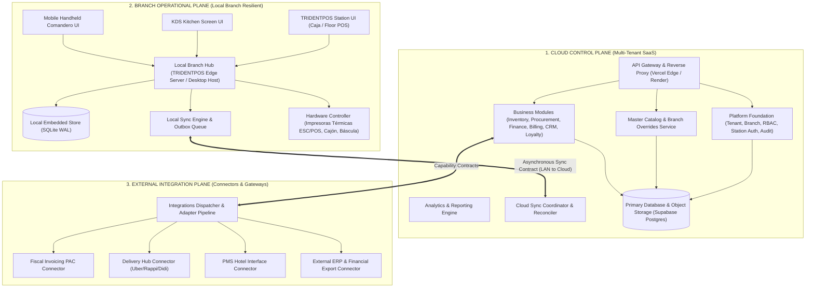
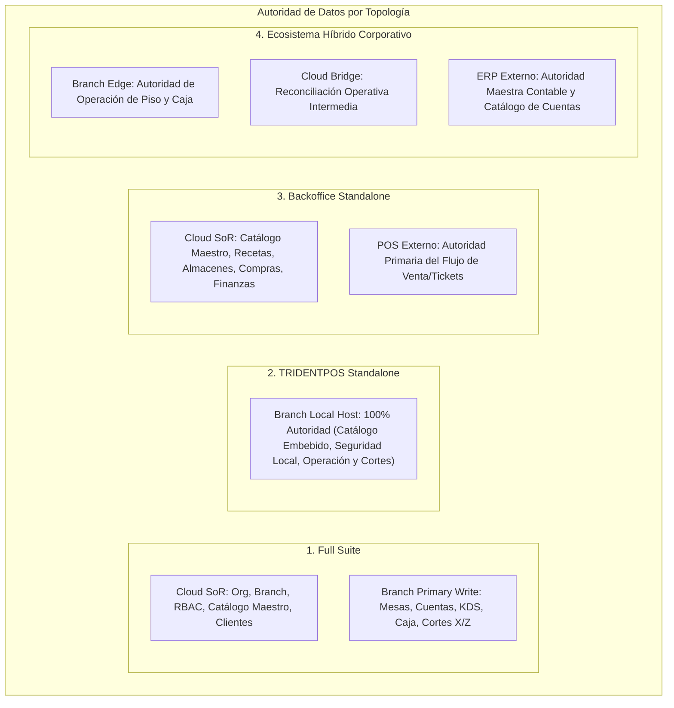

# SYSTEM CONTEXT — ERP RESTAURANTES

**Versión:** 1.1 (SOLUTION ARCHITECTURE NORMALIZED)  
**Fecha:** 2026-08-31  
**SSOT Baseline:**  
- [`RESTAURANT_SOFTWARE_RECONSTRUCTION_SPEC.md`](file:///Volumes/SSD_ORICO/BRAIN/TRIDENTPOSREST/RESTAURANT_SOFTWARE_RECONSTRUCTION_SPEC.md) (v1.1 APPROVED)  
- [`FUNCTIONAL_ARCHITECTURE.md`](file:///Volumes/SSD_ORICO/BRAIN/TRIDENTPOSREST/FUNCTIONAL_ARCHITECTURE.md) (v1.2 APPROVED)  
- [`PRODUCT_SCOPE.md`](file:///Volumes/SSD_ORICO/BRAIN/TRIDENTPOSREST/PRODUCT_SCOPE.md) (v1.2 APPROVED)  
- [`PRODUCT_DECISIONS.md`](file:///Volumes/SSD_ORICO/BRAIN/TRIDENTPOSREST/PRODUCT_DECISIONS.md) (v1.2 APPROVED)  
- [`MODULE_CATALOG.md`](file:///Volumes/SSD_ORICO/BRAIN/TRIDENTPOSREST/MODULE_CATALOG.md) (v1.2 APPROVED)  
- [`CAPABILITY_MAP.md`](file:///Volumes/SSD_ORICO/BRAIN/TRIDENTPOSREST/CAPABILITY_MAP.md) (v1.2 APPROVED)  
- [`OPEN_QUESTIONS.md`](file:///Volumes/SSD_ORICO/BRAIN/TRIDENTPOSREST/OPEN_QUESTIONS.md) (v1.1 APPROVED)  
**Rol:** `01_Solution Architect`

---

## 1. Declaración de Misión y Contexto del Sistema

**`ERP RESTAURANTES`** es una plataforma de software modular para la gestión integral de operaciones gastronómicas, cadena de suministro, finanzas y control multi-sucursal. El sistema está diseñado para resolver la necesidad operativa crítica de la industria de hospitalidad: **garantizar alta disponibilidad y baja latencia en piso, cocina y caja durante contingencias de red local o caídas de internet**, manteniendo la centralización del gobierno de catálogos, consolidación financiera, abastecimiento y analítica en la nube.

---

## 2. Diagrama de Contexto del Sistema (C4 Context Level)

```mermaid
C4Context
    title Diagrama de Contexto del Sistema — ERP RESTAURANTES

    Person(admin, "Administrador Corporativo", "Gestiona organización, sucursales, catálogo maestro, seguridad y consolidados.")
    Person(manager, "Gerente de Sucursal", "Supervisa turnos, autorizaciones de seguridad, cancelaciones y arqueos.")
    Person(cashier, "Cajero / Operador POS", "Abre turnos, cobra cuentas, efectúa movimientos de efectivo y emite Cortes X/Z.")
    Person(waiter, "Mesero / Garzón", "Abre mesas, comanda modificadores y gestiona precuentas.")
    Person(cook, "Personal de Cocina", "Visualiza y confirma preparación de comandas en KDS.")
    Person(customer, "Comensal / Cliente", "Consulta menú y lealtad; solicita autofacturación web [PROPOSED / FUTURE].")

    Enterprise_Boundary(b0, "Ecosistema ERP RESTAURANTES") {
        System(cloud_plane, "Cloud Control Plane", "Backoffice SaaS multi-tenant, catálogos maestros, consolidación, BI y contratos de sincronización.")
        System(branch_plane, "Branch Operational Plane (TRIDENTPOS)", "Nodo local de sucursal: operaciones de piso, KDS, caja y persistencia resiliente LAN.")
        System(integrations_plane, "External Integration Plane", "Pasarela de conectores, transformación de formatos y webhooks externos.")
    }

    System_Ext(pac, "PAC / Autoridad Tributaria", "Servicio de timbrado de comprobantes fiscales digitales (CFDI / Fiscal Internacional).")
    System_Ext(pinpad, "Pasarela Bancaria / PinPAD", "Procesamiento de pagos con tarjetas de crédito/débito.")
    System_Ext(aggregators, "Agregadores de Delivery", "Uber Eats, Rappi, Didi Food y hubs de pedidos (Deliverect/Ordatic).")
    System_Ext(pms, "PMS Hotelero", "Sistemas de gestión hotelera (Opera, protel) para cargos a habitación.")
    System_Ext(ext_erp, "ERP Corporativo Externo", "SAP, Odoo, Dynamics, ContPAQi para pólizas contables e inventarios.")

    Rel(admin, cloud_plane, "Administra y consulta consolidados vía", "HTTPS / Web Browser")
    Rel(manager, cloud_plane, "Parametriza sucursal y audita reportes vía", "HTTPS / Web Browser")
    Rel(manager, branch_plane, "Supervisa y autoriza en piso vía", "LAN / Fast PIN")
    Rel(cashier, branch_plane, "Opera caja, cobra y emite Cortes X/Z vía", "LAN / POS Terminal")
    Rel(waiter, branch_plane, "Comanda y divide cuentas vía", "WiFi Local / Tablet")
    Rel(cook, branch_plane, "Despacha órdenes vía", "LAN / KDS Touch")
    Rel(customer, cloud_plane, "Autofactura [PROPOSED] y consulta puntos vía", "HTTPS / Portal Web")

    Rel(branch_plane, cloud_plane, "Sincroniza eventos y catálogos de forma asíncrona vía", "HTTPS / Secure WebSocket")
    Rel(integrations_plane, cloud_plane, "Intercambia eventos de negocio con", "Internal Bus / RPC Contracts")
    Rel(integrations_plane, pac, "Timbra y valida facturas fiscales vía", "HTTPS / SOAP / REST")
    Rel(branch_plane, pinpad, "Procesa transacciones bancarias vía", "LAN / TCP / Serial")
    Rel(integrations_plane, aggregators, "Ingesta órdenes y actualiza menús vía", "Webhooks / REST API")
    Rel(integrations_plane, pms, "Valida huéspedes y carga consumos vía", "TCP / Web Services")
    Rel(integrations_plane, ext_erp, "Exporta pólizas y sincroniza maestros vía", "REST API / SFTP")
```

---

## 3. Planos Arquitectónicos del Sistema

Para garantizar el cumplimiento de los principios de diseño y aislamiento operativo, la arquitectura de solución se divide formalmente en tres planos:

### 3.1 Cloud Control Plane
- **Naturaleza:** Entorno centralizado multi-tenant alojado en la nube.
- **Responsabilidades:**
  - Gobierno de organizaciones, sucursales, usuarios, permisos (RBAC) y licenciamiento.
  - Gestión y versionado del Catálogo Maestro unificado y distribución de branch overrides.
  - Ejecución de procesos de cadena de suministro (Procurement), contabilidad/tesorería (Finance), facturación electrónica (Billing), fidelización (Loyalty) y tableros analíticos consolidados (Analytics).
  - Coordinación de sincronización, ingesta idempotente de eventos de sucursales y reconciliación contable.

### 3.2 Branch Operational Plane (TRIDENTPOS)
- **Naturaleza:** Entorno de ejecución en el borde (Edge / On-Premise) desplegado dentro de la red local (LAN) de cada sucursal física.
- **Responsabilidades:**
  - Operación en tiempo real de Servicio Comedor, Servicio Rápido, Comandero Móvil, KDS y Caja.
  - Control de estados de mesa, apertura/edición/cierre de cuentas con control de concurrencia optimista y asignación de folios de venta.
  - Gestión integral de turnos de caja, fondo inicial, movimientos de efectivo, arqueo ciego y **emisión autónoma de Cortes X y Z**.
  - Control de hardware de sucursal: impresoras térmicas de tickets y comandas (ESC/POS), cajones de dinero, básculas y terminales bancarias PinPAD locales.
  - Persistencia local transaccional y cola de eventos de salida (Outbox).

### 3.3 External Integration Plane
- **Naturaleza:** Capa especializada de adaptadores y conectores desacoplados.
- **Responsabilidades:**
  - Gestión de credenciales de plataformas externas, tokens de acceso y certificados digitales.
  - Normalización bidireccional de datos: traducción entre los modelos canónicos internos y los esquemas propietarios de agregadores (Uber/Rappi/Didi), PACs fiscales y sistemas hoteleros (PMS).
  - Aislamiento de fallas para proteger la estabilidad del núcleo de la aplicación.

---

## 4. Autoridad de Datos por Topología de Despliegue

La autoridad de datos sobre las entidades del sistema se define de forma explícita según la topología operativa:

| Dominio / Entidad | Full Suite | TRIDENTPOS Standalone | Backoffice Standalone | Híbrido (TRIDENT + ERP Externo) |
|---|---|---|---|---|
| **Estructura Org & Sucursales** | Cloud Plane | Local Host (Embebido) | Cloud Plane | Cloud Plane / ERP Externo |
| **Identidad & RBAC** | Cloud Plane (Downstream) | Local Host | Cloud Plane | Cloud Plane / Directorio Corporativo |
| **Catálogo Maestro & Precios Base** | Cloud Plane (Downstream) | Local Host | Cloud Plane | ERP Externo -> Cloud Plane |
| **Branch Overrides** | Cloud Plane (Downstream) | Local Host | N/A | Cloud Plane -> Branch |
| **Mesas, Cuentas & Comandas** | Branch Edge (Upstream) | Local Host | POS Externo | Branch Edge |
| **KDS (Estados de Cocina)** | Branch Edge (Upstream) | Local Host | N/A / POS Externo | Branch Edge |
| **Turnos de Caja & Arqueos** | Branch Edge (Upstream) | Local Host | POS Externo | Branch Edge |
| **Cortes X y Cortes Z** | Branch Edge (Emisor) / Cloud (Consumidor) | Local Host | POS Externo | Branch Edge (Emite) -> ERP (Póliza) |
| **Recetas, Kárdex & Existencias** | Cloud Plane (Procesador) | N/A | Cloud Plane | Cloud Plane / ERP Externo |
| **Órdenes de Compra & CxP** | Cloud Plane | N/A | Cloud Plane | ERP Externo |
| **Facturación Fiscal** | Cloud Plane | N/A / Emisor Local | Cloud Plane | Cloud Plane / ERP Externo |

---

## 5. Actores del Sistema y Canales de Acceso

| Actor / Rol | Canal de Acceso Primario | Protocolo / Plano | Modo Operativo Local |
|---|---|---|---|
| **Administrador Corporativo** | Backoffice Web (SaaS) | HTTPS / Cloud Plane | Acceso vía Cloud |
| **Gerente de Sucursal** | Web Backoffice / Terminal POS | HTTPS (Cloud) / HTTP-WS (LAN) | Totalmente operativo en LAN |
| **Cajero** | Terminal POS de Caja | HTTP / WebSocket (LAN) | Operativo en red local |
| **Mesero / Garzón** | Tablet / Móvil (Comandero) | WebSocket / HTTP (LAN WiFi) | Operativo en red WiFi local |
| **Personal de Cocina** | Monitor Táctil KDS | WebSocket / HTTP (LAN) | Operativo en red local |
| **Almacenista** | Backoffice Web / Terminal | HTTPS (Cloud) / LAN | Consultas locales / sync cloud |
| **Comensal (Autofacturación)** | Portal Web Público `[PROPOSED / FUTURE]` | HTTPS / Cloud Plane | Requiere conexión a Internet |
| **Repartidor Propio** | Terminal POS / Dispositivo Móvil | HTTP (LAN / Celular) | Despacho local / Liquidación LAN |

---

## 6. Suposiciones Arquitectónicas y Restricciones de Solución

1. **Tolerancia a Fallas de Telecomunicaciones:** La conexión a internet en entornos de hospitalidad es variable. Ninguna acción en la mesa, comanda a cocina, cobro en efectivo ni corte de caja se bloquea esperando confirmación de la nube.
2. **Aislamiento Físico de Periféricos:** Las impresoras de tickets, cajones de dinero e impresoras de cocina responden a comandos sobre la red local (Ethernet / USB / Serial) y no dependen de servicios de impresión cloud.
3. **Consistencia Eventual:** Los datos operativos generados en sucursal convergen hacia la nube de manera asíncrona mediante ingesta idempotente y secuenciación por agregado.
4. **Preservación de Preguntas de Negocio Abiertas:** Las cuestiones funcionales registradas en `OPEN_QUESTIONS.md` se implementan como puntos de extensión y políticas parametrizables sin asumir reglas de negocio fijas.

---

SYSTEM CONTEXT V1.1: READY FOR FINAL APPROVAL
