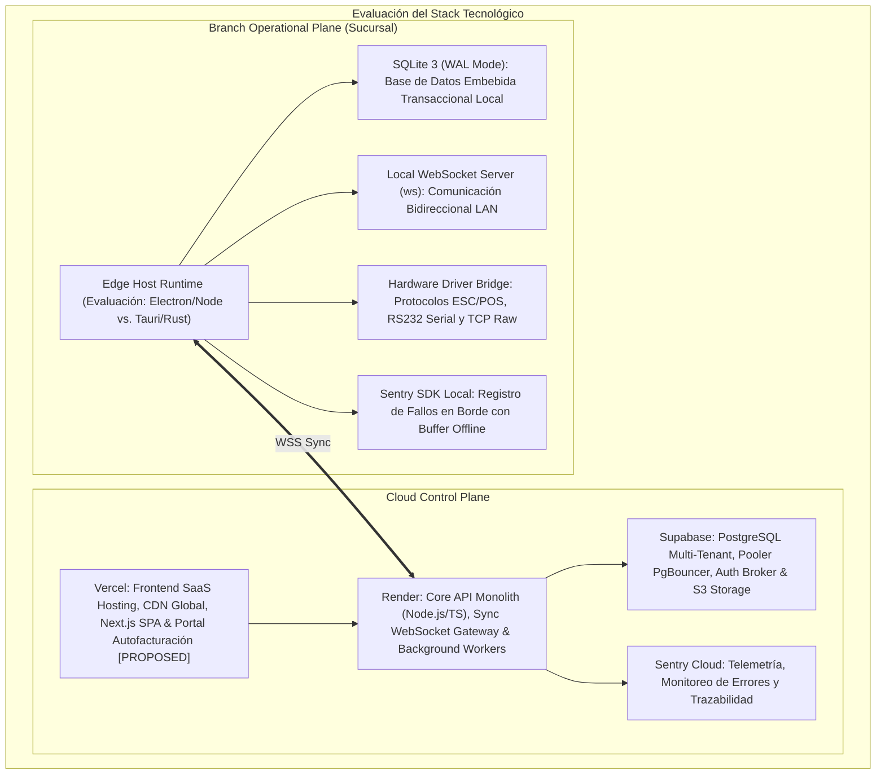

# TECH STACK DECISIONS — ERP RESTAURANTES

**Versión:** 1.1 (SOLUTION ARCHITECTURE NORMALIZED)  
**Fecha:** 2026-08-31  
**SSOT Baseline:** [`FUNCTIONAL_ARCHITECTURE.md`](file:///Volumes/SSD_ORICO/BRAIN/TRIDENTPOSREST/FUNCTIONAL_ARCHITECTURE.md) (v1.2 APPROVED).  
**Rol:** `01_Solution Architect`

---

## 1. Evaluación del Stack Tecnológico Objetivo

Para `ERP RESTAURANTES`, se ha evaluado la combinación del Cloud Plane (**`Vercel + Render + Supabase + Sentry`**) y las alternativas del Edge Host Runtime en sucursal (**`Electron/Node` vs. `Tauri/Rust`**).

---

## 2. Componentes Cloud: Justificación y Responsabilidades

### 2.1 Vercel (Capa de Presentación y Distribución Global)
- **Rol:** Hospeda la aplicación web administrativa (Backoffice SPA) y el portal público de autofacturación `[PROPOSED / FUTURE]`.
- **Justificación:** Distribución en CDN global, renderizado híbrido con Next.js y aislamiento del frontend respecto a la carga transaccional del backend.

### 2.2 Render (Capa de Cómputo Backend y Workers)
- **Rol:** Ejecuta el contenedor del Monolito Modular (Node.js/TypeScript), el Gateway de Sincronización WebSocket (`WSS`) y Workers de integración en segundo plano.
- **Justificación:** Soporte de conexiones WebSocket persistentes para sincronización con sucursales, procesos en segundo plano para tareas asíncronas y despliegues reproducibles.

### 2.3 Supabase (Capa de Datos, Almacenamiento y Seguridad)
- **Rol:** Base de datos principal relacional (PostgreSQL), gestión de archivos y autenticación.
- **Justificación:**
  - **PostgreSQL Relacional:** Motor ACID con soporte de transacciones complejas, JSONB indexado para catálogos y esquemas fiscales.
  - **PgBouncer / Pooler:** Manejo eficiente de conexiones concurrentes provenientes de los servicios backend.
  - **Supabase Storage:** Almacenamiento de XMLs de facturas fiscales, PDFs y recursos multimedia.
  - **Row Level Security (RLS):** Garantía a nivel de motor de aislamiento de datos entre Tenants (`OrganizationId`).

### 2.4 Sentry (Observabilidad, Telemetría y Monitoreo de Errores)
- **Rol:** Monitoreo transversal de excepciones, salud de sincronización, cuellos de botella de rendimiento y caídas en cloud y sucursales.
- **Justificación:** Trazabilidad distribuida para rastrear eventos desde el comandero móvil en sucursal hasta el procesamiento en la nube, con alertas automáticas.

---

## 3. Comparativa del Runtime del Edge Host en Sucursal: Electron/Node vs. Tauri/Rust

| Criterio de Evaluación | Alternativa A: Electron / Node.js (Baseline Actual) | Alternativa B: Tauri / Rust (Alternativa de Alto Rendimiento) |
|---|---|---|
| **Consumo de Memoria RAM** | ~150 MB - 300 MB por proceso (V8 + Chromium embebido). | ~30 MB - 60 MB (Utiliza webview nativo del SO + binario Rust). |
| **Velocidad y Latencia de Ejecución** | Alta (Node.js I/O no bloqueante con V8 JIT). | Ultra-alta (Código máquina nativo compilado en Rust). |
| **Integración con Periféricos Locales** | Excelente: Ecosistema maduro de paquetes npm para ESC/POS, RS232 serial y raw TCP. | Excelente pero requiere desarrollo nativo en Rust para librerías de hardware específicas. |
| **Velocidad de Desarrollo y Ecosistema** | **Muy Alta:** Mismo lenguaje (TypeScript) y librerías compartidas entre Cloud y Edge. | **Media:** Requiere dominio avanzado de Rust y gestión de bindings FFI. |
| **Despliegue e Instalador** | Paquetes instalables (~80-120 MB) para Windows / Linux / macOS. | Binarios extremadamente ligeros (~10-20 MB). |
| **Veredicto Arquitectónico** | **ADOPTADA COMO BASELINE:** Permite reutilizar modelos y contratos TypeScript entre Cloud y Edge con máxima velocidad de entrega. | **EVALUADA PARA FASE AVANZADA:** Si el benchmark en terminales POS de gama muy baja (<= 2GB RAM) muestra saturación de memoria, se migrará el host a Tauri. |

---

## 4. Almacenamiento Local en Sucursal: SQLite 3 y Durabilidad

- **Motor Seleccionado:** **SQLite 3 con WAL (Write-Ahead Logging)**.
- **Justificación:** Cero configuración de administración, embebido en proceso, transaccional ACID y resistente a fallos de software.
- **Estrategia de Durabilidad:**
  - `synchronous = NORMAL` para operaciones continuas de comandas y mesas.
  - `synchronous = FULL` para operaciones financieras críticas (Cierre de Turno y emisión de Corte Z).
  - **Validación Requerida:** Ejecución de pruebas de corte de energía (power-loss testing) en hardware objetivo antes del despliegue en producción.

---

TECH STACK DECISIONS V1.1: READY FOR FINAL APPROVAL
