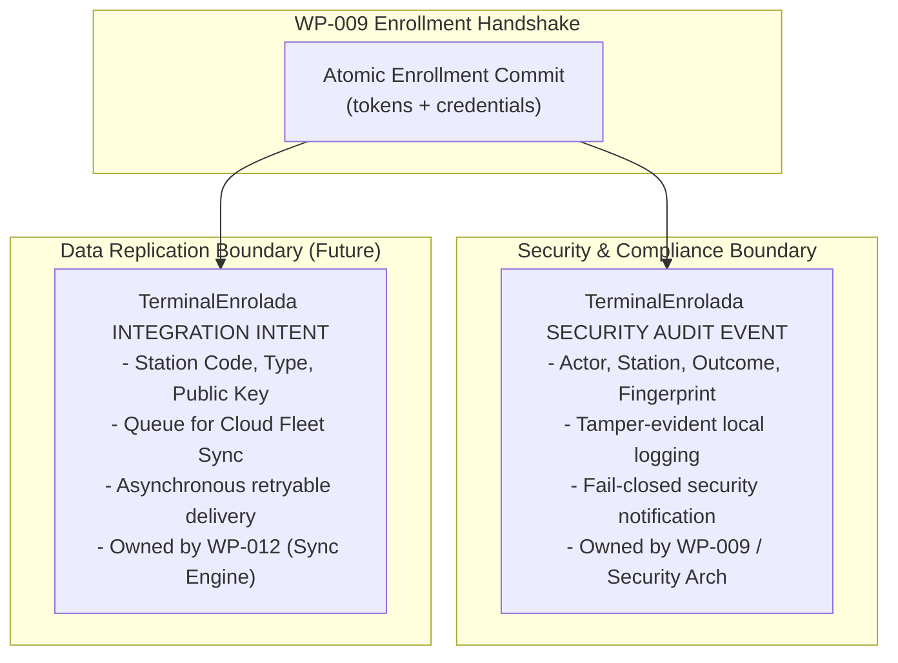

# WP-009 DATA AUTHORITY & TRANSACTION BOUNDARY CLARIFICATION (R2)

**Document ID:** `DATA-ARCH-WP009-CLA-002`  
**Version:** `2.0 PROPOSAL`  
**Date:** 2026-09-11  
**Framework:** `EAAF v1.2.0 @ 7e036f43240b3dc28ccb996e350263598275b2cd`  
**Author Agent:** `03_Data_Architect — WP-009 DATA AUTHORITY CLARIFICATION R2`  
**Scope:** Architecture Clarification Only — No Application Code Modified — No Implementation Review  

---

## 1. Governance Baseline & Remediation Context

### 1.1 Baseline Identifiers
- **Canonical Repository:** `https://github.com/Lucas030509/TRIDENTPOS.git`
- **Canonical Main SHA (G8):** `bb44f35bbe459ae86869b541e42dea12fc8173f8` (Merge commit of PR #27 / WP-008 closure)
- **Reviewed Implementation Trigger (S9-R1):** `6b7fc1982e04872fa9255a701cb978380376807d` (`fix(edge): [WP-009-R1] address quick integrity check findings and harden security boundaries`)
- **Previous Clarification Artifact:** `evidence/WP-009_DATA_AUTHORITY_CLARIFICATION_R1.md`
- **Clarification Disposition:** `NOT YET APPROVED — CLARIFICATION REVISION REQUIRED (COORDINATOR DIRECTIVE R2)`
- **Target PR:** PR #28 (Open, targeting `main`, not modified by this clarification)

### 1.2 Purpose & Scope Boundaries
This document is exclusively an architectural clarification revision (R2) authored by `03_Data_Architect`. In compliance with the Coordinator Remediation Directive:
- It does **not** evaluate PR #28 for merge.
- It does **not** repair or alter application source code.
- It does **not** grant implementation PASS.
- It does **not** claim retroactive authority for unapproved proposals.
- It provides rigorous provenance classification for all data topology claims, strictly separates durable device identity from ephemeral session state, establishes the boundary between WP-009 and WP-012, and specifies the exact amendments required for formal Product Owner Governance Synthesis via `ACR-2026-011`.

---

## 2. Preserved Accepted R1 Architectural Invariants

The following architectural conclusions established in R1 are fully preserved:

### 2.1 Mandatory Atomic Transaction Invariant (`DATA-INV-WP009-01`)
Enrollment of a station on the Edge Host requires the following operations to execute within a **single, atomic SQLite WAL transaction (`BEGIN IMMEDIATE ... COMMIT`)**:
1. Validate pairing token state, tenant/branch context, and cryptographic expiration (`consumed_at IS NULL AND now < expires_at`);
2. Guarded Compare-And-Swap (CAS) consumption (`UPDATE enrollment_tokens SET consumed_at = :now WHERE pairing_id = :id AND consumed_at IS NULL`);
3. Station credential persistence (`INSERT INTO station_credentials ...`);
4. Binding of the physical pairing session to the newly registered station identity.

```text
================================================================================
TRANSACTION INVARIANT: ALL COMMIT OR NONE COMMIT
================================================================================
If station credential persistence fails (due to constraint violation, storage I/O,
process crash, or unexpected exception), the entire transaction MUST ROLLBACK.
consumed_at MUST REMAIN NULL. No half-enrolled or burned-token state is permitted.
================================================================================
```

### 2.2 Multi-Tenant & Branch Context Enforcement
- `organization_id` is mandatory in all persistent enrollment records to preserve default-deny tenant isolation.
- `branch_id` is mandatory in all persistent enrollment records to enforce physical branch boundaries.
- `edge_id` is mandatory to bind pairing tokens to the specific issuing Edge Host node.
- Cross-tenant and cross-branch requests must fail closed with explicit security errors (`CONTEXT_MISMATCH`).

### 2.3 Public Persistence Boundary Encapsulation
- Exposing `EdgeDatabaseService.getEnrollmentPersistence()` as a public method is **architecturally unacceptable**.
- It represents an ungoverned security backdoor allowing callers to insert station credentials and mutate tokens without passing through the cryptographic QR secret, constant-time comparison, or TLS fingerprint validation layers.
- Enrollment persistence MUST remain **module-internal / package-private** to `@trident/edge`.

---

## 3. Provenance & Authority Classification Table

Canonical G8 `DATA_AUTHORITY_MATRIX.md` contains **no explicit rows** for `stations`, `edge_hosts`, `enrollment_tokens`, or `station_credentials`. Therefore, no proposal may claim to be "already established" by the frozen authority matrix.

Every architectural statement in this clarification is classified under one of three strict categories:
1. **`EXISTING FROZEN SSOT`**: Explicitly stated in approved G8 documents.
2. **`DERIVED INVARIANT FROM EXISTING FROZEN SSOT`**: Direct logical necessity required to satisfy frozen security/durability invariants.
3. **`PROPOSED NEW DECISION — REQUIRES ACR-2026-011 + PRODUCT OWNER APPROVAL`**: Novel data architecture proposals.

```text
==================================================================================================================================================
DECISION / TOPOLOGICAL CLAIM       CLASSIFICATION                      SOURCE FILE & SECTION                     ACR REQUIRED?
==================================================================================================================================================
Cloud public.stations is           EXISTING FROZEN SSOT                DATA_MODEL.md lines 110-130;              NO (Already canonical in
authoritative corporate fleet SoR                                      packages/database/migrations/             PostgreSQL via WP-006)
                                                                       20260904190000_cloud_audit_trail.sql
--------------------------------------------------------------------------------------------------------------------------------------------------
Cloud stations RLS default-deny    EXISTING FROZEN SSOT                DATA_MODEL.md line 125;                   NO (Already canonical)
by organization_id                                                     20260904190000_cloud_audit_trail.sql
--------------------------------------------------------------------------------------------------------------------------------------------------
Pairing secret has max 600s TTL,   EXISTING FROZEN SSOT                SECURITY_ARCHITECTURE.md Sec 3.2;         NO (Frozen security policy)
consumed atômico, TLS fingerprint                                      IAM_SECURITY_MODEL.md Sec 4-5;
pinned prior to secret disclosure                                      IMPLEMENTATION_PLAN.md line 411
--------------------------------------------------------------------------------------------------------------------------------------------------
Local Station Token is HMAC-       EXISTING FROZEN SSOT                IAM_SECURITY_MODEL.md Sec 4               NO (Frozen security policy)
SHA256, 12h TTL, revoked on shift
--------------------------------------------------------------------------------------------------------------------------------------------------
Transactional Outbox Engine &      EXISTING FROZEN SSOT                IMPLEMENTATION_PLAN.md line 465           NO (Assigned to WP-012)
outbox_queue owned by WP-012                                           (WP-012 Bounded Context)
--------------------------------------------------------------------------------------------------------------------------------------------------
DATA-INV-WP009-01: Single atomic   DERIVED INVARIANT FROM              SECURITY_ARCHITECTURE.md Sec 3.2          YES (Formalize in
SQLite transaction for CAS token   EXISTING FROZEN SSOT                (Atomic consumption requirement);         ACR-2026-011 to bind
consumption + credential insert                                        WP-008 fail-closed durability contract    Builder acceptance)
--------------------------------------------------------------------------------------------------------------------------------------------------
Mandatory organization_id and      DERIVED INVARIANT FROM              ACR-2026-007; EAAF v1.2.0;                YES (Formalize in
branch_id in local credentials     EXISTING FROZEN SSOT                DATA_MODEL.md tenant RLS invariants       ACR-2026-011 schema)
--------------------------------------------------------------------------------------------------------------------------------------------------
Encapsulation of enrollment        DERIVED INVARIANT FROM              WP-008 Database Boundary;                 YES (Formalize in
persistence as module-internal     EXISTING FROZEN SSOT                SECURITY_ARCHITECTURE.md Sec 3.2          ACR-2026-011 plan)
--------------------------------------------------------------------------------------------------------------------------------------------------
enrollment_tokens assigned to      PROPOSED NEW DECISION —             Proposed for DATA_AUTHORITY_MATRIX.md     YES (Requires ACR-2026-011 +
Edge SQLite WAL SoR                REQUIRES ACR-2026-011 + PO APPROVAL and DATA_MODEL.md Sec 3                   Product Owner approval)
--------------------------------------------------------------------------------------------------------------------------------------------------
station_credentials assigned to    PROPOSED NEW DECISION —             Proposed for DATA_AUTHORITY_MATRIX.md     YES (Requires ACR-2026-011 +
Edge SQLite WAL SoR                REQUIRES ACR-2026-011 + PO APPROVAL and DATA_MODEL.md Sec 3                   Product Owner approval)
--------------------------------------------------------------------------------------------------------------------------------------------------
edge_hosts assigned to Hybrid      PROPOSED NEW DECISION —             Proposed for DATA_AUTHORITY_MATRIX.md;    YES (Requires ACR-2026-011 +
Protected Config + Cloud SoR       REQUIRES ACR-2026-011 + PO APPROVAL defines edge identity contract            Product Owner approval)
--------------------------------------------------------------------------------------------------------------------------------------------------
Durable Station Identity vs.       PROPOSED NEW DECISION —             Separates device identity from ephemeral  YES (Requires ACR-2026-011 +
Ephemeral Session Token separation REQUIRES ACR-2026-011 + PO APPROVAL 12h session token hashes                  Security Coordination)
==================================================================================================================================================
```

---

## 4. Enrollment Tokens Authority Proposal

### 4.1 Topology & Authority Classification
- **Classification:** `PROPOSED NEW DECISION — REQUIRES ACR-2026-011 + PRODUCT OWNER APPROVAL`
- **Proposed Authoritative Source of Record (SoR):** Edge SQLite WAL (Local Branch Node).
- **Proposed Writable Node:** Edge Host Local Runtime Console exclusively.
- **Read Replicas / Sync Direction:** None. Strictly LAN-local security material.
- **Cloud Synchronization Policy:** **ZERO Cloud synchronization.** Plaintext pairing secrets, pairing payloads, and secret hashes MUST NEVER be synchronized to Cloud or transmitted across WAN boundaries.

### 4.2 Proposed Schema Fields
```sql
-- Proposed for DATA_MODEL.md Sec 3 via ACR-2026-011 (NOT YET CANONICAL)
CREATE TABLE IF NOT EXISTS enrollment_tokens (
  pairing_id TEXT PRIMARY KEY,
  organization_id TEXT NOT NULL,
  branch_id TEXT NOT NULL,
  edge_id TEXT NOT NULL,
  secret_hash TEXT NOT NULL,
  expires_at INTEGER NOT NULL,
  consumed_at INTEGER NULL,
  created_at INTEGER NOT NULL,
  CONSTRAINT chk_enrollment_tokens_consumed CHECK (consumed_at IS NULL OR consumed_at >= created_at)
);
```

### 4.3 Lifecycle, Pruning & Durability Semantics
- **Issuance Window:** Maximum TTL of 600 seconds (10 minutes) from `created_at` (`expires_at <= created_at + 600000`).
- **Crash & Durability Behavior:** Persisted in SQLite WAL to guarantee crash-resilience during the 10-minute pairing window. If the Edge Host process restarts while a token is unconsumed and `now < expires_at`, the physical QR token remains valid and consumable. If `now >= expires_at`, the token fails closed as expired (`TOKEN_EXPIRED`).
- **Atomic Single-Winner Guarantee:** Concurrency conflicts on simultaneous requests are resolved by `UPDATE ... WHERE pairing_id = :id AND consumed_at IS NULL`. Exactly 1 request succeeds; competing requests receive 0 affected rows and abort with `CONCURRENT_CONSUMPTION_CONFLICT`.
- **Pruning & Retention Policy:** Consumed or expired tokens must be retained for a minimum of 24 hours to support local replay-attack detection and audit correlation. A periodic maintenance sweep purges records where `expires_at < (now - 86400000)`.

---

## 5. Station Credentials: Identity vs. Ephemeral Session Separation

### 5.1 Analysis of Ephemeral Token vs. Durable Identity
In candidate S9-R1, the Builder included `station_token_hash` as a column in the local `station_credentials` table.
However, frozen `IAM_SECURITY_MODEL.md` Section 4 establishes:
- **Local Station Token:** Issuer: Edge Host, Validity: **12 hours (Shift Duration)**, Algorithm: HMAC-SHA256, Revocation: In-memory or on shift close.
- A 12-hour session/shift token is **ephemeral authorization state**, whereas station enrollment registers a **durable physical terminal** on the branch floor.
- Storing short-lived shift token hashes inside the durable device identity table creates architectural confusion between device credentials and active sessions.

### 5.2 Disposition: Separation of Concerns
1. **Durable Station Identity (`station_credentials`):**
   - Represents the physical hardware terminal enrolled in the branch.
   - Contains immutable hardware public key or certificate fingerprint, station code, type, and branch tenancy.
   - Remains active across restarts and shifts until explicitly revoked or decommissioned.
2. **Ephemeral Station Session / Token (`station_sessions` or In-Memory Store):**
   - Represents the active 12-hour shift session token.
   - Belongs to `WP-010` (Edge Offline IAM & Floor PIN Authentication Engine, which manages `StationSessions`).
   - Therefore, `station_token_hash` is marked: **`PENDING SECURITY ARCHITECTURE CLARIFICATION`**. It is NOT frozen as a mandatory durable credential column in this data architecture proposal.

### 5.3 Proposed Durable Station Credential Schema
```sql
-- Proposed for DATA_MODEL.md Sec 3 via ACR-2026-011 (NOT YET CANONICAL)
CREATE TABLE IF NOT EXISTS station_credentials (
  station_id TEXT PRIMARY KEY,
  organization_id TEXT NOT NULL,
  branch_id TEXT NOT NULL,
  station_code TEXT NOT NULL,
  station_type TEXT NOT NULL,
  station_public_key TEXT NOT NULL,
  enrolled_at INTEGER NOT NULL,
  is_revoked INTEGER NOT NULL DEFAULT 0,
  revoked_at INTEGER NULL,
  CONSTRAINT uq_station_credentials_tenant_branch_code UNIQUE (organization_id, branch_id, station_code),
  CONSTRAINT chk_station_credentials_type CHECK (station_type IN ('POS', 'KDS', 'COMANDERO', 'DISPLAY')),
  CONSTRAINT chk_station_credentials_revoked CHECK (is_revoked IN (0, 1))
);
```
*(Note: If Security Architecture determines that local Station Token validation in WP-009 requires persisting the active token hash, that column may be added as an optional ephemeral reference pending joint synthesis).*

---

## 6. Cloud `stations` Reconciliation & Authority

### 6.1 Authority Boundary
- **Cloud `public.stations`** (PostgreSQL) is the **Existing Frozen SSOT** for multi-tenant corporate fleet management (`DATA_MODEL.md` lines 110–130). Cloud owns global provisioning and corporate de-authorization.
- **Edge SQLite `station_credentials`** is the **Proposed Local Authority** for floor-level terminal authentication and LAN operation.

### 6.2 Reconciliation Invariants
1. **Station Identifier Origin:**
   - *Pre-provisioned Flow:* Cloud Administrator provisions station `POS-01` in Cloud Backoffice, issuing UUID `station_id`. When enrolling on Edge, this pre-assigned `station_id` is referenced.
   - *Floor-provisioned Flow (Offline Bootstrap):* Terminal generates a UUIDv4 `station_id` during floor pairing. Edge registers it in `station_credentials` and emits a local integration intent.
2. **Cloud Mapping:** In both flows, the station identifier in Edge SQLite matches `public.stations.id` 1-to-1.
3. **Offline Operation Invariant:** Edge operates with 100% autonomy when Cloud is unreachable. Local station enrollment, credential storage, and LAN command processing succeed immediately without Cloud connectivity.
4. **Ownership of Authorization & Revocation:**
   - *Cloud Corporate Revocation:* Cloud administrator marks `is_authorized = false`. Cloud transmits a revocation delta to Edge. Edge updates `is_revoked = 1, revoked_at = :now`.
   - *Local Emergency Revocation:* Edge Host supervisor revokes terminal locally (`is_revoked = 1`). Edge denies LAN traffic immediately and emits an audit event.

---

## 7. Bounded Context Separation: WP-009 vs. WP-012

### 7.1 The WP-012 Boundary Invariant
In R1, the proposal stated: `TerminalEnrolada → outbox_queue → Cloud`.
This was premature. Canonical `IMPLEMENTATION_PLAN.md` explicitly assigns:
- `OutboxQueue` table and schema;
- `IngestedIdempotencyLog` table and schema;
- Transactional Outbox Worker and WAN sync protocol;
to **`WP-012: Cloud/Edge Bidirectional Synchronization Engine`** (line 465).

### 7.2 Strict WP-009 Scope Constraint
```text
================================================================================
BOUNDARY ENFORCEMENT: WP-009 MUST NOT IMPLEMENT WP-012
================================================================================
WP-009 (Current Scope):
  1. Executes secure physical pairing and mutual TLS fingerprint verification.
  2. Commits atomic SQLite transaction (tokens + station_credentials).
  3. Emits local in-memory security/integration events (TerminalEnrolada).
  4. DOES NOT touch or require outbox_queue, OutboxEngine, or Cloud sync.

WP-012 (Future Sync Scope):
  1. Subscribes to or persists TerminalEnrolada into durable outbox_queue.
  2. Implements retry, backoff, and effectively-once WAN transport to Cloud.
  3. Delivers payload to Cloud Platform Core for public.stations reconciliation.
================================================================================
```
WP-009 acceptance criteria must **never** depend on functional Cloud synchronization.

---

## 8. Audit Event vs. Integration Event Distinction

To prevent architectural conflation between forensic compliance and data replication:



1. **Security Audit Responsibility (`TerminalEnrolada Audit Event`):**
   - Governed by `SECURITY_ARCHITECTURE.md` Sec. 3 and `packages/core/src/audit-contracts.ts`.
   - Records the cryptographic handshake outcome, client IP, certificate fingerprint, and timestamps.
   - Emitted fail-closed: if the audit sink fails, enrollment aborts.
2. **Data Integration Responsibility (`TerminalEnrolada Integration Event`):**
   - Governed by Platform Core / Data Architecture.
   - Represents device registration state destined for Cloud `public.stations`.
   - Asynchronous and retryable; managed exclusively by WP-012 once implemented.

---

## 9. Edge Host Identity & Configuration

### 9.1 Evaluation of Current `packages/edge/src/config.ts`
At canonical G8, `packages/edge/src/config.ts` defines:
```typescript
export interface EdgeRuntimeConfig {
  version: string;
  environment: 'development' | 'staging' | 'production' | 'test';
  station: { code: string; stationType: 'POS' | 'KDS' | 'CAPTAIN' | 'MANAGER'; name: string };
  network: { host: string; port: number };
  logging: { level: 'debug' | 'info' | 'warn' | 'error' };
  window?: { width?: number; height?: number; title?: string };
}
```
**Finding:** At G8, `config.ts` **does not define** `organization_id`, `branch_id`, or `edge_id`.
Therefore, claiming that Edge Host identity is "already established by config.ts" is incorrect.

### 9.2 Proposed Canonical Edge Host Identity Contract
To provide the required context for WP-009 enrollment without prematurely rewriting configuration files:
- **Classification:** `PROPOSED NEW DECISION — REQUIRES ACR-2026-011 + PRODUCT OWNER APPROVAL`
- **Required Identity Tuple:**
  ```typescript
  export interface EdgeHostIdentity {
    readonly organizationId: string; // UUID
    readonly branchId: string;       // UUID
    readonly edgeId: string;         // Unique node identifier / UUID
    readonly stationCode: string;   // e.g. "EDGE-HOST-01"
  }
  ```
- **Injection for WP-009:** For WP-009 implementation, this tuple must be passed into `EnrollmentServer` and `PairingStore` options during initialization, remaining clean and decoupled from unapproved file schema mutations.

---

## 10. Disposition of `local_branch_config`

In R1, `local_branch_config` was cited as part of a hybrid authority topology.
- **Analysis:** `DATA_MODEL.md` Section 3 line 145 contains a schema outline for `local_branch_config`. However, no migration in G8 creates it, and no code in G8 manages it.
- **Disposition for WP-009:** **DEFERRED.** WP-009 does not require a persistent `local_branch_config` table to execute terminal enrollment. Introducing it in WP-009 would expand scope unnecessarily.
- **Minimal Requirement:** WP-009 requires only the in-memory `EdgeHostIdentity` (`organizationId`, `branchId`, `edgeId`) injected into the enrollment server to validate pairing context.

---

## 11. Relational Schemas: Canonical vs. Proposed

### A. APPROVED / FROZEN EXISTING SCHEMA (Canonical at G8)
The only schema canonical at G8 for station management is Cloud PostgreSQL `public.stations`:

```sql
-- CANONICAL BASELINE: packages/database/migrations/20260904190000_cloud_audit_trail.sql
-- Governed by WP-006 / DATA_MODEL.md Sec 2.1
CREATE TABLE stations (
    id UUID PRIMARY KEY DEFAULT gen_random_uuid(),
    organization_id UUID NOT NULL REFERENCES organizations(id),
    branch_id UUID NOT NULL,
    code VARCHAR(50) NOT NULL,
    station_type VARCHAR(50) NOT NULL,
    public_key_fingerprint VARCHAR(255) NULL,
    is_authorized BOOLEAN NOT NULL DEFAULT TRUE,
    created_at TIMESTAMPTZ NOT NULL DEFAULT NOW(),
    updated_at TIMESTAMPTZ NOT NULL DEFAULT NOW(),
    CONSTRAINT uq_stations_org_branch_code UNIQUE (organization_id, branch_id, code),
    CONSTRAINT uq_stations_org_branch_id UNIQUE (organization_id, branch_id, id),
    CONSTRAINT uq_stations_org_id UNIQUE (organization_id, id),
    CONSTRAINT fk_stations_branch FOREIGN KEY (organization_id, branch_id)
        REFERENCES branches(organization_id, id)
        ON DELETE RESTRICT
);

ALTER TABLE stations ENABLE ROW LEVEL SECURITY;
ALTER TABLE stations FORCE ROW LEVEL SECURITY;

CREATE POLICY tenant_isolation_policy ON stations
    FOR ALL
    USING (organization_id = current_app_org_id())
    WITH CHECK (organization_id = current_app_org_id());
```

---

### B. PROPOSED ACR-2026-011 EDGE SCHEMA (Edge SQLite WAL)
```text
================================================================================
NOTICE: THE FOLLOWING DDL IS A PROPOSAL ONLY.
IT IS NOT CANONICAL UNTIL ACR-2026-011 IS APPROVED AND MERGED.
================================================================================
```

```sql
-- 1. Ephemeral One-Time Pairing Tokens (Edge SQLite WAL)
CREATE TABLE IF NOT EXISTS enrollment_tokens (
  pairing_id TEXT PRIMARY KEY,
  organization_id TEXT NOT NULL,
  branch_id TEXT NOT NULL,
  edge_id TEXT NOT NULL,
  secret_hash TEXT NOT NULL,
  expires_at INTEGER NOT NULL,
  consumed_at INTEGER NULL,
  created_at INTEGER NOT NULL,
  CONSTRAINT chk_enrollment_tokens_consumed CHECK (consumed_at IS NULL OR consumed_at >= created_at)
);

CREATE INDEX IF NOT EXISTS idx_enrollment_tokens_lookup
  ON enrollment_tokens (pairing_id, consumed_at, expires_at);

CREATE INDEX IF NOT EXISTS idx_enrollment_tokens_tenant_branch
  ON enrollment_tokens (organization_id, branch_id);

-- 2. Durable Station Local Credentials & Identity (Edge SQLite WAL)
CREATE TABLE IF NOT EXISTS station_credentials (
  station_id TEXT PRIMARY KEY,
  organization_id TEXT NOT NULL,
  branch_id TEXT NOT NULL,
  station_code TEXT NOT NULL,
  station_type TEXT NOT NULL,
  station_public_key TEXT NOT NULL,
  enrolled_at INTEGER NOT NULL,
  is_revoked INTEGER NOT NULL DEFAULT 0,
  revoked_at INTEGER NULL,
  CONSTRAINT uq_station_credentials_tenant_branch_code UNIQUE (organization_id, branch_id, station_code),
  CONSTRAINT chk_station_credentials_type CHECK (station_type IN ('POS', 'KDS', 'COMANDERO', 'DISPLAY')),
  CONSTRAINT chk_station_credentials_revoked CHECK (is_revoked IN (0, 1))
);

CREATE INDEX IF NOT EXISTS idx_station_credentials_auth
  ON station_credentials (station_id, is_revoked);

CREATE INDEX IF NOT EXISTS idx_station_credentials_tenant_branch
  ON station_credentials (organization_id, branch_id);
```

---

## 12. Migration & Schema Creation Ownership

1. **WP-009 Remediation (S9-R2):** Following approval and merge of `ACR-2026-011`, the Builder (`16_Native_Edge_Developer`) is authorized to create the local SQLite schema for `enrollment_tokens` and `station_credentials` inside internal Edge enrollment persistence initialization.
2. **Prohibited Tables in WP-009:** Under no circumstances may WP-009 create `outbox_queue`, `ingested_idempotency_log`, or generic sync infrastructure. These tables remain under the exclusive migration ownership of `WP-012`.

---

## 13. Required ACR-2026-011 Document Amendments

The following table details the exact minimum set of canonical architecture documents requiring amendment upon Product Owner approval:

```text
==================================================================================================================================
DOCUMENT FILE              CURRENT STATE IN G8                   PROPOSED AMENDMENT IN ACR-2026-011    REASON & IMPACTED WP
==================================================================================================================================
DATA_AUTHORITY_MATRIX.md   Contains no entries for stations,     Add 4 explicit rows:                  Establishes canonical data
                           edge_hosts, enrollment_tokens, or     - stations (Cloud PostgreSQL SoR)     authority topology.
                           station_credentials in Section 1.     - edge_hosts (Hybrid Config SoR)      Impacts WP-009, WP-010,
                                                                 - enrollment_tokens (Edge SQLite SoR) WP-012.
                                                                 - station_credentials (Edge SQLite)
----------------------------------------------------------------------------------------------------------------------------------
DATA_MODEL.md              Section 3 (Edge SQLite Logical        Add DDL for enrollment_tokens and     Establishes canonical DDL
                           Schema) defines no tables for         station_credentials with full         and constraints for local
                           enrollment or credentials.            multi-tenant columns and indexes.     enrollment persistence.
                                                                                                       Impacts WP-009.
----------------------------------------------------------------------------------------------------------------------------------
DATA_DICTIONARY.md         Contains no attribute entries for     Add table and column descriptions     Provides formal definitions,
                           enrollment_tokens or local            for all enrollment_tokens and         nullability, and security
                           station_credentials.                  station_credentials attributes.       classification. Impacts WP-009.
----------------------------------------------------------------------------------------------------------------------------------
IMPLEMENTATION_PLAN.md     WP-009 lists data objects but does    Update WP-009 Outputs and Acceptance  Formalizes atomic composite
                           not specify atomic composite          Criteria to require DATA-INV-WP009-01 transaction and package-
                           transaction or internal persistence.  and internal persistence boundary.    private encapsulation.
==================================================================================================================================
```

---

## 14. Unresolved Decisions & Blocking Findings

The following items are explicitly recorded for governance visibility:
1. **Station Token Hash in Durable Storage (`PENDING SECURITY ARCHITECTURE CLARIFICATION`):**
   Whether the 12-hour HMAC-SHA256 Station Token hash should be held exclusively in memory (per `IAM_SECURITY_MODEL.md` Sec. 4) or persisted alongside durable credentials in SQLite must be determined in joint synthesis with `08_Security_Architect`.
2. **No Application Code or PR Mutation:** PR #28 remains in its original commit state (`S9-R1`). No Builder remediation or reviewer evaluation may proceed until the Product Owner acts on `ACR-2026-011`.

---

## 15. Final Clarification Verdict

```text
====================================================================================================
FINAL VERDICT:
CLARIFICATION COMPLETE — READY FOR PRODUCT OWNER GOVERNANCE SYNTHESIS
====================================================================================================
Data authority topology, transaction boundaries, relational schemas, provenance classifications,
and bounded context constraints have been fully clarified in compliance with Coordinator Directive R2.
====================================================================================================
```

### Exact Next Action
`RETURN TO EAAF COORDINATOR FOR JOINT DATA + SECURITY GOVERNANCE SYNTHESIS`  
*(Do NOT return to Builder. Do NOT authorize Specialist or Code Reviewers).*

---

DOCUMENT STATUS: PROPOSAL COMPLETE — COMMITTED ON DEDICATED CLARIFICATION BRANCH
