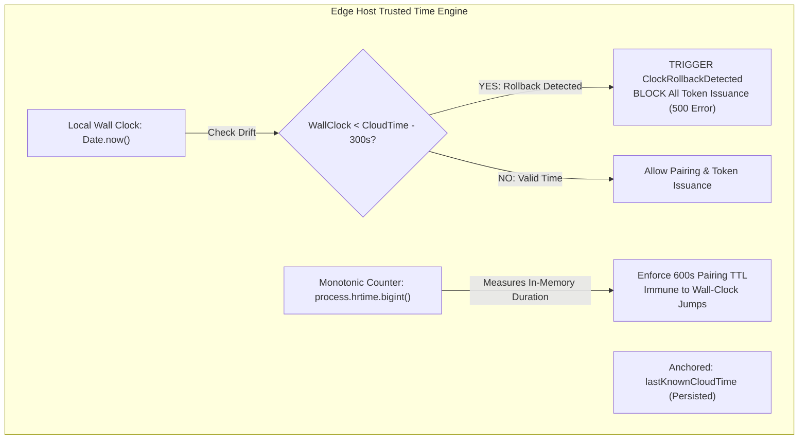
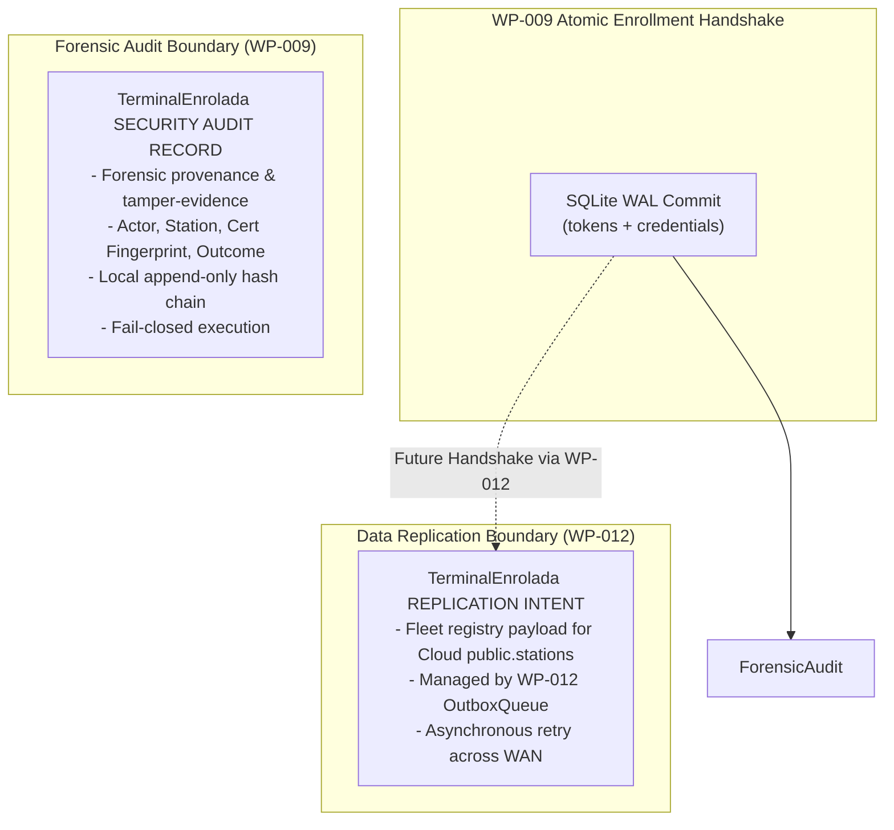

# WP-009 SECURITY ARCHITECTURE CLARIFICATION (R1)
## Key Lifecycle, Trusted Time, Certificate Pinning, and Audit Semantics

**Document ID:** `SEC-ARCH-WP009-CLA-001`  
**Version:** `1.0 PROPOSAL`  
**Date:** 2026-09-11  
**Framework:** `EAAF v1.2.0 @ 7e036f43240b3dc28ccb996e350263598275b2cd`  
**Author Agent:** `08_Security_Architect — WP-009 SECURITY ARCHITECTURE CLARIFICATION`  
**Governance Scope:** Security Architecture Clarification Only — No Application Implementation — No Merge Review  

---

## 1. Governance Baseline & Clarification Trigger

### 1.1 Baseline Identifiers
- **Canonical Repository:** `https://github.com/Lucas030509/TRIDENTPOS.git`
- **Canonical Main SHA (G8):** `bb44f35bbe459ae86869b541e42dea12fc8173f8` (Merge commit of PR #27 / WP-008 closure)
- **Reviewed Implementation Trigger (S9-R1):** `6b7fc1982e04872fa9255a701cb978380376807d` (`fix(edge): [WP-009-R1] address quick integrity check findings and harden security boundaries`)
- **Status:** `INVALIDATED FOR INDEPENDENT REVIEW — ARCHITECTURE CLARIFICATION REQUIRED`
- **Data Architecture Clarification (Sibling Direct Child of G8):** `ED9 = 469e30d07e4ea3e18bb9c22e1c7089f37b1dc560`
- **Dedicated Security Clarification Branch:** `clarification/wp-009-security-architecture-r1` (Direct child of G8)
- **Target PR:** PR #28 (Open, targeting `main`, not modified by this clarification)

### 1.2 Purpose & Non-Goals
This document is authored strictly by `08_Security_Architect` to resolve critical security ambiguities identified in implementation candidate S9-R1:
- Plaintext filesystem persistence of Edge TLS private keys;
- Silent TLS private key regeneration upon restart or file loss;
- Volatile, unvalidated in-memory generation of the Local Station Token HMAC signing key;
- Ambiguity between durable device credentials and ephemeral 12-hour shift tokens;
- Absence of production-grade tamper-resistant certificate pin storage on floor stations;
- Non-compliance with frozen clock-rollback detection and monotonic timing invariants (`IAM_SECURITY_MODEL.md` §5);
- False-positive audit sequencing where `TerminalEnrolada / SUCCESS` was emitted prior to atomic transaction commit;
- Un-governed public configuration parameters permitting security policy downgrades.

This clarification does **not** evaluate code for merge, does **not** repair PR #28, and does **not** issue an implementation PASS.

---

## 2. Provenance & Authority Classification Table

In accordance with EAAF v1.2.0, no implementation detail may claim authority unless grounded in approved architecture documents. All conclusions are classified into three strict categories:

```text
==================================================================================================================================
SECURITY CONCLUSION / DIRECTIVE        CLASSIFICATION                      SOURCE FILE & SECTION             ACR REQUIRED?
==================================================================================================================================
TLS cert fingerprint must be verified  EXISTING FROZEN SSOT                SECURITY_ARCHITECTURE.md Sec 3.2; NO (Already canonical
prior to pairing secret transmission                                       IAM_SECURITY_MODEL.md Sec 5;      in frozen security SSOT)
                                                                           IMPLEMENTATION_PLAN.md line 420
----------------------------------------------------------------------------------------------------------------------------------
Pairing secret max 600s TTL, single    EXISTING FROZEN SSOT                SECURITY_ARCHITECTURE.md Sec 3.2; NO (Already canonical)
atomic consumption, one-time payload                                       IAM_SECURITY_MODEL.md Sec 4
----------------------------------------------------------------------------------------------------------------------------------
Local Station Token is HMAC-SHA256,    EXISTING FROZEN SSOT                IAM_SECURITY_MODEL.md Sec 4;      NO (Already canonical)
12-hour validity, shift-bound                                              SECURITY_ARCHITECTURE.md Sec 5
----------------------------------------------------------------------------------------------------------------------------------
Local clock rollback > 5 minutes       EXISTING FROZEN SSOT                IAM_SECURITY_MODEL.md Sec 5;      NO (Frozen requirement;
blocks token issuance and generates                                        SECURITY_ARCHITECTURE.md Sec 10   must be implemented)
ClockRollbackDetected audit event
----------------------------------------------------------------------------------------------------------------------------------
TerminalEnrolada audit event must be   DERIVED SECURITY INVARIANT          SECURITY_ARCHITECTURE.md Sec 3.2; YES (Formalize in
emitted ONLY AFTER SQLite transaction  FROM EXISTING FROZEN SSOT           WP-006 audit integrity baseline   ACR-2026-011 to eliminate
successfully commits                                                                                         false-success bug)
----------------------------------------------------------------------------------------------------------------------------------
Zero application bytes or secrets on   DERIVED SECURITY INVARIANT          SECURITY_ARCHITECTURE.md Sec 3.2  YES (Formalize probe
untrusted TLS certificate probe socket FROM EXISTING FROZEN SSOT           (No disclosure invariant)         invariant in ACR-2026-011)
----------------------------------------------------------------------------------------------------------------------------------
Station Token HMAC key must be 256-bit DERIVED SECURITY INVARIANT          IAM_SECURITY_MODEL.md Sec 4;      YES (Formalize in
CSPRNG and persist across restarts     FROM EXISTING FROZEN SSOT           SECRETS_AND_KEY_MANAGEMENT.md §2  ACR-2026-011)
----------------------------------------------------------------------------------------------------------------------------------
Separation of durable station identity DERIVED SECURITY INVARIANT          DATA_MODEL.md;                    YES (Formalize schema
from ephemeral 12h session tokens      FROM EXISTING FROZEN SSOT           IAM_SECURITY_MODEL.md Sec 4       boundary in ACR-2026-011)
----------------------------------------------------------------------------------------------------------------------------------
Edge TLS private key encryption-at-    PROPOSED NEW DECISION —             Proposed for SECRETS_AND_KEY_     YES (Requires ACR-2026-011 +
rest via OS Keyring (DPAPI/Keyring)    REQUIRES ACR-2026-011 + PO APPROVAL MANAGEMENT.md Sec 2               Product Owner approval)
----------------------------------------------------------------------------------------------------------------------------------
Prohibition of silent TLS key          PROPOSED NEW DECISION —             Proposed for SECURITY_            YES (Requires ACR-2026-011 +
regeneration (fail-closed on corrupt)  REQUIRES ACR-2026-011 + PO APPROVAL ARCHITECTURE.md Sec 3             Product Owner approval)
----------------------------------------------------------------------------------------------------------------------------------
Production Station Pin Store Contract  PROPOSED NEW DECISION —             Proposed for SECURITY_            YES (Requires ACR-2026-011 +
(tamper-resistant platform storage)    REQUIRES ACR-2026-011 + PO APPROVAL ARCHITECTURE.md Sec 3             Product Owner approval)
----------------------------------------------------------------------------------------------------------------------------------
lastKnownCloudTime storage contract    PROPOSED NEW DECISION —             Proposed for IAM_SECURITY_        YES (Requires ACR-2026-011 +
and bootstrap trust anchor on Edge     REQUIRES ACR-2026-011 + PO APPROVAL MODEL.md Sec 5                    Product Owner approval)
==================================================================================================================================
```

---

## 3. Edge TLS Private Key Lifecycle & Storage

### 3.1 Defect Analysis of S9-R1 Implementation
In S9-R1 `packages/edge/src/enrollment/tls-identity.ts`:
```typescript
fs.writeFileSync(keyFile, this.#keyPem, { encoding: 'utf8', mode: 0o600 });
```
This is **architecturally and cryptographically insufficient**:
1. **Plaintext Storage Hazard:** The private key (`edge_tls_key.pem`) is written as unencrypted plaintext on the local filesystem. If the physical host, backup archive, or disk image is accessed, the private key is compromised.
2. **Windows Platform Insecurity:** Windows does not enforce POSIX octal modes (`0o600`) via `fs.writeFileSync`. On Windows (the predominant target for desktop restaurant POS/KDS terminals), the file inherits parent directory DACLs, allowing any authenticated local user process to read the private key.
3. **Silent Key Regeneration Catastrophe:**
   ```typescript
   if (fs.existsSync(keyFile) && fs.existsSync(certFile)) { ... }
   else { const generated = generateSelfSignedX509Certificate(...); ... writeFileSync(...) }
   ```
   If `edge_tls_key.pem` is temporarily inaccessible, accidentally deleted, or corrupted, Edge **silently generates a brand new key and certificate**. When enrolled floor stations reconnect, their pinned certificate fingerprint mismatches, and **every single floor terminal fails closed (`CERTIFICATE_PIN_MISMATCH`)**, inducing a total denial-of-service across the restaurant.

### 3.2 Canonical Storage & Lifecycle Specification (`REQUIRES ACR-2026-011`)
- **Key Algorithm:** ECDSA curve P-256 (`prime256v1`) via native `node:crypto`.
- **Encryption at Rest:** Plaintext private key files on disk are **STRICTLY PROHIBITED**. The private key must be protected via envelope encryption using a hardware/OS-bound key derived from:
  - Windows: **DPAPI** (`CryptProtectData`) bound to the local machine/service account.
  - Linux: **Linux Secret Service API / Kernel Keyring** or SQLCipher encrypted vault.
  - macOS: **Apple Keychain Services**.
- **Prohibition of Silent Key Regeneration:**
  > **SECURITY INVARIANT (SEC-INV-WP009-01):**  
  > If the Edge Host has been initialized and its TLS identity is missing, corrupted, or unreadable, the Edge Host process **MUST FAIL CLOSED ON STARTUP**. It must emit a critical operational alert (`EdgeTlsKeyMissingOrCorrupted`) and refuse to launch HTTPS listeners until explicit supervisor recovery or backup restoration occurs. Silent regeneration of an active node's TLS key is strictly prohibited.
- **Rotation Policy:**
  - Certificate renewal/rotation is an authorized administrative procedure executed through Cloud Backoffice or an authorized local supervisory console.
  - When rotation occurs, Edge Host initiates a staged pairing migration (dual-fingerprint window or re-enrollment prompt), preventing sudden terminal disconnection.
- **Backup & Recovery:** The encrypted key archive may only be exported under root/admin credentials using PBKDF2-derived master passphrase encryption (`SECRETS_AND_KEY_MANAGEMENT.md` Sec. 2).

---

## 4. Local Station Token HMAC Key Lifecycle

### 4.1 Defect Analysis of S9-R1 Implementation
In S9-R1 `packages/edge/src/enrollment/enrollment-server.ts`:
```typescript
if (options.localStationSigningKey) {
  this.#localStationSigningKey = Buffer.from(options.localStationSigningKey, 'utf8');
} else {
  this.#localStationSigningKey = crypto.randomBytes(32);
}
```
This introduces two severe vulnerabilities:
1. **Volatile In-Memory Key:** If no external key is provided, the key is generated in memory. Upon an Edge process restart, crash, or OS reboot, a new random key is generated. **All active 12-hour Station Tokens held by terminals become instantly invalid**, terminating active dining and kitchen sessions across the floor.
2. **Unvalidated Caller Override:** A caller can pass a 1-byte string or predictable password (`"secret"`), completely degrading the cryptographic strength of all issued Station Tokens.

### 4.2 Governed Lifecycle Contract (`REQUIRES ACR-2026-011`)
- **Entropy & Algorithm:** Exactly 256 bits (32 bytes) of CSPRNG entropy (`crypto.randomBytes(32)`). Algorithmic binding: `HS256` (`HMAC-SHA256`).
- **Cryptographic Independence:** The Station Token signing key is **strictly independent** from the Edge TLS private key. Under no circumstances may the TLS private key be used to sign or derive Station Tokens (preventing cross-protocol key reuse attacks).
- **Durable Secure Persistence:**
  - The signing key must persist across Edge process restarts and OS reboots.
  - Stored inside the OS Keyring / Encrypted Local Vault with restricted access (`0o600` equivalent).
- **Constructor & Production Boundary:**
  - In production mode, passing an arbitrary public key string through `localStationSigningKey?: string` is **PROHIBITED**.
  - The key must be loaded internally from the protected key manager.
  - If a key buffer is injected in test mode, it must be validated at runtime:
    ```typescript
    if (!Buffer.isBuffer(key) || key.length < 32) {
      throw new SecurityConfigurationError('Station Token signing key must be a Buffer of at least 32 bytes');
    }
    ```
- **Rotation & Revocation:** Rotated on a governed shift/daily cycle or upon supervisor command. Previous keys are retained for a 15-minute grace window to validate in-flight requests.

---

## 5. Durable Station Identity vs. Ephemeral Shift Tokens

### 5.1 Analysis of `station_token_hash`
In S9-R1, the local database table `station_credentials` included a column `station_token_hash`. Data Architecture R2 separated this and marked it `PENDING SECURITY ARCHITECTURE CLARIFICATION`.

**Security Architecture Ruling:**
- `IAM_SECURITY_MODEL.md` Section 4 defines Local Station Token as a 12-hour session token issued for operational shift duration.
- Persisting `station_token_hash` in the durable hardware identity table conflates **physical device enrollment** with **transient shift authentication**.
- Storing active token hashes in `station_credentials` causes severe operational bugs:
  - Shift closures, token renewals, or multiple concurrent operator logins on a terminal would overwrite or invalidate the single durable hash.
  - A device un-enrollment would leave stale session tokens valid if not separately tracked.

### 5.2 Architectural Disposition
1. **Durable Store (`station_credentials`):** Holds only persistent hardware identity:
   - `station_id`, `organization_id`, `branch_id`, `station_code`, `station_type`, `station_public_key`, `enrolled_at`, `is_revoked`, `revoked_at`.
   - **`station_token_hash` is EXCLUDED from `station_credentials`.**
2. **Ephemeral Session Validation:**
   - Station Tokens are self-contained signed HMAC-SHA256 JWTs with standard claims (`sub: stationId`, `iss: edgeId`, `aud: orgId`, `branchId`, `stationCode`, `stationType`, `iat`, `exp`).
   - Token validation requires:
     1. Cryptographic HMAC verification using `#localStationSigningKey`;
     2. Expiration verification (`exp > now`);
     3. Monotonic clock check (`now >= iat`);
     4. Hardware status check: `station_credentials.is_revoked === 0`.
   - Ephemeral session tracking (lockouts, active cashier shifts) is the exclusive responsibility of **`WP-010: Edge Offline IAM & Floor PIN Authentication Engine`** (`StationSessions`).

---

## 6. Station Certificate Pin Persistence Contract

### 6.1 Vulnerability in S9-R1 Implementation
In S9-R1:
1. `StationPinStore` is defined merely as an in-memory interface with no production storage implementation.
2. `initialPin?: string` is exposed as an open option on `StationEnrollmentClient`, permitting any caller to pre-seed or bypass the physical QR pairing result.

### 6.2 Production Pin Store Contract (`REQUIRES ACR-2026-011`)
- **Storage Target:**
  - Desktop Terminals (Electron): Encrypted system storage or protected configuration file with OS-restricted ACLs.
  - Mobile Comanderos (Android/iOS): Android Keystore (`EncryptedSharedPreferences`) or iOS Keychain.
- **Integrity Requirement:** High. The certificate fingerprint (`SHA256:XX:...:XX`) does not require secrecy (it is public metadata), but requires **tamper-evidence**. If an attacker alters the stored pin, the terminal could be coerced into connecting to a rogue server.
- **`initialPin` Option:** **STRICTLY PROHIBITED IN PRODUCTION.** Must be eliminated from public production client interfaces. Pre-configuring pins undermines the physical zero-trust enrollment protocol.
- **Pin Reset Flow:** Once pinned, the fingerprint cannot be overwritten through network commands. It can only be cleared via:
  - An authenticated supervisor physical reset on the terminal;
  - A complete terminal factory un-enrollment wipe.

---

## 7. Trusted Time & Monotonic Clock Rollback Architecture

### 7.1 Compliance with Frozen SSOT (`IAM_SECURITY_MODEL.md §5`)
Frozen SSOT explicitly mandates:
1. Ephemeral session timers must use monotonic process counters (`process.hrtime.bigint()`).
2. Local clock rollback $> 5\text{ minutes}$ relative to `lastKnownCloudTime` must **BLOCK the issuance of new tokens** and emit `ClockRollbackDetected`.

S9-R1 completely omitted monotonic timing and clock rollback checks, relying solely on vulnerable `Date.now()`.

### 7.2 Governed Trusted Time Engine for WP-009



#### A. Pairing Secret Lifecycle
- When an administrator initiates pairing, record:
  - `createdAtWall = Date.now()`
  - `creationMonotonic = process.hrtime.bigint()`
  - `expiresAtWall = createdAtWall + (ttlSeconds * 1000)`
- **In-Memory Validation:** While the process remains running:
  $$\Delta t = \frac{\text{process.hrtime.bigint}() - \text{creationMonotonic}}{10^9\text{ ns}}$$
  If $\Delta t \ge \text{ttlSeconds}$, the secret is expired regardless of any OS wall-clock adjustments.
- **Process Restart Fallback:** If restarted, validate against persisted `expires_at` in SQLite WAL, subject to the clock rollback check below.

#### B. `lastKnownCloudTime` Contract
- **Authoritative Source:** Authenticated timestamps delivered by Cloud Platform Core during HTTPS synchronization, API responses, or heartbeat exchanges.
- **Persistence:** Persisted in Edge SQLite metadata table or protected configuration.
- **Cold-Start / Initial Provisioning:** Initialized from the signed cryptographic branch provisioning manifest generated at restaurant onboarding.
- **Long Offline Periods:** When Edge operates offline, `lastKnownCloudTime` is advanced locally using monotonic process uptime:
  $$\text{effectiveCloudTime} = \text{lastKnownCloudTime} + \Delta t_{\text{monotonic}}$$
- **Rollback Evaluation:**
  If $\text{Date.now}() < (\text{lastKnownCloudTime} - 300\text{ s})$:
  - Set Edge server state to `CLOCK_ROLLBACK_LOCKED`;
  - **BLOCK all pairing secret generation and Station Token issuance**;
  - Emit `ClockRollbackDetected` audit event.

---

## 8. `ClockRollbackDetected` Audit Specification

When a backward clock adjustment exceeding 5 minutes is detected:
- **Event Identifier:** `ClockRollbackDetected`
- **Severity:** `CRITICAL`
- **Audit Payload Contract:**
  ```typescript
  export interface ClockRollbackDetectedAuditEvent {
    readonly event: 'ClockRollbackDetected';
    readonly organizationId: string;
    readonly branchId: string;
    readonly edgeId: string;
    readonly localWallTimestamp: number;      // Current Date.now()
    readonly lastKnownCloudTimestamp: number; // Stored Cloud anchor
    readonly driftSeconds: number;            // Difference in seconds
    readonly actionTaken: 'TOKEN_ISSUANCE_BLOCKED';
    readonly outcome: 'FAILURE';
  }
  ```
- **Redaction Invariant:** The event payload must never log pairing secrets, Station Tokens, or cryptographic key material.

---

## 9. `TerminalEnrolada` Audit Semantics & Execution Ordering

### 9.1 The False-Success Audit Defect in S9-R1
In S9-R1 `enrollment-server.ts` lines 304–335, the server emitted `TerminalEnrolada` with `outcome: 'SUCCESS'` **prior to** calling `#pairingStore.consumePairingToken(...)`.
If token CAS consumption failed (e.g. concurrent race, invalid secret, expired token, or database disk error), the audit trail permanently recorded a **false-positive successful terminal enrollment**. This constitutes a critical forensic integrity violation.

### 9.2 Governed Cryptographic & Audit Execution Order

```text
========================================================================================================================
GOVERNED ENROLLMENT EXECUTION PIPELINE (STRICT TRANSACTION & AUDIT ORDERING)
========================================================================================================================
1. TLS PROBE PHASE:
   Station connects TLS probe socket. ZERO application bytes sent. Reads cert DER. Calculates SHA-256 fingerprint.
   Compares in constant-time against physical QR payload. Mismatch aborts immediately with ZERO secret disclosure.

2. PINNED HTTPS CONNECT:
   Station connects to Edge HTTPS with ca: [candidateCertDer], rejectUnauthorized: true.
   Presents EnrollmentRequest: { pairingId, pairingSecret, stationPublicKey, stationCode, stationType }.

3. PRE-TRANSACTION SECURITY VALIDATION:
   - Validate payload schema and max 64 KB size limit.
   - Verify trusted time and clock rollback status (assert NOT CLOCK_ROLLBACK_LOCKED).
   - Verify secret in constant-time (timingSafeSecretCompare).
   - If secret invalid or expired: Emit TerminalEnrolada / FAILURE and return HTTP 401/403 immediately.

4. ATOMIC DATABASE COMMIT (Single runInTransaction):
   - CAS token consumption (UPDATE enrollment_tokens SET consumed_at = :now ... WHERE consumed_at IS NULL).
   - If CAS fails: Rollback. Emit TerminalEnrolada / FAILURE (CONCURRENT_CONFLICT). Return HTTP 409.
   - Persist durable hardware identity (INSERT INTO station_credentials ...).
   - If insert fails: Full Rollback (consumed_at reverts to NULL). Return HTTP 500.
   - COMMIT SQLite transaction.

5. STATION TOKEN ISSUANCE:
   Sign Station Token (HS256, 12h) using local Station Token signing key.
   (If signing fails post-commit: execute compensating transaction UPDATE station_credentials SET is_revoked = 1).

6. FORENSIC AUDIT EMISSION (Fail-Closed):
   Emit TerminalEnrolada / SUCCESS with { stationId, stationCode, stationType, certFingerprint, timestamp }.
   Audit emission must be durable and fail-closed.

7. CLIENT RESPONSE & PINNING:
   Return HTTP 200 OK with EnrollmentResponse.
   Station client securely saves pinned fingerprint in platform pin store and stores Station Token.
========================================================================================================================
```

---

## 10. Security Audit vs. Data Integration Boundary

Data Architecture R2 separated the forensic audit event from data replication. Security Architecture strictly affirms this boundary:



- **WP-009 Responsibility:** Strictly limited to local tamper-evident security logging.
- **WP-012 Responsibility:** Outbox queueing, WAN serialization, network retries, and Cloud PostgreSQL `stations` reconciliation. WP-009 **must not** instantiate `outbox_queue` or simulate WAN replication.

---

## 11. Audit Durability & Failure Semantics

### 11.1 Rejection of Optional Audit Callback
In S9-R1, audit logging was governed by `onAuditEvent?: (event: EnrollmentAuditEvent) => void`.
- **Verdict:** **UNACCEPTABLE IN PRODUCTION.**
- If `onAuditEvent` is omitted, security events evaporate silently. Terminal enrollment directly mutates device trust; omitting audit records violates `SECURITY_ARCHITECTURE.md` Section 10 and `SECURITY_LOGGING_AND_MONITORING.md`.

### 11.2 Mandatory Audit Durability Invariants
1. **Mandatory Default Sink:** Edge Host must include a default local audit sink that records events to `local_audit_trail` (or a dedicated tamper-evident append-only JSONL log with hash chaining).
2. **Fail-Closed Execution:** If the audit sink throws or fails to persist a `SUCCESS` event, the enrollment request must return HTTP 500 (`AUDIT_LOGGING_FAILED`), and the newly issued credentials must be revoked immediately.

---

## 12. Public Security Options Disposition Matrix

All public options exposed in S9-R1 are classified below. Any option classified as `PROHIBITED` must be removed from production interfaces:

```text
==================================================================================================================================
OPTION IDENTIFIER                      S9-R1 LOCATION             GOVERNANCE CLASSIFICATION           SECURITY DIRECTIVE
==================================================================================================================================
tokenTtlSeconds                        EdgeEnrollmentServer       PROHIBITED PUBLIC OVERRIDE          Hardcode to exact 12h (43200s).
                                                                                                      Must not be caller-configurable.
----------------------------------------------------------------------------------------------------------------------------------
localStationSigningKey                 EdgeEnrollmentServer       INTERNAL ONLY / REQUIRES VALIDATION Reject strings. Must be loaded
                                                                                                      from OS Keyring. Test key must
                                                                                                      be validated Buffer >= 32 bytes.
----------------------------------------------------------------------------------------------------------------------------------
PairingPayloadInput.pairingSecret      PairingPayloadInput        PROHIBITED PUBLIC OVERRIDE          Must always be generated via
                                                                                                      crypto.randomBytes(32).
----------------------------------------------------------------------------------------------------------------------------------
PairingPayloadInput.ttlSeconds         PairingPayloadInput        REQUIRES GOVERNED VALIDATION        Must be validated: 1 <= ttl <= 600.
                                                                                                      Values > 600s must throw error.
----------------------------------------------------------------------------------------------------------------------------------
initialPin                             StationEnrollmentClient    PROHIBITED PUBLIC OVERRIDE          Eliminate from production options.
                                                                                                      Pin must come from QR pairing.
----------------------------------------------------------------------------------------------------------------------------------
customCa                               StationEnrollmentClient    TEST-ONLY                           Must not be enabled in production.
----------------------------------------------------------------------------------------------------------------------------------
onAuditEvent                           EdgeEnrollmentServer       REQUIRES GOVERNED VALIDATION        Cannot be optional without a
                                                                                                      mandatory default local sink.
----------------------------------------------------------------------------------------------------------------------------------
existingIdentity                       EdgeTlsIdentityManager     INTERNAL ONLY                       Permitted only for internal loading
                                                                                                      of decrypted OS Keyring assets.
----------------------------------------------------------------------------------------------------------------------------------
storagePath                            EdgeTlsIdentityManager     REQUIRES GOVERNED VALIDATION        Must enforce OS Keyring / DPAPI
                                                                                                      encryption; reject plaintext 0600.
==================================================================================================================================
```

---

## 13. Private Key Exposure Boundary

- **Inviolable Invariant:** The Edge TLS private key and Station Token HMAC signing key **MUST NEVER escape the Edge process boundary or the `@trident/edge` package boundary**.
- **Prohibited Patterns:**
  - Zero getters returning raw private key material;
  - Zero `Symbol.for` backdoors or global process registries;
  - Zero IPC channels exposing private keys or raw signing primitives to Electron renderer processes;
  - Test access, if required, must be confined strictly to co-located unit test files (`*.test.ts`) using isolated, mockable test fixtures, never exportable production hooks.

---

## 14. TLS Probe Security Disposition

### 14.1 Distinction: Transport Probe vs. Trust Establishment
In S9-R1, the station client establishes an initial TLS socket with `rejectUnauthorized: false` to extract the candidate's certificate DER before fingerprint verification.
- **Security Assessment:** **APPROVED WITH STRICT BOUNDARY CONSTRAINTS.**
- Because Edge Host certificates are dynamically generated self-signed X.509 certificates (no global PKI CA exists on an air-gapped restaurant LAN), standard CA trust stores cannot validate them.
- Trust is anchored **out-of-band** via physical scanning of the QR code containing `edgePublicKeyFingerprint`.

### 14.2 Mandatory Probe Constraints
An unauthenticated TLS probe connection is permissible **if and only if**:
1. Zero application data (HTTP requests, headers, or pairing secrets) is written to the probe socket.
2. The probe connection is used exclusively to invoke `socket.getPeerCertificate(true)` to extract raw DER bytes.
3. The socket is destroyed immediately (`socket.destroy()`) upon certificate retrieval.
4. The SHA-256 fingerprint of the extracted DER is verified in constant time (`timingSafeSecretCompare`) against the physically scanned payload.
5. If verified, the subsequent application connection is opened using a fresh HTTPS agent pinned strictly to the proven certificate (`ca: [provenCertDer]`, `rejectUnauthorized: true`).

---

## 15. SEC-VAL-03 Security Debt Disposition

- **Current Status:** **`OPEN / PARTIAL — TARGET HARDWARE / LAN EVIDENCE REQUIRED`**.
- **Rationale:** While software unit tests and simulated in-process mDNS discovery prove algorithmic correct-path and canary abort logic, software tests cannot close:
  - Physical LAN broadcast/multicast behavior on commercial Wi-Fi equipment;
  - Adversarial rogue hardware injecting malformed ARP/mDNS packets on physical LAN;
  - Performance and memory exhaustion of ECDSA/HMAC cryptography on constrained $\le 2\text{ GB}$ hardware.
- **Governance Assignment:** Full closure of `SEC-VAL-03` is formally assigned to **`WP-028: Multi-Platform Native Binary Packaging & SLSA Verification`** and **Target Hardware Benchmarks**.

---

## 16. Required ACR-2026-011 Security Amendments

To incorporate these mandatory security controls into the canonical baseline, the following amendments must be processed under `ACR-2026-011`:

```text
==================================================================================================================================
DOCUMENT FILE                  CURRENT STATE IN G8                   PROPOSED AMENDMENT IN ACR-2026-011    SECURITY RATIONALE
==================================================================================================================================
SECURITY_ARCHITECTURE.md       Sec 3.2 outlines enrollment sequence  Amend Sec 3.2 to mandate:             Prevents plaintext key
                               but does not specify key encryption   - OS Keyring / DPAPI key encryption   theft, silent lockout DOS,
                               or prohibition of silent regeneration - Prohibition of silent TLS regen     and false-success audit
                                                                     - Audit emission AFTER commit         records.
----------------------------------------------------------------------------------------------------------------------------------
IAM_SECURITY_MODEL.md          Sec 4-5 specifies Station Token and   Amend Sec 4-5 to mandate:             Prevents volatile session
                               clock rollback but omits HMAC key     - 256-bit CSPRNG HMAC key persistence loss and enforces
                               storage and lastKnownCloudTime anchor - lastKnownCloudTime storage contract frozen clock security
                                                                     - Exclude station_token_hash from DB  controls.
----------------------------------------------------------------------------------------------------------------------------------
SECURITY_CONTROL_MATRIX.md     SEC-VAL-03 lacks target hardware      Update SEC-VAL-03 to explicitly note  Prevents premature
                               boundary specification                software closure in WP-009 and final  debt sign-off before real
                                                                     hardware validation in WP-028         hardware testing.
----------------------------------------------------------------------------------------------------------------------------------
IMPLEMENTATION_PLAN.md         WP-009 acceptance criteria omit       Update WP-009 Acceptance Criteria to  Ensures Builder is bound
                               trusted time and OS Keyring storage   require encrypted private key store,  to implement fail-closed
                                                                     trusted time, and no public overrides time & secret boundaries.
==================================================================================================================================
```

---

## 17. Unresolved Decisions & Blockers

1. **Local Secret Store Engine Selection for Electron:**  
   Whether the OS Keyring integration uses Electron's native `safeStorage` API or an encrypted SQLCipher vault key must be finalized in joint governance synthesis with the Solution Architect.
2. **PR #28 Merge Status:**  
   PR #28 remains in its original commit state (`S9-R1`) and **MUST NOT BE MERGED OR REVIEWED** until `ACR-2026-011` is approved and the Builder completes remediation `S9-R2`.

---

## 18. Final Clarification Verdict

```text
====================================================================================================
FINAL VERDICT:
CLARIFICATION COMPLETE — READY FOR PRODUCT OWNER GOVERNANCE SYNTHESIS
====================================================================================================
Key lifecycle, trusted time, certificate pinning, audit sequencing, and security boundary controls
have been fully clarified and specified in compliance with EAAF v1.2.0.
====================================================================================================
```

### Exact Next Action
**`RETURN TO EAAF COORDINATOR FOR JOINT DATA + SECURITY GOVERNANCE SYNTHESIS`**  
*(Do NOT return to Builder. Do NOT authorize formal Specialist Review or Code Review. Do NOT modify PR #28).*

---

DOCUMENT STATUS: PROPOSAL COMPLETE — COMMITTED ON DEDICATED SECURITY CLARIFICATION BRANCH
